# BACKEND TECHNICAL SPECIFICATION
## Solo-Operator Algorithmic Trading System — Production Build

> **Companion document:** `prompt-b-frontend-spec.md` (Frontend) — references the canonical SSE event types, Discord command tables, IA naming, anomaly reason codes, and trade state enum defined here.
> **Implementation rule:** every locked constraint from `prompt-a-backend-spec.md` is treated as an architectural invariant. Where genuine implementation choices remain, 2–3 options are presented with a recommendation. Strategic decisions are never re-opened.

> **🔄 ARCHITECTURE PIVOT 2026-05-12 — read this before consulting any "Phase 1 vs Phase 2" content below.**
>
> Original spec (pre-pivot) described Phase 1 as QC-Cloud-mediated (algorithm on QC, backend polls ObjectStore, defensive trims via `/instructions/<n>.json`) and Phase 2 as direct-IBKR (LEAN Local + `ib-async` + IB Gateway). DP-025 surfaced at Day 28 deploy: QC's `/object/get` REST endpoint is gated behind the Institutional subscription tier, which the operator is not on. The entire ObjectStore-polling architecture is infeasible.
>
> **Operator decision Day 28 02:00 UTC: Option 4 — pull the original Phase 2 architecture forward into Phase 1.** Post-pivot operational reality:
> - **Phase 1 = the architecture this spec calls "Phase 2"** (LEAN Local in Docker on the VPS, `ib-async` direct to `ib_gateway` container, IBKR FlexQuery for EOD reconciliation).
> - **No Phase 2 cutover event exists.** §1.5 is RETIRED; the spec's Phase 1/Phase 2 split collapses.
> - **`services/qc_adapter/**` stays in the repo** but is dormant under a `qc_adapter_backfill` docker-compose profile gate (per §1.4 line 233 retained backfill role). The Day 28 PR-A surface (12 modules + 50 tests + operator runbook) is preserved for institutional memory; the container is never started in production.
> - **Sections marked `[RETIRED — pivot 2026-05-12]`** describe pre-pivot Phase 1 — preserved for history; not operationally active.
> - **Tables with "Phase 1" + "Phase 2" columns:** read the Phase 2 column as operational reality. The Phase 1 column documents the QC-mediated path that never went live.
>
> See `Docs/decisions-log.md` 2026-05-12 entry "Phase-1 architecture pivot — QC ObjectStore → LEAN Local + direct IBKR (DP-025 → Option 4)" for full rationale, the 4 underlying decision points (DP-023/024/025/026), and the migration diff list.

---

## TABLE OF CONTENTS

1. [System Architecture Overview](#1-system-architecture-overview)
2. [Component Breakdown](#2-component-breakdown)
3. [Data Models and Schemas](#3-data-models-and-schemas)
4. [API Contracts](#4-api-contracts)
5. [Sequence Diagrams](#5-sequence-diagrams)
6. [Error Handling Strategy](#6-error-handling-strategy)
7. [Observability](#7-observability)
8. [Security](#8-security)
9. [Deployment Topology](#9-deployment-topology)
10. [Testing Strategy](#10-testing-strategy)
11. [Phased Build Plan](#11-phased-build-plan)
12. [Claude Ops Agent — Detailed Spec](#12-claude-ops-agent--detailed-spec)

---

# 1. System Architecture Overview

## 1.1 Repository Layout (locked)

```
trading/
├── alembic/                       # DB migrations (PR-required path)
├── deploy/                        # Compose, Caddyfile, sops bundles, systemd units
├── infrastructure/
│   ├── retry/                     # Generic retry primitives  (hot-fix whitelist)
│   ├── broker_reconnect/          # IB Gateway reconnect       (hot-fix whitelist)
│   └── logging/                   # structlog config           (hot-fix whitelist)
├── services/
│   ├── api/                       # FastAPI HTTP + SSE
│   ├── signal/                    # Donchian/MA signal engine  (PR-required)
│   ├── risk/                      # Position sizing, rings,    (PR-required)
│   │                              # kill-switch state machine
│   ├── execution/                 # Order placement & retries  (PR-required)
│   ├── reconciliation/            # Position/cash/margin recon (PR-required)
│   ├── audit/                     # Hash-chain writer + verify (PR-required)
│   ├── calibration/               # Slippage OLS               (PR-required)
│   ├── scheduler/                 # APScheduler + calendars
│   ├── qc_adapter/                # ObjectStore poll + push
│   ├── discord_bot/               # discord.py gateway client
│   ├── webhook_pusher/            # Discord webhook + email
│   ├── monitoring/                # Health, metrics, watchdog  (hot-fix whitelist)
│   ├── observability/             # Telemetry pipeline         (hot-fix whitelist)
│   └── agent/
│       ├── decisions/             # WHICH/WHEN/WHAT            (PR-required)
│       ├── risk_actions/          # Risk invocations           (PR-required)
│       ├── parameter_changes/     # Param mutation             (PR-required)
│       ├── reporting/             # Briefings, summaries       (hot-fix whitelist)
│       ├── monitoring/            # Telemetry consumption      (hot-fix whitelist)
│       ├── integrations/          # External API clients       (hot-fix whitelist)
│       └── prompts/
│           ├── system/            # Format templates           (hot-fix whitelist)
│           └── decision/          # Decision templates         (PR-required)
├── strategies/
│   └── v1_trend_following/        # Strategy code              (PR-required)
├── lean/                          # LEAN config; Phase 2 LEAN Local
├── tests/
│   ├── unit/
│   ├── integration/
│   └── golden/                    # Parity (LEAN↔vectorbt, QC adapter)
├── secrets/                       # sops-encrypted only
│   ├── dev.enc.yaml
│   ├── paper.enc.yaml
│   └── live.enc.yaml
└── pyproject.toml                 # Hot-fix whitelist
```

A pre-merge linter enforces the **Hot-Fix Whitelist** path classification by enumerating the file paths that are agent-mutable vs. PR-required, and by grepping for the constants matching `RISK_RING_*`, `KILL_SWITCH_*`, `MARGIN_*`, `CLUSTER_CAP_*`, `PARAMETER_RANGE_*` in any agent-deployed change.

## 1.2 Phase 1 Architecture (post-pivot 2026-05-12 + data-layer pivot v2 2026-05-21; LEAN Local + direct IBKR)

> **Pivot note:** the diagram + critical-contract paragraph below describe Phase 1 **post-pivot 2026-05-12 + 2026-05-21 data-layer pivot v2 (Option C)**. The original Phase 1 plan (QC-Cloud-mediated, ObjectStore polling, instruction protocol) is **retained immediately below this current section as §1.2-RETIRED** for institutional memory. Operational reality from 2026-05-21 onward matches the diagram below.
>
> **2026-05-21 data-layer pivot v2 delta (Option C) vs. 2026-05-12 pivot baseline:** the api now owns the bar-fetch responsibility for LEAN. The new `services/data/bar_sync.py` module runs a `BarSyncWorker` on a dedicated `clientId=2` ib-async connection to the existing `ib_gateway` sidecar (distinct from the api's order-placement `clientId=1`; both are read-only telemetry / order-mutating respectively over the same gateway session). The worker fetches daily OHLCV bars via `reqHistoricalData` for all 11 Phase 1 markets at 17:00 ET daily + writes them to the shared `lean_data` Docker volume in LEAN's expected on-disk format. `lean_local` reads via the original `FakeDataQueue` + `SubscriptionDataReaderHistoryProvider` shape (read-only mount of the same volume).
>
> The 2026-05-20 v1 attempt (PRs #195 + #196 + #197) routed LEAN directly to IBKR via the QC `InteractiveBrokersBrokerage` data-queue-handler on clientId=10 + was blocked at deploy on the IBAutomater gateway-launch conflict (the plugin tries to spawn its own gateway rather than connect to the existing one). Pre-2026-05-20 the LEAN data path read on-disk seed files populated by `scripts/seed_lean_data.py` (yfinance ETFs) + `scripts/seed_lean_futures_databento.py` (DataBento futures); both scripts were DELETED in the 2026-05-20 v1 attempt and remain deleted under Option C (the api's bar_sync worker is the new producer). See `Docs/decisions-log.md` 2026-05-21 entry "Data-layer pivot v2 LANDS via Option C" + the 2026-05-20 evening v1 postmortem.

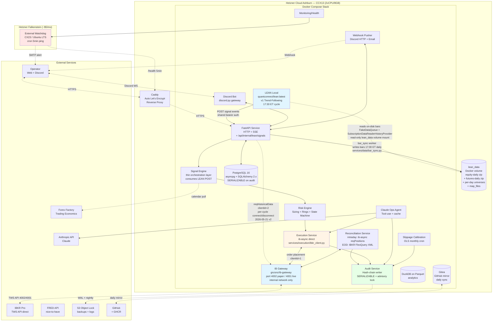

**Phase 1 critical contract (post-pivot + 2026-05-21 data-layer pivot v2 Option C):** the backend holds IBKR Pro credentials in sops-encrypted `secrets/<env>.enc.yaml` and connects to the broker via `ib_gateway` (Dockerized) using the `ib-async` Python library on TWO distinct clientIds: **`clientId=1`** for the long-lived order-placement worker (`services/execution/ibkr_adapter.py::DEFAULT_CLIENT_ID`; locked since PR #101) + **`clientId=2`** for the per-cycle bar-sync worker (`services/data/bar_sync.py::DEFAULT_BAR_SYNC_CLIENT_ID`; locked 2026-05-21). Both share the same gateway session (IBKR supports multiple clientIds per gateway). LEAN runs locally in a separate `lean_local` container (extending `quantconnect/lean:latest` with tini + pyyaml + structlog only — no IBKR plugin DLLs under Option C), hosts the v1 trend-following algorithm, **reads market data from on-disk** via the original `FakeDataQueue` + `SubscriptionDataReaderHistoryProvider` shape (read-only mount of the shared `lean_data` Docker volume), and emits signal events to the backend via `POST /api/internal/lean/signals` (shared-bearer auth — `LeanAuthMiddleware` mirroring the Day 23 `BotAuthMiddleware` pattern). The execution path is signal-on-LEAN → POST to backend → risk-engine sizing → `ib-async.placeOrder` direct to IBKR on clientId=1. The data path is api's `BarSyncWorker` (17:00 ET daily) → `reqHistoricalData` on clientId=2 → writes to disk → LEAN's `self.history(symbol, count, Resolution.DAILY)` reads on-disk at 17:30 ET. LEAN's `live-mode-brokerage` stays `PaperBrokerage` — LEAN does NOT place orders + does NOT connect to IBKR at all under Option C.

**Key constraints (post-pivot + 2026-05-21 data-layer pivot v2 Option C):**
- IBKR credentials are sops-encrypted; the backend never logs them; gitleaks pre-commit hook covers source.
- The `ib_gateway` container is on the `internal` Docker network only; port 4002 (paper) / 4001 (live) are not exposed to Caddy or the public internet.
- LEAN Local's bearer auth (for the `POST /api/internal/lean/signals` path) is a sops-encrypted secret distinct from the Discord bot's (so a LEAN container compromise can't impersonate the bot or vice versa).
- IBKR clientId allocation (locked in dev-guide §1.5 + extended here for Option C):
  - **api order-placement worker = 1** (long-lived; orders + position queries + EOD recon)
  - **api bar_sync worker = 2** (per-cycle connect/disconnect; reqHistoricalData for the 11-market Phase 1 universe daily at 17:00 ET)
  - **operator probes + recovery tools = 80-99** (e.g., `scripts/operator_tools/replay_executions.py` uses 99)
  - **reserve 3-7** for future multi-strategy / additional read-only telemetry clients
  - Never overlap; IBKR's Error 162 "Trading TWS session is connected from a different IP address" fires when two clients race the same clientId + wedges the colliding client for ~30 min.
- IBKR delayed-quote subscription is sufficient for the daily-cadence V1 strategy. The bar_sync worker uses `whatToShow=TRADES` + `useRTH=True` for ETFs + `useRTH=False` for futures (futures trade ~23h sessions). Switch to a paid real-time bundle (~$10/mo) only when a future strategy depends on intraday tick freshness.
- Audit chain integrity is preserved end-to-end. Every signal POSTed by LEAN → `signal_emitted` audit row; every `ib-async` fill confirmation → `order_filled` audit row. Hash chain unbroken. **The bar_sync worker emits NO audit rows** (read-only IBKR queries; data-pipeline operation, not a state mutation).
- The `lean_data` Docker volume is mounted READ-WRITE by the api (`/Lean/Data:rw`) so the bar_sync worker can write; READ-ONLY by lean_local (`/Lean/Data:ro`). Single-writer-multiple-reader on the same Docker volume.

**Service inventory delta vs. spec §1.4 table:**
- `qc_adapter` row: status flipped to "dormant under `qc_adapter_backfill` profile gate"; code preserved.
- `ib_gateway` row: status flipped from "Phase 2 only" to "Phase 1+ always-on".
- `lean_local` row: status flipped from "Phase 2 on-demand" to "Phase 1+ always-on".

## 1.2-RETIRED Phase 1 Architecture (months 2–5; live on QC; backend has NO direct IBKR) — `[RETIRED — pivot 2026-05-12]`

> **Status:** This section describes the ORIGINAL pre-pivot Phase 1 plan. RETIRED 2026-05-12 per DP-025 → Option 4. **Operational reality is described in §1.2 above.** Preserved for institutional memory + audit-chain continuity (the strategies code still mounts to LEAN; the `services/qc_adapter/**` code still tests under the `qc_adapter_backfill` profile gate).

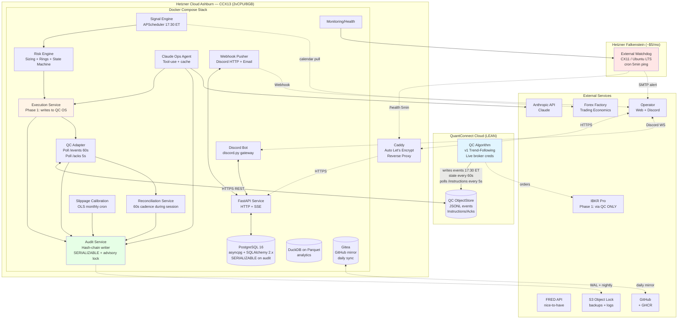

**Pre-pivot Phase 1 critical contract (RETIRED):** the backend never holds IBKR credentials. All broker interaction passes through the QC algorithm, which the operator has provisioned with their IBKR Pro live account credentials inside QC's secure vault. The instruction protocol (write to `/instructions/<n>.json`, poll, ack) is the ONLY path for backend-originated order action.

**Why this was retired:** DP-025 (Day 28, 2026-05-12). QC's `/object/get` REST endpoint is gated behind the Institutional subscription tier. The operator's Researcher-$60 tier allows `/object/list` (metadata) but blocks content fetch. The entire polling architecture is infeasible without an upgrade to Institutional (~10× cost), and there is no realistic pricing path to that tier from a solo-operator budget. See `Docs/decisions-log.md` 2026-05-12 entry for the full DP-025 narrative.

## 1.3 Phase 2 Architecture (months 5–9+; LEAN Local; direct IBKR) — `[RETIRED — pivot 2026-05-12]`

> **Status post-pivot:** This section described the originally-planned Phase 2 architecture. After the 2026-05-12 pivot, **this IS the Phase 1 architecture** (see §1.2 above for the current canonical description). There is no longer a "Phase 2" event — no cutover, no broker migration, no LEAN Local activation date. The architecture below is operationally live from Phase 1 onset onward. The text + diagram are preserved here for cross-reference continuity with sequence diagrams in §5 and the pre-pivot ai-and-strategy-overview narrative.


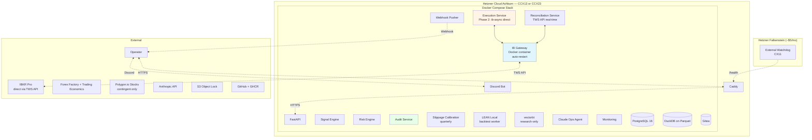

## 1.4 Service Inventory (post-pivot 2026-05-12)

| # | Service | Container | Hot-Fix? | Phase 1 (post-pivot) | Pre-pivot Phase 1 (RETIRED) | Restart Policy |
|---|---|---|---|---|---|---|
| 1 | `api` | FastAPI + uvicorn | No (PR) | ✅ (+ `/api/internal/lean/signals`) | ✅ | `unless-stopped` |
| 2 | `signal` | Python | No (PR) | ✅ thin orchestration over LEAN POST | ✅ scheduler-driven 17:30 ET | `unless-stopped` |
| 3 | `risk` | Python | No (PR) | ✅ | ✅ | `unless-stopped` |
| 4 | `execution` | Python | No (PR) | ✅ ib-async direct via `ib_gateway` | ✅ writes QC OS instructions | `unless-stopped` |
| 5 | `reconciliation` | Python | No (PR) | ✅ ib-async intraday + IBKR FlexQuery EOD | ✅ from QC OS `/state/portfolio.json` | `unless-stopped` |
| 6 | `audit` | Python | No (PR) | ✅ | ✅ | `unless-stopped` |
| 7 | `calibration` | Python (cron) | No (PR) | ✅ monthly | ✅ monthly | `on-failure:3` |
| 8 | `scheduler` | APScheduler | No (PR) | ✅ | ✅ | `unless-stopped` |
| 9 | `qc_adapter` | Python | Yes (§2.3) | 💤 **dormant** under `qc_adapter_backfill` profile gate; PR-A code preserved | ✅ poll `/events` 60s, `/acks` 5s | `unless-stopped` (when profile enabled) |
| 10 | `discord_bot` | Python (discord.py) | Partial | ✅ | ✅ | `unless-stopped` |
| 11 | `webhook_pusher` | Python | Partial | ✅ | ✅ | `unless-stopped` |
| 12 | `monitoring` | Python | Yes | ✅ | ✅ | `unless-stopped` |
| 13 | `agent` | Python | Decisions PR; reporting/integrations hot-fix | ✅ | ✅ | `unless-stopped` |
| 14 | `postgres` | postgres:16-alpine | n/a | ✅ | ✅ | `unless-stopped` |
| 15 | `duckdb` | (embedded; no container) | n/a | ✅ | ✅ | n/a |
| 16 | `caddy` | caddy:2-alpine | n/a | ✅ | ✅ | `unless-stopped` |
| 17 | `gitea` | gitea/gitea | n/a | ✅ | ✅ | `unless-stopped` |
| 18 | `ib_gateway` | gnzsnz/ib-gateway | n/a | ✅ **Phase 1+ always-on** (port 4002 paper / 4001 live; internal network only) | ❌ Phase 2 only | `unless-stopped` |
| 19 | `lean_local` | custom (extends `quantconnect/lean:latest` with `QuantConnect.Brokerages.InteractiveBrokers` plugin DLL from NuGet baked in via multi-stage Dockerfile at `infrastructure/lean_local/Dockerfile`; post-2026-05-20 data-layer sub-pivot) | n/a | ✅ **Phase 1+ always-on** (17:30 ET signal cycle; reads IBKR market data via InteractiveBrokersBrokerage data-queue-handler on clientId=10) | ❌ Phase 2 on-demand | `unless-stopped` |

**Post-pivot deltas vs. pre-pivot column:**
- Row 4 `execution`: `ib-async` direct path is the canonical Phase 1+ path. The QC OS instruction-write code is RETIRED (lives in `services/qc_adapter/` but never executed in production).
- Row 5 `reconciliation`: intraday source switches from QC OS `/state/portfolio.json` to `ib-async.reqPositions()` + `reqAccountSummary()`; EOD source switches from QC-pushed FlexQuery to backend-pulled FlexQuery via IBKR's FlexQuery web service (Phase 1+).
- Row 9 `qc_adapter`: dormant. Code stays in repo for institutional memory + ad-hoc historical replay (Pivot-PR-A moves it under the `qc_adapter_backfill` docker-compose profile). The 50 unit + integration tests still run in CI as a regression net against re-introducing ObjectStore polling.
- Row 18 `ib_gateway`: always-on from Phase 1 onset.
- Row 19 `lean_local`: always-on from Phase 1 onset (not the original "Phase 2 on-demand" pattern).

External (separate VPS): `watchdog` on Hetzner **Falkenstein** (locked; see §1.6).

## 1.5 Phase 1 → Phase 2 Cutover (locked checklist) — `[RETIRED — pivot 2026-05-12]`

> **Status post-pivot:** There is no longer a cutover event. Phase 1 architecture (§1.2 above) IS the originally-planned Phase 2 architecture. The 8-item pre-cutover checklist below was designed to validate the transition from QC-mediated to direct-IBKR; since direct-IBKR is now the Phase 1 starting point, the checklist's content folded into the Phase 1 Week 8 pre-live-funding checklist (see `implementation-guide.md` §3 Week 8). The text + diagram below are preserved for institutional memory.
>
> **Surviving items that DID move forward into Phase 1 Week 8 pre-live checklist:**
> - CK3 (IB Gateway docker boots + paper login OK) — now Pivot-PR-B's A27 satisfier
> - CK4 (ib-async paper test: place + cancel) — now Pivot-PR-B's mandatory smoke
> - CK6 (audit chain integrity) — runs continuously via `verify_chain --env paper` per `deploy/audit/README.md`
> - CK7 (S3 backup restored) — Week 8 pre-flight check
> - CK8 (slippage calibration head pinned) — Week 8 pre-flight check
>
> **Retired items (made meaningless by the pivot):**
> - CK1 (LEAN Local backtest reproduces Phase 1 last 30 sessions) — pre-pivot, this validated the QC→LEAN-Local parity gate. Post-pivot, LEAN Local is the live engine from day 1; no parity check needed because there's no QC algorithm to parity-check against.
> - CK2 (vectorbt golden test weekly) — kept as ongoing parity gate but no longer cutover-gated.
> - CK5 (no HALT_NEW in last 24h) — still operationally meaningful but applies to any pre-live milestone, not a specific cutover event.

**Trigger:** operator selects cutover date `D` ≥ 5 CME sessions in advance via `/system/deployments/cutover/schedule` (Phase 2 API only — in Phase 1, scheduled via direct DB row by Claude Code under operator approval; web UI ships in Phase 2).

**Pre-cutover automated checklist** (run at `D − 1` 17:00 ET):

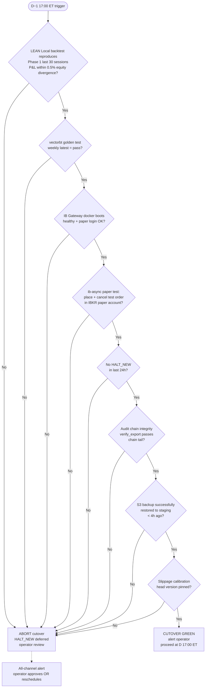

**Cutover execution at D 17:00 ET:**

1. QC algorithm flattens all positions via final session-close orders
2. Wait for fill confirmations + EOD reconciliation pass
3. Audit log records `phase_cutover_started` at the chain tail with `from_phase=1, to_phase=2`
4. QC algorithm enters "drain mode": no new signals; continues to push state for 24h post-cutover for adapter parity verification
5. LEAN Local activated on backend VPS; `live-small` env tag preserved
6. `ib-async` connects to IB Gateway in Docker; verifies account positions = 0 + cash matches FlexQuery
7. First Phase 2 signal cycle = next 17:30 ET schedule
8. Audit log records `phase_cutover_completed` after first successful signal-to-order round-trip on direct IBKR path

**No position transfer.** Audit log continuous (single chain spans both phases — `record_payload` includes `phase_at_emit` field).

## 1.6 External Watchdog Topology

| Property | Value |
|---|---|
| Provider | Hetzner Cloud (separate Hetzner project from Ashburn) |
| Region | **EU DC, geographically separated from US Ashburn** (Falkenstein preferred; Nuremberg as substitute if Falkenstein unavailable). The "locked" property is the geographic isolation, not the specific DC. See `Docs/decisions-log.md` 2026-05-05 entry. |
| Spec | CX23 (2 vCPU, 4 GB RAM) — note: spec previously listed CX11; that SKU has been retired by Hetzner. CX23 is the current entry tier. |
| Static IP | `<watchdog_static_ip>` (substitute watchdog VPS static IPv4 at provisioning; required by Caddy IP-allowlist for `POST /api/internal/watchdog`) |
| Cost | ~$5.59/mo (CX23 + IPv4) |
| OS | Ubuntu LTS, hardened (CIS L1) |
| Runtime | Single Python script via systemd timer; `cron` 5-min interval |
| Auth to backend | Bearer token from sops; rotates with full secrets quarterly |
| Action on `/health` 4xx/5xx | Increment counter |
| Action on counter ≥ 3 (15 min unreachable) | Email operator via **Resend** + Discord webhook to `#critical` |
| Logs | systemd journal; daily ship to S3 |

The watchdog **does not have authority to halt the system** — it only alerts. This is a deliberate constraint: a watchdog with halt authority compounds operational risk.

# 2. Component Breakdown

For each service: **Purpose → Inputs → Outputs → Dependencies → Configuration → Failure Modes → Implementation Notes.**

## 2.1 Data Ingestion

### 2.1.1 Market Data Ingestion (post-pivot 2026-05-12 + data-layer pivot v2 2026-05-21 Option C)

**Phase 1+ (post-pivot + 2026-05-21 data-layer pivot v2 Option C):** the api owns bar ingestion via the `BarSyncWorker` in `services/data/bar_sync.py`. The worker runs as a long-lived asyncio task inside the api process, fires once per America/New_York calendar day at 17:00 ET (30 min before LEAN's 17:30 ET signal cycle), opens a per-cycle `ib-async` connection to the existing `ib_gateway` sidecar on `clientId=2` (distinct from the order-placement worker's `clientId=1`), calls `reqHistoricalData` for all 11 Phase 1 markets (4 ETFs + 7 micro futures), and writes the results to the shared `lean_data` Docker volume in LEAN's expected on-disk format. `lean_local` reads on-disk via the original `FakeDataQueue` + `SubscriptionDataReaderHistoryProvider` shape (read-only volume mount) and computes signals on its independent 17:30 ET cycle. **Free for any IBKR account holder** — no separate market-data subscription required. `reqHistoricalData` returns current-trading-day bars including the settlement bar. LEAN POSTs `signal_emitted` events to the backend at `POST /api/internal/lean/signals` (shared-bearer auth). The backend's `signal` service is a thin orchestration layer that consumes those POSTs and dispatches to `risk` for sizing.

**On-disk format produced by bar_sync** (mirrors the deleted seed scripts byte-for-byte):
- **ETFs** (`/Lean/Data/equity/usa/`):
  - `daily/<lower>.zip` containing `<lower>.csv` rows `YYYYMMDD 00:00,O*10000,H*10000,L*10000,C*10000,V` (deci-cent integer-scaled prices).
  - `map_files/<lower>.csv` 2-row sentinel `19980102,<lower>,<exchange>\n20501231,<lower>,<exchange>`.
  - `factor_files/<lower>.csv` 2-row sentinel `19980102,1,1,<last_close>\n20501231,1,1,0`.
- **Futures** (`/Lean/Data/future/<market>/`):
  - `daily/<lower>_trade.zip` containing `<lower>_trade_<YYYYMM>.csv` rows `YYYYMMDD 00:00,O,H,L,C,V` (raw float prices, not deci-cent scaled).
  - `daily/<lower>_openinterest.zip` containing `<lower>_openinterest_<YYYYMM>.csv` rows `YYYYMMDD 00:00,<oi>`.
  - `universes/<lower>/<YYYYMMDD>.csv` per-session-date file with header `#expiry,open,high,low,close,volume,open_interest` + one row pinning the current front-month expiry.
  - `map_files/<lower>.csv` 2-row Path-4-Raw-mode sentinel `18991230,<lower>\n20501231,<lower>,<MARKET_CODE>`.

**Pre-2026-05-21 data-layer (v1 attempt; FAILED + RETIRED):** the v1 attempt routed LEAN directly to IBKR via the QC `InteractiveBrokersBrokerage` data-queue-handler on clientId=10 + was blocked at deploy by the IBAutomater gateway-launch conflict. PRs #195 + #196 + #197 are in tree as institutional memory; `lean.json` + `entrypoint.sh` + `infrastructure/lean_local/Dockerfile` are reverted under Option C. See `Docs/decisions-log.md` 2026-05-20 evening entry "Data-layer pivot deploy ceremony: 3 sequential failure modes" + 2026-05-21 entry "Data-layer pivot v2 LANDS via Option C" for the full chain.

**Pre-2026-05-20 data-layer (DOUBLE-RETIRED):** LEAN read market data from on-disk seed files populated by operator-side scripts (`scripts/seed_lean_data.py` yfinance + `scripts/seed_lean_futures_databento.py` DataBento). Both scripts + the runbook (`deploy/lean_local/seed-data.md`) were DELETED in the 2026-05-20 v1 attempt and remain deleted under Option C (api's bar_sync worker is the new producer). The 2026-05-17 evening staleness incident that motivated the original sub-pivot is structurally impossible under both v1 and Option C since IBKR's reqHistoricalData always returns current-trading-day bars.

| Property | Value (Phase 1+ post-2026-05-21 Option C) | v1 attempt 2026-05-20 (RETIRED) | Pre-2026-05-20 seed files (DOUBLE-RETIRED) | Pre-pivot Phase 1 (TRIPLE-RETIRED) |
|---|---|---|---|---|
| Data path | api `BarSyncWorker` → ib-async clientId=2 → reqHistoricalData → writes lean_data volume → lean_local reads via FakeDataQueue + SubscriptionDataReaderHistoryProvider | LEAN's QC `InteractiveBrokersBrokerage` plugin → ib_gateway on clientId=10 | On-disk seed files in `trading_lean_data` Docker volume (yfinance ETFs + DataBento futures) | QC ObjectStore polled |
| Outputs | LEAN signals → `POST /api/internal/lean/signals` | Same | Same | Same |
| Dependencies | `ib_gateway`, api `bar_sync` worker, `lean_data` Docker volume, `lean_local` (extends `quantconnect/lean:latest` with tini + pyyaml + structlog), audit | `ib_gateway`, `lean_local` (with IBKR plugin DLL baked in via NuGet), `quantconnect.com:443` egress, audit | `ib_gateway` (orders only), `lean_local`, audit | QC adapter, audit |
| Config | `bar_sync_*` settings in `services/api/config.py` (enabled / client_id=2 / schedule_et=17:00 / bars_per_fetch=250 / data_root=/Lean/Data / ibkr_call_timeout_seconds=60.0); `LEAN_LOCAL_SCHEDULE_ET=17:30` on lean_local side | 9 ib-* keys + 2 QC keys in lean.json | `LEAN_LOCAL_SCHEDULE_ET=17:30`; seed scripts via operator cadence | `QC_OBJECTSTORE_POLL_INTERVAL_SECONDS=60`, `QC_INSTRUCTION_POLL_INTERVAL_SECONDS=5` |
| Failure modes | `ib_gateway` TWS disconnect during bar_sync cycle → per-market timeout; cycle marked fired; next-day retry. LEAN's `_log_universe_freshness` log fires `v1_universe_data_stale` if no fresh writes for 5+ calendar days. AsyncTaskMonitor probes the `bar_sync_worker.run_forever` task each cycle; emits `async_task_died` ERROR + Discord #alerts P1 if the worker hits an unhandled exception. | LEAN's IBAutomater would try to launch its own gateway (conflicts with api's existing session) | Seed data > 5 calendar days old → `v1_history_unavailable` per-cycle silent failure | QC ObjectStore unavailable > 10 min → HALT_NEW (defensive_envelope) |
| Auth | LEAN→backend shared bearer via sops `lean.api_bearer_token` only; bar_sync uses api's existing ib_gateway session (no separate cred needed on the api side beyond the ib_gateway env vars `IB_GATEWAY_USERNAME` / `IB_GATEWAY_PASSWORD`) | LEAN→backend bearer + sops IBKR cred + sops QC subscription cred | LEAN→backend bearer only | QC API token sops-encrypted; ObjectStore polled with HMAC HTTP Basic |
| Smoke (A27 satisfier) | `deploy/lean_local/README.md` (Option C rewrite — operator runbook for the bar_sync-managed architecture) + `deploy/ibkr/README.md` (Pivot-PR-B unchanged) | `deploy/lean_local/README.md` (the v1 attempt's rewrite, now superseded) | `deploy/lean_local/seed-data.md` (DELETED 2026-05-20) | `deploy/qc_adapter/README.md` (RETIRED) |

### 2.1.2 Calendar Ingestion (CRITICAL)

| Property | Value |
|---|---|
| Inputs | Forex Factory (primary scrape via JSON endpoint or HTML); Trading Economics secondary |
| Outputs | `macro_events` table rows; classified by tier-1 enum (FOMC, CPI, NFP, GDP, PCE, ECB/BOJ/BOE, OPEC if /MCL exposed) |
| Dependencies | Audit, scheduler |
| Cadence | Nightly cron at 22:00 ET |
| Ratification | Operator confirms next-day events via Discord by 23:00 ET; Phase 2 also via web |
| Failure modes | Last successful import > 48h → HALT_NEW (routine, `reason=calendar_service_outage`); 23:00 ET cutoff with no ratification → HALT_NEW (routine, `reason=calendar_unratified`) — VACATION exception suspends ratification gate |

**Implementation note:** primary and secondary fetcher run concurrently; canonicalize event taxonomy via internal name-pattern matcher (e.g., `r"(?i)^FOMC|federal funds|rate decision"` → `tier1_event=FOMC`). Schemas verified Phase 0 weeks 0–2 against live feeds.

### 2.1.3 FRED (NICE-TO-HAVE)

| Property | Value |
|---|---|
| Inputs | FRED API (`fredapi` library, free tier) |
| Outputs | Macro context display only (DGS10, T10Y2Y, VIXCLS) |
| Failure modes | Outage degrades System page macro panel; **no halt** |

## 2.2 Storage

### 2.2.1 PostgreSQL 16 (transactional)

**Tuning baseline (CCX13):**
```
shared_buffers = 2GB
effective_cache_size = 4GB
work_mem = 16MB
maintenance_work_mem = 256MB
max_connections = 50
statement_timeout = 30s            # app default
# Per-session override for slippage calibration jobs:
SET statement_timeout = '60s';
default_transaction_isolation = 'read committed'
# Per-transaction SERIALIZABLE for audit_log via service code
wal_level = replica
checkpoint_timeout = 15min
random_page_cost = 1.1             # NVMe
effective_io_concurrency = 200
```

**Connections:** asyncpg pooling via SQLAlchemy 2.x async engine; one pool per service (sized 5–10 each); total bounded < 50.

**Migrations:** Alembic, versioned, signed (commit SHA); `alembic upgrade head` runs in init container at deploy. Additive-only migrations are applied without downtime; destructive/transformative migrations require the maintenance window (Sat 17:00 ET → Sun 18:00 ET, outside CME session) and explicit operator sign-off.

**Roles:**
| Role | Privileges |
|---|---|
| `app_service` | `INSERT, SELECT` on `audit_log`; full DML on non-audit tables; **no** `UPDATE/DELETE/TRUNCATE` on `audit_log` |
| `app_owner` | Schema owner; runs Alembic; cannot bypass triggers (BEFORE UPDATE/DELETE blocks even owner; EVENT TRIGGER blocks TRUNCATE) |
| `dba_breakglass` | Superuser; offline credential (paper, fireproof safe + safety deposit box; annual rotation); printed paper holds plaintext one-time use; SCRAM-SHA-256 hash in `pg_authid` |

**Backups:** `pg_dump` daily encrypted to S3 Object Lock (Compliance mode; retention 7 daily / 4 weekly / 12 monthly / permanent annual). WAL streaming via `pgBackRest` (Phase 2; Phase 1 daily logical dump is sufficient given low TPS). Quarterly restore drill (mandatory test).

### 2.2.2 DuckDB on Parquet (analytics)

| Property | Value |
|---|---|
| Use case | Historical bar storage; backtest / research queries; tax export aggregation |
| Storage | `/data/parquet/` on Hetzner volume; partitioned by `(market, year, month)` |
| Reader | DuckDB embedded in Python services (no separate container) |
| Writer | Single-writer pattern: only `signal` and `qc_adapter` services write Parquet |
| Compaction | Monthly cron: rewrite small files into 128 MB row-groups; ZSTD compression |

**Why DuckDB+Parquet, not TimescaleDB:** at this data volume (10–12 markets × daily bars × ~25 years history ≈ 100k rows total) and with vectorbt research running on the same VPS, DuckDB's columnar Parquet reads are dramatically faster for backtest scans, with zero operational overhead. Postgres remains the system-of-record for transactional state.

## 2.3 Signal Engine (post-pivot 2026-05-12)

| Property | Value (Phase 1+ post-pivot) | Pre-pivot Phase 1 (RETIRED) |
|---|---|---|
| Purpose | Thin orchestration layer over LEAN Local POSTs; emit `signal_emitted` audit events; dispatch to risk engine | Same purpose; ran APScheduler 17:30 ET cycle reading from QC adapter |
| Inputs | `POST /api/internal/lean/signals` (LEAN Local → backend, shared-bearer auth), parameter set head, calendar, universe state | Bars parsed from QC adapter, parameter set, calendar, universe state |
| Outputs | `signals` rows; `signal_emitted` audit events | Same |
| Schedule | LEAN's internal `OnData` loop runs at 17:30 ET (LEAN's `Schedule.On(DateRules.EveryDay, TimeRules.At(17, 30))` per `lean/v1_strategy.py`). Backend signal service is event-driven (no APScheduler trigger). | APScheduler 17:30 ET wall-clock daily |
| Per-market wait policy (locked) | Settlement available → LEAN emits immediately; else LEAN retries 5 min; 18:00 ET (30 min late) → LEAN uses bid/ask midpoint with `unsettled` flag; 18:30 ET (60 min late) → LEAN drops signal that day (`market_drop_settlement_unavailable`); other markets unaffected | Same policy; enforced backend-side instead of LEAN-side |
| Dependencies | LEAN Local container, api `/api/internal/lean/signals` endpoint, risk engine (sizing), audit | Risk engine (sizing), audit |
| Failure modes | LEAN Local crash > 10 min during CME session → HALT_NEW (defensive_envelope); api signal endpoint 5xx → LEAN retries 3× with exponential backoff (10s, 60s, 5min); persistent failure → LEAN logs structlog `lean_signal_post_failed` + alerts backend via `liveness_probes` heartbeat gap | Signal-engine crash → scheduler retries 3× with exponential backoff; persistent failure → HALT_NEW (routine) |
| Authentication | LEAN→backend uses shared bearer token from sops `lean.api_bearer_token`; `LeanAuthMiddleware` runs outermost (peer of Day 23 `BotAuthMiddleware`) and CSRF-skip when the bearer is valid | n/a (signal engine ran in-process; no auth boundary) |

**Strategy v1 (authored by Claude Code; PR-required):**
- **Entry signal:** Donchian channel breakout (`LOOKBACK_DAYS_DONCHIAN`-day high broken to upside, low broken to downside); confirmed by trend filter (close > `MA_FAST_DAYS` AND `MA_FAST_DAYS` > `MA_SLOW_DAYS`); confirmed by Kaufman Efficiency Ratio ≥ `EFFICIENCY_RATIO_THRESHOLD` over the same lookback (trend-quality filter; direction-agnostic). ER replaced the Hurst R/S persistence gate 2026-06-02 — same gate slot, launched active at 0.20; see `Docs/decisions-log.md`.
- **Stop:** ATR-based (`STOP_DISTANCE_ATR_MULT` × ATR(20)); stop-market exit.
- **Profit target:** none (let trend run). Exit only on: stop hit, signal reversal, MIN_HOLDING_DAYS=14 satisfied AND trend filter flips, or strategy decommission.
- **Position sizing:** delegated to risk engine (Stage 0–5 algorithm).

## 2.4 Risk Engine

This service implements the locked five-stage position-sizing algorithm, the risk-rings framework, and the kill-switch state machine.

### 2.4.1 Position Sizing (full Stage 0–5)

| Property | Value |
|---|---|
| Inputs | Active universe (Stage 0), candidate signals, current equity, 60-day rolling covariance Σ, parameter set head |
| Outputs | `target_contracts` per market with full intermediate trace persisted to `signals.sizing_trace` (jsonb) |
| Dependencies | Audit (`psd_repair_applied`, `universe_exclusion`, `universe_inclusion`) |

**Algorithm trace (persisted; no PII):**
```json
{
  "stage_0_universe": {
    "active_markets": ["MCL", "MBT", ...],
    "excluded": [{"market": "MNQ", "reason": "single_contract_notional_exceeds_50pct_equity",
                  "single_contract_notional": 36000, "current_equity": 25000}]
  },
  "stage_1_inverse_vol": {
    "sigma_per_market": {"MCL": 0.024, ...},
    "raw_weights": {"MCL": 41.6, ...},
    "unconstrained_weight": {"MCL": 0.18, ...},
    "portfolio_realized_vol": 0.12,
    "effective_vol_target_daily": 0.0088,
    "m_combined": 1.0,
    "unconstrained_notional": {"MCL": 4500, ...}
  },
  "stage_2_per_position_cap": {
    "target_cap_pct": 0.25,
    "hard_floor_pct": 0.50,
    "capped_notional": {"MCL": 4500, ...},
    "single_contract_overrides_applied": []
  },
  "stage_3_cluster": {
    "iterations": 2,
    "convergence_tolerance_met": true,
    "psd_repair_applied": false,
    "scaled_clusters": ["commodity"]
  },
  "stage_4_gross_net": {
    "gross_pre_scale": 2.8,
    "gross_post_scale": 2.8,
    "net_pre_scale": 1.2,
    "net_post_scale": 1.2
  },
  "stage_5_lot_rounding": {
    "contract_count_pre_round": {"MCL": 0.75, ...},
    "rounded": {"MCL": 1, ...},
    "rounding_deviation_pct": {"MCL": 0.33, ...},
    "sub_minimum_drops": []
  }
}
```

**PSD repair (Stage 3):** every covariance Σ used for portfolio-vol or cluster shrink runs through:
```python
def nearest_psd(sigma: np.ndarray) -> np.ndarray:
    eigvals, eigvecs = np.linalg.eigh(sigma)
    if eigvals.min() >= 0:
        return sigma
    eigvals = np.clip(eigvals, 0, None)
    repaired = eigvecs @ np.diag(eigvals) @ eigvecs.T
    audit.write(event_type="psd_repair_applied",
                payload={"min_eigval_pre": float(eigvals.min()), ...})
    return repaired
```

**Cluster shrink convergence (Stage 3):** iterate per-cluster scaling up to 10 times with 0.1% tolerance; on non-convergence, drop the lowest-momentum signal in the binding cluster (rolling 60-day return z-score, ascending) and restart. Tracked in `sizing_trace.stage_3.dropped_due_to_non_convergence`.

### 2.4.2 Risk Rings (continuous evaluator)

Risk rings are evaluated:
1. **At signal-emit time** (pre-trade check; sizing already enforces via Stages 2–4)
2. **Every 60s during CME session** (post-trade monitor — uses live MTM)
3. **On every fill** (immediate post-fill check)

If any post-trade ring breach is detected → kill-switch trigger (severity per taxonomy in `prompt-a-backend-spec.md` §Risk Framework).

### 2.4.3 Kill-Switch State Machine

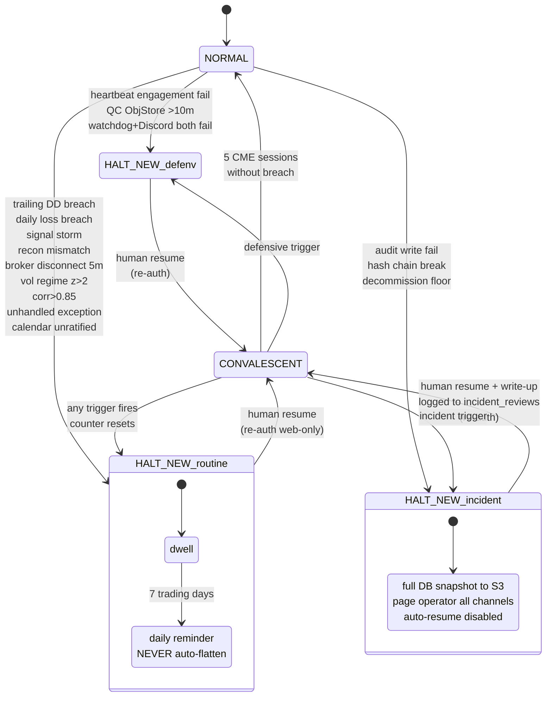

**Implementation notes:**
- State stored in `risk_state` table (single-row + history); all transitions write `state_transition_*` audit events
- CONVALESCENT counter: `convalescent_session_count` integer in `risk_state`; incremented at each CME session close while in CONVALESCENT; reset on any trigger
- **SUPERSEDED (2026-07-09, decisions-log "C1 night one, CONVALESCENT amendment"):** the criterion is now **3 clean UTC calendar days** (crypto has no CME sessions), the resume day counts, the breach day never counts, and the tick source is the 00:15 UTC recon cycle with a `convalescent_last_counted_day_utc` once-per-day marker. The mermaid "5 CME sessions" above is retained as history; the decisions-log entry wins.
- **AMENDED (2026-07-11, decisions-log "C1 night two"):** CONVALESCENT → NORMAL gains a second lawful cause beside clean-day graduation: **operator false-positive adjudication** (`plan_false_positive_graduation` + `POST /api/system/kill-switch/false-positive`, re-auth gated web-only — Discord stays risk-tightening-only per frontend-spec §6.1). Only lawful from CONVALESCENT (never shortcuts HALT_NEW); requires a non-blank operator reason AND a defect-fix reference; reuses the locked `state_transition_convalescent_to_normal` audit event with `cause="false_positive_adjudicated"` in the payload.
- Capital-event timer is independent of CONVALESCENT counter; both run in parallel, vol multipliers compose via `MIN`

### 2.4.4 Vol-Target Multiplier Composition

```python
def m_combined(now: datetime, equity: Decimal, peak_mtm: Decimal) -> Decimal:
    multipliers = []
    if capital_event_session_count(now) <= 5:
        multipliers.append(Decimal("0.5"))     # m_capital_event sessions 1-5
    elif capital_event_session_count(now) <= 30:
        multipliers.append(Decimal("1.0"))     # sessions 6-30 mode-active flag, multiplier normalized
    if state == "CONVALESCENT":
        multipliers.append(Decimal("0.5"))     # m_convalescent
    if monthly_dd_breached(now):
        multipliers.append(Decimal("0.5"))     # m_monthly_dd: -10% in calendar month
    multipliers.append(Decimal("1.0"))         # ceiling
    return min(multipliers)                    # MIN, not compounded
```

- **SUPERSEDED (2026-07-10, decisions-log "C1 day two, evening" / PR #374):** the capital-event counter is UTC calendar days derived from the latest threshold-met `capital_events.effective_at_utc` date (no global session counter exists); the locked half-size window is `1 <= count <= 5` — the event's own UTC day is session 0, full size — per `services/risk/multipliers.py`, which is authoritative over the `<= 5` in the pseudocode above (retained as history). The §5.13 CME-era `capital_event_mode_ended` emission at session 31 has no crypto-era emitter: the mode lapses by date, and the `risk_state` absolute `capital_event_*_session_no` fields are unread forensic placeholders.

### 2.4.5 Margin Protocol (graduated de-leverage)

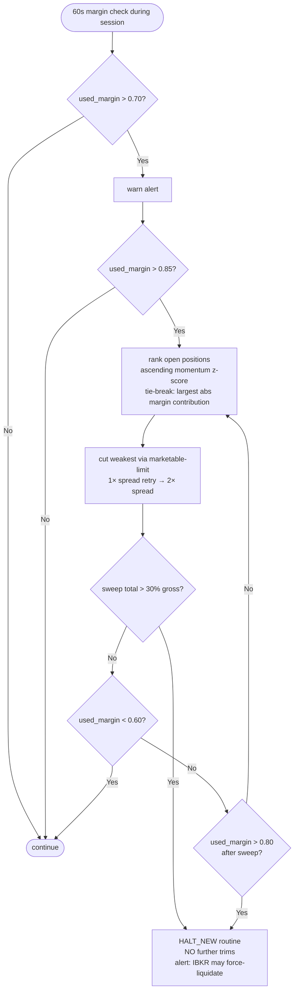

## 2.5 Execution Engine (post-pivot 2026-05-12)

| Property | Value (Phase 1+ post-pivot) | Pre-pivot Phase 1 (RETIRED) |
|---|---|---|
| Order placement path | Direct via `ib-async` (`IB.placeOrder()`) to `ib_gateway` container; TWS API session paper/live | Write to QC ObjectStore `/instructions/<n>.json`; QC algorithm executes via IBKR |
| Order types | Limit-marketable for entries; stop-market for stops; limit at target for profit-target exits; calendar spread for rolls (when broker supports) | Same |
| Idempotency | `client_order_id` 33-char format (locked); passed as `orderRef` field to IBKR | Same; passed via QC instruction protocol |
| Retry on rejection | Order Rejection Taxonomy (locked); rejections parsed from IBKR's `error()` callbacks (error codes) | Same taxonomy; rejections parsed from QC ack payloads |
| Macro pause | Applies to PLACEMENT only; signal generation runs regardless at 17:30 ET | Same |
| Round-trip target | p99 ≤ 5s (direct path); typical 200-800ms | p99 ≤ 20s (QC poll-mediated round trip) |
| Kill-switch SLO | ≤ 5s (direct path: signal HALT → `ib-async.cancelOrder()` for working orders) | ≤ 30s (write `/instructions/halt.json` → 5s poll → ack) |
| Code path | `services/execution/ibkr_client.py` (Pivot-PR-B; `risk-review-approved` required per [A02]) | `services/qc_adapter/` instruction-write module (RETIRED) |
| Smoke (A27 satisfier) | `deploy/ibkr/README.md` Pivot-PR-B precondition: `placeOrder` + `cancelOrder` round-trip on IBKR paper `/MES` BEFORE PR can merge | `deploy/qc_adapter/README.md` (RETIRED) |

**`client_order_id` derivation (33 chars):**
```
Format: {strategy_short:8}-{paramset_short:8}-{signal_short:12}-{retry_n:1-2}
Example: 9d2f7a1c-b54e83a1-4d9e7c1b2f0a-1
```

**Order placement queueing model (locked):** orders are queued at 17:30 ET signal cycle but placement is delayed:
- Futures: placed at next CME session start (typically ~18:00 ET same evening after maintenance pause)
- ETFs: placed at next NYSE 09:30 ET open
- If pause + 60-min staleness exceeds session, signal dropped (`macro_window_drop`)

`signal-emit-to-placement-attempt` is therefore NOT a bounded SLO — overnight queue is normal. The SLO is `signal-to-order placement latency: p50 ≤ 60s, p99 ≤ 5 min` measured `t_1 − t_0` where `t_0` = order placement attempted (scheduler dispatches order to broker after queueing window has cleared).

## 2.6 Reconciliation (post-pivot 2026-05-12)

Reconciliation evaluates whether the system's understanding of state matches the broker's authoritative state.

| Property | Value (Phase 1+ post-pivot) | Pre-pivot Phase 1 (RETIRED) |
|---|---|---|
| Intraday cadence | Every 60s during CME session, from `ib-async.reqPositions()` + `reqAccountSummary()` real-time TWS snapshot | Every 60s, from QC ObjectStore `/state/portfolio.json` push |
| EOD cadence | Daily 18:30 ET — IBKR FlexQuery XML pulled directly by backend via FlexQuery web service (token in sops `ibkr.flex_query_token`) | Daily 18:30 ET — IBKR FlexQuery (XML) pulled by QC algorithm, written to ObjectStore, polled by backend 5min after |
| Break detection | Per Reconciliation Tolerances Table | Same |
| Break action | Kill-switch (severity=routine) on any tolerance exceeded | Same |
| Special: dividend ex-date | Tolerances widen 2× for +24h, anchored to 17:00 ET MTM on ex-date | Same |
| Code path | `services/reconciliation/recon.py` (Day 9 PR #42 pure-policy planner) + `services/reconciliation/flex_query_fetcher.py` (Pivot-PR-C) + `services/reconciliation/ibkr_intraday.py` (Pivot-PR-C) | `services/reconciliation/recon.py` (same policy core) + `services/qc_adapter/` data source (RETIRED) |
| Smoke (A27 satisfier) | `deploy/reconciliation/README.md` Pivot-PR-C precondition: pull a FlexQuery XML for the operator's paper account, parse, compare against backend `positions` table, log `reconciliation_check_passed` audit event | `deploy/qc_adapter/README.md` (RETIRED) |

**Failure mode:** reconciliation stale > 60s during CME session → HALT_NEW (routine). The 60s threshold matches the freshness SLO; it is monitored independently as a meta-check (a separate "freshness-of-freshness" check that the recon service itself is alive).

**FlexQuery setup precondition:** the operator must pre-create a FlexQuery template in IBKR Account Management (Reports → Flex Queries) with: positions, cash balances, trades, dividends, ex-date metadata. Save the FlexQuery ID + token to `secrets/<env>.enc.yaml` under `ibkr.flex_query_id` + `ibkr.flex_query_token`. The Pivot-PR-C runbook walks the operator through this; the FlexQuery template is reusable across paper + live and rotates with quarterly secret rotation.

## 2.7 Monitoring and Health

| Property | Value |
|---|---|
| Endpoint | `GET /api/health` — returns 200 if all critical services healthy; 503 with `{degraded_services: [...]}` otherwise |
| Internal endpoint | `GET /internal/health/deep` — same check + extended diagnostics (full service heartbeat map); Bearer auth; consumed by external watchdog. Distinct from `POST /api/internal/watchdog` (push endpoint receiving watchdog pings) |
| Health criteria | All services responsive (last heartbeat < 30s); Postgres connection healthy; QC adapter cursor advancing within last 120s during session; reconciliation last-success < 90s during session |
| Liveness probes | systemd watchdog + Docker healthcheck per container |
| Failure modes | `/health` 503 → external watchdog increments counter, alerts at 3 (15 min) |

## 2.8 Claude Ops Agent

See **§12 Claude Ops Agent — Detailed Spec** for full treatment. Component summary:

| Property | Value |
|---|---|
| Tool inventory (bounded) | `tighten_parameter`, `invoke_defensive_trim`, `invoke_kill_switch`, `draft_pr`, `deploy_hotfix`, `generate_briefing`, `query_audit`, `summarize_costs` (no `place_order` tool exists) |
| Trigger model | (a) Scheduled (daily briefing 08:00 ET, weekly summary, monthly cost report); (b) Event-driven (kill-switch triggered, anomaly flagged, 7d HALT dwell reminder); (c) Operator-invoked via `/agent` command |
| Prompt cache | `cache_control: ephemeral` on system prompt + tool schemas + most-recent N audit summaries; 1h TTL aligns with typical session |
| Cost budget | $30–100/mo soft; alert at $200 monthly; `cost_alert_hard_ceiling` at $300 (HALT_NEW for cost — no, cost-review state, no halt of trading) |
| Failure handling | Anthropic API down → agent service degrades to read-only; trading continues; alert |
| Audit | Every tool invocation written to `agent_actions` + `audit_log` via `agent_decision_made` event |

## 2.9 Scheduler + Calendar (combined)

| Property | Value |
|---|---|
| Engine | APScheduler with `SQLAlchemyJobStore` (Postgres-backed) for persistence across restarts |
| Time source | `zoneinfo.ZoneInfo("America/New_York")` for wall-clock ET; UTC for storage |
| Calendars | `pandas_market_calendars` for CME (`CMEGlobex`) and NYSE; per-market mapping in `infrastructure/market_calendar.py` (locked, PR-required) |
| Schedules | 17:30 ET signal cycle (daily, CME sessions only); 22:00 ET calendar import; 18:30 ET EOD reconciliation; 23:00 ET ratification cutoff check; 09:00 ET liveness probe; 60s session-tick (margin, recon, MTM); 5s instruction ack poll Phase 1 |
| DST handling | Wall-clock-anchored ET; APScheduler natively DST-aware; session-counted windows (e.g., CONVALESCENT 5 sessions) use canonical CME session calendar so DST is irrelevant |

## 2.10 Audit Service

The audit service is the single most-load-bearing component of this system. Track record reproducibility, regulatory defensibility, and prop-firm allocation eligibility all depend on audit log integrity.

### 2.10.1 Write Path (locked algorithm)

```python
async def write_audit(event_type: AuditEventType, payload: dict) -> AuditRecord:
    canonical_payload = jcs.canonicalize(payload)  # RFC 8785 JCS
    for attempt in range(5):
        try:
            async with engine.begin() as conn:
                await conn.execute(text("BEGIN ISOLATION LEVEL SERIALIZABLE"))
                await conn.execute(
                    text("SELECT pg_advisory_xact_lock(:lock_id)"),
                    {"lock_id": AUDIT_CHAIN_LOCK_ID}  # fixed bigint
                )
                row = await conn.execute(text(
                    "SELECT record_hash FROM audit_log "
                    "ORDER BY sequence_no DESC LIMIT 1"
                )).fetchone()
                prev_hash = row.record_hash if row else b"\x00" * 32
                record_hash = hashlib.sha256(prev_hash + canonical_payload).digest()
                await conn.execute(text(
                    "INSERT INTO audit_log "
                    "(event_uuid, sequence_no, event_type, source_clock_ts, "
                    " ingest_clock_ts, prev_hash, record_hash, payload_jcs) "
                    "VALUES (:event_uuid, DEFAULT, :event_type, :source_ts, "
                    " :ingest_ts, :prev_hash, :record_hash, :payload)"
                ), {...})
            return ...
        except SerializationError:
            await asyncio.sleep([0.01, 0.05, 0.25, 1.25, 6.0][attempt])
            continue
    # 5 retries failed
    raise AuditWriteFailure  # → HALT_NEW (incident_review)
```

### 2.10.2 Immutability Mechanism

```sql
-- Block UPDATE/DELETE on audit_log even by app_owner
CREATE OR REPLACE FUNCTION audit_log_immutability_trigger()
RETURNS TRIGGER AS $$
BEGIN
  RAISE EXCEPTION 'audit_log is append-only; UPDATE/DELETE forbidden (TG_OP=%)', TG_OP;
END;
$$ LANGUAGE plpgsql;

CREATE TRIGGER audit_log_immutability
BEFORE UPDATE OR DELETE ON audit_log
FOR EACH ROW EXECUTE FUNCTION audit_log_immutability_trigger();

-- Block TRUNCATE via EVENT TRIGGER (TG_OP UPDATE/DELETE doesn't fire on TRUNCATE)
CREATE OR REPLACE FUNCTION block_audit_truncate()
RETURNS event_trigger AS $$
DECLARE r record;
BEGIN
  FOR r IN SELECT * FROM pg_event_trigger_ddl_commands() LOOP
    IF r.command_tag = 'TRUNCATE TABLE' AND r.objid::regclass::text LIKE 'audit_log%' THEN
      RAISE EXCEPTION 'TRUNCATE forbidden on audit_log';
    END IF;
  END LOOP;
END;
$$ LANGUAGE plpgsql;

CREATE EVENT TRIGGER block_audit_truncate
ON ddl_command_start
WHEN TAG IN ('TRUNCATE TABLE')
EXECUTE FUNCTION block_audit_truncate();

-- Hard revoke
REVOKE TRUNCATE ON audit_log FROM PUBLIC, app_service, app_owner;
-- Only dba_breakglass retains TRUNCATE
GRANT TRUNCATE ON audit_log TO dba_breakglass;
```

### 2.10.3 Verification Tool

`services/audit/verify_export.py` — given a CSV export with hash-chain footer:
1. Parse rows; recompute `record_hash = SHA-256(prev_hash || JCS(payload))` per row
2. Verify chain continuity (each row's `prev_hash` = previous row's `record_hash`)
3. Verify footer signature: `export_signature = SHA-256(JCS({chain_start_hash, chain_end_hash, record_count, exported_at_utc}))`
4. Compare `chain_end_hash` against current DB chain tail (or supplied "anchor" timestamp)
5. Exit 0 on success, non-zero with detailed error on failure

## 2.11 QC Adapter — `[RETIRED for primary role; DORMANT backfill role retained — pivot 2026-05-12]`

> **Status post-pivot:** The QC Adapter was originally the primary bridge between the Phase 1 backend and the QC algorithm. After the 2026-05-12 pivot (DP-025 → Option 4), it is **dormant in production** under a `qc_adapter_backfill` docker-compose profile gate.
>
> **What's preserved:**
> - The `services/qc_adapter/**` code surface (12 modules, ~100KB) — Day 28 PR-A
> - The 50 unit + integration tests — run in CI as a regression net against accidental re-introduction
> - The `deploy/qc_adapter/README.md` operator runbook — historical reference for the QC API contract
> - The `qc_adapter_cursor` table (§3.19) — preserved in schema; rows untouched
>
> **What's no longer operational:**
> - The container is never started by default `docker compose up -d` (profile-gated under `qc_adapter_backfill`)
> - No polling against `/events`, `/acks`, `/state/portfolio.json`, or any other ObjectStore path occurs in production
> - The instruction-write code path (`/instructions/<n>.json`) is wholly retired
>
> **When the dormant code might be invoked:** ad-hoc historical replay — if the operator ever wants to re-process pre-pivot ObjectStore content (none currently exists because production never wrote to QC; the pivot landed before any live Phase 1 traffic). In the absence of any historical content to replay, the dormant role is effectively "code documentation of the path not taken."
>
> **Re-enabling for backfill (procedure):**
> 1. `docker compose --profile qc_adapter_backfill up -d qc_adapter`
> 2. Operator confirms what's being replayed + writes a `decision_diary` entry with rationale
> 3. Wait for `orchestrator_cycle_completed` log line
> 4. `docker compose --profile qc_adapter_backfill stop qc_adapter` when replay complete
> 5. `verify_chain --env paper` to confirm audit chain still walks

The tables and protocol descriptions below are preserved verbatim for institutional memory + audit-chain provenance traceability. **None of the directions, cadences, or schemas below describe Phase 1+ operational reality.**

| Direction | Path | Cadence | Phase (pre-pivot) |
|---|---|---|---|
| QC → backend (audit events) | `/events/<sequence>.jsonl` | Backend polls every 60s | 1 (primary), 2 (backfill) |
| QC → backend (state) | `/state/portfolio.json`, `/state/positions/*.json`, `/state/dt_count.json` | QC pushes every 60s during session; backend polls 60s | 1 only |
| QC → backend (FlexQuery EOD) | `/state/flexquery/<date>.xml` | Daily 18:30 ET QC pull, push to ObjectStore; backend polls 5min after | 1 only |
| Backend → QC (instructions) | `/instructions/<sequence>.json` | Backend writes; QC polls every 5s | 1 only |
| QC → backend (acks) | `/instruction_acks/<sequence>.json` | QC writes; backend polls every 5s | 1 only |

**Cursor management (preserved-for-replay):** `qc_adapter_cursor` table tracks last-consumed `sequence_no` per directory. On startup, adapter resumes from cursor.

**Loss handling (preserved-for-replay):** if a sequence gap is detected (e.g., `sequence_no` jumps from 1042 to 1045), adapter alerts and pulls from QC's logs API; backfilled records APPENDED at current chain tail with `repaired_for_sequence_no` provenance. Original gap remains visible.

**Schema parity (preserved-for-replay):** golden test compares JCS-canonicalized `record_payload` byte-for-byte; metadata fields (`{ingest_clock_ts, ingest_uuid, sequence_no}`) validated for shape only. Tests in `tests/golden/test_qc_parity.py` (PR #45) + `tests/integration/test_qc_adapter_ingestion.py` (PR #84) still run in CI.

**Failure mode (pre-pivot, RETIRED):** unavailable > 10 min during CME session → HALT_NEW (defensive_envelope). **Post-pivot:** the failure mode is N/A because the container is profile-gated off in production; if the operator manually enables `qc_adapter_backfill` and the upstream service is unavailable, the backfill replay fails locally without triggering a kill-switch (the container is not on the canonical health-check graph).

## 2.12 Watchdog (External)

See §1.6. Component-level summary:

| Property | Value |
|---|---|
| Inputs | `GET /api/health` from backend (5-min cron) |
| Outputs | Email via Resend + Discord webhook on 3 consecutive failures (15 min unreachable) |
| Authority | NONE — alerts only; cannot halt or modify state |

## 2.13 Gitea Mirror

| Property | Value |
|---|---|
| Purpose | Repo / build-chain DR; survives GitHub outage |
| Container | `gitea/gitea:1.21` |
| Sync | Daily cron pulls from GitHub via `git fetch --mirror`; weekly encrypted repo archive to S3 |
| Access | Reachable on Caddy at `/gitea/*` (basic auth, opaque path); not in main nav |

## 2.14 Slippage Calibration Service

| Property | Value |
|---|---|
| Cadence | Phase 1: monthly cron (1st of month, 22:00 ET); Phase 2: quarterly |
| Functional form | `slippage_bps_market = α_market + β_market × (order_size / ADV_30d)` |
| Estimator | OLS per market on realized fills (compared to LEAN-emitted `expected_price` at signal time) |
| Bootstrap (Phase 1, first 30 days) | LEAN built-in slippage model DISABLED in bootstrap backtest run; `expected_price = decision_price`; initial α=0, β=0 (zero-slippage prior) |
| First real calibration | After 30 days of Phase 1 LIVE fills accumulated |
| Output | New row in `slippage_calibration_versions` (event-sourced); HEAD pointer updated |
| Audit | `slippage_calibration_recalibrated` event |
| Trigger for unscheduled review | Realized > 2× modeled for any single market for 3 consecutive months → strategy review (NOT automatic; human-initiated) |

# 2.15 Per-Service Failure Mode Cross-Reference

The Per-Service Degradation Matrix from `prompt-a-backend-spec.md` is the authoritative source. Each service's runtime configuration includes a `failure_mode_handler.py` that imports a shared dispatcher. Cross-references:

| Service | Failure modes cross-ref |
|---|---|
| Risk engine | §6.2 below; matrix line "Risk engine down" |
| Reconciliation | §6.2; "Reconciliation stale > 60s" |
| Calendar | §6.2; "Calendar service can't reach FF/TE" |
| FRED | §6.2; "FRED unreachable" |
| QC adapter | §6.2; "QC ObjectStore poll fails 5–9 min" / ">10 min" |
| IBKR (Phase 2) | §6.2; "Backend can't reach IBKR > 5 min" |
| Discord | §6.2; "Discord delivery fails" |
| DB write (non-audit) | §6.2; "Database write fails (non-audit)" |
| DB write (audit) | §6.2; "Database write fails (audit_log)" |
| Postgres corruption | §6.2; "Postgres corruption / hash chain break" |
| Anthropic API | §6.2; "Anthropic Claude API down" |
| External watchdog | §6.2; "External watchdog unreachable" |
| CME settlement | §6.2; "CME settlement prints unavailable > 60 min" |

---

# 3. Data Models and Schemas

All migrations are Alembic-versioned. Below are the **canonical** DDLs in PostgreSQL 16 syntax. Implementation drops them into Alembic ops.

> **Schema invariants:**
> - Every persistent entity has UUIDv7 PK (`uuid_v7()` extension or `pgcrypto`-based generator), surrogate to any business key.
> - Every row carries `created_at TIMESTAMPTZ NOT NULL DEFAULT now()`.
> - Every row tagged with `account_id UUID NOT NULL REFERENCES accounts(id)` from day 1 (multi-account = INSERT, not migration).
> - Every trade-related row tagged with `env TEXT NOT NULL CHECK (env IN ('paper','live-small','live-scale'))`.
> - Every signal/trade/order tagged with `(strategy_hash, parameter_set_hash, slippage_calibration_version_id)` composite identity.
> - Yearly partitioning from day 1 on `audit_log`, `trades`, `orders`, `fills`, `attribution`. Empty future partitions for 5 years; cron Dec 31 adds new partition.

## 3.1 `accounts`

```sql
CREATE TABLE accounts (
  id UUID PRIMARY KEY DEFAULT uuid_generate_v7(),
  external_account_id TEXT NOT NULL UNIQUE,        -- IBKR account ID
  account_type TEXT NOT NULL CHECK (account_type IN ('individual','llc','prop')),
  base_currency CHAR(3) NOT NULL DEFAULT 'USD',
  reg_t_eligible BOOLEAN NOT NULL DEFAULT TRUE,
  span_eligible BOOLEAN NOT NULL DEFAULT TRUE,
  pdt_eligible BOOLEAN NOT NULL DEFAULT TRUE,
  -- Reader-role schema lands in Phase 0 (column lands now to avoid future destructive migration);
  -- reader-redaction middleware + invite flow are a Phase 3 deliverable.
  role TEXT NOT NULL DEFAULT 'owner' CHECK (role IN ('owner', 'reader')),
  created_at TIMESTAMPTZ NOT NULL DEFAULT now(),
  active_from TIMESTAMPTZ NOT NULL,
  active_to TIMESTAMPTZ
);
CREATE UNIQUE INDEX accounts_active_unique ON accounts(external_account_id) WHERE active_to IS NULL;
```

### 3.1.1 `setup_tokens` (first-run bootstrap; Phase 0)

One-time tokens emitted at first boot for `/api/setup/verify-token`. The raw token is printed to `stdout` exactly once (and only at boot); only the Argon2id hash is persisted.

```sql
CREATE TABLE setup_tokens (
    token_uuid UUID PRIMARY KEY,                    -- UUIDv7
    token_hash TEXT NOT NULL,                       -- Argon2id hash (argon2-cffi); raw token only in stdout at boot
    intended_role TEXT NOT NULL CHECK (intended_role IN ('owner', 'reader')),
    created_at TIMESTAMPTZ NOT NULL DEFAULT now(),
    expires_at TIMESTAMPTZ NOT NULL,                -- created_at + 24h
    consumed_at TIMESTAMPTZ
);
CREATE INDEX idx_setup_tokens_unconsumed ON setup_tokens(consumed_at) WHERE consumed_at IS NULL;
```

## 3.2 `audit_log` (PARTITIONED BY YEAR; hash-chained)

```sql
CREATE TABLE audit_log (
  event_uuid UUID NOT NULL DEFAULT uuid_generate_v7(),
  sequence_no BIGSERIAL NOT NULL,
  event_type TEXT NOT NULL,                        -- enum mirror; see §3.20
  account_id UUID NOT NULL REFERENCES accounts(id),
  env TEXT NOT NULL CHECK (env IN ('paper','live-small','live-scale')),
  phase_at_emit SMALLINT NOT NULL CHECK (phase_at_emit IN (0,1,2,3)),
  source_clock_ts TIMESTAMPTZ NOT NULL,           -- emitter's wall clock
  ingest_clock_ts TIMESTAMPTZ NOT NULL DEFAULT now(),
  monotonic_ns BIGINT,                             -- in-process monotonic
  prev_hash BYTEA NOT NULL CHECK (octet_length(prev_hash) = 32),
  record_hash BYTEA NOT NULL CHECK (octet_length(record_hash) = 32),
  payload_jcs BYTEA NOT NULL,                      -- canonicalized JCS bytes
  repaired_for_sequence_no BIGINT,                 -- non-null on backfill
  repaired_for_event_timestamp TIMESTAMPTZ,
  PRIMARY KEY (sequence_no, ingest_clock_ts)
) PARTITION BY RANGE (ingest_clock_ts);

-- Yearly partitions
CREATE TABLE audit_log_y2026 PARTITION OF audit_log
  FOR VALUES FROM ('2026-01-01') TO ('2027-01-01');
CREATE TABLE audit_log_y2027 PARTITION OF audit_log
  FOR VALUES FROM ('2027-01-01') TO ('2028-01-01');
-- ... through y2031 (5 years out)

CREATE INDEX audit_log_event_type_idx ON audit_log(event_type, ingest_clock_ts DESC);
CREATE INDEX audit_log_event_uuid_idx ON audit_log(event_uuid);
CREATE UNIQUE INDEX audit_log_sequence_no_uniq ON audit_log(sequence_no);

-- Application-defined fixed bigint for advisory lock
-- 1 = audit chain lock id (literal: 0x617564697420636861in_const)
-- Service code: SELECT pg_advisory_xact_lock(0x6175646974636861);

-- Triggers (immutability + truncate block) per §2.10
```

## 3.3 `signals`

```sql
CREATE TABLE signals (
  id UUID PRIMARY KEY DEFAULT uuid_generate_v7(),
  account_id UUID NOT NULL REFERENCES accounts(id),
  env TEXT NOT NULL,
  market TEXT NOT NULL,                            -- '/MES', 'TLT', etc.
  contract_id UUID REFERENCES contracts(id),       -- futures only
  emitted_at_utc TIMESTAMPTZ NOT NULL,
  session_date DATE NOT NULL,                      -- CME session date
  direction TEXT NOT NULL CHECK (direction IN ('long','short','flat')),
  signal_type TEXT NOT NULL,                       -- 'donchian_breakout','ma_cross', ...
  strategy_hash CHAR(40) NOT NULL,                 -- git SHA
  parameter_set_hash CHAR(64) NOT NULL,            -- SHA-256 hex
  slippage_calibration_version_id UUID NOT NULL
    REFERENCES slippage_calibration_versions(id),
  decision_price NUMERIC(20,8) NOT NULL,
  expected_slippage_bps NUMERIC(10,4),
  expected_fill_price NUMERIC(20,8),
  target_contracts INTEGER NOT NULL,               -- post-Stage 5 rounded
  sizing_trace JSONB NOT NULL,                     -- full Stage 0-5 trace
  unsettled BOOLEAN NOT NULL DEFAULT FALSE,        -- bid/ask midpoint fallback
  anomaly_reasons TEXT[] NOT NULL DEFAULT '{}',    -- reason codes from frontend vocab
  status TEXT NOT NULL DEFAULT 'pending'
    CHECK (status IN ('pending','approved','rejected','deferred','expired',
                      'working','partially_filled','filled','cancelled',
                      'closed','stopped_out','sub_minimum_size','macro_window_drop',
                      'market_drop_settlement_unavailable')),
  approved_at_utc TIMESTAMPTZ,
  rejected_at_utc TIMESTAMPTZ,
  expires_at_utc TIMESTAMPTZ,
  decision_diary_entry_id UUID REFERENCES decision_diary(id),
  created_at TIMESTAMPTZ NOT NULL DEFAULT now()
);
CREATE INDEX signals_emitted_at ON signals(emitted_at_utc DESC);
CREATE INDEX signals_status ON signals(status);
CREATE INDEX signals_session_date_market ON signals(session_date, market);
```

## 3.4 `orders` (PARTITIONED BY YEAR)

```sql
CREATE TABLE orders (
  id UUID NOT NULL DEFAULT uuid_generate_v7(),
  account_id UUID NOT NULL REFERENCES accounts(id),
  env TEXT NOT NULL,
  signal_id UUID NOT NULL REFERENCES signals(id),
  client_order_id TEXT NOT NULL UNIQUE,            -- 33-char per spec
  broker_order_id TEXT,                            -- IBKR-issued
  market TEXT NOT NULL,
  contract_id UUID REFERENCES contracts(id),
  direction TEXT NOT NULL CHECK (direction IN ('buy','sell')),
  order_type TEXT NOT NULL
    CHECK (order_type IN ('limit_marketable','stop_market','limit',
                          'calendar_spread','market_emergency')),
  quantity INTEGER NOT NULL,
  limit_price NUMERIC(20,8),
  stop_price NUMERIC(20,8),
  placed_at_utc TIMESTAMPTZ NOT NULL,
  acknowledged_at_utc TIMESTAMPTZ,
  status TEXT NOT NULL DEFAULT 'pending'
    CHECK (status IN ('pending','working','partially_filled','filled',
                      'cancelled','rejected','expired')),
  rejection_reason TEXT,                            -- per Order Rejection Taxonomy
  retry_n SMALLINT NOT NULL DEFAULT 0,
  parent_order_id UUID REFERENCES orders(id),       -- on retries / spreads
  strategy_hash CHAR(40) NOT NULL,
  parameter_set_hash CHAR(64) NOT NULL,
  created_at TIMESTAMPTZ NOT NULL DEFAULT now(),
  PRIMARY KEY (id, created_at)
) PARTITION BY RANGE (created_at);

-- Yearly partitions y2026...y2031

CREATE INDEX orders_signal_id ON orders(signal_id);
CREATE INDEX orders_status ON orders(status);
CREATE INDEX orders_client_order_id ON orders(client_order_id);
```

## 3.5 `fills` (PARTITIONED BY YEAR)

```sql
CREATE TABLE fills (
  id UUID NOT NULL DEFAULT uuid_generate_v7(),
  account_id UUID NOT NULL REFERENCES accounts(id),
  env TEXT NOT NULL,
  order_id UUID NOT NULL REFERENCES orders(id),
  broker_fill_id TEXT NOT NULL UNIQUE,
  filled_at_utc TIMESTAMPTZ NOT NULL,
  fill_price NUMERIC(20,8) NOT NULL,
  fill_quantity INTEGER NOT NULL,
  commission NUMERIC(20,8) NOT NULL DEFAULT 0,
  exchange_fee NUMERIC(20,8) NOT NULL DEFAULT 0,
  realized_slippage_bps NUMERIC(10,4),             -- vs expected
  created_at TIMESTAMPTZ NOT NULL DEFAULT now(),
  PRIMARY KEY (id, created_at)
) PARTITION BY RANGE (created_at);
-- yearly partitions

CREATE INDEX fills_order_id ON fills(order_id);
CREATE INDEX fills_filled_at ON fills(filled_at_utc);
```

## 3.6 `trades` (PARTITIONED BY YEAR; one trade = entry-to-exit round-trip)

```sql
CREATE TABLE trades (
  id UUID NOT NULL DEFAULT uuid_generate_v7(),
  account_id UUID NOT NULL REFERENCES accounts(id),
  env TEXT NOT NULL,
  market TEXT NOT NULL,
  contract_id UUID REFERENCES contracts(id),
  entry_signal_id UUID NOT NULL REFERENCES signals(id),
  entry_order_id UUID NOT NULL REFERENCES orders(id),
  exit_order_id UUID REFERENCES orders(id),
  direction TEXT NOT NULL CHECK (direction IN ('long','short')),
  opened_at_utc TIMESTAMPTZ NOT NULL,
  closed_at_utc TIMESTAMPTZ,
  total_quantity INTEGER NOT NULL,
  avg_entry_price NUMERIC(20,8) NOT NULL,
  avg_exit_price NUMERIC(20,8),
  realized_pnl_usd NUMERIC(20,4),
  realized_commission_usd NUMERIC(20,4) NOT NULL DEFAULT 0,
  dividend_pnl_usd NUMERIC(20,4) NOT NULL DEFAULT 0,  -- ETF only
  state TEXT NOT NULL CHECK (state IN
    ('open_position','closed','stopped_out','capacity_constrained')),
  managed_by_version CHAR(40) NOT NULL,            -- decommission-aware
  strategy_hash CHAR(40) NOT NULL,
  parameter_set_hash CHAR(64) NOT NULL,
  slippage_calibration_version_id UUID NOT NULL,
  created_at TIMESTAMPTZ NOT NULL DEFAULT now(),
  PRIMARY KEY (id, created_at)
) PARTITION BY RANGE (created_at);
-- yearly partitions

CREATE INDEX trades_state ON trades(state);
CREATE INDEX trades_opened_at ON trades(opened_at_utc);
CREATE INDEX trades_market ON trades(market);
```

## 3.7 `attribution` (PARTITIONED BY YEAR; expected immutable, realized nullable)

```sql
CREATE TABLE attribution (
  id UUID NOT NULL DEFAULT uuid_generate_v7(),
  trade_id UUID NOT NULL REFERENCES trades(id),
  account_id UUID NOT NULL,
  env TEXT NOT NULL,
  -- expected_* columns (immutable post-emit)
  expected_entry_price NUMERIC(20,8) NOT NULL,
  expected_exit_price NUMERIC(20,8),                -- NULL if expected hold-to-stop
  expected_pnl_usd NUMERIC(20,4) NOT NULL,
  expected_slippage_bps NUMERIC(10,4) NOT NULL,
  expected_holding_days INTEGER NOT NULL,
  expected_at_utc TIMESTAMPTZ NOT NULL,
  -- realized_* columns (nullable until trade closes; updatable only via dedicated path)
  realized_entry_price NUMERIC(20,8),
  realized_exit_price NUMERIC(20,8),
  realized_pnl_usd NUMERIC(20,4),
  realized_slippage_bps NUMERIC(10,4),
  realized_holding_days INTEGER,
  realized_at_utc TIMESTAMPTZ,
  created_at TIMESTAMPTZ NOT NULL DEFAULT now(),
  PRIMARY KEY (id, created_at)
) PARTITION BY RANGE (created_at);

-- Trigger: BEFORE UPDATE — allow only realized_* columns to change
CREATE OR REPLACE FUNCTION attribution_immutability()
RETURNS TRIGGER AS $$
BEGIN
  IF NEW.expected_entry_price IS DISTINCT FROM OLD.expected_entry_price OR
     NEW.expected_exit_price IS DISTINCT FROM OLD.expected_exit_price OR
     NEW.expected_pnl_usd IS DISTINCT FROM OLD.expected_pnl_usd OR
     NEW.expected_slippage_bps IS DISTINCT FROM OLD.expected_slippage_bps OR
     NEW.expected_holding_days IS DISTINCT FROM OLD.expected_holding_days OR
     NEW.expected_at_utc IS DISTINCT FROM OLD.expected_at_utc OR
     NEW.trade_id IS DISTINCT FROM OLD.trade_id THEN
    RAISE EXCEPTION 'expected_* columns are immutable post-emit';
  END IF;
  RETURN NEW;
END;
$$ LANGUAGE plpgsql;

CREATE TRIGGER attribution_immutability_trigger
BEFORE UPDATE ON attribution
FOR EACH ROW EXECUTE FUNCTION attribution_immutability();
```

## 3.8 `positions` (current and historical)

```sql
CREATE TABLE positions_current (
  id UUID PRIMARY KEY DEFAULT uuid_generate_v7(),
  account_id UUID NOT NULL,
  market TEXT NOT NULL,
  contract_id UUID REFERENCES contracts(id),
  quantity INTEGER NOT NULL,                       -- signed
  avg_cost NUMERIC(20,8) NOT NULL,
  margin_held NUMERIC(20,4) NOT NULL DEFAULT 0,
  unrealized_pnl NUMERIC(20,4),
  last_mark_ts TIMESTAMPTZ NOT NULL,
  managed_by_version CHAR(40) NOT NULL,
  UNIQUE(account_id, market, contract_id)
);

-- Historical positions (event-sourced snapshot at each 60s tick)
CREATE TABLE positions_history (
  id UUID PRIMARY KEY DEFAULT uuid_generate_v7(),
  account_id UUID NOT NULL,
  snapshot_ts TIMESTAMPTZ NOT NULL,
  market TEXT NOT NULL,
  contract_id UUID,
  quantity INTEGER NOT NULL,
  avg_cost NUMERIC(20,8),
  margin_held NUMERIC(20,4),
  unrealized_pnl NUMERIC(20,4),
  source TEXT NOT NULL CHECK (source IN ('qc_objectstore','tws_api','flexquery_eod')),
  created_at TIMESTAMPTZ NOT NULL DEFAULT now()
);
CREATE INDEX positions_history_snapshot ON positions_history(snapshot_ts DESC);
```

## 3.9 `balances` (event-sourced)

```sql
CREATE TABLE balances (
  id UUID PRIMARY KEY DEFAULT uuid_generate_v7(),
  account_id UUID NOT NULL,
  snapshot_ts TIMESTAMPTZ NOT NULL,
  net_liquidation NUMERIC(20,4) NOT NULL,
  cash_usd NUMERIC(20,4) NOT NULL,
  excess_liquidity NUMERIC(20,4) NOT NULL,
  used_margin_pct NUMERIC(10,8) NOT NULL,           -- 1 - excess_liq/net_liq
  buying_power NUMERIC(20,4),
  pdt_day_trade_count_5d INTEGER,
  source TEXT NOT NULL CHECK (source IN ('qc_objectstore','tws_api','flexquery_eod')),
  created_at TIMESTAMPTZ NOT NULL DEFAULT now()
);
CREATE INDEX balances_snapshot ON balances(snapshot_ts DESC);
```

## 3.10 `strategy_versions`

Flattened to structured columns to match the frontend's flat `StrategyVersion` type (mirrored by `StrategyVersionResponse` in §4.1.5b). `short_hash` is **7 chars** to match `git rev-parse --short` default and the frontend type.

```sql
CREATE TABLE strategy_versions (
  id UUID PRIMARY KEY DEFAULT uuid_generate_v7(),
  strategy_hash CHAR(40) NOT NULL UNIQUE,           -- git SHA (full)
  short_hash CHAR(7) NOT NULL UNIQUE,               -- 7-char prefix; matches frontend StrategyVersion.short_hash
  strategy_name TEXT NOT NULL,                      -- 'v1_trend_following'
  branch TEXT NOT NULL,                             -- e.g. 'main', 'agent/hot-fix-2026-04-12'
  deployed_at_utc TIMESTAMPTZ NOT NULL,
  deployed_by TEXT NOT NULL CHECK (deployed_by IN ('operator', 'agent')),
  deploy_method TEXT NOT NULL CHECK (deploy_method IN ('pr_merge', 'agent_hot_fix')),
  parent_version_short_hash CHAR(7) REFERENCES strategy_versions(short_hash),
  backtest_baseline_id UUID,                        -- FK target may live in research subsystem
  parameter_set_hash TEXT NOT NULL,                 -- sha256 of canonical parameter set
  slippage_calibration_version TEXT NOT NULL,       -- e.g. 'v17'
  paper_days_required INTEGER NOT NULL DEFAULT 30,  -- CME sessions
  paper_days_completed INTEGER NOT NULL DEFAULT 0,
  decommissioned BOOLEAN NOT NULL DEFAULT false,
  decommissioned_at_utc TIMESTAMPTZ,
  decommissioned_reason TEXT
  -- (no JSONB metadata column; all fields explicit and frontend-mirrored)
);
CREATE INDEX strategy_versions_short_hash ON strategy_versions(short_hash);
```

## 3.11 `parameters` and `parameter_sets` (event-sourced)

```sql
-- Event-sourced parameter changes — every change is a row
CREATE TABLE parameters (
  id UUID PRIMARY KEY DEFAULT uuid_generate_v7(),
  parameter_name TEXT NOT NULL,                     -- e.g. 'LOOKBACK_DAYS_DONCHIAN'
  parameter_value JSONB NOT NULL,                   -- typed via app
  valid_from TIMESTAMPTZ NOT NULL,
  valid_to TIMESTAMPTZ,
  changed_by TEXT NOT NULL CHECK (changed_by IN ('agent','operator','init','revert')),
  change_reason TEXT,
  parameter_set_hash CHAR(64) NOT NULL,             -- hash AFTER this change
  prev_parameter_set_hash CHAR(64),                 -- hash BEFORE (NULL on init)
  audit_event_uuid UUID NOT NULL,                   -- FK to audit_log
  pr_url TEXT,                                       -- if PR-based
  created_at TIMESTAMPTZ NOT NULL DEFAULT now()
);
CREATE INDEX parameters_valid_at
  ON parameters(parameter_name, valid_from DESC);

-- Parameter set hash = SHA-256 over JCS({param_name: value} for params in
-- Parameter Ranges Table only, alphabetized by name)
CREATE TABLE parameter_sets (
  parameter_set_hash CHAR(64) PRIMARY KEY,
  parameters JSONB NOT NULL,                        -- {LOOKBACK_DAYS_DONCHIAN: 60, ...}
  first_active_at TIMESTAMPTZ NOT NULL,
  last_active_at TIMESTAMPTZ                        -- NULL if currently active
);
```

> **Hash input scope — operator-only flags excluded (clarified 2026-05-29,
> `Docs/parameter-sets-bootstrap-design.md` §11 Q1-A).** The "Parameter Ranges
> Table" params hashed above are the 10 agent/PR-tunable strategy parameters:
> `LOOKBACK_DAYS_DONCHIAN`, `MA_FAST_DAYS`, `MA_SLOW_DAYS`, `EFFICIENCY_RATIO_THRESHOLD`,
> `STOP_DISTANCE_ATR_MULT`, `ATR_LOOKBACK_DAYS`, `MIN_HOLDING_DAYS`,
> `VOL_TARGET_PCT_ANNUAL`, `INSTRUMENT_VOL_LOOKBACK_DAYS`,
> `ROLL_DAYS_BEFORE_EXPIRY` (the PR-locked `ATR_LOOKBACK_DAYS` /
> `MIN_HOLDING_DAYS` ARE included). The two operator-only boolean kill-switch
> flags added 2026-05-26 — `STRATEGY_DECOMMISSIONED` and `EXIT_AUTO_APPROVE` —
> are **stored in the `parameters` JSONB but EXCLUDED from the hash input.** This
> keeps `parameter_set_hash` stable across a decommission flip, so the
> kill-switch can be toggled with an in-place `parameters` UPDATE that leaves the
> content-addressable primary key unchanged (no PK churn). The canonical minter
> is `services/version/composite_hash.py::compute_parameter_set_hash`, which
> delegates JCS canonicalization to `services/audit/chain.py::jcs_serialize` (the
> single in-tree canonicalizer).

## 3.12 `slippage_calibration_versions`

```sql
CREATE TABLE slippage_calibration_versions (
  id UUID PRIMARY KEY DEFAULT uuid_generate_v7(),
  version_no INTEGER NOT NULL UNIQUE,
  is_head BOOLEAN NOT NULL DEFAULT FALSE,           -- one TRUE at a time
  calibrated_at_utc TIMESTAMPTZ NOT NULL,
  trigger TEXT NOT NULL CHECK (trigger IN
    ('bootstrap','scheduled_monthly','scheduled_quarterly','manual')),
  per_market_coefficients JSONB NOT NULL,
  -- {"MES": {"alpha": 0.5, "beta": 12.3, "n_obs": 84, "r_squared": 0.61}, ...}
  data_window_start TIMESTAMPTZ,
  data_window_end TIMESTAMPTZ,
  audit_event_uuid UUID NOT NULL,
  notes TEXT
);
CREATE UNIQUE INDEX slippage_head ON slippage_calibration_versions(is_head)
  WHERE is_head = TRUE;
```

## 3.13 `decision_diary`

```sql
CREATE TABLE decision_diary (
  id UUID PRIMARY KEY DEFAULT uuid_generate_v7(),
  account_id UUID NOT NULL,
  entry_class TEXT NOT NULL
    CHECK (entry_class IN ('signal_response','forward_looking','general')),
  linked_signal_id UUID REFERENCES signals(id),
  linked_market_id TEXT,
  tag TEXT NOT NULL
    CHECK (tag IN ('data_concern','regime_concern','size_concern',
                   'manual_judgment','other')),
  ts_utc TIMESTAMPTZ NOT NULL DEFAULT now(),
  monotonic_ns BIGINT,
  author TEXT NOT NULL CHECK (author IN ('operator','agent')),
  reasoning_text TEXT NOT NULL,
  CONSTRAINT operator_min_10 CHECK (
    author <> 'operator' OR length(reasoning_text) >= 10
  ),
  CONSTRAINT signal_response_requires_link CHECK (
    entry_class <> 'signal_response' OR linked_signal_id IS NOT NULL
  ),
  CONSTRAINT non_signal_response_no_link CHECK (
    entry_class = 'signal_response' OR linked_signal_id IS NULL
  )
);
CREATE INDEX decision_diary_signal ON decision_diary(linked_signal_id);
CREATE INDEX decision_diary_ts ON decision_diary(ts_utc DESC);
```

## 3.14 `risk_state` (single-row + history)

```sql
CREATE TABLE risk_state (
  id UUID PRIMARY KEY DEFAULT uuid_generate_v7(),
  account_id UUID NOT NULL,
  state TEXT NOT NULL CHECK (state IN ('NORMAL','HALT_NEW','CONVALESCENT')),
  severity TEXT CHECK (severity IN ('routine','defensive_envelope','incident_review')
                       OR state <> 'HALT_NEW'),
  reason TEXT,
  entered_at_utc TIMESTAMPTZ NOT NULL,
  convalescent_session_count INTEGER NOT NULL DEFAULT 0,
  capital_event_active_until_session_no INTEGER,    -- session 30 from event
  capital_event_vol_normalized_at_session_no INTEGER,  -- session 6
  monthly_dd_breached_for_calendar_month CHAR(7),   -- 'YYYY-MM' or NULL
  vacation_active BOOLEAN NOT NULL DEFAULT FALSE,
  vacation_until_utc TIMESTAMPTZ,
  audit_event_uuid UUID NOT NULL,
  is_current BOOLEAN NOT NULL DEFAULT FALSE
);
CREATE UNIQUE INDEX risk_state_current ON risk_state(account_id, is_current)
  WHERE is_current = TRUE;
```

## 3.15 `reconciliation_breaks`

```sql
CREATE TABLE reconciliation_breaks (
  id UUID PRIMARY KEY DEFAULT uuid_generate_v7(),
  account_id UUID NOT NULL,
  detected_at_utc TIMESTAMPTZ NOT NULL,
  metric TEXT NOT NULL,                             -- 'position_qty', 'cash_usd', ...
  market TEXT,
  contract_id UUID,
  expected NUMERIC(30,8),
  actual NUMERIC(30,8),
  delta NUMERIC(30,8),
  tolerance NUMERIC(30,8),
  source TEXT NOT NULL,
  resolved_at_utc TIMESTAMPTZ,
  resolution_path TEXT
    -- 'auto_rereconciled' added 2026-07-13 (migration 20260713_recon_resolution_auto):
    -- a subsequent recon cycle observed the divergence gone (machine
    -- re-resolution; the EOD cycle stamps it). 'manual' = operator action.
    CHECK (resolution_path IN ('grace_period','manual','kill_switch',
                               'tolerance_widened_dividend','auto_rereconciled')),
  audit_event_uuid UUID NOT NULL
);
```

## 3.16 `data_quality_events`

```sql
CREATE TABLE data_quality_events (
  id UUID PRIMARY KEY DEFAULT uuid_generate_v7(),
  market TEXT NOT NULL,
  bar_close_ts TIMESTAMPTZ,
  detected_at_utc TIMESTAMPTZ NOT NULL DEFAULT now(),
  event_type TEXT NOT NULL CHECK (event_type IN ('reject','quarantine')),
  reason TEXT NOT NULL,                             -- 'close_le_zero','high_lt_low', ...
  raw_bar JSONB NOT NULL,
  audit_event_uuid UUID NOT NULL
);
```

## 3.17 `agent_actions`

```sql
CREATE TABLE agent_actions (
  id UUID PRIMARY KEY DEFAULT uuid_generate_v7(),
  account_id UUID NOT NULL,
  invoked_at_utc TIMESTAMPTZ NOT NULL,
  action_type TEXT NOT NULL
    CHECK (action_type IN ('tighten_parameter','invoke_defensive_trim',
                           'invoke_kill_switch','draft_pr','deploy_hotfix',
                           'generate_briefing','query_audit','summarize_costs')),
  agent_decision_id TEXT NOT NULL,                  -- Anthropic msg_id
  prompt_cache_hit_pct NUMERIC(5,2),
  cost_usd NUMERIC(10,4),
  result TEXT NOT NULL CHECK (result IN ('success','partial','failed','reverted')),
  result_detail JSONB,
  audit_event_uuid UUID NOT NULL,
  reverted_at_utc TIMESTAMPTZ,
  revert_reason TEXT
);
CREATE INDEX agent_actions_invoked ON agent_actions(invoked_at_utc DESC);
```

## 3.18 `vacation_mode`

```sql
CREATE TABLE vacation_mode (
  id UUID PRIMARY KEY DEFAULT uuid_generate_v7(),
  account_id UUID NOT NULL,
  started_at_utc TIMESTAMPTZ NOT NULL,
  scheduled_end_utc TIMESTAMPTZ NOT NULL,
  ended_at_utc TIMESTAMPTZ,
  ended_by TEXT CHECK (ended_by IN ('expiry','operator_command','operator_web')),
  audit_event_uuid_start UUID NOT NULL,
  audit_event_uuid_end UUID
);
CREATE INDEX vacation_active ON vacation_mode(account_id, ended_at_utc) WHERE ended_at_utc IS NULL;
```

## 3.19 `qc_adapter_cursor` — `[DORMANT — pivot 2026-05-12]`

> **Status post-pivot:** Schema is preserved; rows are preserved. The 3 INSERT rows from alembic 0004 + the defensive re-seed in `2026-05-09_qc_adapter_cursor_seed.py` (PR #40) stay in place. The table is no longer written to or read from in normal Phase 1+ operation; rows would only be touched if the operator manually enables the `qc_adapter_backfill` docker-compose profile. See §2.11 for the dormant role description.

```sql
CREATE TABLE qc_adapter_cursor (
  directory_path TEXT PRIMARY KEY,
  last_consumed_sequence_no BIGINT NOT NULL,
  last_consumed_at_utc TIMESTAMPTZ NOT NULL,
  bytes_consumed BIGINT NOT NULL DEFAULT 0,
  consecutive_failures INTEGER NOT NULL DEFAULT 0
);
INSERT INTO qc_adapter_cursor VALUES
  ('/events/', 0, now(), 0, 0),
  ('/state/portfolio.json', 0, now(), 0, 0),
  ('/instruction_acks/', 0, now(), 0, 0);
```

## 3.20 `capital_events`

```sql
CREATE TABLE capital_events (
  id UUID PRIMARY KEY DEFAULT uuid_generate_v7(),
  account_id UUID NOT NULL,
  event_type TEXT NOT NULL CHECK (event_type IN ('deposit','withdrawal')),
  amount_usd NUMERIC(20,4) NOT NULL,
  pre_event_equity NUMERIC(20,4) NOT NULL,
  post_event_equity NUMERIC(20,4) NOT NULL,
  pct_of_pre_equity NUMERIC(10,8) NOT NULL,
  threshold_met BOOLEAN NOT NULL,                   -- TRUE if >= 5%
  effective_at_utc TIMESTAMPTZ NOT NULL,
  dd_baseline_reset_to NUMERIC(20,4),               -- NULL on withdrawals
  capital_event_mode_session_start INTEGER,        -- CME session counter at event
  audit_event_uuid UUID NOT NULL
);
```

## 3.21 `cost_events`

```sql
CREATE TABLE cost_events (
  id UUID PRIMARY KEY DEFAULT uuid_generate_v7(),
  provider TEXT NOT NULL,                           -- 'anthropic','quantconnect','hetzner', ...
  observed_at_utc TIMESTAMPTZ NOT NULL,
  amount_usd NUMERIC(10,4) NOT NULL,
  rolling_30d_total NUMERIC(10,4),
  threshold_breached TEXT
    CHECK (threshold_breached IN ('soft_200','hard_300') OR threshold_breached IS NULL),
  source TEXT NOT NULL                              -- 'billing_api' or 'csv_import'
);
```

## 3.22 `liveness_probes`

```sql
CREATE TABLE liveness_probes (
  id UUID PRIMARY KEY DEFAULT uuid_generate_v7(),
  account_id UUID NOT NULL,
  sent_at_utc TIMESTAMPTZ NOT NULL,
  channel TEXT NOT NULL CHECK (channel IN ('discord','email','web')),
  acknowledged_at_utc TIMESTAMPTZ,
  ack_method TEXT CHECK (ack_method IN ('reaction','reply','web_activity','email_reply')),
  audit_event_uuid_sent UUID NOT NULL,
  audit_event_uuid_ack UUID
);
```

## 3.23 `pdt_day_trade_log`

```sql
CREATE TABLE pdt_day_trade_log (
  id UUID PRIMARY KEY DEFAULT uuid_generate_v7(),
  account_id UUID NOT NULL,
  trade_date_nyse DATE NOT NULL,
  market TEXT NOT NULL,
  fills JSONB NOT NULL,                             -- [{order_id, ts, price, qty, side}]
  is_day_trade BOOLEAN NOT NULL,
  source TEXT NOT NULL CHECK (source IN ('qc_objectstore','tws_api','flexquery_eod')),
  reconciled_with_flexquery BOOLEAN NOT NULL DEFAULT FALSE,
  reconciliation_break_id UUID REFERENCES reconciliation_breaks(id),
  audit_event_uuid UUID NOT NULL
);
CREATE INDEX pdt_log_account_date ON pdt_day_trade_log(account_id, trade_date_nyse);
```

## 3.24 `dividend_history`

```sql
CREATE TABLE dividend_history (
  id UUID PRIMARY KEY DEFAULT uuid_generate_v7(),
  symbol TEXT NOT NULL,                             -- TLT, IEF, SHY
  ex_date DATE NOT NULL,
  pay_date DATE,
  amount_usd_per_share NUMERIC(20,8) NOT NULL,
  source TEXT NOT NULL,                             -- 'qc_bundled','manual'
  ingested_at_utc TIMESTAMPTZ NOT NULL DEFAULT now(),
  audit_event_uuid UUID,
  UNIQUE(symbol, ex_date)
);
```

## 3.25 `incident_reviews`

```sql
CREATE TABLE incident_reviews (
  id UUID PRIMARY KEY DEFAULT uuid_generate_v7(),
  triggering_audit_event_uuid UUID NOT NULL,        -- FK conceptual; cross-partition
  triggering_alert_uuid UUID,                       -- nullable
  state_transition_to TEXT NOT NULL,                -- 'HALT_NEW(incident_review)'
  authored_at_utc TIMESTAMPTZ NOT NULL DEFAULT now(),
  authored_by TEXT NOT NULL,                        -- operator session id
  write_up_text TEXT NOT NULL CHECK (length(write_up_text) >= 100),
  resolved BOOLEAN NOT NULL DEFAULT FALSE,
  resolved_at_utc TIMESTAMPTZ,
  resume_audit_event_uuid UUID
);
```

## 3.26 `universe_state`

```sql
CREATE TABLE universe_state (
  id UUID PRIMARY KEY DEFAULT uuid_generate_v7(),
  account_id UUID NOT NULL,
  market TEXT NOT NULL,
  is_active BOOLEAN NOT NULL,
  exclusion_reason TEXT
    CHECK (exclusion_reason IN
      ('single_contract_notional_exceeds_50pct_equity','data_executability_failed',
       NULL)),
  single_contract_notional NUMERIC(20,4),
  current_equity NUMERIC(20,4),
  evaluated_at_utc TIMESTAMPTZ NOT NULL DEFAULT now(),
  audit_event_uuid UUID NOT NULL,
  UNIQUE(account_id, market, evaluated_at_utc)
);
CREATE INDEX universe_active ON universe_state(account_id, is_active, evaluated_at_utc DESC);
```

## 3.27 `alerts`

`alerts.category` is locked to a Postgres ENUM (`alert_category`). The Pydantic `AlertCategory` Literal in §4.1.5b mirrors this enum exactly; new categories require a schema migration AND a corresponding Pydantic update.

```sql
CREATE TYPE alert_category AS ENUM (
    'kill_switch_invoked',
    'kill_switch_resumed',
    'halt_dwell_warning',
    'audit_write_failure',
    'audit_chain_break',
    'qc_objectstore_degraded',
    'broker_disconnect',
    'reconciliation_break',
    'margin_warn',
    'margin_auto_trim',
    'data_quality_reject',
    'data_quality_quarantine',
    'vol_regime_z_high',
    'capacity_warning',
    'slippage_drift',
    'model_decay',
    'capital_event',
    'parameter_change_proposed',
    'parameter_change_reverted',
    'pr_drafted',
    'pr_rejected',
    'liveness_probe_missed',
    'engagement_timeout',
    'cost_alert_soft',
    'cost_alert_hard',
    'external_watchdog_alert',
    'incident_review_required',
    'phase_cutover_started',
    'maintenance_window'
);

CREATE TABLE alerts (
  id UUID PRIMARY KEY DEFAULT uuid_generate_v7(),
  account_id UUID NOT NULL,
  fired_at_utc TIMESTAMPTZ NOT NULL DEFAULT now(),
  severity TEXT NOT NULL CHECK (severity IN ('P0','P1','P2')),
  category alert_category NOT NULL,                 -- locked enum, NOT free-form text
  message TEXT NOT NULL,
  detail JSONB,
  delivery_status JSONB,                            -- {discord: 'ok', email: 'ok'}
  acknowledged BOOLEAN NOT NULL DEFAULT FALSE,
  acknowledged_at_utc TIMESTAMPTZ,
  resolved_at_utc TIMESTAMPTZ,
  triggering_audit_event_uuid UUID
);
CREATE INDEX alerts_severity_unack ON alerts(severity, acknowledged) WHERE NOT acknowledged;

-- Migration note: when retrofitting an existing alerts table:
--   ALTER TABLE alerts ALTER COLUMN category TYPE alert_category USING category::alert_category;
--
-- NOTE: `ALTER TYPE alert_category ADD VALUE` migrations append members AFTER
-- creation; those are NOT reflected in the CREATE TYPE list above. As of
-- 2026-05-29 the live enum additionally contains, in append order:
--   heartbeat_stale                      (PR #154 follow-up, 2026-05-16)
--   worker_failure                       (recovery-agent, 2026-05-26)
--   position_unprotected                 (exit-pipeline PR-C #253, 2026-05-27)
--   reconciliation_data_source_degraded  (Option C recon-fix, 2026-05-29; P1 → #alerts only)
-- alembic/versions/ is the source of truth for current enum membership.
```

## 3.28 `macro_events`

```sql
CREATE TABLE macro_events (
  id UUID PRIMARY KEY DEFAULT uuid_generate_v7(),
  imported_at_utc TIMESTAMPTZ NOT NULL,
  source TEXT NOT NULL CHECK (source IN ('forex_factory','trading_economics','manual')),
  event_name TEXT NOT NULL,
  tier1_classification TEXT,                        -- 'FOMC','CPI','NFP', ...
  scheduled_at_utc TIMESTAMPTZ NOT NULL,
  region TEXT,                                      -- 'US','EU','UK','JP'
  currency CHAR(3),
  importance TEXT CHECK (importance IN ('high','medium','low')),
  ratified_at_utc TIMESTAMPTZ,
  ratified_by TEXT,                                 -- 'operator_discord','operator_web'
  audit_event_uuid_import UUID NOT NULL,
  audit_event_uuid_ratify UUID
);
CREATE INDEX macro_events_scheduled ON macro_events(scheduled_at_utc);
```

## 3.29 `contracts` (futures contract metadata)

```sql
CREATE TABLE contracts (
  id UUID PRIMARY KEY DEFAULT uuid_generate_v7(),
  market_root TEXT NOT NULL,                        -- '/MES'
  ibkr_local_symbol TEXT NOT NULL,
  ibkr_con_id BIGINT,
  expiry_date DATE NOT NULL,
  point_value NUMERIC(20,8) NOT NULL,
  multiplier NUMERIC(20,8) NOT NULL DEFAULT 1,
  exchange TEXT NOT NULL,
  exchange_calendar_code TEXT NOT NULL,
  active BOOLEAN NOT NULL DEFAULT TRUE,
  UNIQUE(market_root, expiry_date)
);
```

## 3.30 Audit Event Type Enum (mirror of locked taxonomy)

```python
# services/audit/event_types.py — Python Enum mirroring locked taxonomy.
# New types REQUIRE schema migration + PR.

class AuditEventType(str, Enum):
    # Lifecycle / state
    SYSTEM_STARTED = "system_started"
    SYSTEM_STOPPED = "system_stopped"
    MIGRATION_APPLIED = "migration_applied"
    PHASE_CUTOVER_STARTED = "phase_cutover_started"
    PHASE_CUTOVER_COMPLETED = "phase_cutover_completed"
    # Strategy / signals
    SIGNAL_EMITTED = "signal_emitted"
    SIGNAL_APPROVED = "signal_approved"
    SIGNAL_REJECTED = "signal_rejected"
    SIGNAL_DEFERRED = "signal_deferred"
    SIGNAL_EXPIRED = "signal_expired"
    BULK_APPROVE_INVOKED = "bulk_approve_invoked"
    TRADE_REALIZED = "trade_realized"
    SIGNAL_ANOMALY_FLAGGED = "signal_anomaly_flagged"
    MARKET_DROP_SETTLEMENT_UNAVAILABLE = "market_drop_settlement_unavailable"
    MACRO_WINDOW_DROP = "macro_window_drop"
    # Orders / execution
    ORDER_PLACED = "order_placed"
    ORDER_FILLED = "order_filled"
    ORDER_PARTIALLY_FILLED = "order_partially_filled"
    ORDER_CANCELLED = "order_cancelled"
    ORDER_REJECTED = "order_rejected"
    ORDER_RETRY_ATTEMPTED = "order_retry_attempted"
    MANUAL_CLOSE_INVOKED = "manual_close_invoked"
    ROLL_INITIATED = "roll_initiated"
    ROLL_COMPLETED = "roll_completed"
    # Risk / state machine
    STATE_TRANSITION_NORMAL_TO_HALT = "state_transition_normal_to_halt"
    STATE_TRANSITION_HALT_TO_CONVALESCENT = "state_transition_halt_to_convalescent"
    STATE_TRANSITION_CONVALESCENT_TO_NORMAL = "state_transition_convalescent_to_normal"
    KILL_SWITCH_TRIGGERED = "kill_switch_triggered"
    DEFENSIVE_TRIM_INVOKED = "defensive_trim_invoked"
    MARGIN_AUTO_TRIM_INVOKED = "margin_auto_trim_invoked"
    CONVALESCENT_COUNTER_RESET = "convalescent_counter_reset"
    DECOMMISSION_FLOOR_TRIGGERED = "decommission_floor_triggered"
    # Capital / equity
    CAPITAL_EVENT_DEPOSIT = "capital_event_deposit"
    CAPITAL_EVENT_WITHDRAWAL = "capital_event_withdrawal"
    CAPITAL_EVENT_MODE_STARTED = "capital_event_mode_started"
    CAPITAL_EVENT_MODE_ENDED = "capital_event_mode_ended"
    DD_BASELINE_RESET = "dd_baseline_reset"
    PEAK_MTM_UPDATED = "peak_mtm_updated"
    # Universe / parameters
    UNIVERSE_EXCLUSION = "universe_exclusion"
    UNIVERSE_INCLUSION = "universe_inclusion"
    PARAMETER_CHANGE_PROPOSED = "parameter_change_proposed"
    PARAMETER_CHANGE_APPLIED = "parameter_change_applied"
    PARAMETER_CHANGE_REVERTED = "parameter_change_reverted"
    PR_DRAFTED = "pr_drafted"
    PR_APPROVED = "pr_approved"
    PR_REJECTED = "pr_rejected"
    PR_MERGED = "pr_merged"
    STRATEGY_VERSION_DEPLOYED = "strategy_version_deployed"
    STRATEGY_VERSION_DECOMMISSIONED = "strategy_version_decommissioned"
    SLIPPAGE_CALIBRATION_RECALIBRATED = "slippage_calibration_recalibrated"
    # Reconciliation / data quality
    RECONCILIATION_CHECK_PASSED = "reconciliation_check_passed"
    RECONCILIATION_BREAK_DETECTED = "reconciliation_break_detected"
    RECONCILIATION_BREAK_RESOLVED = "reconciliation_break_resolved"
    # Option C recon-fix (2026-05-29): reqPositions per-cycle fetch failed
    # terminally; recon fell back to the FlexQuery position list. Audit-first
    # breadcrumb paired with the `reconciliation_data_source_degraded` alert.
    RECONCILIATION_DATA_SOURCE_DEGRADED = "reconciliation_data_source_degraded"
    DATA_QUALITY_REJECT = "data_quality_reject"
    DATA_QUALITY_QUARANTINE = "data_quality_quarantine"
    PSD_REPAIR_APPLIED = "psd_repair_applied"
    # Communications / engagement
    LIVENESS_PROBE_SENT = "liveness_probe_sent"
    LIVENESS_PROBE_ACKNOWLEDGED = "liveness_probe_acknowledged"
    ENGAGEMENT_TIMEOUT_TRIGGERED = "engagement_timeout_triggered"
    DISCORD_DELIVERY_FAILED = "discord_delivery_failed"
    EMAIL_BACKUP_SENT = "email_backup_sent"
    # Vacation / calendar
    VACATION_STARTED = "vacation_started"
    VACATION_ENDED = "vacation_ended"
    CALENDAR_IMPORTED = "calendar_imported"
    CALENDAR_RATIFIED = "calendar_ratified"
    CALENDAR_UNRATIFIED = "calendar_unratified"
    CALENDAR_SERVICE_OUTAGE = "calendar_service_outage"
    # Auth / security
    WEBAUTHN_REGISTERED = "webauthn_registered"
    WEBAUTHN_LOGIN = "webauthn_login"
    TOTP_LOGIN = "totp_login"
    BACKUP_CODE_USED = "backup_code_used"
    SESSION_EVICTED = "session_evicted"
    RE_AUTH_REQUIRED = "re_auth_required"
    RE_AUTH_PASSED = "re_auth_passed"
    BREAKGLASS_INVOKED = "breakglass_invoked"
    SECRETS_ROTATED = "secrets_rotated"
    # Agent
    AGENT_DECISION_MADE = "agent_decision_made"
    AGENT_HOT_FIX_DEPLOYED = "agent_hot_fix_deployed"
    AGENT_HOT_FIX_ROLLED_BACK = "agent_hot_fix_rolled_back"
    AGENT_PR_DRAFTED = "agent_pr_drafted"
    AGENT_ACTION_FAILED = "agent_action_failed"
    # System health
    SERVICE_DEGRADED = "service_degraded"
    SERVICE_RECOVERED = "service_recovered"
    COST_ALERT_SOFT_CEILING = "cost_alert_soft_ceiling"
    COST_ALERT_HARD_CEILING = "cost_alert_hard_ceiling"
    EXTERNAL_WATCHDOG_ALERT = "external_watchdog_alert"
    INCIDENT_REVIEW_LOGGED = "incident_review_logged"
    AUDIT_CHAIN_INTEGRITY_VERIFIED = "audit_chain_integrity_verified"
    AUDIT_REPAIR_APPLIED = "audit_repair_applied"
    HEARTBEAT_STALE_DETECTED = "heartbeat_stale_detected"
    ASYNC_TASK_DIED = "async_task_died"
    RECOVERY_ACTION_TAKEN = "recovery_action_taken"
```

`ASYNC_TASK_DIED` / `RECOVERY_ACTION_TAKEN` are the recovery-agent pair (drill-5 follow-up landed 2026-05-26): the monitor hook in `services/api/async_task_monitor.py` emits `ASYNC_TASK_DIED` + INSERTs a `worker_failure` alerts row when a tracked lifespan task dies; the polling agent at `scripts/operator_tools/recovery_agent.py` emits `RECOVERY_ACTION_TAKEN` (audit-first) before invoking `replay_executions.py` and UPDATEing the alert. Payload contract for `RECOVERY_ACTION_TAKEN`: `triggering_alert_uuid`, `triggering_audit_event_uuid`, `decision` ∈ `{invoke_replay, alert_only}`, `task_name`, `classification` ∈ `{transient, hard_crash, ambiguous}`, `plan`.

---

# 4. API Contracts

## 4.1 REST Endpoints (canonical)

All endpoints live under `/api/*`. All state-changing endpoints require CSRF token (`X-CSRF-Token` header matching the non-HttpOnly `csrf_token` cookie). Risk-loosening endpoints additionally require WebAuthn UV within the last 5 minutes (`last_uv_at` field on session row checked server-side).

> **Pydantic schemas:** every endpoint listed below has a `RequestModel` and `ResponseModel` defined in `services/api/schemas/` with strict `model_config = ConfigDict(strict=True, extra="forbid")`. Pydantic v2 throughout.

### 4.1.1 Auth

| Method | Path | Auth | Re-Auth? | Phase | Description |
|---|---|---|---|---|---|
| POST | `/api/auth/webauthn/challenge` | none | — | 0 | Start login ceremony. Returns `{publicKeyCredentialRequestOptions}`. **`userVerification: "required"`** (locked). |
| POST | `/api/auth/webauthn/verify` | none | — | 0 | Complete login. Sets HttpOnly session cookie + CSRF cookie. |
| POST | `/api/auth/webauthn/register/challenge` | session (within `/setup`) | — | 0 | Start registration. **`userVerification: "required"`** (locked). |
| POST | `/api/auth/webauthn/register/verify` | session | — | 0 | Complete registration. |
| POST | `/api/auth/totp/verify` | none | — | 0 | TOTP fallback login. **Reduced privileges** (no risk-loosening). |
| POST | `/api/auth/totp/setup-verify` | ceremony_session | — | 0 | During enrollment, verify operator's TOTP code before locking the secret. |
| POST | `/api/auth/recover` | none | — | 0 | Backup code recovery (8 single-use codes; Argon2id-hashed at rest). |
| POST | `/api/auth/logout` | session | — | 0 | Invalidate current session. Emits `session_evicted` to all other tabs of same user with reason `explicit_logout`. |
| POST | `/api/auth/backup-codes/regenerate` | session | YES | 0 | Regenerates 8 backup codes. Old codes invalidated. |
| GET  | `/api/auth/me` | session | — | 1 | Returns current session info (user, role, auth-strength, expiry, enrollment flags). |
| POST | `/api/setup/verify-token` | none | — | 0 | First-run bootstrap token verification. Consumes one-time `setup_tokens` row; returns ceremony session for WebAuthn registration. |

```python
# services/api/schemas/auth.py
class WebAuthnChallengeRequest(BaseModel):
    pass  # body empty; user inferred from session if /register, else from username field

class WebAuthnVerifyRequest(BaseModel):
    credential: dict  # raw WebAuthn credential

class TotpVerifyRequest(BaseModel):
    username: str
    totp_code: str = Field(min_length=6, max_length=6)

class RecoverRequest(BaseModel):
    username: str
    backup_code: str = Field(min_length=10, max_length=20)

# GET /api/auth/me — Phase 1 — returns current session info
class AuthMeResponse(BaseModel):
    user_id: str
    username: str
    role: Literal["owner", "reader"]
    auth_strength: Literal["weak", "strong"]
    last_uv_at: datetime | None
    session_expires_at: datetime
    webauthn_enrolled: bool
    totp_enrolled: bool

# POST /api/setup/verify-token — Phase 0 — first-run bootstrap
class SetupTokenVerifyRequest(BaseModel):
    token: str

class SetupTokenVerifyResponse(BaseModel):
    valid: bool
    intended_role: Literal["owner", "reader"]
    ceremony_session_id: str  # short-lived; permits WebAuthn registration

# POST /api/auth/totp/setup-verify — Phase 0 — verify TOTP before locking
class TotpSetupVerifyRequest(BaseModel):
    ceremony_session_id: str
    totp_code: str = Field(min_length=6, max_length=6)

class TotpSetupVerifyResponse(BaseModel):
    success: bool
```

### 4.1.2 Signals & Trades

| Method | Path | Auth | Re-Auth? | Description |
|---|---|---|---|---|
| GET | `/api/signals?status=pending&limit=50&cursor=...` | session | — | List signals, cursor paginated. |
| POST | `/api/signals/:id/approve` | session | — | Approve signal. Body optional `override_size`. |
| POST | `/api/signals/:id/reject` | session | — | Reject. Body REQUIRED `decision_diary_entry: {tag, reasoning_text}`. |
| POST | `/api/signals/:id/defer` | session | — | Defer to next session. Body `decision_diary_entry`. |
| POST | `/api/signals/bulk-approve-standard` | session | — | (Phase 2) Bulk approves all non-anomaly pending signals. |
| GET | `/api/trades?from=&to=&market=&state=&id_prefix=&cursor=` | session | — | List trades. `id_prefix` (alongside existing date/market/state filters) supports the command-palette ID-prefix search; matches against `trade_uuid::text` prefix. |
| GET | `/api/trades/:id` | session | — | Trade detail. |
| POST | `/api/trades/:id/close` | session | YES IF HALT_NEW | Manual close. |
| GET | `/api/trades/export.csv?from=&to=` | session | — | CSV export with hash-chain footer (single anchor). |
| POST | `/api/decision-diary` | session | — | (Phase 1) Create diary entry (`forward_looking` or `general`). For signal-linked entries use `/api/signals/:id/reject` or `/api/signals/:id/defer` with embedded `decision_diary_entry`. |

```python
class SignalListResponse(BaseModel):
    items: list[SignalSummary]
    next_cursor: str | None
    has_more: bool

class SignalSummary(BaseModel):
    id: UUID
    market: str
    direction: Literal["long", "short", "flat"]
    target_contracts: int
    decision_price: Decimal
    expected_fill_price: Decimal | None
    expected_slippage_bps: Decimal | None
    unsettled: bool
    anomaly_reasons: list[
        Literal["vol_regime_z_high", "capacity_above_alert",
                "recent_decision_diary_concern", "slippage_outlier_recent",
                "version_baseline_divergence"]
    ]
    status: Literal["pending", "approved", "rejected", "deferred", "expired",
                    "working", "partially_filled", "filled", "cancelled",
                    "closed", "stopped_out", "sub_minimum_size",
                    "macro_window_drop", "market_drop_settlement_unavailable"]
    emitted_at_utc: datetime
    expires_at_utc: datetime
    strategy_short_hash: str
    parameter_set_short_hash: str

class SignalApproveRequest(BaseModel):
    override_size: int | None = None  # None = use system-sized target_contracts

class SignalRejectRequest(BaseModel):
    decision_diary_entry: DecisionDiaryEntry

class DecisionDiaryEntry(BaseModel):
    entry_class: Literal["signal_response", "forward_looking", "general"] = "signal_response"
    tag: Literal["data_concern", "regime_concern", "size_concern",
                 "manual_judgment", "other"]
    reasoning_text: str = Field(min_length=10, max_length=2000)

# POST /api/decision-diary — Phase 1 — standalone (non-signal) diary entry
class DecisionDiaryCreateRequest(BaseModel):
    entry_class: Literal["signal_response", "forward_looking", "general"]
    linked_signal_id: str | None = None       # required when entry_class == 'signal_response'
    linked_market_id: str | None = None       # used when entry_class == 'forward_looking'
    tag: Literal["data_concern", "regime_concern", "size_concern",
                 "manual_judgment", "other"]
    reasoning_text: str = Field(min_length=10, max_length=2000)

class DecisionDiaryCreateResponse(BaseModel):
    diary_uuid: str
    audit_event_uuid: str
```

### 4.1.3 System & Risk

| Method | Path | Auth | Re-Auth? | Description |
|---|---|---|---|---|
| GET | `/api/system/status` | session | — | Snapshot: kill-switch state + severity, vacation, watchdog last-ping, recon summary. |
| GET | `/api/system/risk-envelope` | session | — | Phase 1 read-only: returns parameter set + risk rings + multipliers. |
| POST | `/api/system/risk-envelope/propose` | session | YES | Phase 2: drafts PR with proposed parameter changes. Body `{changes: [{param_name, new_value, rationale}]}`. |
| POST | `/api/system/kill-switch/invoke` | session | — | Manual kill-switch invocation. |
| POST | `/api/system/kill-switch/resume` | session | YES | Resume from HALT_NEW → CONVALESCENT. Body `{incident_review_id?}` (REQUIRED if severity=incident_review). |
| POST | `/api/system/vacation/start` | session | — | Body `{days: int (1-30)}`. |
| POST | `/api/system/vacation/end` | session | YES | Web-only end. |
| GET | `/api/system/audit?event_type=&from=&to=&limit=&cursor=` | session | — | Audit explorer. Returns canonical payload + chain metadata. |
| GET | `/api/system/audit/export.csv?...` | session | — | Audit CSV export with full hash-chain footer. |
| GET | `/api/system/deployments` | session | — | Phase 2: deployment history. |
| POST | `/api/system/deployments/:id/rollback` | session | YES | Phase 2 manual rollback. |
| GET | `/api/system/agent-activity?limit=&cursor=` | session | — | Phase 2 agent action log. |
| GET | `/api/system/costs?days=30` | session | — | Cost dashboard data. |
| GET | `/api/system/watchdog` | session | — | Last watchdog ping. |
| POST | `/api/internal/watchdog` | Bearer (sops token) | — | Watchdog push endpoint; returns 200 to indicate liveness. |

```python
class SystemStatus(BaseModel):
    risk_state: Literal["NORMAL", "HALT_NEW", "CONVALESCENT"]
    severity: Literal["routine", "defensive_envelope", "incident_review"] | None
    halt_reason: str | None
    halt_dwell_session_count: int | None
    convalescent_session_count: int | None
    vacation_active: bool
    vacation_until_utc: datetime | None
    watchdog_last_ping_utc: datetime
    reconciliation_summary: ReconciliationSummary
    is_session_active: bool  # CME-session boolean per frontend contract
    server_now: datetime  # RFC 3339 ms-precision
    backend_version: str
    expected_frontend_version: str

class ReconciliationSummary(BaseModel):
    last_check_utc: datetime
    last_check_passed: bool
    open_breaks: int
    breaks_24h: int
```

### 4.1.4 Performance / Research / Calendar

| Method | Path | Auth | Re-Auth? | Description |
|---|---|---|---|---|
| GET | `/api/performance/equity?env=current\|all&from=&to=` | session | — | Equity curve. |
| GET | `/api/performance/attribution?from=&to=&group_by=` | session | — | Per-strategy / per-market / per-cluster attribution. |
| GET | `/api/performance/tax-estimate?year=` | session | — | Year-to-date tax view. |
| POST | `/api/performance/tax-election` | session | YES | Election toggle (with CPA acknowledgment text capture). |
| POST | `/api/performance/pdf-export` | session | — | Async; returns `{job_id}`; SSE progress via `job` channel. |
| GET | `/api/research/backtests` | session | — | Phase 2 backtest list. |
| GET | `/api/research/walk-forward/:strategy_version` | session | — | Phase 2 walk-forward fold visualization. |
| POST | `/api/research/parameters/propose` | session | YES | Phase 2: draft PR for parameter change. |
| GET | `/api/calendar/events?from=&to=` | session | — | Macro calendar events. |
| POST | `/api/calendar/ratify` | session | — | Ratify next-day events. Body `{event_uuids: [UUID]}` or `{ratify_all: true}`. |

### 4.1.5 Stress Test, Jobs, Health, Metadata

| Method | Path | Auth | Re-Auth? | Description |
|---|---|---|---|---|
| POST | `/api/stress-test/run` | session | — | Async stress test run; returns `{job_id}`. SSE progress on `job` channel; terminal `job` event payload includes `result_url`. **No separate `/api/stress-test/results/:job_id` endpoint** — frontend reads result via `result_url`. |
| GET | `/api/jobs/:job_id` | session | — | Fallback poll. |
| GET | `/api/health` | none | — | External watchdog endpoint. Returns 200 OR 503 with `degraded_services`. |
| GET | `/api/version` | session | — | `{backend_version, expected_frontend_version, git_sha}`. |
| GET | `/api/metadata/instruments` | session | — | Bulk instrument metadata for frontend. |

### 4.1.5b Today / Health Score / Positions / Orders / Fills / Alerts / Agent / Strategy Versions

These endpoints back the Today landing page, command-palette, agent surface, and per-deployment metadata used by the frontend.

| Method | Path | Auth | Re-Auth? | Phase | Description |
|---|---|---|---|---|---|
| GET | `/api/health-score` | session | — | 1 | Composite health score + components (Sharpe vs backtest, slippage drift, hit rate, capacity headroom, days-since-recon-break). Primary source for `<HealthScoreIndicator />`. |
| GET | `/api/today/digest` | session | — | 1 | Aggregate Today-page first-paint payload (denormalized: includes `health_score` body for landing-page paint without an extra round-trip). |
| GET | `/api/positions/current` | session | — | 1 | Active positions: per (instrument, contract_month) for futures, per symbol for ETFs. |
| GET | `/api/orders?status=working\|filled\|cancelled&limit=20&cursor=` | session | — | 1 | List working / recent orders, cursor paginated. |
| GET | `/api/fills?limit=20&cursor=` | session | — | 1 | Recent fills, cursor paginated. |
| GET | `/api/alerts?status=open\|acknowledged\|resolved&severity=P0\|P1\|P2&limit=&cursor=` | session | — | 1 | List alerts, cursor paginated. |
| POST | `/api/agent/ask` | session | — | 2 | Send query to Claude agent. Streamed via SSE on `agent` channel when response > N tokens; otherwise inline JSON. **Phase 2 only** — depends on `#ask-agent` Discord channel + agent answer surface. |
| GET | `/api/strategy-versions/:short_hash` | session | — | 1 | Returns flat StrategyVersion (matches frontend type). `short_hash` is 7 chars (CHAR(7); `git rev-parse --short` default). |

```python
# services/api/schemas/health_score.py
class HealthScoreComponent(BaseModel):
    name: Literal[
        "live_sharpe_vs_backtest",
        "slippage_drift",
        "hit_rate",
        "capacity_headroom",
        "days_since_recon_break",
    ]
    weight_pct: int                         # 0-100; sums to 100 across components
    window: str                             # e.g. "60-day rolling", "current"
    score: int | None                       # 0-100; null when insufficient_data
    insufficient_data: bool

class HealthScoreResponse(BaseModel):
    composite: int                          # 0-100
    traffic_light: Literal["green", "yellow", "red"]
    components: list[HealthScoreComponent]
    insufficient_data: bool                 # true if any component insufficient AND composite would be misleading
    computed_at: datetime

# services/api/schemas/today.py
class PnLSummary(BaseModel):
    daily_pnl: Decimal
    weekly_pnl: Decimal
    monthly_pnl: Decimal
    yearly_pnl: Decimal

class ExposureBreakdown(BaseModel):
    by_cluster: dict[Literal["equity_index","commodity","rates_bonds","crypto","fx"], Decimal]
    gross_exposure_pct_nav: Decimal
    net_exposure_pct_nav: Decimal

class TodayDigestResponse(BaseModel):
    health_score: HealthScoreResponse       # denormalized for landing-page first paint
    pnl: PnLSummary                         # D / W / M / Y
    exposure: ExposureBreakdown
    queued_signals_count: int
    active_alerts_count_by_severity: dict[Literal["P0","P1","P2"], int]
    state: Literal["NORMAL", "HALT_NEW", "CONVALESCENT", "VACATION"]
    state_severity: Literal["routine", "defensive_envelope", "incident_review"] | None  # only when HALT_NEW
    agent_status: Literal["idle", "working", "degraded", "disabled", "errored"]
    environment: Literal["paper", "live-small", "live-scale"]
    deployed_strategy_version: str          # 7-char short_hash

# services/api/schemas/positions.py
class Position(BaseModel):
    instrument_id: str
    symbol: str                             # e.g. "/MES Mar26", "TLT"
    contract_month: str | None              # futures only
    qty: int
    avg_entry_price: Decimal
    current_price: Decimal
    unrealized_pnl: Decimal
    unrealized_pnl_pct_of_nav: Decimal
    cluster: Literal["equity_index", "commodity", "rates_bonds", "crypto", "fx"] | None
    managed_by_strategy_version: str        # 7-char short_hash

class PositionsResponse(BaseModel):
    positions: list[Position]
    as_of: datetime

# services/api/schemas/orders.py
class Order(BaseModel):
    order_uuid: str
    client_order_id: str
    broker_order_id: str | None
    signal_uuid: str | None
    instrument_id: str
    side: Literal["buy", "sell"]
    qty: int
    order_type: Literal["limit_marketable", "stop_market", "limit"]
    limit_price: Decimal | None
    status: Literal["working", "partially_filled", "filled", "cancelled", "rejected"]
    submitted_at: datetime
    filled_qty: int
    filled_avg_price: Decimal | None

class OrdersResponse(BaseModel):
    orders: list[Order]
    next_cursor: str | None
    has_more: bool

# services/api/schemas/fills.py
class Fill(BaseModel):
    fill_uuid: str
    order_uuid: str
    signal_uuid: str
    instrument_id: str
    side: Literal["buy", "sell"]
    qty: int
    price: Decimal
    slippage_bps: Decimal
    expected_price: Decimal
    filled_at: datetime

class FillsResponse(BaseModel):
    fills: list[Fill]
    next_cursor: str | None
    has_more: bool

# services/api/schemas/alerts.py — AlertCategory mirrors the locked Postgres enum (§3.27).
AlertCategory = Literal[
    "kill_switch_invoked",
    "kill_switch_resumed",
    "halt_dwell_warning",
    "audit_write_failure",
    "audit_chain_break",
    "qc_objectstore_degraded",
    "broker_disconnect",
    "reconciliation_break",
    "margin_warn",
    "margin_auto_trim",
    "data_quality_reject",
    "data_quality_quarantine",
    "vol_regime_z_high",
    "capacity_warning",
    "slippage_drift",
    "model_decay",
    "capital_event",
    "parameter_change_proposed",
    "parameter_change_reverted",
    "pr_drafted",
    "pr_rejected",
    "liveness_probe_missed",
    "engagement_timeout",
    "cost_alert_soft",
    "cost_alert_hard",
    "external_watchdog_alert",
    "incident_review_required",
    "phase_cutover_started",
    "maintenance_window",
    # Appended post-2026-05-16 via `ALTER TYPE alert_category ADD VALUE`
    # migrations (kept here so the Literal stays a faithful mirror of §3.27):
    "heartbeat_stale",
    "worker_failure",
    "position_unprotected",
    "reconciliation_data_source_degraded",
]

class Alert(BaseModel):
    alert_uuid: str
    severity: Literal["P0", "P1", "P2"]
    category: AlertCategory
    title: str
    body_md: str
    status: Literal["open", "acknowledged", "resolved"]
    fired_at: datetime
    acknowledged_at: datetime | None
    resolved_at: datetime | None
    audit_event_uuid: str | None

class AlertsResponse(BaseModel):
    alerts: list[Alert]
    next_cursor: str | None
    has_more: bool

# services/api/schemas/agent.py — Phase 2
class AgentAskRequest(BaseModel):
    query: str = Field(max_length=2000)
    context_hint: Literal["positions", "performance", "audit", "general"] | None = None

class AgentAskResponse(BaseModel):
    request_id: str
    response_streamed_via_sse: bool          # true if response > N tokens (server-tuned)
    response_text: str | None                # null when streamed; full text when inline

# services/api/schemas/strategy_versions.py
class StrategyVersionResponse(BaseModel):
    short_hash: str                          # 7 chars; matches CHAR(7) column
    full_sha: str                            # 40-char git SHA
    branch: str
    deployed_at: datetime
    deployed_by: Literal["operator", "agent"]
    deploy_method: Literal["pr_merge", "agent_hot_fix"]
    parent_version_short_hash: str | None
    backtest_baseline_id: str | None
    parameter_set_hash: str
    slippage_calibration_version: str
    decommissioned: bool
    decommissioned_reason: str | None
```

All endpoints in §4.1.5b conform to the standard error envelope (`{error_code, message, details?}`) and cursor-pagination conventions defined in §4.1.6 / §4.1.7.

### 4.1.6 REST Conventions

- **Errors:** `{error_code: str, message: str, details: dict | None}` with appropriate HTTP status (4xx for client, 5xx for server).
- **Auth:** opaque session ID in `HttpOnly + Secure + SameSite=Strict` cookie; `csrf_token` non-HttpOnly cookie; `X-CSRF-Token` header on state-changing requests (double-submit pattern).
- **Pagination:** cursor-based; `?cursor=...&limit=...` (default limit 50, max 200); response includes `next_cursor` and `has_more`.
- **Timestamps:** RFC 3339 UTC with `Z` suffix and ms precision. Server-rendered ET in human-readable fields ONLY where explicitly UI-bound.
- **Idempotency:** `Idempotency-Key` header on POSTs is honored; same-key writes return same response. Stored in `idempotency_keys` table with 24h TTL.
- **Rate limiting:** none in Phase 1 (single operator). Phase 2: token bucket per session, 100 req/min, surge 200.

### 4.1.7 Error Code Vocabulary

| Code | HTTP | Meaning |
|---|---|---|
| `AUTH_REQUIRED` | 401 | No valid session. |
| `RE_AUTH_REQUIRED` | 401 | Session valid but UV stale; re-prompt WebAuthn. |
| `CSRF_INVALID` | 403 | CSRF token missing or mismatched. |
| `FORBIDDEN_PHASE` | 403 | Endpoint not yet active in current phase. |
| `RISK_LOOSENING_FORBIDDEN_FROM_DISCORD` | 403 | Risk-loosening attempted from non-web surface. |
| `STATE_CONFLICT` | 409 | E.g. approve a signal that has expired. |
| `IDEMPOTENCY_CONFLICT` | 409 | Same key, different payload. |
| `KILL_SWITCH_ACTIVE` | 423 | Operation forbidden while HALT_NEW. |
| `VALIDATION_FAILED` | 422 | Pydantic validation error; `details` carries field errors. |
| `BACKEND_VERSION_SKEW` | 426 | Frontend → backend version mismatch; client must reload. |
| `INTERNAL` | 500 | Generic server error; safe message; full detail in audit. |
| `DEGRADED_SERVICE` | 503 | Specific upstream is degraded (matrix). |

## 4.2 SSE Channel — `/api/sse/events`

**Single multiplexed channel.** Long-lived; `flush_interval -1` at Caddy; `transport.read_timeout 24h`. Caddy config (locked):

```caddy
handle /api/sse/events {
  reverse_proxy localhost:8000 {
    flush_interval -1
    transport http {
      read_timeout 24h
    }
  }
}
```

### 4.2.1 Canonical Envelope (locked)

```json
{
  "type": "<event_type>",
  "sequence_no": <global_monotonic_int>,
  "server_now": "<RFC 3339 UTC ms-precision>",
  "data": { ...event-specific... }
}
```

`sequence_no` is GLOBAL monotonic across the multiplexed channel (single sequence space). On reconnect, client sends `Last-Event-ID: <last_seen_sequence_no>` header; server replays from buffer.

**Backend SSE replay buffer:** 24h backend retention (aligned with Discord IPC buffer). Beyond 24h gap → server returns `426` with `client_must_full_refetch: true`; client falls back to per-page canonical-state re-fetch.

### 4.2.2 Event Types (locked)

| Type | When emitted | Data shape |
|---|---|---|
| `signal` | Signal emitted, approved, rejected, deferred, expired, anomaly-flagged | `{signal_id, market, direction, target_contracts, decision_price, status, anomaly_reasons[], unsettled, ...}` |
| `fill` | Fill received from broker | `{order_id, broker_fill_id, market, fill_price, fill_quantity, side, ts, realized_slippage_bps, commission, exchange_fee}` |
| `position` | Position changed (intraday tick or fill) | `{market, contract_id, quantity, avg_cost, unrealized_pnl, margin_held, last_mark_ts}` |
| `pnl` | MTM tick (every 60s during session) | `{net_liquidation, daily_pnl, daily_pnl_pct, peak_mtm, trailing_dd_pct}` |
| `risk_state` | State transition / multiplier change | `{state, severity, reason, m_combined, m_capital_event, m_convalescent, m_monthly_dd, capital_event_session_count, convalescent_session_count, halt_dwell_session_count}` |
| `health` | Service status change OR health-score change | `{services: [{name, healthy, last_heartbeat_ts, message}], score: HealthScoreResponse}` — `score` carries the full composite + components (same shape as `GET /api/health-score`); frontend invalidates its cached health-score on receipt. |
| `alert` | New alert fired | `{alert_id, severity, category, message, ts}` (`category` mirrors `alert_category` enum in §3.27) |
| `audit` | Audit event of interest to UI (subset; full audit via `/api/system/audit`) | `{audit_event_uuid, event_type, sequence_no, ts}` |
| `agent` | Agent decision/action | `{action_type, result, summary, audit_event_uuid, cost_usd, state}` — `state ∈ {idle, working, degraded, disabled, errored}` reflects the current agent status at emit time; frontend uses this to drive the agent indicator. |
| `vacation` | Vacation start/end | `{active, started_at_utc, scheduled_end_utc}` |
| `watchdog` | Watchdog alert / recovery | `{state: 'healthy'\|'unhealthy', last_ping_utc, message}` |
| `session_evicted` | Connection evicted (4 reasons) | `{reason: 'tab_limit'\|'explicit_logout'\|'breakglass_kill'\|'creds_rotated'}` |
| `job` | Long-running job progress | `{job_id, kind: 'stress_test'\|'pdf_export', progress_pct, status, result_url?}` |
| `version` | Backend/frontend skew detected | `{backend_version, expected_frontend_version, must_reload: bool}` |

**Per-user connection limit:** N=4. On connection N+1, server closes oldest with `session_evicted` (reason=`tab_limit`).

### 4.2.3 Replay & Backfill

```
Client reconnect:
  GET /api/sse/events
  Last-Event-ID: 891234

Server logic:
  if (current_sequence_no - 891234) <= 24h_window:
      replay all events with sequence_no > 891234
      then continue live
  else:
      send {type: "version", data: {must_reload: true, reason: "buffer_expired"}}
      close connection
```

## 4.3 Discord Bot Commands

Discord interaction via `discord.py` (gateway WS) + `webhook_pusher` (HTTP webhooks for outgoing only). Commands are **slash commands** (registered to operator's guild via `app_commands`); button payloads via interaction handlers.

> **Phasing reference:** the exact per-phase command set is defined in `prompt-b-frontend-spec.md` §6 Discord Bot Specification. Below is the canonical schema each command must conform to.

### 4.3.1 Slash Commands (per-phase)

| Command | Args | Phase | Re-Auth? | Internal route |
|---|---|---|---|---|
| `/status` | none | 1 | — | `GET /api/system/status` |
| `/positions` | none | 1 | — | `GET /api/positions/current` |
| `/today` | none | 1 | — | `GET /api/today/digest` |
| `/audit` | `[hours: int]` | 1 | — | `GET /api/system/audit?from=...` |
| `/halt` | `reason: str` | 1 | — | `POST /api/system/kill-switch/invoke` |
| `/vacation start` | `days: int (1-30)` | 1 | — | `POST /api/system/vacation/start` |
| `/ratify` | `event_ids: comma-list \| 'all'` | 1 | — | `POST /api/calendar/ratify` |
| `/diary` | `tag: enum, reasoning: str (10-2000)` | 1 | — | `POST /api/decision-diary` |
| `/ask` | `question: str` | **2** | — | `POST /api/agent/ask` (Phase 2 only — depends on `#ask-agent` channel which is Phase 2) |

**Re-auth note:** Discord cannot perform WebAuthn UV. Therefore risk-loosening commands are **forbidden** in Discord:
- `/resume` (kill-switch resume) — web-only
- `/vacation end` — web-only
- `/parameters propose` — web-only
- Anything that would loosen risk

If a user attempts a risk-loosening flow via Discord, bot replies with deep-link to web with the explanation: `RISK_LOOSENING_FORBIDDEN_FROM_DISCORD`.

### 4.3.2 Button Interactions (Phase 1)

Posted to channels `#signals`, `#fills`, `#alerts`, `#critical` as embedded buttons.

| Channel | Buttons | Result |
|---|---|---|
| `#signals` | `[Approve] [Reject] [Defer] [Diary]` | Approve/Defer route directly; Reject/Diary open modal for diary entry |
| `#alerts` | `[Acknowledge] [Open Web]` | Mark acknowledged; or deep-link |
| `#critical` | `[Halt Now] [Open Web]` | Confirm via reply ack; route to halt invoke |
| `#daily-brief` (liveness probe) | `[I'm here]` reaction or reply | Counts as engagement |

### 4.3.3 Discord IPC (backend ↔ bot)

Backend → bot: HTTP `POST /internal/discord/post` with payload `{channel, embed, components, dedupe_key}`. 24h replay buffer for missed messages on bot restart.

Bot → backend: HTTP `POST /api/discord/interaction` with full Discord interaction payload; backend validates Discord signature; routes to appropriate REST handler with `surface=discord` field.

```python
class DiscordPostRequest(BaseModel):
    channel: Literal["#daily-brief", "#signals", "#fills", "#alerts",
                     "#critical", "#ops", "#ask-agent", "#audit"]
    embed: dict  # Discord embed schema
    components: list[dict] | None  # buttons
    dedupe_key: str  # `event_uuid` typically
    sequence_no: int  # global monotonic for ordered re-delivery
```

## 4.4 Internal HTTP-IPC

Internal endpoints are bound to `127.0.0.1` only and use Bearer-token auth (sops-managed; rotated quarterly):

| Method | Path | Caller | Purpose |
|---|---|---|---|
| POST | `/internal/discord/post` | api → bot | Push embed |
| POST | `/internal/email/send` | api → webhook_pusher | Send email backup |
| POST | `/internal/agent/invoke` | api / scheduler → agent | Trigger agent run |
| POST | `/internal/audit/append` | * → audit | Append audit record (alt path; primary is direct DB write) |
| GET | `/internal/health/deep` | watchdog → api | Deep health (includes service heartbeats) |

## 4.5 Webhook Payloads

### 4.5.1 QC ObjectStore Polling Payloads — `[RETIRED — pivot 2026-05-12]`

> **Status post-pivot:** This payload schema is no longer in active use. The replacement is the new `POST /api/internal/lean/signals` endpoint (Pivot-PR-A) — LEAN Local pushes signal events directly to the backend rather than the backend polling an ObjectStore. The replacement schema is documented in §4.1.1 (when Pivot-PR-A lands) and follows the same Pydantic v2 `signals` shape used by the rest of the backend. The pre-pivot polling payload below is preserved for QC-Adapter-backfill-replay rendering only.

Backend polls QC ObjectStore via authenticated REST. JSONL events schema:

```json
{
  "sequence_no": 1042,
  "event_type": "signal_emitted",
  "source_clock_ts": "2026-05-04T17:30:01.234Z",
  "qc_algorithm_version": "v1-trend-following-9d2f7a1c",
  "payload": {
    "market": "MES",
    "direction": "long",
    "target_contracts": 1,
    "decision_price": 5234.50,
    "sizing_trace": { ... }
  }
}
```

### 4.5.2 Backend → QC Algorithm Instructions — `[RETIRED — pivot 2026-05-12]`

> **Status post-pivot:** The instruction protocol is wholly retired. Backend now places orders directly via `ib-async.placeOrder()` (Pivot-PR-B) and cancels via `ib-async.cancelOrder()` — no JSON-instruction-via-ObjectStore handshake. The Defensive Trim Protocol's semantics (which positions to trim, in what order, with what limits) are unchanged; only the transport changes. Defensive trims become direct `placeOrder` calls with `orderType='LMT'` + the trim limit price + 1× spread retry logic. Preserved below for historical contract reference.

Per Phase 1 Defensive Trim Protocol (locked in `prompt-a-backend-spec.md`):

```json
{
  "instruction_id": "0193abc4-0000-7321-89ab-cdef01234567",
  "instruction_type": "defensive_trim",
  "issued_at_utc": "2026-05-04T19:30:00.000Z",
  "expires_at_utc": "2026-05-04T19:35:00.000Z",
  "payload": {
    "positions_to_trim": [
      {"market": "MES", "contracts_to_close": 1, "momentum_score": -1.23}
    ],
    "session_cap_pct_remaining": 0.20
  },
  "audit_log_sequence_no": 39201
}
```

Acknowledgment from QC:

```json
{
  "instruction_id": "0193abc4-0000-7321-89ab-cdef01234567",
  "status": "completed",
  "executed_at_utc": "2026-05-04T19:30:08.123Z",
  "result": {
    "orders_placed": ["c1r1-trim-..."],
    "fills_observed": [{"order_id": "...", "fill_price": 5232.25, "qty": 1}]
  },
  "error_message": null
}
```

### 4.5.3 Watchdog Push (`POST /api/internal/watchdog`)

```json
{
  "watchdog_id": "hetzner-helsinki-1",
  "ping_at_utc": "2026-05-04T19:30:00.000Z",
  "consecutive_failures_observed": 0,
  "last_check_status_code": 200
}
```

### 4.5.4 Email Backup Payload

```json
{
  "to": "<operator_email>",
  "subject": "[CRITICAL] HALT_NEW invoked: trailing_dd_breach",
  "body_text": "...",
  "body_html": "...",
  "alert_uuid": "...",
  "sequence_no": 42010
}
```

## 4.6 Idempotency Conventions

| Resource | Key | TTL |
|---|---|---|
| Order placement | `client_order_id` (33-char) | Permanent (broker-side) |
| Audit writes | `event_uuid` (UUIDv7) | Permanent |
| Webhook re-delivery | `dedupe_key` / `event_uuid` | 7 days (Postgres unique constraint) |
| `Idempotency-Key` header on POST | `idempotency_keys` table | 24 h |

```sql
CREATE TABLE idempotency_keys (
  key TEXT PRIMARY KEY,
  account_id UUID NOT NULL,
  request_hash CHAR(64) NOT NULL,
  response_status INTEGER,
  response_body JSONB,
  created_at TIMESTAMPTZ NOT NULL DEFAULT now(),
  expires_at TIMESTAMPTZ NOT NULL DEFAULT (now() + interval '24 hours')
);
CREATE INDEX idempotency_expiry ON idempotency_keys(expires_at);
```

## 4.7 CSV Export Endpoints

### 4.7.1 Audit Export (`GET /api/system/audit/export.csv`)

Query params: `from`, `to`, `event_type` (optional). Response is CSV with header row + rows + footer comment block:

```
sequence_no,event_uuid,event_type,ingest_clock_ts,prev_hash_hex,record_hash_hex,payload_jcs_b64
1,...
2,...
...
# CHAIN_FOOTER_BEGIN
# chain_start_hash=<hex>
# chain_end_hash=<hex>
# record_count=42010
# exported_at_utc=2026-05-04T22:00:00.000Z
# export_signature=<hex>  (SHA-256 of JCS({chain_start_hash, chain_end_hash, record_count, exported_at_utc}))
# CHAIN_FOOTER_END
```

### 4.7.2 Trades Export (`GET /api/trades/export.csv`)

Single-anchor footer:

```
trade_id,market,direction,opened_at,closed_at,realized_pnl_usd,strategy_short_hash,parameter_set_short_hash,...
...
# CHAIN_FOOTER_BEGIN
# audit_chain_anchor_hash=<hex>
# record_count=823
# exported_at_utc=2026-05-04T22:00:00.000Z
# export_signature=<hex>
# CHAIN_FOOTER_END
```

### 4.7.3 Tax Exports (Form 6781, Schedule D, Form 8949)

Generated annually Jan 31; reconciliation pass after Feb 15 against IBKR FlexQuery 1099-B; `tax_export_reconciliation` report flags any divergence > $1.

---

# 5. Sequence Diagrams

All diagrams are Mermaid. Each diagram begins from a triggering event and ends at a stable terminal state (or explicit "continue session" marker).

## 5.1 Position Sizing Full Algorithm (Stage 0 → 5)

```mermaid
sequenceDiagram
  autonumber
  participant Sched as Scheduler (17:30 ET)
  participant Sig as Signal Engine
  participant Risk as Risk Engine
  participant DB as Postgres
  participant Audit as Audit Service

  Sched->>Sig: trigger daily cycle
  Sig->>DB: load active universe + bars + Σ
  Sig->>Risk: stage_0_universe(equity, markets)
  Risk->>Risk: filter markets where 1-contract notional ≤ 50% × equity
  Risk-->>Sig: active_markets[]; excluded[]
  loop for each excluded market
    Risk->>Audit: write universe_exclusion
  end
  Sig->>Risk: stage_1_inverse_vol(active, Σ, vol_target, m_combined)
  Risk->>Risk: σ_i 60d, raw_w = 1/σ, normalize, scale to vol-target
  alt Σ non-PSD
    Risk->>Risk: nearest_PSD (Higham)
    Risk->>Audit: write psd_repair_applied
  end
  Risk-->>Sig: unconstrained_notional[]
  Sig->>Risk: stage_2_per_position_cap (25% target / 50% override)
  Risk-->>Sig: capped_notional[]
  Sig->>Risk: stage_3_cluster_shrink (iterative, ≤10, tol 0.1%)
  alt non-convergence at 10
    Risk->>Risk: drop lowest-momentum signal in binding cluster
    Risk->>Sig: restart Stage 3
  else convergence
    Risk-->>Sig: cluster-capped notional[]
  end
  Sig->>Risk: stage_4_gross_net (3.0 / 1.5 caps)
  Risk-->>Sig: gross-/net-capped notional[]
  Sig->>Risk: stage_5_lot_round (banker's)
  Risk-->>Sig: rounded contracts; sub_minimum_drops[]
  loop per surviving signal
    Sig->>DB: INSERT signals row + sizing_trace
    Sig->>Audit: signal_emitted (with composite identity)
  end
  loop per sub_minimum_drop
    Sig->>Audit: signal_rejected reason=sub_minimum_size
  end
```

## 5.2 Universe Expansion on Equity Growth

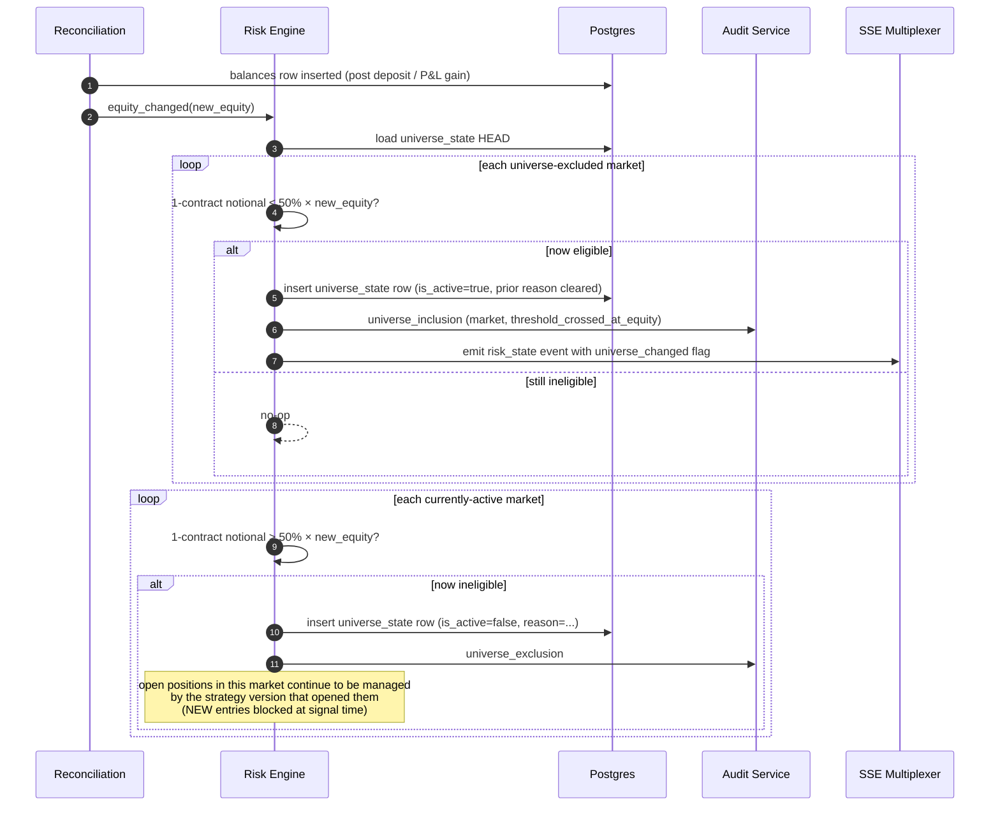

## 5.3 Signal Generation 17:30 ET → Order Placement Next Session

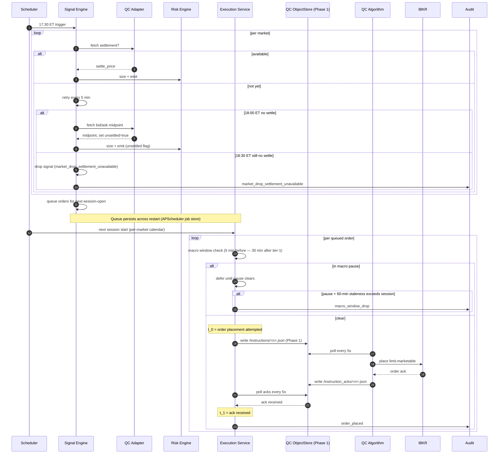

## 5.4 Slippage Recalibration (no paper-day reset)

```mermaid
sequenceDiagram
  autonumber
  participant Sched as Scheduler
  participant Calib as Calibration Service
  participant DB as Postgres
  participant Audit as Audit Service

  Sched->>Calib: monthly cron (Phase 1)
  Calib->>DB: SELECT fills WHERE filled_at_utc > now() - 30 days
  Calib->>Calib: per market: OLS realized_slippage_bps ~ size/ADV
  Calib->>DB: INSERT slippage_calibration_versions (is_head=false initially)
  Calib->>DB: BEGIN; UPDATE slippage_calibration_versions SET is_head=false WHERE is_head=true
  Calib->>DB: UPDATE slippage_calibration_versions SET is_head=true WHERE id=:new_id; COMMIT
  Calib->>Audit: slippage_calibration_recalibrated
  Note over Calib: NO paper-day reset (recalibration doesn't change live execution semantics)
  Note over Calib: New live signals will pin new HEAD; backtests at PR creation pin AT-PR HEAD
```

## 5.5 Daily Liveness Probe → Engagement Registration

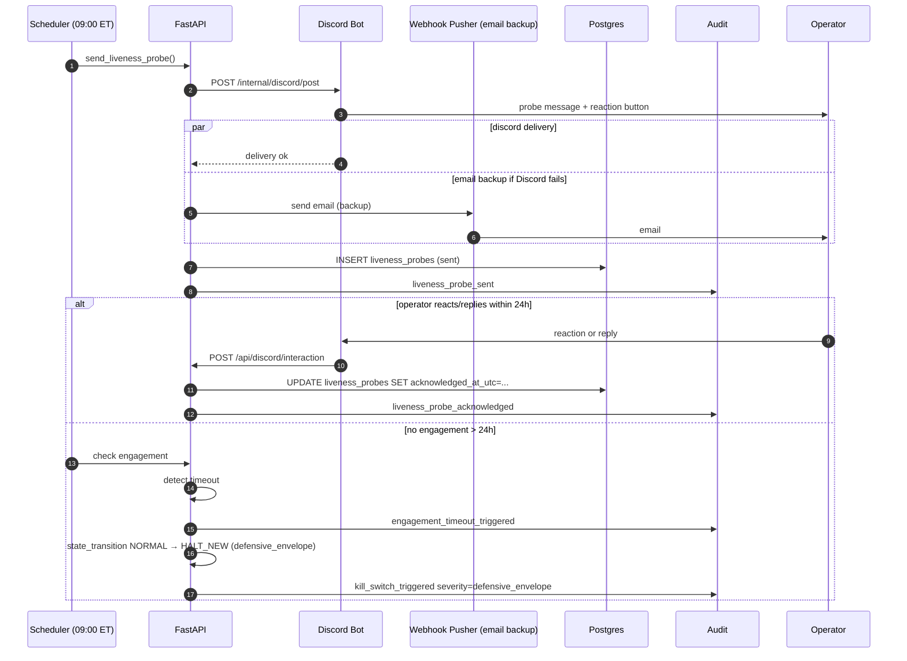

## 5.6 Hot-Fix Auto-Deploy → 30-min Watch → Rollback or Commit

```mermaid
sequenceDiagram
  autonumber
  participant Agent as Claude Ops Agent
  participant GH as GitHub
  participant CI as GitHub Actions
  participant Deploy as Deploy Service (compose)
  participant Mon as Monitoring
  participant Audit as Audit
  participant Op as Operator

  Agent->>Agent: lint check: path in hot-fix whitelist?
  alt path forbidden
    Agent->>GH: open PR (NOT auto-deploy)
    Agent->>Audit: pr_drafted
  else allowed
    Agent->>GH: commit to agent/hotfix-<short>
    GH->>CI: run tests, type-check, lint, gitleaks
    alt CI red
      Agent->>Audit: agent_action_failed reason=ci_red
    else CI green
      CI->>Deploy: trigger deploy via webhook
      Deploy->>Deploy: pull GHCR image, docker-compose up
      Deploy->>Audit: agent_hot_fix_deployed (commit_sha)
      Note over Deploy,Mon: 30-min watch window starts
      loop 30 min
        Mon->>Mon: collect: error_rate, p99 latency,<br/>kill_switch frequency, recon break rate, audit fail rate
      end
      alt any threshold breached (>2× 7-day baseline; audit fail rate >0)
        Mon->>Deploy: trigger rollback
        Deploy->>Deploy: docker-compose up prior image
        Deploy->>Audit: agent_hot_fix_rolled_back
        Deploy->>Op: alert "hot-fix rolled back; subtree disabled 24h"
      else metrics clean
        Mon->>Audit: hot_fix watch passed (informational; no event_type, but logs metric snapshot)
      end
    end
  end
```

## 5.7 HALT_NEW Max-Dwell at 7 Trading Days

```mermaid
sequenceDiagram
  autonumber
  participant Sched as Scheduler (daily)
  participant DB as Postgres
  participant API as FastAPI
  participant Audit as Audit
  participant Bot as Discord Bot
  participant WHP as Webhook Pusher
  participant Op as Operator

  loop each CME session close while HALT_NEW
    Sched->>DB: SELECT halt_dwell_session_count, entered_at_utc
    DB-->>Sched: count
    Sched->>Sched: increment halt_dwell_session_count
    alt count >= 7
      Sched->>API: emit dwell-escalation alert
      API->>Bot: post #critical embed
      API->>WHP: email backup
      Bot->>Op: "HALT dwell day N — system frozen; resume requires re-auth"
      API->>Audit: alert.fired (severity=P0, category=halt_dwell)
    end
  end
  Note over Sched: NEVER auto-flatten. Operator-only path forward.
```

## 5.8 HALT_NEW (incident_review) Flow

```mermaid
sequenceDiagram
  autonumber
  participant Trig as Trigger source
  participant Risk as Risk Engine
  participant DB as Postgres
  participant Audit as Audit
  participant S3 as S3
  participant Bot as Discord Bot
  participant WHP as Webhook Pusher
  participant Op as Operator
  participant API as FastAPI

  Trig->>Risk: trigger fired (e.g. audit_write_failure, hash_chain_break, decommission_floor)
  Risk->>DB: state_transition NORMAL → HALT_NEW (severity=incident_review)
  Risk->>Audit: kill_switch_triggered severity=incident_review

  par DB snapshot
    Risk->>DB: pg_dump (logical, encrypted)
    DB->>S3: upload snapshot (Object Lock)
  and all-channel page
    Risk->>Bot: #critical "INCIDENT REVIEW: <reason>; resume requires write-up"
    Risk->>WHP: email + escalated routing
  end

  Note over Op: Operator investigates offline; writes incident review

  Op->>API: POST /api/system/kill-switch/resume<br/>{incident_review: {write_up_text}, re_auth=ok}
  API->>API: verify last_uv_at < 5min
  API->>DB: INSERT incident_reviews row (CHECK length >= 100)
  API->>Audit: incident_review_logged
  API->>Risk: state_transition HALT_NEW → CONVALESCENT
  API->>Audit: state_transition_halt_to_convalescent
```

## 5.9 IBKR Margin-Call Edge Case

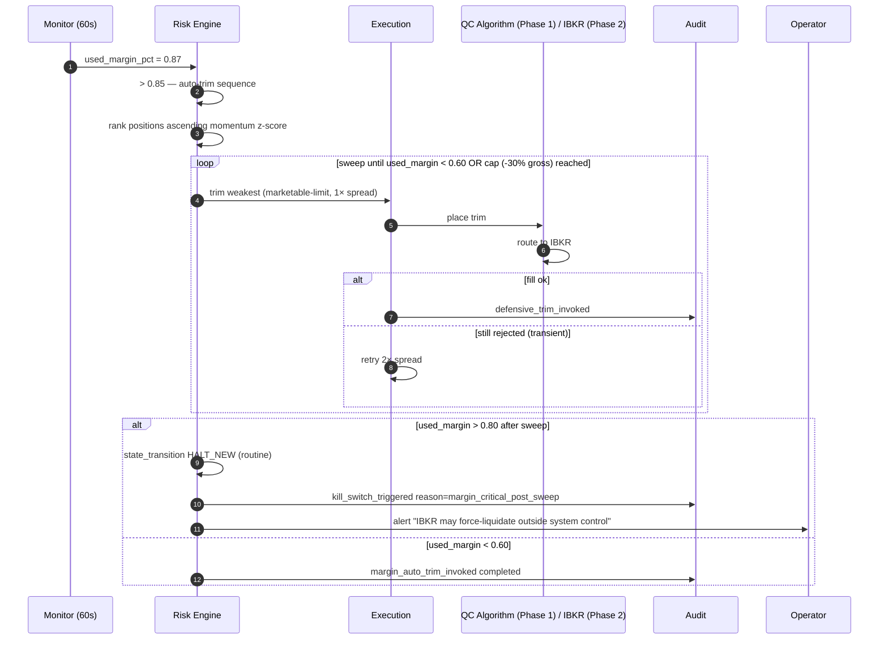

## 5.10 Cutover Scheduling and Abort

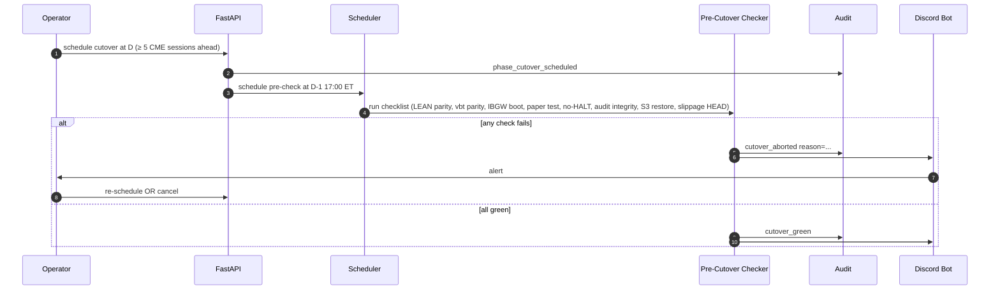

## 5.11 Phase 1 → Phase 2 Cutover Execution

```mermaid
sequenceDiagram
  autonumber
  participant Sched as Scheduler (D 17:00 ET)
  participant QCAL as QC Algorithm
  participant Recon as Reconciliation
  participant LEAN as LEAN Local
  participant IBGW as IB Gateway
  participant Exec as Execution Service
  participant Audit as Audit
  participant Op as Operator

  Sched->>QCAL: flatten command via /instructions
  QCAL->>QCAL: place final session-close orders
  QCAL-->>Sched: ack flatten complete
  Recon->>Recon: EOD reconciliation pass
  Recon-->>Sched: positions=0, cash matches FlexQuery
  Sched->>Audit: phase_cutover_started (from_phase=1, to_phase=2)
  QCAL->>QCAL: enter drain mode (24h state push for adapter parity verification)
  Sched->>LEAN: activate LEAN Local on backend VPS
  Sched->>IBGW: docker compose up ib_gateway
  IBGW->>IBGW: connect to IBKR live (TWS API)
  Sched->>Exec: switch from QC ObjectStore path → ib-async direct
  Exec->>IBGW: verify positions=0; cash matches
  IBGW-->>Exec: confirmed
  Note over Sched: First Phase-2 signal cycle next 17:30 ET
  Sched->>Audit: phase_cutover_completed (after first signal-to-order success on direct path)
  Sched->>Op: #ops "CUTOVER COMPLETE — Phase 2 active"
```

## 5.12 Vol-Target Multiplier Composition (CONVALESCENT + Capital-Event 1–5 → MIN = 0.5)

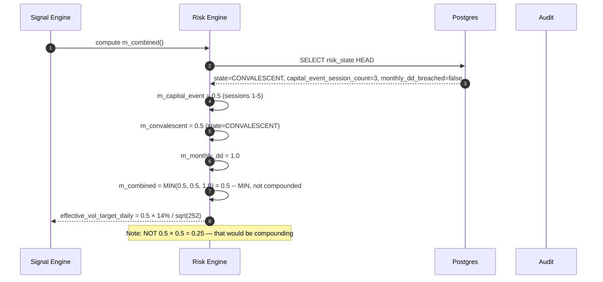

## 5.13 Capital-Event Mode Sessions 1–5 vs 6–30

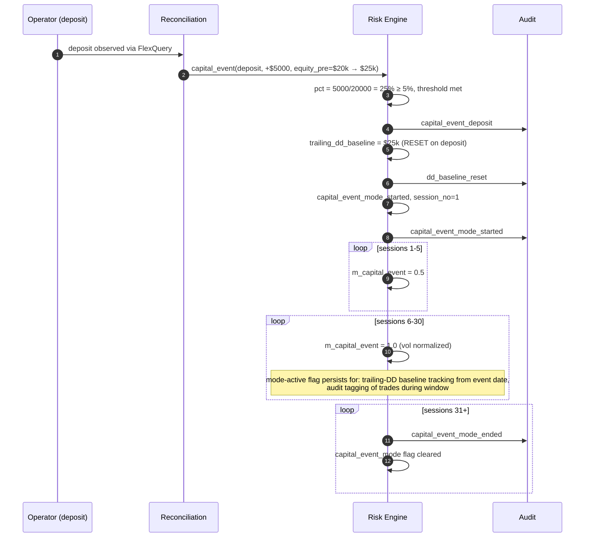

## 5.14 Capital-Event Deposit (DD Reset) vs Withdrawal (No DD Reset) Asymmetry

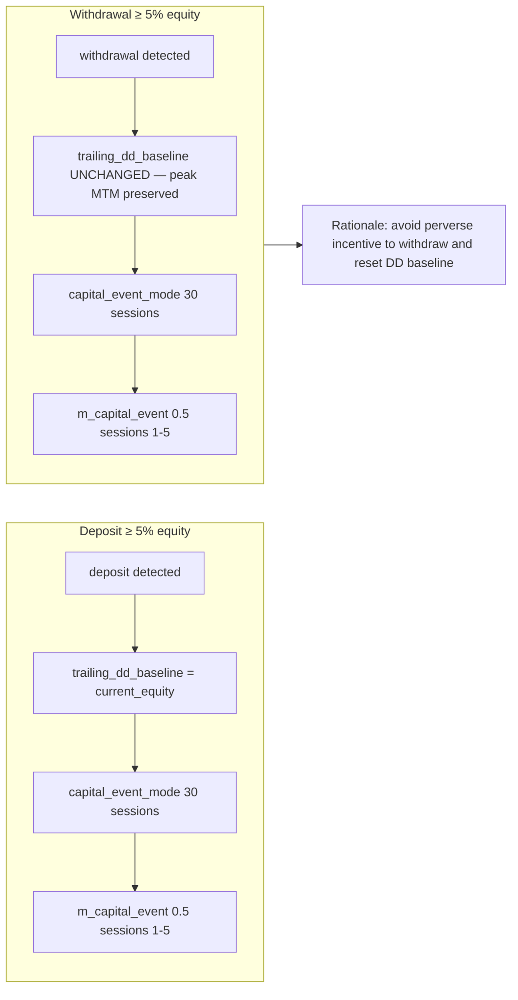

## 5.15 DST Transition Handling

```mermaid
sequenceDiagram
  autonumber
  participant Wall as Wall Clock (America/New_York)
  participant Sched as APScheduler
  participant Sig as Signal Engine

  Note over Wall,Sched: Spring forward: 2:00 ET → 3:00 ET (Sun, no signal cycle)
  Wall->>Sched: Sun 02:00 ET → 03:00 ET (skipped hour)
  Sched->>Sched: 17:30 ET trigger fires once (DST-aware via zoneinfo)
  Sig->>Sig: signals emitted normally

  Note over Wall,Sched: Fall back: 2:00 ET → 1:00 ET (Sun, repeated hour)
  Wall->>Sched: Sun 01:00-02:00 ET occurs twice
  Sched->>Sched: 17:30 ET trigger fires ONCE (zoneinfo handles ambiguity)
  Note over Sched: Session-counted windows (CONVALESCENT 5 sessions, capital-event 30 sessions)<br/>are unaffected — they count CME sessions, not wall-clock hours
```

## 5.16 PDT Pre-Check Refusal (Phase 1 source: QC ObjectStore push)

```mermaid
sequenceDiagram
  autonumber
  participant Sig as Signal Engine
  participant QCA as QC Adapter
  participant Risk as Risk Engine
  participant DB as Postgres
  participant Audit as Audit

  Sig->>Sig: ETF entry signal (TLT long)
  Sig->>QCA: latest dt_count for account
  QCA-->>Sig: rolling_5_NYSE_session_count = 3
  Sig->>DB: SELECT balances HEAD: net_liq = 24000
  Sig->>Risk: pdt_pre_check(equity=24000, dt_count=3)
  Risk->>Risk: equity < 25000 AND dt_count >= 3
  Risk-->>Sig: refuse — PDT pre-check rejection
  Sig->>Audit: order_rejected reason=pdt_pre_check
  Sig->>Audit: signal_expired (PDT)
  Note over Sig: Conservative under-trade. Signal NOT retried this session.
```

## 5.17 Macro Event Window Straddling Next-Session Order Placement

```mermaid
sequenceDiagram
  autonumber
  participant Exec as Execution Service
  participant Cal as Calendar
  participant Audit as Audit

  Exec->>Cal: queued order for /MES at next CME open ~18:00 ET
  Cal-->>Exec: tier-1 event FOMC at 18:30 ET
  Exec->>Exec: pause window: 18:25-19:00 ET
  Exec->>Exec: defer placement until 19:00 ET
  Exec->>Exec: at 19:00 ET — staleness check: signal age 1h30min < 60-min staleness budget?
  alt within budget
    Exec->>Exec: place order
  else exceeds staleness + session
    Exec->>Audit: macro_window_drop
    Exec->>Audit: signal_expired
  end
```

## 5.18 Vacation Start (Cancel Working Orders) and End

```mermaid
sequenceDiagram
  autonumber
  participant Op as Operator
  participant Bot as Discord Bot
  participant API as FastAPI
  participant Risk as Risk Engine
  participant Exec as Execution
  participant DB as Postgres
  participant Audit as Audit

  Op->>Bot: /vacation start days=10
  Bot->>API: POST /api/system/vacation/start
  API->>DB: INSERT vacation_mode (started)
  API->>Risk: enter vacation
  Risk->>Risk: NEW entries blocked; EXIT logic continues
  Risk->>Exec: cancel all WORKING orders
  loop each working order
    Exec->>Exec: cancel via QC instruction (Phase 1) / ib-async (Phase 2)
    Exec->>Audit: order_cancelled reason=vacation_start
  end
  API->>Risk: macro ratification gate suspended
  API->>Audit: vacation_started
  API->>Bot: post #ops confirmation

  Note over API: Daily liveness probe + summary still post; engagement timeout 7d

  Op->>API: POST /api/system/vacation/end (web-only, re-auth)
  API->>API: verify last_uv_at < 5min
  API->>DB: UPDATE vacation_mode SET ended_at_utc=...
  API->>Risk: exit vacation; ratification gate restored
  API->>Audit: vacation_ended
```

## 5.19 `session_evicted` Event Emission for All Four Reasons

```mermaid
flowchart TD
  E1{New connection from same user<br/>count > 4?}
  E1 -- Yes --> A1[Close oldest connection<br/>send session_evicted reason=tab_limit]
  E1 -- No --> NORMAL[continue]

  E2[Operator clicks /logout in tab B]
  E2 --> A2[Send session_evicted reason=explicit_logout<br/>to all OTHER tabs of same user]

  E3[dba_breakglass action: kill user sessions]
  E3 --> A3[Send session_evicted reason=breakglass_kill to all sessions]

  E4[WebAuthn or TOTP credential rotated]
  E4 --> A4[Send session_evicted reason=creds_rotated to all sessions]

  A1 --> CLI[Frontend: tab_limit banner shows which tab evicted]
  A2 --> CLI2[Frontend: redirect to /login]
  A3 --> CLI3[Frontend: redirect to /login]
  A4 --> CLI4[Frontend: redirect to /login]
```

---

# 6. Error Handling Strategy

## 6.1 Categorization

Every error in the system is classified into one of three categories at handle time. The category drives retry behavior and state-machine response.

| Category | Definition | Retry behavior | State-machine response |
|---|---|---|---|
| **Transient** | Temporary failure expected to resolve without intervention. Examples: network timeout to a healthy upstream, transient broker `ORDER_REJECT` with reason "exchange congestion", DB serialization conflict, Discord 503. | 3× exponential backoff (1s, 4s, 16s); on 4th failure → escalate to category check | None unless escalated |
| **Persistent** | Same operation will fail repeatedly until something changes. Examples: 4xx from broker (margin insufficient, instrument halted), DB constraint violation, calendar feed schema change, expired credential. | Do NOT retry. Log + alert. Specific path per Order Rejection Taxonomy. | Per Per-Service Degradation Matrix |
| **Catastrophic** | System integrity compromised. Examples: audit log write failure after retries, hash chain break, Postgres data corruption, broker creds compromise, decommission floor trigger. | No retry. | HALT_NEW (severity=incident_review). DB snapshot to S3. Page operator. |

**Implementation contract:** every service's exception handler must classify `caught_exception` into one of these three categories before any branching. A single `services/observability/error_classification.py` provides the classification function (PR-required path; not hot-fixable).

## 6.2 Per-Service Degradation Matrix Realization

Each row in the locked Per-Service Degradation Matrix maps to a concrete handler in `services/observability/degradation_handlers.py`:

```python
class DegradationHandler:
    async def handle(self, service: str, condition: str, context: dict) -> Action:
        ...

# Registered handlers (locked from spec):
HANDLERS = {
    ("risk_engine", "down"): action_halt_new("routine"),
    ("reconciliation", "stale_gt_60s_during_session"): action_halt_new("routine"),
    ("calendar", "ff_te_unreachable"): action_use_last_then_check_48h,
    ("calendar", "outage_gt_48h"): action_halt_new("routine", reason="calendar_service_outage"),
    ("fred", "unreachable"): action_alert_no_halt,
    ("qc_objectstore", "fail_5_to_9_min"): action_alert_only,
    ("qc_objectstore", "fail_gt_10_min"): action_halt_new("defensive_envelope"),
    ("ibkr_phase2", "unreachable_gt_5min_session"): action_halt_new("routine"),
    ("qc_objectstore_phase1", "unreachable_gt_5min_session"): action_halt_new("routine"),
    ("discord", "delivery_fail"): action_email_backup_automatic,
    ("db_non_audit", "write_fail"): action_retry_3x_then_halt_routine,
    ("db_audit", "write_fail"): action_halt_new("incident_review"),
    ("postgres", "corruption_or_chain_break"): action_halt_new("incident_review"),
    ("anthropic", "down"): action_agent_read_only_no_halt,
    ("watchdog", "unreachable_and_discord_failing"): action_halt_new("defensive_envelope"),
    ("cme_settlement", "unavailable_gt_60min_past_close"): action_drop_signal_for_market,
}
```

## 6.3 Order Rejection Taxonomy Implementation

The locked taxonomy maps to a `Rejection` enum + dispatcher:

```python
class RejectionReason(str, Enum):
    MARGIN_INSUFFICIENT = "margin_insufficient"
    INSTRUMENT_UNAVAILABLE = "instrument_unavailable"
    REGULATORY = "regulatory"
    GENERIC_TRANSIENT = "generic_transient"
    PRE_TRADE_RISK_INTERNAL = "pre_trade_risk_internal"
    PDT_PRE_CHECK = "pdt_pre_check"

REJECTION_HANDLERS: dict[RejectionReason, Callable] = {
    RejectionReason.MARGIN_INSUFFICIENT: halt_market_for_day_no_retry,
    RejectionReason.INSTRUMENT_UNAVAILABLE: wait_60s_retry_once_then_halt_market,
    RejectionReason.REGULATORY: halt_market_for_day_session_end_review,
    RejectionReason.GENERIC_TRANSIENT: retry_3x_exponential_1_4_16,
    RejectionReason.PRE_TRADE_RISK_INTERNAL: log_alert_no_retry_no_bypass,
    RejectionReason.PDT_PRE_CHECK: log_no_retry_signal_expires,
}
```

**Classification source:** broker rejection `text` mapped via `services/execution/rejection_classifier.py` (regex + IBKR error code table).

## 6.4 Idempotency in Practice

### 6.4.1 Order Placement

Every order placement carries `client_order_id` (33 chars, deterministic from `strategy_short + paramset_short + signal_short + retry_n`). Same composite identity + retry number always produces the same ID, so:
- If the previous request was lost in transit and we resend, broker rejects duplicate with `DUPLICATE_CLIENT_ID`. We treat this as success (the order exists).
- If we don't know whether the previous request succeeded, we query `client_order_id` first; if found, we adopt the broker state.

### 6.4.2 Audit Writes

Every audit record has `event_uuid` (UUIDv7). The transaction takes an advisory lock + SERIALIZABLE; double-write attempts produce a unique-constraint violation on `(sequence_no)` and on `(event_uuid)`. On retry, the dedup logic checks if a previous write succeeded with this `event_uuid` and, if so, treats the operation as already complete.

```python
async def append_audit_idempotent(event_uuid: UUID, ...):
    try:
        return await write_audit(event_uuid, ...)
    except UniqueViolation as e:
        if "audit_log_event_uuid" in str(e):
            existing = await db.fetchone(
                "SELECT * FROM audit_log WHERE event_uuid = $1", event_uuid
            )
            return existing
        raise
```

### 6.4.3 Webhook Re-Delivery

Discord and email backups carry `dedupe_key` (typically the originating `event_uuid` or `alert_uuid`). 7-day Postgres unique constraint window:

```sql
CREATE TABLE webhook_deliveries (
  dedupe_key TEXT NOT NULL,
  channel TEXT NOT NULL,
  delivered_at_utc TIMESTAMPTZ NOT NULL DEFAULT now(),
  PRIMARY KEY (dedupe_key, channel)
);
-- TTL by partition or background sweep at 7 days
```

## 6.5 Cascading Failure Containment

Three principles govern cascading-failure containment:

1. **Single failure should not cause unbounded reaction.** Retry budgets are bounded; failing-mode actions are bounded (no auto-flatten, max -30% gross sweep on margin trim).
2. **Halt is reversible; flatten is not.** Therefore halt > flatten in all default paths. Operator may invoke manual close from web (re-auth required if HALT_NEW).
3. **Audit always succeeds OR system halts.** No degraded-audit mode. If audit cannot write, system MUST halt with `incident_review` severity.

## 6.6 Specific Error Path Examples

### 6.6.1 QC ObjectStore poll fails 5–9 min — `[RETIRED — pivot 2026-05-12]`

> **Status post-pivot:** This error path no longer applies because there is no QC ObjectStore poll in production. The post-pivot equivalent is the IBKR Gateway disconnect path (§6.6.1-alt below). Original error path preserved verbatim for institutional memory.

```python
async def poll_qc_objectstore():
    try:
        events = await qc_client.list_events(cursor=cursor)
        return events
    except QCObjectStoreError as e:
        consecutive_failures += 1
        if consecutive_failures * POLL_INTERVAL_S < 300:
            log.warning("qc_objectstore poll failed", failures=consecutive_failures)
        elif 300 <= consecutive_failures * POLL_INTERVAL_S < 600:
            await alerts.fire(severity="P1", category="qc_objectstore_degraded", ...)
        else:  # >= 10 min
            await risk_engine.halt_new(severity="defensive_envelope",
                                       reason="qc_objectstore_unavailable_gt_10min")
```

### 6.6.1-alt IB Gateway disconnect during CME session (post-pivot 2026-05-12)

```python
async def ibkr_gateway_health_check_loop():
    """
    Pivot-PR-B; runs every 30s during CME session.
    `ib.isConnected()` is ib-async's authoritative connection status check.
    """
    while True:
        await asyncio.sleep(30)
        if not ib.isConnected():
            consecutive_disconnect_seconds += 30
            if consecutive_disconnect_seconds < 300:  # < 5 min
                log.warning("ib_gateway_disconnected",
                            consecutive_seconds=consecutive_disconnect_seconds)
                try:
                    await ib.connectAsync(host="ib_gateway", port=4002, clientId=...)
                    consecutive_disconnect_seconds = 0
                except Exception as e:
                    log.error("ib_gateway_reconnect_failed", error=str(e))
            elif consecutive_disconnect_seconds < 600:  # 5-10 min
                await alerts.fire(severity="P1", category="ib_gateway_degraded", ...)
            else:  # >= 10 min
                await risk_engine.halt_new(
                    severity="routine",  # NOT defensive_envelope — broker is the
                                         # canonical reachability path, so loss of
                                         # the broker is operationally normal halt
                                         # not defensive-comm-breakdown
                    reason="ib_gateway_unreachable_gt_10min",
                )
                consecutive_disconnect_seconds = 0  # reset after halt
```

**Severity note:** Pre-pivot, QC ObjectStore loss was `defensive_envelope` because the ObjectStore was the comms layer (loss meant we couldn't reach the broker via ANY path). Post-pivot, `ib_gateway` loss is `routine` because (a) IBKR is the canonical broker, (b) reaching IBKR is a normal-business dependency not a defensive-comm-failure, (c) the 24h-replay-buffer SSE + watchdog email + Discord paths are all unaffected so operator can still receive halt notifications. The state machine §2.4.3 enum entry stays `routine`.

### 6.6.2 Audit write fails (5× retries exhausted)

```python
async def write_audit(...):
    for attempt in range(5):
        try:
            return await _write_audit_serializable(...)
        except SerializationError:
            await asyncio.sleep([0.01, 0.05, 0.25, 1.25, 6.0][attempt])
        except (OperationalError, IntegrityError) as e:
            if attempt < 4:
                await asyncio.sleep(2 ** attempt)
            else:
                # CATASTROPHIC
                await alerts.fire_p0(category="audit_write_failure", detail=str(e))
                await risk_engine.halt_new(severity="incident_review",
                                           reason="audit_log_write_failure")
                raise AuditCatastrophicFailure
    raise AuditCatastrophicFailure
```

### 6.6.3 Hash chain integrity break detected (verification scan)

`services/audit/verify_chain.py` runs as a daily cron (03:00 ET) and on every audit export:

```python
async def verify_chain_integrity():
    rows = stream_audit_log_ordered_by_sequence()
    expected_prev = b"\x00" * 32
    async for row in rows:
        computed = sha256(row.prev_hash + row.payload_jcs).digest()
        if row.record_hash != computed or row.prev_hash != expected_prev:
            await alerts.fire_p0(category="audit_chain_break",
                                 detail={"sequence_no": row.sequence_no})
            await risk_engine.halt_new(severity="incident_review",
                                       reason="audit_chain_break_detected")
            return False
        expected_prev = row.record_hash
    await audit.write(event_type="audit_chain_integrity_verified", ...)
    return True
```

---

# 7. Observability

## 7.1 Logging

### 7.1.1 Schema

All services use **structlog** with JSON renderer. Every log record includes:

```python
{
  "timestamp": "2026-05-04T19:30:00.123Z",  # ISO-8601 UTC
  "level": "INFO|WARN|ERROR|CRITICAL",
  "logger": "services.signal.engine",
  "service": "signal",
  "phase": 1,
  "env": "live-small",
  "git_sha": "9d2f7a1c...",
  "trace_id": "...",
  "span_id": "...",
  "account_id": "...",
  "event": "<human-readable event name>",
  "context": { ... }  # arbitrary structured fields
}
```

`trace_id` propagated via `contextvars`; populated at request entry (FastAPI middleware) and at scheduler-job entry.

### 7.1.2 Local File + S3 Upload

- **Local rotation:** logrotate config rotates `/var/log/trading/*.log` daily; keeps 30 days; gzipped.
- **S3 upload:** daily 03:00 ET cron uploads previous day's gzipped logs to `s3://<bucket>/logs/<service>/<date>.log.gz` (Object Lock NOT applied to logs — they're operational, not audit). 90-day retention.
- **No central log aggregator in Phase 1.** ELK/Loki is overkill for single-VPS, single-operator. Phase 2+ revisit if telemetry volume justifies.

### 7.1.3 PII / Secrets in Logs

- Pre-merge linter: `gitleaks` covers code; logs scanned with `services/observability/log_redactor.py` regex patterns at log-emit time.
- Patterns: API keys, sops-decrypted env values, IBKR account numbers, session IDs.
- Audit-relevant data NEVER goes to operational logs (it goes to `audit_log` only).

## 7.2 Metrics (Prometheus or equivalent)

**Recommendation: Prometheus + Grafana, both self-hosted in Compose stack.**

| Option | Pros | Cons | Recommendation |
|---|---|---|---|
| Prometheus + Grafana (self-hosted) | Free, full control, integrates with FastAPI / Discord bot | Operational overhead; ~500MB RAM | ✅ **chosen** |
| Datadog / New Relic | Polished, alerts built-in | $20–80/mo per host; budget impact | Skip |
| OpenTelemetry → Honeycomb | Modern; great trace UX | Honeycomb cost > target budget | Phase 3+ revisit |

Prometheus exposed on `localhost:9090` (not via Caddy). Grafana on `/grafana/*` (basic auth) — same hardening as Gitea path.

### 7.2.1 Metrics Inventory

**Counters:**
- `signal_emitted_total{market, env}`
- `signal_rejected_total{reason, env}`
- `order_placed_total{market, env, retry_n}`
- `order_filled_total{market, env}`
- `order_rejected_total{reason, env}`
- `audit_write_total{event_type}`
- `audit_chain_repair_total`
- `psd_repair_total`
- `kill_switch_triggered_total{severity, reason}`
- `defensive_trim_invoked_total`
- `margin_auto_trim_invoked_total`
- `cost_alert_total{ceiling}`
- `discord_delivery_total{status}`
- `email_backup_sent_total`
- `agent_decision_total{action_type, result}`
- `agent_hot_fix_deployed_total`
- `agent_hot_fix_rolled_back_total`

**Gauges:**
- `account_equity_usd`
- `daily_pnl_usd`
- `trailing_dd_pct`
- `used_margin_pct`
- `open_position_count`
- `pending_signal_count`
- `working_order_count`
- `risk_state_enum` (encoded: NORMAL=0, HALT_NEW=1, CONVALESCENT=2)
- `m_combined`
- `m_capital_event`
- `m_convalescent`
- `m_monthly_dd`
- `convalescent_session_count`
- `capital_event_session_count`
- `qc_adapter_cursor_lag_seconds{path}`
- `reconciliation_last_success_age_seconds`
- `audit_chain_tail_sequence_no`
- `service_health{service}` (0/1)

**Histograms:**
- `order_placement_latency_seconds{market}` (t_1 − t_0; SLO p50 ≤ 60s, p99 ≤ 5min)
- `kill_switch_invocation_latency_seconds{phase}` (p99 ≤ 30s Phase 1, ≤ 5s Phase 2)
- `discord_delivery_latency_seconds`
- `audit_write_latency_seconds{event_type}`
- `signal_engine_cycle_duration_seconds`
- `reconciliation_cycle_duration_seconds`
- `agent_decision_latency_seconds{action_type}`

### 7.2.2 SLO Recording Rules

```yaml
# prometheus rules.yml
groups:
- name: trading_slo
  rules:
  - record: order_placement_latency_p50
    expr: histogram_quantile(0.50, rate(order_placement_latency_seconds_bucket[5m]))
  - record: order_placement_latency_p99
    expr: histogram_quantile(0.99, rate(order_placement_latency_seconds_bucket[5m]))
  - record: slo_order_placement_p99_breach
    expr: order_placement_latency_p99 > 300  # 5 min
  - record: slo_kill_switch_p99_breach_phase1
    expr: histogram_quantile(0.99, rate(kill_switch_invocation_latency_seconds_bucket{phase="1"}[5m])) > 30
```

## 7.3 Health Checks

| Endpoint | Caller | Returns |
|---|---|---|
| `GET /api/health` | External watchdog (5min cron) | 200 OR 503 with `{degraded_services: [...]}` |
| `GET /internal/health/deep` | Internal (Bearer auth) | 200 with full service heartbeat map |
| Docker `HEALTHCHECK` per container | Docker daemon | service-specific check (e.g. `pg_isready`) |
| systemd `WatchdogSec` | systemd | service heartbeats every 30s |

**Health criteria for `/api/health` 200:**
- Postgres reachable AND `SELECT 1` returns < 200ms
- All in-process services have heartbeated within last 30s
- During CME session: `qc_adapter_cursor_lag_seconds < 120` for `/state/portfolio.json`
- During CME session: `reconciliation_last_success_age_seconds < 90`
- `risk_state` not in `HALT_NEW(incident_review)` for > 60 min without operator engagement (informational note in 200; only 503 if everything else also degraded)

## 7.4 Dashboard (Grafana)

Recommended dashboard layout (committed to repo as `deploy/grafana/dashboards/*.json`):

| Dashboard | Panels |
|---|---|
| **Today** | Risk state, equity curve (1d), open positions, used margin, P&L tick, last signal cycle status, recon last-success, alerts (24h) |
| **Strategy** | Signal flow rate (24h, 7d), acceptance rate, anomaly rate, sub_minimum_size drops, attribution by market, slippage vs modeled |
| **Reliability** | Service heartbeat heatmap, audit chain tail rate, hash-chain repair count, hot-fix deploy/rollback, SLO p50/p99 trends |
| **Cost** | Per-provider monthly spend, rolling 30d, soft/hard ceiling lines |
| **Phase 1 ops** | QC adapter cursor lag per path, instruction round-trip p99, FlexQuery EOD success rate |

## 7.5 Agent Telemetry Consumption

The Claude Ops agent reads telemetry as follows (full detail in §12):

- Daily morning briefing pulls metrics from Prometheus (read-only) and renders summary to operator.
- On kill-switch invocation: agent receives event via SSE `agent` channel; queries Postgres for context; drafts incident summary.
- Agent has read-only Postgres role (`app_service` SELECT-only sub-role for the agent).
- Agent's own actions metrics: `agent_decision_total`, `agent_hot_fix_*_total`, cached prompt-cache hit rate from Anthropic API.

## 7.6 Alert Routing by Severity

| Severity | Channels | Latency | Acknowledgment |
|---|---|---|---|
| **P0** | Discord `#critical` (immediate) + Email backup automatic + External watchdog notify | ≤ 10s | Required within 24h or escalation re-fires daily |
| **P1** | Discord `#alerts` + Email digest within 1h | ≤ 60s | Optional; tracked but not enforced |
| **P2** | Discord `#daily-brief` daily summary; web System page Activity feed | Daily aggregate | None |

**Defensive Risk Envelope escalation (severity=defensive_envelope):**
- Email backup priority elevated (separate `From:` header for filtering)
- External watchdog notify
- Discord retry cadence increased (1 retry → 5 retries with 15s backoff)

## 7.7 Cost Tracking Integration

| Provider | Source | Cadence |
|---|---|---|
| Anthropic | `usage_report` API endpoint | Daily 02:00 ET pull |
| QuantConnect | CSV from billing portal | Manual monthly upload OR API if available |
| Hetzner | API | Daily |
| AWS S3 | Cost Explorer API | Weekly |
| Resend | API | Daily |
| GitHub | n/a (free tier) | n/a |

Aggregation in `cost_events` table; rolling-30d totals computed on insert. Soft alert at $200/mo, hard at $300/mo. Hard alert triggers `cost_alert_hard_ceiling` audit event AND posts to `#critical` (does NOT halt trading; cost is operational, not safety).

## 7.8 Tracing (light)

OpenTelemetry instrumentation on FastAPI + asyncpg + outbound HTTP. **Phase 1: console exporter only (logs trace_id in structlog).** Phase 2+: revisit Honeycomb / Tempo if cost permits.

---

# 8. Security

## 8.1 Secrets Management — sops + age

### 8.1.1 File Structure

```
secrets/
├── dev.enc.yaml            # local development; mock everything
├── paper.enc.yaml          # Phase 0 paper environment
└── live.enc.yaml           # Phase 1+ live environment
```

Each file encrypts to a fresh age recipient. `.sops.yaml`:

```yaml
creation_rules:
  - path_regex: secrets/dev\.enc\.yaml$
    age: age1devkey...
  - path_regex: secrets/paper\.enc\.yaml$
    age: age1paperkey...
  - path_regex: secrets/live\.enc\.yaml$
    age: age1livekey...
```

Sample structure (live; cleartext shown only for documentation):

```yaml
postgres:
  app_service_password: <encrypted>
  app_owner_password: <encrypted>
  # dba_breakglass plaintext NOT here — paper-stored only
ibkr:
  account_number: <encrypted>      # Phase 2 only
  flex_query_token: <encrypted>
quantconnect:
  api_token: <encrypted>
  organization_id: <encrypted>
anthropic:
  api_key: <encrypted>
  workspace_id: <encrypted>
discord:
  bot_token: <encrypted>
  webhook_urls:
    daily_brief: <encrypted>
    signals: <encrypted>
    fills: <encrypted>
    alerts: <encrypted>
    critical: <encrypted>
    ops: <encrypted>
    ask_agent: <encrypted>
    audit: <encrypted>
forex_factory:
  api_token: <encrypted>          # if FF requires token
trading_economics:
  api_token: <encrypted>
fred:
  api_key: <encrypted>
s3:
  access_key_id: <encrypted>
  secret_access_key: <encrypted>
  bucket: <encrypted>
github:
  app_id: <encrypted>
  app_private_key: <encrypted>
internal:
  watchdog_bearer_token: <encrypted>
  ipc_bearer_token: <encrypted>
webauthn:
  rp_id: <your-domain>             # substitute with operator's registered apex domain (e.g., mytrading.com); needed for Caddy auto-cert + WebAuthn rpID
  origin: https://<your-domain>
resend:
  api_key: <encrypted>             # email backup provider (locked: Resend, NOT SES)
  from_address: <operator_email>   # operator's email for sender + recipient
```

### 8.1.2 Age Key Backup (locked)

- Printed on archival paper (acid-free, 100-year rated)
- Stored in fireproof safe + safety deposit box
- Annual rotation forced (calendar reminder on operator's calendar)
- On rotation: re-encrypt all sops files; commit new ciphertext; destroy old paper

### 8.1.3 Runtime Decryption (locked)

```yaml
# docker-compose.yml fragment
services:
  api:
    image: ghcr.io/operator/trading-api:latest
    depends_on:
      sops_init:
        condition: service_completed_successfully
    environment:
      - POSTGRES_URL_FILE=/run/secrets/postgres_url
      - ANTHROPIC_API_KEY_FILE=/run/secrets/anthropic_key
    secrets:
      - postgres_url
      - anthropic_key
  sops_init:
    image: getsops/sops:latest
    entrypoint: /bin/sh
    command: -c "sops -d /secrets/live.enc.yaml > /run/secrets/decrypted.yaml; ..."
    volumes:
      - /etc/credstore.encrypted:/etc/credstore.encrypted:ro
      - secrets_volume:/run/secrets
```

systemd loads age private key via `LoadCredentialEncrypted=`:

```ini
[Service]
LoadCredentialEncrypted=age_key:/etc/credstore.encrypted/age_key
ExecStart=/usr/bin/docker compose -f /opt/trading/docker-compose.yml up
```

The init container exits before the main containers start. **Decrypted secrets are never written to disk in plaintext** — the `secrets_volume` is a tmpfs (memory-only).

## 8.2 Postgres Role Hierarchy (locked)

```sql
-- app_service: regular runtime role
CREATE ROLE app_service LOGIN PASSWORD '...';
GRANT CONNECT ON DATABASE trading TO app_service;
GRANT USAGE ON SCHEMA public TO app_service;
GRANT INSERT, SELECT ON audit_log TO app_service;
REVOKE UPDATE, DELETE, TRUNCATE ON audit_log FROM app_service;
GRANT SELECT, INSERT, UPDATE, DELETE ON ALL OTHER TABLES IN SCHEMA public TO app_service;
ALTER DEFAULT PRIVILEGES IN SCHEMA public
  GRANT SELECT, INSERT, UPDATE, DELETE ON TABLES TO app_service;
ALTER DEFAULT PRIVILEGES IN SCHEMA public
  GRANT INSERT, SELECT ON TABLES TO app_service;  -- no-op for non-audit; safe

-- app_service_readonly: agent's read-only sub-role
CREATE ROLE app_service_readonly LOGIN PASSWORD '...';
GRANT CONNECT ON DATABASE trading TO app_service_readonly;
GRANT USAGE ON SCHEMA public TO app_service_readonly;
GRANT SELECT ON ALL TABLES IN SCHEMA public TO app_service_readonly;

-- app_owner: schema owner; runs Alembic
CREATE ROLE app_owner LOGIN PASSWORD '...';
GRANT CONNECT ON DATABASE trading TO app_owner;
GRANT ALL ON SCHEMA public TO app_owner;
-- but cannot bypass triggers (BEFORE UPDATE/DELETE blocks even owner)

-- dba_breakglass: superuser; offline credential
CREATE ROLE dba_breakglass SUPERUSER LOGIN PASSWORD '<long-random>';
-- password stored as SCRAM-SHA-256 hash in pg_authid; printed paper holds plaintext
```

### 8.2.1 Break-Glass Procedure

1. Operator retrieves printed paper from safe
2. Logs into Postgres with `dba_breakglass` from a controlled, audited shell
3. Every command logged to `pg_audit` extension AND mirrored to system journal
4. On exit, paper credential is invalidated; new credential generated and re-printed
5. `breakglass_invoked` audit event written from a separate (non-broken) state if possible; else from journal recovery post-incident

## 8.3 File Permissions

```
/opt/trading/                      root:root  0755
  ├── docker-compose.yml           root:root  0644
  ├── secrets/                     root:trading  0750
  │   ├── *.enc.yaml               root:trading  0640
  ├── data/                        trading:trading  0700  (Postgres + Parquet volume)
  ├── logs/                        trading:trading  0700
  └── deploy/                      root:root  0755

/etc/credstore.encrypted/age_key   root:systemd-credential  0600
```

## 8.4 Network Exposure

| Surface | Port | Exposure |
|---|---|---|
| Caddy HTTPS | 443 | Public |
| Caddy HTTP (redirect) | 80 | Public |
| SSH | 22 | Public, key-only, no root |
| Postgres | 5432 | Docker internal only (no host bind) |
| Prometheus | 9090 | localhost-only (`127.0.0.1:9090`) |
| Grafana | 3000 | Caddy `/grafana/*` (basic auth) |
| Gitea | 3001 | Caddy `/gitea/*` (basic auth) |
| FastAPI | 8000 | Docker internal; via Caddy `/api/*` |
| Discord bot | n/a | Outbound WebSocket only |
| IB Gateway (Phase 2) | 4001/4002 | Docker internal only |

### 8.4.1 Network Egress Allowlist (UFW + Docker)

```bash
# UFW host-level egress
ufw default deny outgoing
ufw allow out 53/udp                       # DNS
ufw allow out 123/udp                      # NTP
ufw allow out 80/tcp                       # cert renewals (Let's Encrypt)
ufw allow out 443/tcp                      # everything HTTPS

# Docker iptables egress (more granular)
# - IBKR endpoints (Phase 2 only)
# - Anthropic API (api.anthropic.com)
# - S3 bucket endpoint
# - GitHub + GHCR
# - QC API endpoints (Phase 1)
# - Forex Factory + Trading Economics
```

## 8.5 API Auth

### 8.5.1 WebAuthn (primary)

- Library: `py_webauthn` (Python server-side); `@simplewebauthn/browser` on frontend
- Attestation: `none` (single-operator; we trust the operator's authenticator)
- User verification: **`required` for ALL WebAuthn ceremonies** — registration, routine login, AND risk-loosening flows (locked; matches frontend §5.1). No `preferred` fallback.
- Allowed credentials: stored per-user in `webauthn_credentials` table

```sql
CREATE TABLE webauthn_credentials (
  id UUID PRIMARY KEY DEFAULT uuid_generate_v7(),
  account_id UUID NOT NULL REFERENCES accounts(id),
  credential_id BYTEA NOT NULL UNIQUE,
  public_key BYTEA NOT NULL,
  sign_count INTEGER NOT NULL DEFAULT 0,
  authenticator_attachment TEXT,
  registered_at_utc TIMESTAMPTZ NOT NULL DEFAULT now(),
  last_used_at_utc TIMESTAMPTZ,
  nickname TEXT,                                    -- e.g. 'YubiKey 5C', 'iPhone Touch ID'
  active BOOLEAN NOT NULL DEFAULT TRUE
);
```

### 8.5.2 TOTP (backup)

- Library: `pyotp`
- Stored secret: AES-encrypted via app-level encryption key (separate from sops; column-encrypted)
- **Reduced privileges:** TOTP-bootstrap session has `risk_loosening_blocked = true`; operator must register WebAuthn within session to lift the block
- 8 single-use printed backup codes; stored as **Argon2id** hashes (via `argon2-cffi` — `argon2.PasswordHasher` from the `argon2` package); replaced on each use
- **Code generation format (locked):** 10-char base32 (uppercase, RFC 4648), hyphen-separated as `ABCDE-FGHIJ` (2 groups of 5). Generated server-side via `secrets.token_bytes(8)` then base32-encoded and split. Format must match the frontend `/setup` print acknowledgment template.

```sql
CREATE TABLE totp_secrets (
  account_id UUID PRIMARY KEY REFERENCES accounts(id),
  encrypted_secret BYTEA NOT NULL,
  enrolled_at_utc TIMESTAMPTZ NOT NULL,
  last_used_at_utc TIMESTAMPTZ
);

CREATE TABLE backup_codes (
  id UUID PRIMARY KEY DEFAULT uuid_generate_v7(),
  account_id UUID NOT NULL,
  code_hash TEXT NOT NULL,                           -- Argon2id encoded hash (argon2-cffi PasswordHasher)
  used_at_utc TIMESTAMPTZ,
  generation_id UUID NOT NULL                        -- ties to a regen batch
);
```

### 8.5.3 Session Cookies

- Name: `__Host-trading_session`
- Attributes: `HttpOnly; Secure; SameSite=Strict; Path=/`
- Value: opaque session ID (random 32 bytes, base64url)
- Server-side: `sessions` table

```sql
CREATE TABLE sessions (
  id BYTEA PRIMARY KEY,                              -- session_id raw
  account_id UUID NOT NULL,
  created_at_utc TIMESTAMPTZ NOT NULL DEFAULT now(),
  last_activity_utc TIMESTAMPTZ NOT NULL DEFAULT now(),
  last_uv_at_utc TIMESTAMPTZ,                        -- WebAuthn UV time
  user_agent TEXT,
  ip_address INET,
  totp_bootstrap_only BOOLEAN NOT NULL DEFAULT FALSE,
  evicted_at_utc TIMESTAMPTZ,
  evicted_reason TEXT,
  expires_at_utc TIMESTAMPTZ NOT NULL                -- absolute 24h
);
CREATE INDEX sessions_account ON sessions(account_id);
CREATE INDEX sessions_expiry ON sessions(expires_at_utc);
```

- **Idle timeout:** 30 min (last_activity_utc check on every request)
- **Absolute timeout:** 24 h (expires_at_utc check)
- **Refresh window:** 7 d (request to refresh extends expires_at)

### 8.5.4 CSRF (double-submit)

- Cookie: `__Host-csrf_token` (NOT HttpOnly so JS can read)
- Header on state-changing requests: `X-CSRF-Token: <value>`
- Server compares cookie value to header value; reject on mismatch

### 8.5.5 Re-Auth (UV) Required Endpoints

Per locked principle: WebAuthn UV re-prompt within last 5 minutes is required for **(a) risk-loosening actions**, OR **(b) direct manual order actions while system is in HALT_NEW**. Such actions are WEB-ONLY by construction.

Endpoints:
- `POST /api/auth/backup-codes/regenerate`
- `POST /api/system/risk-envelope/propose`
- `POST /api/system/kill-switch/resume`
- `POST /api/system/vacation/end`
- `POST /api/trades/:id/close` (only if HALT_NEW)
- `POST /api/system/deployments/:id/rollback`
- `POST /api/research/parameters/propose`
- `POST /api/performance/tax-election`

Implementation:

```python
@router.post("/api/system/kill-switch/resume", dependencies=[Depends(require_uv_within_5min)])
async def resume_kill_switch(...): ...

async def require_uv_within_5min(session: Session = Depends(get_session)):
    if session.last_uv_at_utc is None or (now() - session.last_uv_at_utc).seconds > 300:
        raise HTTPException(401, {"error_code": "RE_AUTH_REQUIRED"})
```

## 8.6 Audit Log Immutability

Per §2.10. Three layers:

1. **Trigger-level:** `BEFORE UPDATE OR DELETE` raises exception
2. **Event-trigger level:** TRUNCATE blocked at DDL level
3. **Privilege-level:** `REVOKE TRUNCATE` from all but `dba_breakglass`

Verification: `verify_chain.py` runs daily 03:00 ET cron; on every audit export; on every Phase cutover; on every backup restore drill.

## 8.7 Backup Encryption

- Postgres `pg_dump | age | aws s3 cp -` pipeline
- S3 Object Lock in **Compliance mode** (cannot be deleted/overwritten before retention expires, even by root account)
- Retention: 7 daily / 4 weekly / 12 monthly / permanent annual
- Quarterly restore drill: pull a random backup from S3, restore to staging Postgres, verify chain integrity, audit row count, equity curve sample

## 8.8 Repo / Build-Chain DR

| Component | Primary | DR |
|---|---|---|
| Repo | GitHub `operator/trading` (private) | Self-hosted Gitea on VPS, daily mirror via `git fetch --mirror` |
| Container registry | GHCR (private) | Daily `docker pull && docker save | age | aws s3 cp -` of latest images |
| CI | GitHub Actions free tier | Self-hosted runner on separate Hetzner CX11 (~$5/mo); ephemeral job pattern |
| Source archives | weekly `tar.gz | age | s3 cp` | S3 Object Lock |

## 8.9 Account Recovery

**All-factors-lost recovery procedure:**

1. Operator retrieves printed `dba_breakglass` paper credential from safe
2. SSH into VPS via root key (separate from app credentials)
3. Run `dba_breakglass` Postgres session
4. Verify operator identity via out-of-band channels (phone call to known number, email from known account, etc.)
5. `INSERT INTO webauthn_credentials_recovery_audit ...` capturing recovery event
6. Reset operator's WebAuthn credentials; allow new registration
7. Restore from latest S3 backup if data corruption suspected
8. New age key generated; sops re-encrypted; new paper printed

This procedure is **manual and slow** by design. Automated recovery is a key compromise risk; the manual gate is intentional.

## 8.10 GitHub Workflow (corrected for single-operator reality)

- **Branch protection on `main`** requires CI pass only (NOT GitHub native ≥1 approval — impossible to satisfy in single-operator system without admin-bypass theater)
- **The actual approval gate is the in-app PR review surface** in `/system` (operator sees plain-English summary + risk impact + backtest delta + tests; clicks Approve / Reject / Request Changes)
- On in-app Approve, backend's GitHub App install token merges the PR via GitHub API (`PUT /repos/.../pulls/.../merge`)
- The in-app approval is logged to `audit_log` with: `operator session ID`, `last_uv_at` (re-auth proof), in-app decision rationale (if rejection: feedback modal text)
- Agent commits to `agent/...` feature branches; operator's commits to `human/...` branches
- This is documented as "in-app approval supersedes GitHub native review" — security audit reviewers should see the in-app trail, not GitHub's review surface

## 8.11 Container Hardening

Each Dockerfile must:
- Run as non-root user (`USER 10000` or named user)
- Read-only filesystem where compatible (`read_only: true` in compose); writable mounts only for explicit data paths
- No `privileged: true`
- Use distroless base where compatible (`gcr.io/distroless/python3-debian12`)
- Pinned image digests in compose, not just tags
- Trivy scanned in CI on every PR; reject critical vulns

## 8.12 Authenticator Hygiene

- Operator registers ≥ 2 WebAuthn authenticators (e.g., YubiKey + iPhone) to avoid single-device-loss scenario
- TOTP backup separately enrolled (Aegis or 1Password)
- 8 backup codes printed and stored (separate location from age key paper)

---

# 9. Deployment Topology

## 9.1 VPS Specs

### 9.1.1 Primary VPS (Hetzner Cloud Ashburn)

| Property | Phase 1 baseline | Phase 1 upgrade | Phase 2+ |
|---|---|---|---|
| Type | CCX13 | CCX23 | CCX23 or CCX33 |
| vCPU | 2 (dedicated) | 4 (dedicated) | 4–8 |
| RAM | 8 GB | 16 GB | 16–32 GB |
| Disk | 80 GB NVMe | 160 GB NVMe | 240 GB+ |
| Bandwidth | 20 TB | 20 TB | 20 TB |
| Cost / month | ~$25 | ~$50 | ~$50–100 |
| OS | Ubuntu 24.04 LTS | Ubuntu 24.04 LTS | Ubuntu 24.04 LTS |
| Kernel hardening | `cis-cat-lite` audit + remediation | Same | Same |

**Upgrade trigger (locked):** if telemetry shows sustained CPU > 70% or memory > 80% during CME session for > 2 weeks → upgrade to CCX23.

### 9.1.2 External Watchdog VPS

Per §1.6: Hetzner CX11 in **Falkenstein** (locked), ~$5/mo, single Python script via systemd timer, alerts only. Static IPv4 substituted as `<watchdog_static_ip>` in Caddy IP-allowlist.

## 9.2 Docker Compose Layout

```yaml
# /opt/trading/docker-compose.yml
version: '3.9'

networks:
  internal:
    driver: bridge
    internal: true       # no internet egress except via egress-gateway
  egress:
    driver: bridge

services:
  caddy:
    image: caddy:2-alpine
    restart: unless-stopped
    networks: [internal, egress]
    ports: ['80:80', '443:443']
    volumes:
      - ./deploy/Caddyfile:/etc/caddy/Caddyfile:ro
      - caddy_data:/data
      - caddy_config:/config

  api:
    image: ghcr.io/operator/trading-api:${RELEASE_SHA}
    restart: unless-stopped
    depends_on: [postgres, sops_init]
    networks: [internal]
    secrets: [postgres_url, anthropic_key, ...]
    healthcheck:
      test: ['CMD', 'curl', '-fsS', 'http://localhost:8000/api/health']
      interval: 30s
      timeout: 10s
      retries: 3

  signal:
    image: ghcr.io/operator/trading-signal:${RELEASE_SHA}
    restart: unless-stopped
    depends_on: [postgres, sops_init]
    networks: [internal]

  risk:
    image: ghcr.io/operator/trading-risk:${RELEASE_SHA}
    restart: unless-stopped
    depends_on: [postgres, sops_init]
    networks: [internal]

  execution:
    image: ghcr.io/operator/trading-execution:${RELEASE_SHA}
    restart: unless-stopped
    depends_on: [postgres, sops_init, qc_adapter]  # Phase 1; Phase 2 adds ib_gateway
    networks: [internal, egress]   # needs QC ObjectStore reach

  reconciliation:
    image: ghcr.io/operator/trading-recon:${RELEASE_SHA}
    restart: unless-stopped
    depends_on: [postgres, qc_adapter]
    networks: [internal]

  audit:
    image: ghcr.io/operator/trading-audit:${RELEASE_SHA}
    restart: unless-stopped
    depends_on: [postgres]
    networks: [internal]

  calibration:
    image: ghcr.io/operator/trading-calibration:${RELEASE_SHA}
    restart: 'on-failure:3'
    depends_on: [postgres]
    networks: [internal]

  scheduler:
    image: ghcr.io/operator/trading-scheduler:${RELEASE_SHA}
    restart: unless-stopped
    depends_on: [postgres]
    networks: [internal]

  qc_adapter:
    image: ghcr.io/operator/trading-qc-adapter:${RELEASE_SHA}
    restart: unless-stopped
    depends_on: [postgres]
    networks: [internal, egress]
    secrets: [qc_api_token]

  discord_bot:
    image: ghcr.io/operator/trading-discord-bot:${RELEASE_SHA}
    restart: unless-stopped
    networks: [internal, egress]
    secrets: [discord_bot_token]

  webhook_pusher:
    image: ghcr.io/operator/trading-webhook-pusher:${RELEASE_SHA}
    restart: unless-stopped
    networks: [internal, egress]
    secrets: [discord_webhooks, smtp_credentials]

  monitoring:
    image: ghcr.io/operator/trading-monitoring:${RELEASE_SHA}
    restart: unless-stopped
    networks: [internal]

  agent:
    image: ghcr.io/operator/trading-agent:${RELEASE_SHA}
    restart: unless-stopped
    depends_on: [postgres]
    networks: [internal, egress]
    secrets: [anthropic_key, github_app_key]

  postgres:
    image: postgres:16-alpine
    restart: unless-stopped
    networks: [internal]
    volumes:
      - postgres_data:/var/lib/postgresql/data
      - ./deploy/postgres/postgresql.conf:/etc/postgresql/postgresql.conf:ro
    secrets: [postgres_passwords_init]

  gitea:
    image: gitea/gitea:1.21
    restart: unless-stopped
    networks: [internal, egress]
    volumes:
      - gitea_data:/data

  prometheus:
    image: prom/prometheus:latest
    restart: unless-stopped
    networks: [internal]
    volumes:
      - ./deploy/prometheus.yml:/etc/prometheus/prometheus.yml:ro
      - prometheus_data:/prometheus

  grafana:
    image: grafana/grafana:latest
    restart: unless-stopped
    networks: [internal]
    volumes:
      - ./deploy/grafana:/etc/grafana/provisioning:ro
      - grafana_data:/var/lib/grafana

  # Phase 2 only
  ib_gateway:
    image: gnzsnz/ib-gateway:latest
    restart: unless-stopped
    networks: [internal]
    secrets: [ibkr_credentials]
    profiles: ['phase2']

  sops_init:
    image: getsops/sops:latest
    networks: [egress]
    volumes:
      - secrets_volume:/run/secrets
      - ./secrets/live.enc.yaml:/secrets/live.enc.yaml:ro
    command: -c "sops -d /secrets/live.enc.yaml > /run/secrets/decrypted.yaml"

volumes:
  caddy_data:
  caddy_config:
  postgres_data:
  prometheus_data:
  grafana_data:
  gitea_data:
  secrets_volume:
    driver_opts:
      type: tmpfs

secrets:
  postgres_url: { file: /run/secrets/postgres_url }
  # ... other secrets sourced from sops-decrypted volume
```

### 9.2.1 Caddy Configuration

```caddy
# deploy/Caddyfile
{
  email <operator_email>          # Caddy auto-cert account contact (substitute at deployment)
  servers {
    timeouts {
      read_body 10s
      read_header 5s
      write 30s
      idle 24h         # for SSE
    }
  }
}

# Caddy auto-cert (HTTP-01 / TLS-ALPN) requires the apex domain to resolve to this VPS.
# substitute <your-domain> with operator's registered apex domain (e.g., mytrading.com); needed for Caddy auto-cert + WebAuthn rpID
<your-domain> {
  encode gzip zstd
  header {
    Strict-Transport-Security "max-age=31536000; includeSubDomains; preload"
    X-Content-Type-Options "nosniff"
    X-Frame-Options "DENY"
    Referrer-Policy "strict-origin-when-cross-origin"
    Content-Security-Policy "default-src 'self'; ..."
  }

  handle /api/sse/events {
    reverse_proxy api:8000 {
      flush_interval -1
      transport http {
        read_timeout 24h
      }
    }
  }

  # External watchdog push — IP-allowlisted to the Hetzner Falkenstein VPS static IP.
  # Substitute <watchdog_static_ip> at deployment.
  @watchdog {
    path /api/internal/watchdog
    remote_ip <watchdog_static_ip>
  }
  handle @watchdog {
    reverse_proxy api:8000
  }

  handle /api/* {
    reverse_proxy api:8000
  }

  handle_path /grafana/* {
    basicauth {
      operator JDJhJDEy...
    }
    reverse_proxy grafana:3000
  }

  handle_path /gitea/* {
    basicauth {
      operator JDJhJDEy...
    }
    reverse_proxy gitea:3000
  }

  # Maintenance / fallback
  handle /maintenance {
    root * /var/www/maintenance
    file_server
  }

  handle_errors {
    @502 expression {http.error.status_code} == 502
    handle @502 {
      rewrite * /maintenance
      file_server
    }
  }

  # Else → Next.js
  handle {
    reverse_proxy nextjs:3000
  }
}
```

### 9.2.2 systemd Wrapper

`/etc/systemd/system/trading.service`:

```ini
[Unit]
Description=Trading System
Requires=docker.service
After=docker.service network-online.target chrony.service

[Service]
Type=simple
WorkingDirectory=/opt/trading
LoadCredentialEncrypted=age_key:/etc/credstore.encrypted/age_key
Environment="SOPS_AGE_KEY_FILE=%d/age_key"
ExecStart=/usr/bin/docker compose up
ExecStop=/usr/bin/docker compose down
Restart=on-failure
RestartSec=30
WatchdogSec=120

[Install]
WantedBy=multi-user.target
```

## 9.3 Environment Configuration

| Env | Where it runs | Strategy code | Broker | Audit env tag |
|---|---|---|---|---|
| `dev` | Local laptop | mock strategy or live | mock everything | `paper` |
| `paper` | Phase 0 paper environment on QC; backend on local or staging VPS | v1 or branch | QC paper account (or IBKR paper Phase 2) | `paper` |
| `live-small` | Phase 1 live; Phase 2 first $50k | merged main | IBKR Pro live, equity < $50k | `live-small` |
| `live-scale` | Phase 2+ ≥ $50k | merged main | IBKR Pro live, equity ≥ $50k | `live-scale` |

Env tag is computed at signal-emit time from current `balances.net_liquidation` and stamped immutably on the signal/trade record.

## 9.4 Deployment Procedure

### 9.4.1 Routine Deploy (PR-merged, CI green)

```mermaid
sequenceDiagram
  autonumber
  participant Op as Operator
  participant GH as GitHub
  participant CI as GitHub Actions
  participant GHCR as GHCR
  participant VPS as VPS (deploy hook)
  participant Audit as Audit

  Op->>GH: in-app approve PR (via web)
  GH->>GH: GitHub App merges PR
  GH->>CI: workflow_run on main
  CI->>CI: tests + type-check + lint + gitleaks
  CI->>GHCR: docker build + push (commit SHA tag)
  GHCR->>VPS: webhook: new image available
  VPS->>VPS: docker compose pull
  VPS->>VPS: docker compose up -d (rolling per service)
  VPS->>Audit: migration_applied (if Alembic ran)
  VPS->>Audit: strategy_version_deployed (if strategies/* changed)
```

### 9.4.2 Hot-Fix Auto-Deploy

Per §5.6 sequence diagram. Bypasses the in-app approval gate but ONLY for paths in the hot-fix whitelist; pre-merge linter blocks anything else.

### 9.4.3 Rollback

**Automatic (within 30-min watch window after hot-fix):** §5.6.

**Manual (Phase 2 web UI):** `POST /api/system/deployments/:id/rollback` (re-auth required) → backend pulls previous image SHA + redeploys.

**Disaster rollback:** if VPS fully compromised, restore from S3:
1. Provision fresh Hetzner CCX13
2. Restore latest backup via `aws s3 cp ... | age -d | psql`
3. Pull latest known-good image from GHCR backup S3
4. Run `verify_chain.py` to confirm audit integrity
5. `risk_state` will be in NORMAL or last-saved state; operator validates before resuming

## 9.5 DR Runbook

Stored as `deploy/runbooks/disaster_recovery.md`; operator-readable; references this spec.

Top-level DR scenarios:

| Scenario | Recovery time objective | Recovery procedure summary |
|---|---|---|
| VPS compromised | 4 hours | Provision fresh VPS; restore from S3 backup + GHCR image; rotate all secrets |
| Postgres corruption | 2 hours | Stop services; restore from latest pg_dump; verify chain integrity |
| GitHub outage | n/a (continues operation) | Gitea mirror serves as build/source; CI on self-hosted runner only until GitHub returns |
| QC outage (Phase 1) | n/a (HALT_NEW automatic) | Wait for QC; system in HALT_NEW (defensive_envelope) |
| IBKR outage | n/a (HALT_NEW automatic) | Wait for IBKR; positions hold; orders queued |
| Operator authenticator lost | 24 hours | All-factors-lost recovery (§8.9) |
| Age key compromise | 4 hours | Rotate age key; re-encrypt sops; redeploy with new key |
| dba_breakglass paper compromise | 2 hours | Generate new password; rotate `pg_authid` hash; re-print paper |

---

# 10. Testing Strategy

## 10.1 Unit Tests (required inventory)

The locked unit-test list from `prompt-a-backend-spec.md` is treated as the minimum bar. Each item below must have ≥ 1 test class with ≥ 5 cases (happy path + boundary + edge):

| Module | Specific test cases (representative subset) |
|---|---|
| `services/risk/state_machine.py` | NORMAL→HALT_NEW (each trigger × each severity); HALT_NEW→CONVALESCENT routine; HALT_NEW→CONVALESCENT incident_review (write-up gate); CONVALESCENT→NORMAL after exactly 5 sessions; CONVALESCENT→HALT_NEW resets counter |
| `services/risk/sizing.py` | Stage 0 universe filter at $15k / $25k / $50k / $100k tiers; Stage 2 50%-override for /MES at $20k; Stage 3 cluster shrink convergence (≤10 iter); Stage 3 non-convergence drops lowest-momentum signal and restarts; Stage 5 lot rounding sub_minimum_size detection |
| `services/risk/multipliers.py` | m_combined = MIN(m_capital_event=0.5, m_convalescent=0.5, m_monthly_dd=1.0) = 0.5 (NOT 0.25); transition session 5→6 normalizes capital_event multiplier |
| `services/risk/risk_rings.py` | gross > 3.0× equity uniform shrink; net > 1.5× shrink; cluster cap binding; per-position 50% hard floor |
| `services/risk/margin_protocol.py` | 70% warn; 85% trim sweep; -30% gross hard cap; HALT_NEW escalation on >80% post-sweep |
| `services/execution/order_routing.py` | client_order_id 33-char format; retry exponential 1-4-16; Order Rejection Taxonomy dispatch |
| `services/execution/rejection_classifier.py` | IBKR error code → RejectionReason mapping for known codes (margin, halt, regulatory) |
| `services/audit/writer.py` | hash chain on insert; SERIALIZABLE retry on conflict; advisory lock; backfill provenance |
| `services/audit/verify_chain.py` | clean chain passes; broken prev_hash detected; broken record_hash detected |
| `services/version/composite_hash.py` | strategy_hash = git SHA; parameter_set_hash = SHA-256 over JCS of param values; slippage_calibration_version_id pinned |
| `services/reconciliation/tolerance.py` | position qty 0 tolerance; cash $5 / 1bps abs tolerance; T+1 grace; dividend ex-date 2× widening |
| `services/calibration/ols.py` | OLS fit α/β recovers known signal; bootstrap zero-slippage prior |
| `services/scheduler/calendar.py` | CME vs NYSE calendar lookup; per-market mapping; DST transitions handled; session counters across DST |
| `services/signal/storm_detector.py` | session_count > max(5, 3 × rolling_90d_mean); floor of 5 |
| `services/risk/vol_regime_detector.py` | z-score > 2 trips; 60-day rolling, 250-sample distribution |
| `services/agent/diary.py` | min 10 char operator entry; entry_class link constraint; tag enum |
| `services/scheduler/vacation.py` | NEW entries blocked; EXIT logic continues; queued working orders cancelled at start; ratification gate suspended |
| `services/risk/capital_events.py` | deposit ≥ 5% triggers DD reset; withdrawal ≥ 5% does NOT reset DD; mode 30 sessions; sessions 6–30 mode-flag persists |
| `services/observability/data_quality.py` | reject conditions (close ≤ 0; high < low; OHLC NaN); quarantine conditions (≥ 10× range; volume < 10%) |
| `services/observability/liveness_probe.py` | 09:00 ET send; 24h timeout; vacation mode 7d timeout |
| `services/risk/parameter_changes.py` | tighten direction enforcement per param; outside Min/Max → PR; loosening → PR |
| `services/signal/etf_dividend.py` | back-adjustment computed on-the-fly; raw bars never restated; dividend_pnl tracked separately |
| `services/risk/mtm.py` | ETF MTM at 17:00 ET = NYSE 16:00 close (no extended hours); 60s intraday cadence |

## 10.2 Integration Tests

| Test | Scope |
|---|---|
| Strategy logic vs. historical data | Run v1 strategy through last 5 years of QC bundled data; compare to LEAN backtest output for known SHA |
| Mock broker (Phase 1) | QC ObjectStore mock; full instruction-write → poll → ack cycle |
| Live-paper broker (Phase 2) | `ib-async` against IBKR paper account; happy-path order placement and fills |
| Full kill-switch flow | Simulate each trigger; verify state transition + audit chain entry + alerts fired |
| Signal-to-fill round trip | Phase 1 path: signal → instruction → QC → fill ack; Phase 2 path: signal → ib-async → fill |
| Order placement at next-session-open delay | Time-machine fixture; verify orders queued at 17:30 placed at correct per-market open |
| QC adapter golden test (weekly) | Byte-for-byte JCS payload parity between QC algorithm push and backend ingestion |
| vectorbt-vs-LEAN parity (weekly) | Per-trade ≤ 5 bps; aggregate ≤ 0.5% equity; trade-count ≤ 5% |
| Per-service degradation matrix | Each row: simulate failure → verify documented system response |
| Continuous-vs-physical contract reconciliation | At each roll date, verify continuous backtest P&L matches sum of physical contract P&Ls |
| Hot-fix auto-rollback simulation | Deploy hot-fix; inject artificial 5xx burst; verify rollback within 30 min |
| DST transition handling | Spring forward + fall back fixtures; verify scheduler fires once |
| PDT pre-check edge cases | equity transitions $24,999 ↔ $25,001; dt_count 2 → 3 → 4 |
| Cluster-shrink convergence + non-convergence | Adversarial Σ that doesn't converge in 10; verify drop-lowest-momentum-restart |
| Universe filter at multiple equity tiers | $14,999 vs. $15,001 (MCL boundary); $24,999 vs. $25,001; $49,999 vs. $50,001 |

## 10.3 Golden Tests

```
tests/golden/
├── lean_vbt_parity/
│   ├── strategy_v1_2024H1/
│   │   ├── lean_output.json
│   │   ├── vbt_output.json
│   │   └── parity_report.json
│   └── ...
├── qc_adapter/
│   ├── session_2026_01_15/
│   │   ├── qc_emitted.jsonl
│   │   ├── backend_ingested.jsonl
│   │   └── canonical_diff.json
│   └── ...
└── continuous_vs_physical/
    ├── MES_2025/
    │   ├── continuous_pnl.csv
    │   ├── physical_pnl.csv
    │   └── reconciliation_at_rolls.csv
    └── ...
```

Golden tests run weekly via cron + on every PR touching `services/risk/`, `services/signal/`, `services/execution/`, `strategies/`. Threshold breach → P0 investigation; two of three thresholds breached → block strategy deploy.

## 10.4 CI/CD Pipeline (GitHub Actions)

`.github/workflows/ci.yml`:

```yaml
name: CI
on:
  pull_request:
  push:
    branches: [main]

jobs:
  test:
    runs-on: ubuntu-latest
    services:
      postgres:
        image: postgres:16-alpine
        env:
          POSTGRES_PASSWORD: test
        ports: ['5432:5432']
        options: --health-cmd pg_isready
    steps:
      - uses: actions/checkout@v4
      - uses: actions/setup-python@v5
        with:
          python-version: '3.11'
      - run: pip install -r requirements-dev.txt
      - run: alembic upgrade head
      - run: ruff check .
      - run: mypy --strict .
      - run: pytest --cov=services tests/unit tests/integration
      - run: pytest tests/integration/qc_adapter_mock
      - run: gitleaks detect --source .
      - name: Hot-fix path linter
        run: python scripts/hotfix_linter.py
      - name: Trivy container scan
        uses: aquasecurity/trivy-action@master
        with:
          scan-type: fs
          severity: CRITICAL

  parity:
    runs-on: self-hosted-trading-ci  # separate Hetzner CX11
    if: github.event_name == 'schedule'  # weekly cron only
    steps:
      - uses: actions/checkout@v4
      - run: ./scripts/run_lean_vbt_parity.sh
      - run: ./scripts/run_qc_adapter_golden.sh
      - run: ./scripts/run_continuous_vs_physical.sh

  build-images:
    runs-on: ubuntu-latest
    needs: test
    if: github.ref == 'refs/heads/main'
    steps:
      - uses: actions/checkout@v4
      - run: docker build -f services/api/Dockerfile -t ghcr.io/operator/trading-api:${{ github.sha }} .
      # ... per service ...
      - run: docker push ghcr.io/operator/trading-api:${{ github.sha }}
```

`.github/workflows/deploy.yml` triggered on `main` push:

```yaml
name: Deploy
on:
  push:
    branches: [main]
jobs:
  deploy:
    runs-on: ubuntu-latest
    steps:
      - run: |
          curl -X POST -H "Authorization: Bearer ${{ secrets.DEPLOY_HOOK_TOKEN }}" \
            https://<your-domain>/api/internal/deploy \
            -d '{"git_sha": "${{ github.sha }}"}'
```

## 10.5 Pre-Merge Gates

| Gate | Enforcement |
|---|---|
| `ruff check` passes | CI required |
| `mypy --strict` passes | CI required |
| Unit tests pass with ≥ 80% coverage on touched modules | CI required |
| `gitleaks detect` passes | CI required |
| Hot-fix path linter | CI required: any change outside hot-fix whitelist requires `risk-review-approved` label |
| Trivy CRITICAL vulns | CI required |
| In-app PR approval (operator clicks Approve) | Backend GitHub App enforces |
| Branch protection on `main` | GitHub-side: CI required; native review NOT required (single-operator reality) |

## 10.6 Strategy Validation Pipeline

When strategy code or parameters change (PR):

```mermaid
flowchart TD
  PR[PR opened touching strategies/* or parameters/*]
  PR --> CI[CI gates: tests, lint, type, gitleaks]
  CI --> BT[LEAN backtest pinned to current slippage_calibration_version_id]
  BT --> DELTA[Compute delta vs. prior commit: equity curve, trade count, max DD, Sharpe, ten worst-divergence trades]
  DELTA --> SURFACE[Render to in-app PR review surface]
  SURFACE --> OPER{Operator approves?}
  OPER -- Yes --> MERGE[GitHub App merge]
  MERGE --> NEWVER[New strategy_version row; paper_days_completed = 0; require 30 paper sessions]
  NEWVER --> CIGATE[Strategy version in CI gate; ineligible for live until paper_days_completed >= 30]
  OPER -- Reject --> CLOSE[PR closed; rationale in audit_log]
  OPER -- Request Changes --> COMMENT[Feedback to PR]
```

## 10.7 Backtest Validation Discipline

- Walk-forward: rolling 3-year train, 6-month out-of-sample, advance, repeat
- 70/30 in-sample / held-out split; held-out touched ONCE
- Survivorship-bias-free per Data Sources
- Realistic fills via slippage calibration (versioned)
- Tax modeling post-hoc on trade log
- Capacity analysis at 1×, 5×, 10×, 25× current capital

---

# 11. Phased Build Plan

## 11.1 Phase 0 — Foundation (weeks 0–8)

**Goal:** v1 strategy authored by Claude Code with operator review; paper trading on QC begins week 1; Phase 1 sub-universe verified by end of week 2; QC adapter golden-tested by week 4; 30 CME paper sessions completed within weeks 1–7; week 8 buffer.

### Deliverables

| Week | Deliverable |
|---|---|
| 0 | Operator upskilling kickoff (Python basics, git, deploy workflow); IBKR Pro account opening initiated; QC subscription started; repo + CI scaffolding (Claude Code authors v1 strategy with operator review/approval); Hetzner Ashburn VPS provisioned; Hetzner Falkenstein external watchdog VPS provisioned (capture `<watchdog_static_ip>`); operator email Resend account created with `<operator_email>` as sender |
| 1 | **Register apex domain `<your-domain>` and create QuantConnect organization (operator's choice — fresh org)**; operator's `<operator_username>` chosen; Paper trading begins on QC week 1 with v1; sops + age secrets management initialized; audit schema migrated (initial Alembic ops); risk engine + signal engine PR-merged; Postgres + Caddy + base Compose up; operator's break-glass DBA contact `<dba_breakglass_contact>` documented in paper safe |
| 2 | Phase 1 sub-universe verification completed (data executability + per-position cap feasibility per current equity); decision diary writer; vacation mode handler; calendar import (FF + TE) |
| 3 | Reconciliation service against QC ObjectStore mock; alerts pipeline (Discord + email); webhook pusher; FastAPI scaffolding |
| 4 | QC adapter coded; golden test parity passes for 5 representative session events; instruction protocol round-trip working in mock |
| 5 | Slippage calibration bootstrap (zero-slippage prior); LEAN backtest pipeline operational; backtest delta surface for PR review |
| 6 | (Frontend Phase 0 scaffolding complete at frontend week 3; backend integration continues — frontend Phase 1 surfaces ship at backend week 8 / start of Phase 1 month 2.) WebAuthn registration + login backend handlers ready |
| 7 | 30th paper session completed (CME-counted); end-to-end signal-to-paper-fill cycle clean; audit chain integrity verified end-to-end |
| 8 | **Frontend Phase 1 surfaces shipped (Today, Trades minimal, System minimal) — coincident with backend Phase 0 → Phase 1 cutover**; Buffer + Phase 1 handover; pre-flight checklist for live cutover; final operator sign-off |

### Success Criteria

- 30 CME paper sessions completed with no audit chain breaks
- All Phase 1 unit tests pass; integration tests against QC mock pass
- vectorbt-vs-LEAN parity: trade count within 5%, P&L divergence ≤ 0.5%
- QC adapter golden test passes on 5 representative session events
- Sub-universe verified: ≥ 4 markets active at expected starting equity ($15–25k)
- Operator can: read logs, deploy via single command, restart any service, invoke kill switch from Discord, ratify calendar
- Audit log writes succeed under 100% of fault-injection scenarios run

### Kill Criteria

- 30-session minimum slips past week 7 + week 8 buffer → Phase 0 extends; live deferred
- v1 strategy backtest Sharpe < 1.5 → strategy logic review BEFORE Phase 1 proceed
- QC adapter golden test fails repeatedly → Phase 1 architecture re-evaluation (may need to fall back on direct IBKR earlier than planned)
- Audit chain breaks during Phase 0 → halt Phase 0; root cause + fix; re-verify

## 11.2 Phase 1 — Live Track Record (months 2–5)

**Goal:** live trading on QuantConnect Cloud (LEAN); real money small size (`live-small`); track record begins.

### Deliverables

| Month | Deliverable |
|---|---|
| 2 | Cutover from paper to `live-small`; first $15–25k IBKR Pro live account funded; first live signals + fills; first reconciliation passes against IBKR FlexQuery |
| 3 | Frontend Phase 1 polish (Performance page, Audit explorer); Phase 1 Discord command set complete; agent reporting (daily briefing, weekly summary) |
| 4 | First slippage recalibration on 30 days of live fills; first parameter-change PR drafted by agent (auto + audit + auto-revert); decommission floor monitoring active |
| 5 | Phase 1 metrics evaluation; pre-cutover Phase 2 prep begins |

### Success Criteria

- 6-month rolling live Sharpe ≥ 0.8 (cross-phase target; spans Phase 1 → Phase 2)
- max DD ≤ 15%
- signal acceptance ≥ 90% per refined denominator (post-universe-filter, post-Stage-5-rounding)
- Zero audit chain breaks
- Zero kill-switch (severity=incident_review) events
- All P0 alerts acknowledged within 24h
- Cost envelope ≤ $200/mo soft alert ceiling

### Kill Criteria

- Decommission floor triggered (live 30-day Sharpe < 0 OR live max DD ≤ -25% OR 60-day Sharpe underperforms backtest by > 2 SD)
- More than 2 incident_review HALT_NEW events in any 30-day window
- Sustained cost > $300/mo (hard ceiling) → cost-review state; trading continues, agent investigation
- Operator engagement timeout > 24h on critical alert (HALT_NEW defensive_envelope) → reflects fundamental fit problem; pause and review

## 11.3 Phase 2 — Custom Infra Hardened (months 5–9)

**Goal:** custom infrastructure built and hardened; LEAN Local + vectorbt research; track record continuous via QC adapter audit ingestion (drain mode 24h post-cutover for parity verification).

### Deliverables

| Month | Deliverable |
|---|---|
| 5 | Cutover scheduling + abort flow; LEAN Local installed; ib-async direct path; IB Gateway in Docker; paper validation on Phase 2 stack |
| 6 | Cutover executed; first live trades on Phase 2 stack; audit chain continuous; QC adapter retained for backfill audit reads only |
| 7 | Frontend Phase 2 features (per-trade detail drawer, full attribution, advanced search, parameter PR proposal, deployment management UI, agent activity log) |
| 8 | Bulk-approve standard (Phase 2); stress test runner (async via `job` SSE); PDF export pipeline (Typst + Recharts); Polygon.io contingent connector if QC gaps observed |
| 9 | Phase 2 hardening complete; portfolio Sharpe target 1.2 active; second-strategy preparation begins |

### Success Criteria

- Cutover completed cleanly: zero audit gaps; positions reconciled to zero pre-cutover; first Phase 2 signal-to-fill round trip ≤ 5s SLO met
- Phase 2 portfolio live Sharpe ≥ 1.2
- Operator competence: can debug a degraded service via logs alone (ops bar)
- Kill-switch SLO ≤ 5s (Phase 2 direct broker path)

### Kill Criteria

- Cutover abort triggered repeatedly (3+ attempts) without resolution
- Phase 2 live Sharpe < 0.8 (well below target) for 60+ days

## 11.4 Phase 3 — Capital Scaling and F&F Prep (months 9–12)

**Goal:** capital scaling; second-strategy preparation; family-money legal structure (LLC + securities lawyer consult).

### Deliverables

- Family/F&F legal structure: LLC, securities-lawyer consult, account model accommodates additional principals (schema already supports via `account_id` FK from day 1; multi-account = INSERT, not migration)
- Second strategy added (sequential addition only after Phase 1 live validation): new strategy version, full 30 CME paper sessions, walk-forward + held-out validation
- Capacity analysis at 5×, 10×, 25× current capital for both strategies
- Prop-firm allocation track-record export (CSV per audit hash-chain; verifiable)
- Frontend Phase 3 surfaces: F&F principal management, capacity dashboard

### Success Criteria

- Phase 3 portfolio live Sharpe ≥ 1.5
- Track record sufficient to qualify for prop firm allocation OR first F&F commit ($250k cap)
- Legal structure operational

### Kill Criteria

- Sharpe target missed by > 0.3 for 90+ days → strategy review
- Legal counsel flags compliance risk → halt second-account onboarding until resolved

## 11.5 Phase Cross-Reference

| Capability | Phase 0 | Phase 1 | Phase 2 | Phase 3 |
|---|---|---|---|---|
| QC LEAN Cloud | ✅ paper | ✅ live | ❌ (drain mode 24h post-cutover) | ❌ |
| LEAN Local | ❌ | ❌ | ✅ | ✅ |
| Direct IBKR | ❌ | ❌ | ✅ | ✅ |
| QC adapter | ✅ | ✅ | ⚠️ backfill reads only | ⚠️ |
| Audit log | ✅ | ✅ | ✅ continuous | ✅ |
| Web UI | ✅ minimal | ✅ Phase-1 surfaces | ✅ full | ✅ + F&F |
| Discord | ✅ | ✅ Phase-1 commands | ✅ Phase-2 commands | ✅ |
| Polygon.io | ❌ | ❌ | ⚠️ contingent | ⚠️ |
| Multi-account | n/a | n/a | n/a | ✅ INSERT only |

---

# 12. Claude Ops Agent — Detailed Spec

## 12.1 Identity and Authority

The Claude Ops Agent is a Claude-API-driven service that performs bounded operational actions on the trading system. It has **zero broker credentials**, **zero ability to place orders directly**, and **zero authority to loosen risk** without human approval.

**Authority matrix (locked, mirrors `prompt-a-backend-spec.md`):**

| Category | Authority | Note |
|---|---|---|
| Tighten risk via parameter change (within range, tighten-direction, next-cycle) | AUTO + notify | |
| Tighten risk via defensive position trim (mid-session) | AUTO + notify | Phase 1: agent triggers QC algorithm-side trim via ObjectStore instruction. Phase 2: agent triggers risk engine which holds broker creds. Either way agent has zero broker creds directly. |
| Loosen risk | HUMAN APPROVAL | Hard-coded denial in agent's tool layer |
| Hot-fix infrastructure (within whitelist) | AUTO-DEPLOY + auto-rollback | |
| Strategy logic changes | DRAFTS PR | |
| Place orders directly | NEVER | No broker creds physically |
| Invoke kill switch | AUTO on threshold | Agent's threshold logic mirrors risk engine; agent invokes only when risk engine has not (rare belt-and-suspenders case) |
| Un-invoke kill switch (resume) | HUMAN ONLY (re-auth, web-only) | |
| Modify strategy params within range AND tighten direction | AUTO + audit + auto-revert | |
| Generate reports, alerts, briefings, diagnostics | AUTO | |

## 12.2 Trigger Model

**Three trigger sources:**

1. **Scheduled** — APScheduler-driven jobs:
   - 08:00 ET daily morning briefing (CME sessions only)
   - Mondays 08:00 ET weekly summary
   - 1st of month 09:00 ET monthly cost report
   - Quarterly: capacity review, slippage drift review

2. **Event-driven** — backend emits `agent_trigger` to agent's intake queue:
   - `kill_switch_triggered` → agent drafts incident summary
   - `signal_anomaly_flagged` (capacity, vol regime, slippage outlier) → agent renders context for operator's decision
   - `7d_halt_dwell_reached` → daily reminder briefing
   - `cost_alert_soft_ceiling` → cost-review briefing
   - `parameter_change_proposed` (auto path) → agent generates rationale + PR-draft if param outside agent-mutable surface
   - `decommission_floor_triggered` → agent drafts post-incident review template

3. **Operator-invoked** — via Discord `/ask <question>` or web UI:
   - Free-text question routed to agent
   - Read-only context: current positions, audit summary, alerts, cost dashboard

## 12.3 Tool Inventory (bounded)

```python
# services/agent/tools.py
AGENT_TOOLS = [
    # Read-only
    {"name": "query_audit", "description": "Search audit log; max 200 rows.",
     "input_schema": {"type": "object", "properties": {
         "event_type": {"type": "string"},
         "from_utc": {"type": "string"},
         "to_utc": {"type": "string"},
         "limit": {"type": "integer", "default": 50, "maximum": 200}
     }}},
    {"name": "query_metrics", "description": "Pull Prometheus metrics by name + range.",
     "input_schema": {"type": "object", "properties": {
         "metric_name": {"type": "string"},
         "labels": {"type": "object"},
         "range": {"type": "string"}  # e.g. "1h", "24h"
     }}},
    {"name": "query_signals", "description": "List signals by status / market / window.",
     "input_schema": {...}},
    {"name": "query_positions", "description": "Current positions + unrealized P&L.",
     "input_schema": {}},
    {"name": "query_cost_summary", "description": "Per-provider rolling 30d cost.",
     "input_schema": {}},

    # Tighten-only mutations (auto + audit + auto-revert)
    {"name": "tighten_parameter", "description":
         "Tighten parameter within range AND in tighten-direction. Loosening always rejected.",
     "input_schema": {"type": "object", "properties": {
         "parameter_name": {"type": "string", "enum": [
             "LOOKBACK_DAYS_DONCHIAN", "VOL_TARGET_PCT_ANNUAL", "MA_FAST_DAYS",
             "MA_SLOW_DAYS", "STOP_DISTANCE_ATR_MULT", "EFFICIENCY_RATIO_THRESHOLD",
             "ROLL_DAYS_BEFORE_EXPIRY"
             # NOT INCLUDED: INSTRUMENT_VOL_LOOKBACK_DAYS (n/a tighten direction)
             # NOT INCLUDED: MIN_HOLDING_DAYS (locked PR-only constant)
         ]},
         "new_value": {"type": "number"},
         "rationale": {"type": "string", "minLength": 50}
     }, "required": ["parameter_name", "new_value", "rationale"]}},
    {"name": "invoke_defensive_trim", "description":
         "Mid-session position trim (Phase 1: via QC instruction; Phase 2: via risk engine). "
         "Capped at -30% gross exposure across the entire session.",
     "input_schema": {"type": "object", "properties": {
         "positions_to_trim": {"type": "array", "items": {...}},
         "rationale": {"type": "string", "minLength": 50}
     }}},
    {"name": "invoke_kill_switch", "description":
         "Force HALT_NEW. Severity inferred from rationale.",
     "input_schema": {"type": "object", "properties": {
         "rationale": {"type": "string", "minLength": 50}
     }}},

    # PR-only paths
    {"name": "draft_pr", "description":
         "Draft a PR. Use for: param outside agent-mutable surface, strategy logic changes, "
         "any change in PR-required path.",
     "input_schema": {"type": "object", "properties": {
         "branch_name": {"type": "string", "pattern": "^agent/"},
         "files_changed": {"type": "array", "items": {...}},
         "title": {"type": "string"},
         "summary": {"type": "string", "minLength": 100}
     }}},
    {"name": "deploy_hotfix", "description":
         "Auto-deploy to a hot-fix-whitelist path. Auto-rollback within 30 min if metrics breach.",
     "input_schema": {...}},

    # Output
    {"name": "generate_briefing", "description":
         "Render structured briefing (morning/weekly/monthly/incident) and emit to operator.",
     "input_schema": {"type": "object", "properties": {
         "kind": {"type": "string", "enum": ["morning", "weekly", "monthly", "incident", "ad_hoc"]},
         "channel": {"type": "string", "enum": ["#daily-brief", "#ops", "#critical", "email"]},
         "body": {"type": "string"}
     }}}
]

# Hard-coded refusals (in tool wrapper, NOT just prompt):
def tighten_parameter(name, new_value, rationale):
    if name == "MIN_HOLDING_DAYS":
        return AgentRefusal("MIN_HOLDING_DAYS is locked; PR required")
    range_def = PARAMETER_RANGES[name]
    if not range_def.min <= new_value <= range_def.max:
        return AgentRefusal(f"{name}={new_value} outside [{range_def.min}, {range_def.max}]; PR required")
    if not is_tightening(name, current_value, new_value):
        return AgentRefusal(f"{name} change is loosening direction; refused")
    # ... proceed
```

**No `place_order` tool exists.** Even with the most permissive prompt, the agent cannot place orders because the tool simply does not exist in the inventory. Defense in depth.

## 12.4 Prompt Cache Strategy

```python
# Anthropic API call with prompt caching
response = await client.messages.create(
    model="claude-opus-4-7",
    max_tokens=4096,
    system=[
        # CACHED: stable system prompt (rarely changes)
        {"type": "text", "text": SYSTEM_PROMPT,
         "cache_control": {"type": "ephemeral"}},
        # CACHED: tool schemas (rarely change)
        {"type": "text", "text": render_tool_schemas(AGENT_TOOLS),
         "cache_control": {"type": "ephemeral"}},
        # CACHED: most-recent N audit summaries (changes hourly; cache 1h TTL)
        {"type": "text", "text": render_recent_audit_summary(last_n=50),
         "cache_control": {"type": "ephemeral"}},
    ],
    messages=[
        # NOT CACHED: current trigger payload
        {"role": "user", "content": render_trigger_context(trigger)},
    ],
    tools=AGENT_TOOLS,
)
```

Expected cache hit rate ≥ 80% on follow-up calls within the same session. Tracked via `prompt_cache_hit_pct` field in `agent_actions`.

**LOCKED: PR-rejection prompt-cache priming = NO.** When an in-app PR rejection occurs, the rejected PR is **NOT** included in subsequent prompt-cache priming. Rationale: cleaner re-discovery on later proposals; avoids reinforcement of operator-rejected approaches.

## 12.5 Cost Budget

| Cost | Monthly target | Alert |
|---|---|---|
| Anthropic Claude API | $30–100 | Soft $200 (cumulative cost across providers) |
| Hard ceiling | $300 | `cost_alert_hard_ceiling` event; cost-review state (NO trading halt) |

Daily 02:00 ET pull from Anthropic `usage_report`; persisted to `cost_events`; rolling 30d aggregated.

## 12.6 Failure Mode Handling

| Failure | Agent behavior |
|---|---|
| Anthropic API down | Agent service degrades to read-only; no decisions made; trading continues unaffected; alert |
| Anthropic API rate limited | Exponential backoff; queue triggers up to 5 deep; oldest dropped on overflow with alert |
| Anthropic returns malformed tool call | Single retry with corrective prompt; persistent failure → `agent_action_failed` event; PR for tool schema review |
| Agent attempts loosening parameter | Tool wrapper refuses (hard-coded); `agent_action_failed`; alert |
| Agent attempts hot-fix to forbidden path | Pre-merge linter rejects; `agent_action_failed` |
| Agent's hot-fix triggers auto-rollback | Subtree disabled 24h; alert |
| Agent burns through cost budget | Soft ceiling alert; hard ceiling cost-review state |

## 12.7 Audit Trail

Every agent invocation produces:

1. `agent_actions` row with:
   - `agent_decision_id` = Anthropic `msg_id`
   - `prompt_cache_hit_pct`
   - `cost_usd`
   - `result` (success / partial / failed / reverted)
   - `result_detail` (jsonb)

2. `audit_log` row with `event_type=agent_decision_made`:
   - `payload_jcs` includes: trigger source, tool calls made, tool results, final outcome
   - Composite identity: agent's git SHA at time of decision

3. For mutating actions (`tighten_parameter`, `invoke_defensive_trim`, `invoke_kill_switch`, `deploy_hotfix`):
   - Additional event-specific audit entries (e.g., `parameter_change_applied`, `defensive_trim_invoked`)

## 12.8 Rollback Mechanism

### 12.8.1 Parameter Auto-Revert

Per locked spec: parameter changes auto-revert when ANY:
- 30-day rolling live PORTFOLIO Sharpe drops > 2 SD from pre-change baseline within 30 sessions, AND ≥ 30 portfolio-wide trades in window
- Portfolio max DD breaches -10% within 5 CME sessions of the change
- 5+ consecutive losing trades portfolio-wide within 30 sessions of the change

Auto-revert: parameter restored; full audit; alert; no further auto-changes to that parameter for 14 days.

### 12.8.2 Hot-Fix Auto-Rollback

Per §5.6: 30-min watch window; metric thresholds; auto-revert + 24h subtree disable on breach.

### 12.8.3 Manual Rollback

Phase 2 web UI: `POST /api/system/deployments/:id/rollback` (re-auth). Backend pulls prior image SHA + redeploys.

## 12.9 Operator-Friendly PR Review Surface

PRs touching strategy logic or risk parameters surface in `/system` at `/system/prs/:id`:

```
┌─────────────────────────────────────────────────────────────────────┐
│ PR #142 — Tighten Donchian breakout lookback to 70                   │
│ Author: agent (claude-opus-4-7)   Branch: agent/tighten-donchian-70  │
├─────────────────────────────────────────────────────────────────────┤
│ ▼ PLAIN-ENGLISH SUMMARY (≤200 words; agent-written)                  │
│   The current 60-day Donchian lookback has produced a recent cluster │
│   of false breakouts in /MES (3 of last 5 entries stopped within 5  │
│   sessions). Tightening to 70 days requires stronger trend evidence │
│   before entry, in line with the locked tighten-direction (longer = │
│   stronger). Backtest delta below.                                   │
├─────────────────────────────────────────────────────────────────────┤
│ ▼ RISK IMPACT (auto-generated)                                       │
│   Direction: TIGHTEN ✓                                               │
│   Within range? YES (range 40–80; new=70)                            │
│   Auto-revert thresholds armed: YES                                  │
│   Affected markets: ALL active                                       │
│   Composite identity:                                                │
│     strategy_hash unchanged (parameter-only PR)                      │
│     parameter_set_hash: prev=ab12cd34 → new=ef56ab78                 │
│     slippage_calibration_version: pinned at v8 (current HEAD)        │
├─────────────────────────────────────────────────────────────────────┤
│ ▼ BACKTEST DELTA (LEAN authoritative; pinned slippage v8)            │
│   Window: 2023-01-01 → 2026-01-31 (3yr OOS-equivalent)               │
│   Sharpe:    1.42 → 1.51 (+0.09)                                     │
│   max DD:   -14.2% → -12.8%                                          │
│   Trades:   89 → 76 (-13)                                            │
│   Equity curve: [chart]                                              │
│   Ten worst-divergence trades: [table]                               │
├─────────────────────────────────────────────────────────────────────┤
│ ▼ TEST RESULTS                                                       │
│   Unit ✅ 412 passed, 0 failed                                       │
│   Integration ✅ 38 passed                                           │
│   ruff ✅                                                            │
│   mypy --strict ✅                                                   │
│   gitleaks ✅                                                        │
│   Hot-fix path linter: N/A (parameter-only PR)                       │
├─────────────────────────────────────────────────────────────────────┤
│ ▼ DIFF (collapsed) ────────────────────────────────────────────  ▶  │
│   parameters/v1_trend_following.yaml (1 changed)                    │
├─────────────────────────────────────────────────────────────────────┤
│ ▼ FILES AFFECTED                                                     │
│   parameters/v1_trend_following.yaml                                 │
├─────────────────────────────────────────────────────────────────────┤
│  [ Approve ]   [ Request Changes ]   [ Reject ]                      │
│                                                                      │
│  Re-auth required for Approve/Reject actions affecting risk          │
└─────────────────────────────────────────────────────────────────────┘
```

On Approve: backend GitHub App merges PR via API; logs to `audit_log` (`pr_approved`, `pr_merged`); records operator session ID + `last_uv_at` (re-auth proof); param applied at next signal cycle (NEVER mid-session).

On Reject: PR closed; rationale captured in feedback modal text; audit entry `pr_rejected` includes rationale; agent's prompt cache is **NOT** primed with the rejection feedback (avoids reinforcement loops); future PRs from agent re-discover the issue from first principles.

On Request Changes: PR remains open; feedback comment posted via GitHub API; agent receives event-driven trigger to consider revision.

## 12.10 Read-Only Postgres Role for Agent

The agent service connects to Postgres via `app_service_readonly` role (SELECT-only). Mutating actions go through the agent's tool wrappers, which themselves call into the API service (which has full write privileges and enforces business logic). This double-gate ensures that even a compromised agent prompt cannot directly write to the DB.

## 12.11 Prompt Templates

Stored under `services/agent/prompts/`:

```
services/agent/prompts/
├── system/                          # HOT-FIX WHITELIST (response formatting only)
│   ├── morning_briefing.md          ✅ template
│   ├── weekly_summary.md            ✅ template
│   ├── monthly_cost_report.md       ✅ template
│   ├── error_response_format.md     ✅ format
│   └── identity.md                  ✅ persona
└── decision/                        # PR-REQUIRED (decision logic)
    ├── parameter_tighten_choice.md  ❌ decision
    ├── defensive_trim_trigger.md    ❌ decision
    ├── halt_assessment.md           ❌ decision
    └── pr_drafting_strategy.md      ❌ decision
```

The boundary is enforced by the pre-merge linter at the path level. A change to `services/agent/prompts/system/morning_briefing.md` is hot-fix-deployable; a change to `services/agent/prompts/decision/parameter_tighten_choice.md` requires a PR.

## 12.12 Sample Agent System Prompt (excerpt)

```
You are the Claude Ops Agent for a solo-operator algorithmic trading system.

YOUR HARD CONSTRAINTS:
1. You hold ZERO broker credentials. There is no `place_order` tool. You cannot place trades.
2. You may NOT loosen risk under any circumstance. Loosening parameter changes are refused at the tool layer.
3. You may tighten parameters within their locked Min/Max range AND in the tighten-direction defined in the Parameter Ranges Table.
4. Strategy logic changes require a PR. Use `draft_pr` for these.
5. Hot-fixes are auto-deployable ONLY to whitelisted paths. The pre-merge linter enforces this; your `deploy_hotfix` calls to non-whitelisted paths will be refused.
6. Every action you take is audited. Every audit entry is hash-chained and immutable.
7. You are a teammate to the operator, not a replacement. When uncertain, draft a PR and let the operator decide.

YOUR PRIMARY OBJECTIVES:
- Keep the operator informed (briefings, alerts, summaries).
- Tighten risk when objective signals warrant.
- Draft PRs for changes outside your auto-action surface.
- Escalate to the operator when actions exceed your authority.
...
```

---

## APPENDIX A — Glossary

| Term | Definition |
|---|---|
| **CME session** | Sun 18:00 ET → Fri 17:00 ET with daily 17:00–18:00 ET maintenance pause; canonical session calendar throughout this spec |
| **NYSE calendar** | Used only for ETF-related behaviors (PDT, ETF order placement, NYSE holidays) |
| **CONVALESCENT** | Risk state with `m_convalescent = 0.5`; entries permitted; 5 CME sessions to NORMAL |
| **HALT_NEW** | No new entries; existing positions hold; exits continue (stops, profit-targets, manual close) |
| **m_combined** | MIN of active vol multipliers (NOT compounded) |
| **JCS** | RFC 8785 JSON Canonicalization Scheme; canonical serialization for audit hash chain |
| **Composite identity** | (`strategy_hash`, `parameter_set_hash`, `slippage_calibration_version_id`) attached to every signal/trade |
| **`live-small`** | Real money, equity < $50k at signal time |
| **`live-scale`** | Real money, equity ≥ $50k at signal time |
| **Defensive Risk Envelope** | HALT_NEW (severity=defensive_envelope) — comms-breakdown triggers (heartbeat, calendar outage, QC ObjectStore unavailable) |
| **Incident Review** | HALT_NEW (severity=incident_review) — formerly "hard halt"; full DB snapshot + write-up gate |
| **Universe filter** | Stage 0 of position sizing; markets where 1-contract notional > 50% × equity are excluded |
| **Sub-minimum size** | Stage 5 lot-rounding artifact; signal where vol-targeting requested < 0.5 contract; tagged + dropped from acceptance-rate denominator |

## APPENDIX B — Open Questions for Operator

> All marked with `[QUESTION FOR OPERATOR: ...]` — items where the spec defaults conservatively and the operator may want to over-rule:

- `[LOCKED — external watchdog region: Hetzner Falkenstein.]`
- `[LOCKED — email backup provider: Resend (NOT SES).]`
- `[LOCKED — Phase 0 week 1: v1 strategy paper-deployed via a freshly created QC organization (operator's choice). See §11.1 week 0 task.]`
- `[QUESTION FOR OPERATOR: when an in-app PR rejection occurs, should the agent's prompt cache be primed with the rejection rationale (faster convergence, risk of reinforcement) or not (slower convergence, cleaner re-discovery)? Recommend NOT (current spec) — confirm?]`
- `[LOCKED — TOTP backup: any TOTP-compatible app (Authy / 1Password / Google Authenticator). Operator picks at enrollment.]`
- `[QUESTION FOR OPERATOR AT PHASE 3 — Phase 3 multi-strategy `m_combined` composition: ACROSS strategies (global) or PER-STRATEGY (each can be CONVALESCENT independently)? Default in current spec is global; per-strategy adds complexity. Decision deferred to Phase 3.]`
- `[CONSERVATIVE DEFAULT: cost-review state on hard ceiling does NOT halt trading — only flags. Per spec philosophy, cost is operational, not safety. If you want cost ceiling to halt trading, override here.]`
- `[CONSERVATIVE DEFAULT: agent's `invoke_kill_switch` tool is included even though risk engine independently invokes kill-switch on triggers. The agent path is "belt and suspenders" — fires if agent observes condition risk engine has not yet caught (e.g., qualitative regime concern). Confirm you want this dual path?]`

---

**END OF BACKEND SPECIFICATION**

> This document is the production-grade backend technical specification for the solo-operator algorithmic trading system. It is the source of truth for all backend implementation, complementing `prompt-b-frontend-spec.md` for the frontend surface.
>
> Every locked decision in `prompt-a-backend-spec.md` has been honored. Where genuine implementation choices remained, options were presented and a recommendation made. Strategic decisions were not re-opened.
>
> **Implementation rule of thumb:** if you find yourself making a strategic choice that is not explicitly authorized by this spec, stop and ask the operator. The point of the locked-decisions framework is that the implementer (Claude Code) makes implementation choices, not strategic ones.


```
