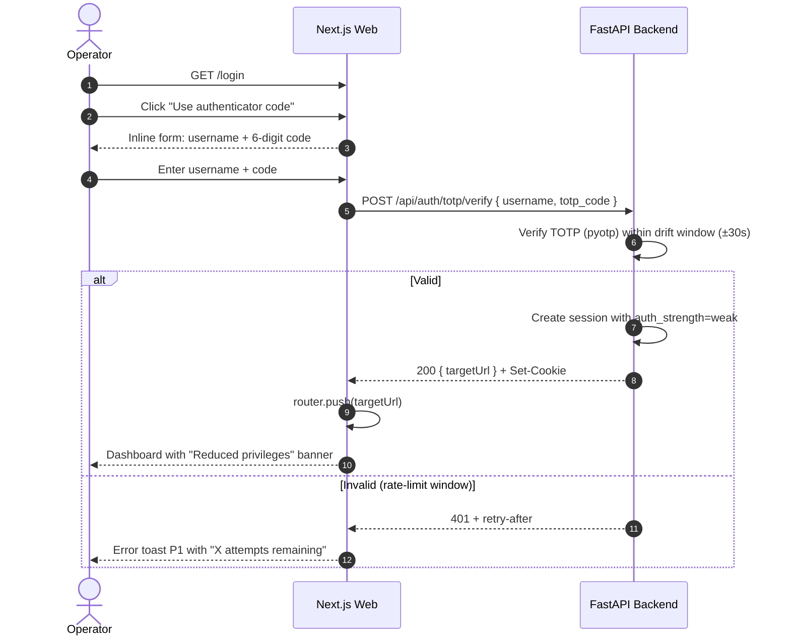
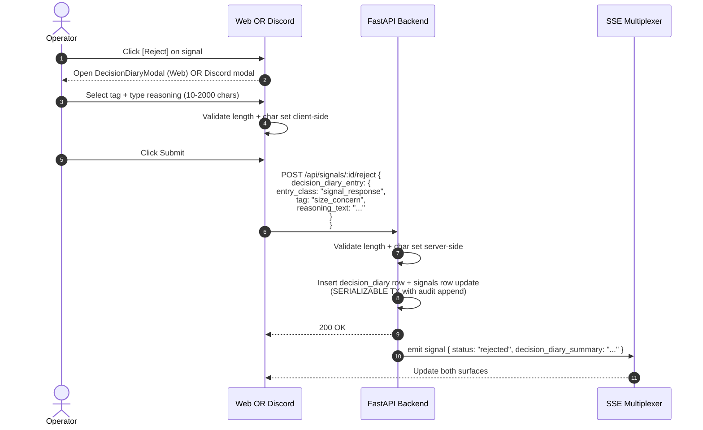
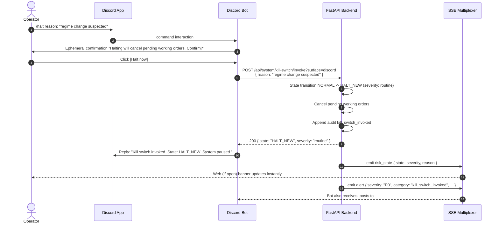
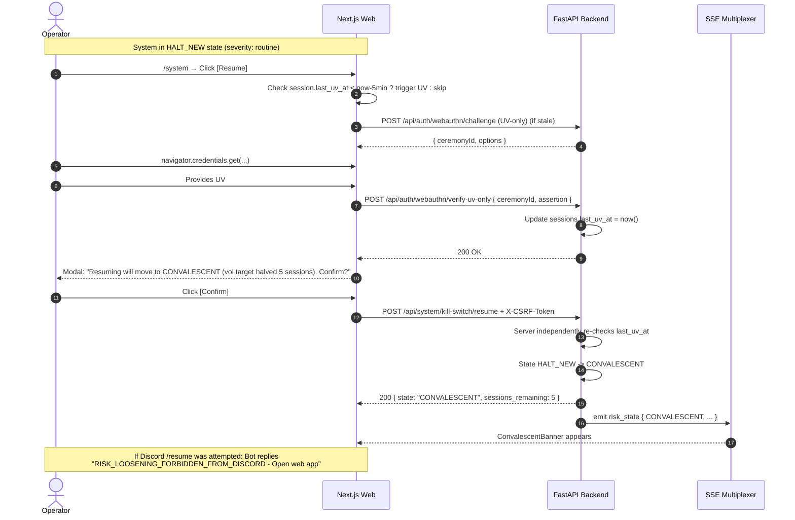
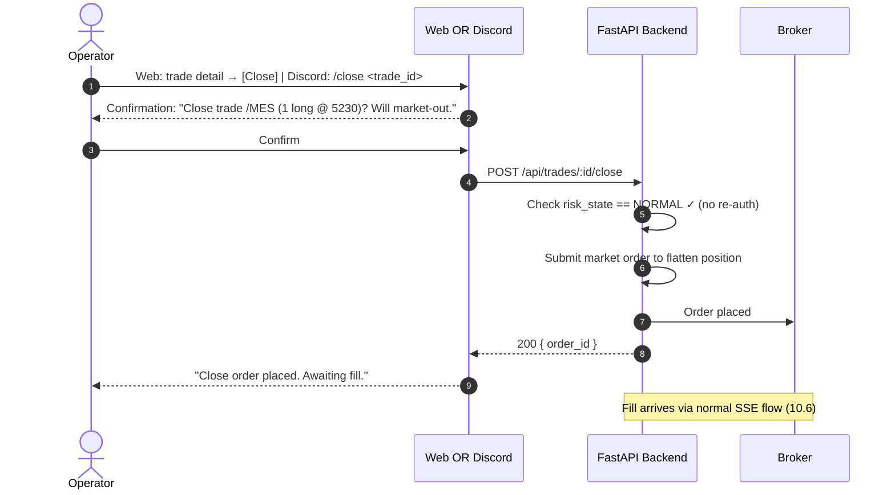
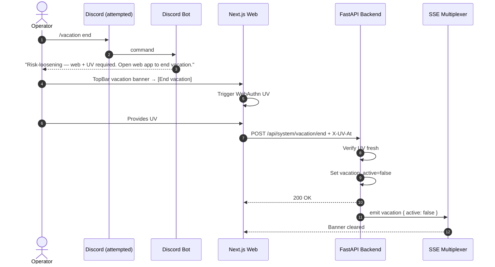

# FRONTEND TECHNICAL SPECIFICATION
## Solo-Operator Algorithmic Trading System — Production Build

**Companion to:** `backend-spec.md` (Prompt A output). API contracts in this document reference and conform to backend-spec.md §4. Where divergence is necessary it is flagged inline with `[CONTRACT — verify against Prompt A]`.

**Domain placeholder:** `<your-domain>` is the **registrable apex domain** (e.g., `mytrading.com`). Production at `<your-domain>`; staging at `paper.<your-domain>`. WebAuthn `rpID = <your-domain>` — identical at both environments via registrable-domain suffix matching. If the operator hosts the app at `app.<your-domain>`, the rpID still equals the apex.

> **Operator placeholders (substitute consistently at deployment):**
> - `<your-domain>` — substitute with operator's registered apex domain (e.g., `mytrading.com`); needed for Caddy auto-cert + WebAuthn rpID
> - `<operator_username>` — operator's chosen username (used in TOTP / recovery; single-user system but stored)
> - `<operator_email>` — operator's email for backups (Resend) + Sentry user-feedback routing
> - `<watchdog_static_ip>` — Hetzner Falkenstein VPS static IP for Caddy IP-allowlist on `/api/internal/watchdog`
> - `<discord_guild_id>` — Discord server ID for the bot
> - `<dba_breakglass_contact>` — operator's documented break-glass runbook contact (paper safe location, etc.)

**Phasing terminology used throughout:**
- **Phase 0 (frontend weeks 0–3):** scaffold, auth surfaces, mocked Today, Discord skeleton
- **Phase 1 (months 2–5):** ships before live trading — paper + live-small
- **Phase 2 (months 5–9):** Research, full Performance, agent-PR review, deployments log, full Discord
- **Phase 3 (months 9–12):** investor PDF refinements, CPA reader role active

**Binding constraint:** §2 per-page table and §6 Discord-surface table are the contractual phase definitions. Where prose elsewhere differs from those tables, the tables win.

> **🔄 ARCHITECTURE PIVOT 2026-05-12 — frontend impact summary.**
>
> The backend pivoted from QC-Cloud-mediated to direct-IBKR + LEAN Local on 2026-05-12 (see `Docs/backend-spec.md` top banner + `Docs/decisions-log.md` 2026-05-12 entry). **Frontend impact is minimal:**
> - All page layouts, components, state shape, SSE event types, and routes are unchanged.
> - The environment tags `paper` / `live-small` / `live-scale` still mean the same things — they now map to IBKR-paper / IBKR-live-small / IBKR-live-scale account contexts (instead of pre-pivot QC-paper / QC+IBKR-live).
> - The Discord deep-link contracts are unchanged.
> - The System page reconciliation status tile (§2.6.5) sources from `ib-async` intraday + IBKR FlexQuery EOD instead of QC ObjectStore — the surface and copy update, the data shape on the wire is unchanged.
> - The Today page "queued signals" component still receives `signal_emitted` events via SSE; the upstream producer changes from QC-adapter to the LEAN-Local→`/api/internal/lean/signals`→`signal` service chain, but the SSE event shape sent to the browser is unchanged.
>
> **No frontend code is impacted by the pivot.** Day 20-27 work (Today / Trades / System / auth pages) ships forward.

---

## TABLE OF CONTENTS

1. Information Architecture
2. Screen-by-Screen Specification
3. Six Locked Additional Features
4. Real-Time Update Mechanism
5. Auth and Session Management
6. Discord Bot Specification
7. Component Library Inventory
8. Data Fetching and State Strategy
9. Design Tokens
10. Sequence Diagrams (Mermaid)
11. Phased Build Plan
12. Testing Strategy
13. Investor PDF Report Layout
14. SLO / Performance Budgets
15. Export Taxonomy
16. Observability
17. Security Headers and Browser Hardening
18. Staging Environment

---

# 1. Information Architecture

## 1.1 Full IA Tree

```
<your-domain>/
├── (pre-auth)
│   ├── /login                 — WebAuthn primary + TOTP fallback + backup-code link
│   ├── /setup                 — first-run bootstrap (one-time token from Postgres)
│   ├── /recover               — backup-code recovery (one of 8 single-use codes)
│   └── /maintenance           — static page served by Caddy on 502 / planned deploy
│
├── (post-auth, RBAC: owner / [reader Phase 3])
│   ├── /                      — Today (landing dashboard)
│   ├── /trades
│   │   └── /:id               — trade detail (Phase 1: page; Phase 2: drawer-preferred)
│   ├── /performance
│   ├── /research              — Phase 2
│   │   └── /backtest/:id      — Phase 2
│   ├── /system
│   │   ├── /audit/:id         — single audit-event detail
│   │   └── /pr/:id            — PR review surface (Phase 2)
│   └── /calendar
│
├── (debug only — not in nav)
│   ├── /__health              — client-side health diagnostic (renders connection state)
│   └── /__version             — renders frontend git sha + boot env
│
└── /api/*                     — proxied to FastAPI (same origin)
```

**Routes hidden via `routes.config.ts`:**

```typescript
// apps/web/src/lib/routes.config.ts
export type RouteConfig = {
  path: string;
  available_from: 0 | 1 | 2 | 3;
  hidden_in_nav: boolean;
};

export const ROUTES: RouteConfig[] = [
  { path: "/",                   available_from: 0, hidden_in_nav: false },
  { path: "/trades",             available_from: 1, hidden_in_nav: false },
  { path: "/trades/:id",         available_from: 1, hidden_in_nav: true  }, // deep-link only
  { path: "/performance",        available_from: 1, hidden_in_nav: false },
  { path: "/research",           available_from: 2, hidden_in_nav: false },
  { path: "/research/backtest/:id", available_from: 2, hidden_in_nav: true },
  { path: "/system",             available_from: 1, hidden_in_nav: false },
  { path: "/system/audit/:id",   available_from: 1, hidden_in_nav: true  },
  { path: "/system/pr/:id",      available_from: 2, hidden_in_nav: true  },
  { path: "/calendar",           available_from: 1, hidden_in_nav: false },
];
```

**Server consultation (Next.js middleware):** `if (current_phase < route.available_from) return new NextResponse(null, { status: 404 })`. Phase transitions deployment-controlled; logged to backend audit as `phase_transition_deployed`.

**Client consultation (Nav component):** filters out `hidden_in_nav: true` routes.

## 1.2 Pre-Auth Surfaces

**`/login`** (mobile-accessible):
- WebAuthn primary button: "Sign in with passkey"
- TOTP fallback collapsed by default; "Use authenticator code instead"
- Backup-code link → `/recover`
- Browser-unsupported explainer (when `!window.PublicKeyCredential`): "WebAuthn not supported. Use Chrome, Firefox, Safari, or Edge."
- Captures intended `targetUrl` from `?to=` query param (default `/`); never embedded in URL after auth — passed via server-side ceremony state

**`/setup`** (mobile-accessible):
- Token field (password-style; not in URL, not in browser history; rate-limited 5 attempts / 1h lock)
- 4-step wizard: WebAuthn passkey → TOTP enrollment → backup codes → confirm
- TOTP-only-fallback path: prominent warning, session marked `auth_strength: weak`

**`/recover`** (mobile-accessible):
- Backup-code entry (10-char base32, 2 groups of 5; format `ABCDE-FGHIJ`)
- Successful → wizard to reset WebAuthn + TOTP + regenerate backup codes
- Rate-limited 5 attempts / 1h lock
- "All factors lost" path: `dba_breakglass` contact info (operator pre-configures during /setup)

## 1.3 Top Nav (recommended)

**Single horizontal top nav, persistent across all post-auth pages.** Dense, dark, monospace where numeric.

```
┌──────────────────────────────────────────────────────────────────────────────┐
│  ●trd  Today  Trades  Performance  Research  System  Calendar                │
│                                                       v9d2f7a1·● 87  +$2,341 │
│                                                       ●Agent  paper-NORMAL   │
└──────────────────────────────────────────────────────────────────────────────┘
                                                       └─ persistent badges ─┘
```

**Defense of choice:** trading dashboards historically use a single dense top bar (Bloomberg, IB TWS, Tradestation). A side rail wastes horizontal pixels in a numerically dense interface. Six pages comfortably fit a horizontal strip; expansion would require redesign at >9 items, but the IA explicitly forbids more.

**Elements (left → right):**
- App mark `●trd` (link to `/`)
- Page links: `Today` `Trades` `Performance` `Research` `System` `Calendar` (active page underlined; phase-hidden routes omitted)
- Spacer
- **Strategy version badge:** click → popover with `StrategyVersion` schema (§ Strategy Version Object); displays `short_hash` + click to expand
- **Health score pill:** small circle (G/Y/R) + numeric score `87`; click expands cached payload
- **Portfolio P&L:** `+$2,341` (current-environment scoped); color emerald/rose; tabular-num; SSE-driven
- **Agent status indicator:** dot (`idle` muted / `working` indigo pulse / `degraded` amber / `disabled` muted with strikethrough / `errored` red)
- **Environment + state pill:** `paper-NORMAL` / `live-small-HALT_NEW` / etc. — color per environment with state suffix
- **Vacation banner:** when active, full-width band ABOVE top nav showing end date + "End vacation" button (web-only, re-auth)
- **Convalescent banner:** full-width band ABOVE top nav showing sessions remaining + countdown + effective vol target
- **Incident-review HALT_NEW banner:** bright red full-width band above top nav with "Incident review required" + linked review form

**Persistent banner stack ordering (top → bottom):**
1. Maintenance / version-skew (highest)
2. Incident-review HALT_NEW (red)
3. Routine HALT_NEW / CONVALESCENT / Vacation
4. SSE polling-mode degraded indicator
5. Top nav

## 1.4 Command Palette (cmd-K)

Library: `cmdk` (`pnpm add cmdk`). Mounted at `apps/web/src/components/CommandPalette.tsx` and toggled globally via `useHotkeys('mod+k', ...)`.

**Corpus:**
- Pages: all post-auth routes (filtered by `routes.config.ts` for current phase)
- **Trades:** by ID (UUID prefix lookup via `GET /api/trades?id_prefix=`) or by symbol (`/MES`, `TLT`)
- **Signals:** by ID prefix
- **Audit events:** by sequence_no (`#39201`) or free-text on `reason` field (Phase 2 FTS)

**Implementation:**
- Local search for pages (instant)
- Backend search for trades/signals/audit (debounced 200ms; cancellable; uses `AbortController`)
- Recent items cached in Zustand (last 10 picks across pages and entities)
- Keyboard: ↑/↓ to navigate, Enter to select, Esc to close, mod+K to toggle

**Result item shapes:**
- Page: `<icon> Page name              ↗ /path`
- Trade: `<dir-arrow> /MES long  filled  +$320  v9d2f7a1`
- Signal: `<status-dot> /ZN short  pending  vol_regime_z_high`
- Audit: `#39201 audit signal_emitted  17:30 ET  paper`

## 1.5 Keyboard Shortcuts

`?` opens the cheat-sheet modal. Library: `react-hotkeys-hook`.

| Shortcut | Action | Scope |
|---|---|---|
| `mod+K` | Open command palette | global |
| `?` | Open shortcuts cheat sheet | global |
| `g t` | Go to Today | global |
| `g r` | Go to Trades | global |
| `g p` | Go to Performance | global |
| `g s` | Go to System | global |
| `g c` | Go to Calendar | global |
| `g a` | Go to Agent activity (System anchor) | global |
| `j` / `k` | Next / prev row | tabular pages |
| `Enter` | Open selected row | tabular pages |
| `f` | Focus filter bar | tabular pages |
| `e` | Export current view (CSV) | Trades, Audit, Performance |
| `a` | Approve focused signal | Today (queued signals) |
| `r` | Reject focused signal (opens diary modal) | Today (queued signals) |
| `d` | Defer focused signal | Today (queued signals) |
| `Esc` | Close drawer/modal | global |
| `mod+Enter` | Submit form | active form |
| `mod+,` | Open command palette settings (Phase 2) | global |

**Conflict-avoidance:** all shortcuts disabled when an `<input>` / `<textarea>` / `[contenteditable]` is focused, EXCEPT `Esc` and `mod+Enter`.

## 1.6 Persistent UI Elements (top bar) — schema

Every post-auth page renders this bar via `apps/web/src/components/TopBar.tsx`. Elements bound to SSE channel events:

| Element | Binding | Stale threshold |
|---|---|---|
| Strategy version badge | SSE `agent` (deploy events) + initial `GET /api/system/status` | n/a (immutable per deploy) |
| Health score pill | SSE `health` (carries full `score`) + initial `GET /api/health-score` | 60s session / 5min off |
| Portfolio P&L | SSE `pnl` (60s during session) | 5s session / 60s off |
| Agent status | SSE `agent` | 60s |
| Environment + state pill | SSE `risk_state` + initial `GET /api/system/status` | n/a (state-driven) |

## 1.7 Deep-Link Conventions

| From | Path | Behavior |
|---|---|---|
| Discord `#signals` embed | `/trades/:signal_uuid` | Phase 1 full-page; Phase 2 same path opens drawer over `/trades` if user came from there, otherwise full-page |
| Discord `#fills` embed | `/trades/:trade_id` | same |
| Discord `#alerts` embed | `/system?audit_event_uuid=:uuid` (anchored to that audit row) | scrolls + highlights row in audit explorer |
| Discord `#critical` embed | `/system` (kill-switch UI focused) | Phase 1: scrolls + flashes the kill-switch panel |
| Email backup | `/system?alert_uuid=:uuid` | same as #alerts |
| Watchdog email | `/system?focus=watchdog` | scrolls to watchdog tile |

**Anchored highlight pattern:** any `?focus=*` query param triggers a 2-second amber outline-pulse on the matching DOM node and `scrollIntoView({ block: "center" })`.

---

# 2. Screen-by-Screen Specification

## 2.1 Phase Surface Enumeration (BINDING — supersedes prose elsewhere)

| Page | Phase 1 ships | Phase 2 adds |
|---|---|---|
| **Today** | Health score (insufficient-data graceful), positions table, P&L summary D/W/M/Y, exposure breakdown vs. ring + cluster limits, queued signals (individual approve/reject WITH decision diary modal on rejection; **anomaly badge present**; NO bulk-approve), recent fills feed, P0/P1 alerts, paused-state distinction | Stress test button (six scenarios), anomalies quick-link list, P2 alerts integration, bulk-approve "standard" |
| **Trades** | Filterable summary table (date/market filters); CSV export; **minimal per-trade detail PAGE at `/trades/:id`** (full-page; basic info: signal, market, direction, status, fill_price, fill_qty, P&L; ensures Discord deep-links don't 404) | Per-trade detail DRAWER (in-table preview), full decision-diary view in Trades, full attribution view, all filters, advanced search |
| **Performance** | Equity curve (no benchmark overlay yet), monthly returns table; CSV export | Drawdown underwater, attribution, actual-vs-rule compare, tax estimate widget, PDF export, benchmark overlay, print stylesheet, environment-segregation toggle |
| **Research** | (not in Phase 1; route 404) | Backtest viewer, parameter sandbox, regime analysis, A/B compare, walk-forward visualizer (strip chart) |
| **System** | Kill-switch UI + state, **read-only Risk Envelope tile**, audit log basic table (date + event type + environment filter), reconciliation status (Phase 1+ post-pivot 2026-05-12: IBKR TWS via `ib-async` intraday + IBKR FlexQuery EOD; see `Docs/backend-spec.md` §2.6 + `Docs/decisions-log.md` 2026-05-12 pivot entry), watchdog status, **minimal Account section: regenerate backup codes (re-auth)** | Risk envelope + propose-PR, deployments log + rollback, agent activity feed, full audit explorer with FTS + actor + hash-validity + repaired-events filters, operator-friendly PR review surface, convalescent banner refinements, operating cost dashboard, full operator account management |
| **Calendar** | Read-only event list (next 30 days) | Tomorrow's ratification flow on web (Phase 1 ratification is Discord-only), holidays, contract expiration / roll schedule, manual event log |

## 2.2 `/` — Today (landing dashboard)

### 2.2.1 Layout (12-col grid, dense)

```
┌────────────────────────────────────────────────────────────────────────────┐
│  TopBar (persistent)                                                       │
├──────────────────────────────────┬─────────────────────────────────────────┤
│  Health Score          [G 87]    │  P&L Summary       D    W    M    Y    │
│   [click to expand component bars]│   Net Liq          ...  ...  ...  ...  │
│                                  │   $-vs-Bench       ...  ...  ...  ...  │
├──────────────────────────────────┼─────────────────────────────────────────┤
│  Queued Signals (3)              │  Exposure                               │
│   ─ /MES long 1@5234.50          │   Gross: 195% ─────────░░░░ 300%        │
│      [vol_regime_z_high] anomaly │   Net:    72%  ──░░░░░░░░░░ 150%        │
│      [Approve][Reject][Defer]    │   Equity-Idx: 38%   ░░░░░░░ 60%         │
│   ─ /ZN  short 2@112.07          │   Rates/Bonds: 22%  ░░░░░░░ 80%         │
│   ─ /MNQ long  1@18234           │   Commodity: 12%    ░░░░░░░ 80%         │
│  [Bulk approve standard] (Ph 2)  │   Crypto: 0%        ░░░░░░░ 40%         │
├──────────────────────────────────┼─────────────────────────────────────────┤
│  Positions (5)                   │  Recent Fills (10)                      │
│  Mkt  Qty  AvgCost  Mkt  uPnL    │  17:32  /MES  +1 @ 5234.75  +$3.75      │
│  /MES   1  5230.00  5237  +$35   │  17:31  /ZN   -2 @ 112.05   -$45.00     │
│  ...                             │  ...                                    │
├──────────────────────────────────┴─────────────────────────────────────────┤
│  Active Alerts                                                              │
│   [P0] Reconciliation tolerance breach — open detail                        │
│   [P1] Vol regime transition: equity_idx σ +0.4 above 30d                  │
└────────────────────────────────────────────────────────────────────────────┘
```

**Tablet/mobile (<1024px):** banner "Use desktop or Discord →" + Discord deep-link button. Login/setup/recover excepted.

### 2.2.2 Sections

#### A. Health Score Tile
- Single number 0–100, color G ≥75 / Y 50–74 / R <50
- Click expands to component bars (cached payload — no extra fetch):
  ```
  Live Sharpe vs. backtest    30%  ████████░░  82
  Slippage drift              20%  ████████░░  78
  Hit rate vs. expected       20%  █████████░  91
  Capacity headroom           15%  ██████████  100
  Days since last recon break 15%  █████░░░░░  55
  Composite                       ████████░░  87
  ```
- Insufficient-data: gray "—" + tooltip "insufficient data — track record under construction" (per locked rule: <50% expected data points per component → component "—"; <50% total weight available → composite "—")
- Backend: **primary source `GET /api/health-score`** returns composite + components. The `GET /api/today/digest` payload includes the health-score body as a denormalized convenience for landing-page first paint. Updated via SSE `health` events (which carry a full `score` object — frontend invalidates the cached health-score on receipt).

#### B. P&L Summary
- 4-column grid: Day / Week / Month / Year
- Two rows: Net Liquidation, Active vs. Benchmark (delta to SPY same period)
- Period boundary: ET-aligned (day = 17:00 ET to 17:00 ET; week = Mon 17:00 ET; month = first session of calendar month; year = Jan 1 first session)
- Backend: `GET /api/performance/equity?env=current&from=&to=` for each window; SSE `pnl` events for daily live update
- Stale: yellow corner badge if no `pnl` event >5s during session / >60s off-session

#### C. Queued Signals
- Table of signals with `status: pending`
- Per-row: market | direction | size | decision price | anomaly badge (if `anomaly_reasons.length > 0`) | expires_at countdown | [Approve] [Reject] [Defer]
- Anomaly badge renders amber pill with tooltip listing all `anomaly_reasons` mapped to human text:
  - `vol_regime_z_high` → "Vol regime z-score above 1.5 — recently elevated volatility"
  - `capacity_above_alert` → "Position size between 0.5%–2% of ADV"
  - `recent_decision_diary_concern` → "You logged a concern on this market within 14 days"
  - `slippage_outlier_recent` → "Backtest expected slippage exceeded by >2× in last 5 trades same market"
  - `version_baseline_divergence` → "Strategy version diverged from baseline in last week's golden test"
- **Approve action:** POST `/api/signals/:id/approve` with optional `{ override_size }`; optimistic update; on 5xx queue retry per locked optimistic-update UX; SSE replay event `signal` with `status=approved` reconciles
- **Reject action:** opens DecisionDiaryModal; on submit POST `/api/signals/:id/reject` with `{ decision_diary_entry: { tag, reasoning_text } }`
- **Defer action:** opens DecisionDiaryModal (same shape; required); POST `/api/signals/:id/defer`
- **Bulk approve standard (Phase 2):** button enabled when ≥1 non-anomaly signal exists (regardless of how many anomaly-flagged also present); POST `/api/signals/bulk-approve-standard`; confirmation modal lists count
- Empty: "No signals queued."
- ARIA: new signal arrival → `aria-live="polite"` announces "New signal: /MES long, target 1 contract"

#### D. Exposure Breakdown
- Visual: horizontal bar groups, one per ring (Gross/Net) + cluster (equity-idx, rates/bonds, commodity, crypto, FX)
- Each bar: filled portion = current %; gray remainder to limit; vertical tick at limit
- Color: emerald if >50% headroom, amber 25–50%, red <25%
- Charts: simple HTML/CSS bars (no chart library on Today — bundle budget); reserve Recharts for `/performance`
- Backend: `GET /api/today/digest` returns nested exposure object (`exposure` field); SSE `position` events trigger refetch (debounced 1s)

#### E. Positions Table
- Columns: Market | Qty | Avg Cost | Mark | uPnL | Cluster | Strategy Version
- Virtualized if >50 rows (TanStack Table + `@tanstack/react-virtual`)
- Click row → `/trades/:id` (Phase 1: full-page; Phase 2: drawer)
- Backend: SSE `position` events; initial fetch `GET /api/positions/current` (Phase 1) or derived from `/api/trades?status=open_position`
- Stale: 30s session / 5min off

#### F. Recent Fills Feed
- Live feed (newest top); show last 10
- Per-row: time (ET) | market | qty | price | realized P&L (color)
- ARIA: new fill → `aria-live="polite"` announces "Fill: /MES +1 at 5234.75"
- Backend: SSE `fill` events
- Stale: 10s session / 60s off

#### G. Active Alerts
- Sorted P0 → P1 → P2 (Phase 2 includes P2)
- Per-row: severity pill | category | message | timestamp ET | "open detail" link to audit row
- Empty: "No active alerts."
- Backend: SSE `alert` events; initial fetch `GET /api/alerts?status=open`

### 2.2.3 States

| State | Behavior |
|---|---|
| Initial load | Skeleton placeholders for each tile; hydrate from initial fetches |
| SSE connected | Live updates; no badges |
| SSE disconnected | DEGRADED banner + per-tile stale badges per threshold; polling fallback active |
| HALT_NEW | Top banner red/amber per severity; **paused-state pills replace stale badges on positions/exposure/queued signals** ("PAUSED — last activity at HH:MM ET") |
| Vacation | Top banner (indigo) + paused-state pills |
| Insufficient health-score data | Health score "—" + tooltip; other tiles unaffected |
| Empty (Phase 0/Phase 1 day 1) | "No trades yet — equity curve will appear after first fill" pattern |
| Reduced (TOTP-only weak session) | Banner: "Reduced privileges — add WebAuthn to unlock"; queued-signal action buttons disabled; tooltip explainer |

### 2.2.4 Accessibility
- `<main>` landmark wraps page content
- Each tile is `<section aria-labelledby="...">` with hidden h2
- Polite-live region for fills + signals; alerts P0 use `role="alert"` (assertive)
- All pills/badges include text + visual; never color-only
- Focus order: TopBar → Health → P&L → Queued Signals → Exposure → Positions → Fills → Alerts

## 2.3 `/trades` and `/trades/:id`

### 2.3.1 Layout (Phase 1)

```
┌────────────────────────────────────────────────────────────────────────────┐
│  TopBar                                                                     │
├────────────────────────────────────────────────────────────────────────────┤
│  Filters: [Date range ▼] [Market ▼] [Env ▼] [State ▼]   [Search]  [Export] │
├────────────────────────────────────────────────────────────────────────────┤
│  Date         Market  Dir  Size  Status     Entry  Exit   P&L      Vers    │
│  05-04 17:32  /MES    L    1     filled     5230   5237   +$35.00  9d2f7   │
│  05-04 14:18  /ZN     S    2     stopped    112.5  113.0  -$50.00  9d2f7   │
│  ...                                                                        │
│                                                                             │
│  [Showing 50 of 312 — load more]                                            │
└────────────────────────────────────────────────────────────────────────────┘
```

### 2.3.2 Component Hierarchy

```
TradesPage
├── TradesFilterBar
│   ├── DateRangePicker (default last 30d)
│   ├── MarketFilter (multi-select; populated from instrument_metadata)
│   ├── EnvFilter (paper / live-small / live-scale; one at a time — never blended)
│   ├── StateFilter (multi-select from TradeState enum)
│   ├── StrategyVersionFilter (Phase 2)
│   ├── RegimeFilter (Phase 2)
│   ├── SearchBox (Phase 2: backend FTS on diary text)
│   └── ExportButton (CSV; locked schema)
├── TradesTable
│   ├── TanStackTableHeader (sortable)
│   ├── TanStackTableBody (virtualized via @tanstack/react-virtual; row=32px)
│   └── PaginationControls (cursor-based; "Load more" button)
└── TradeDetailDrawer (Phase 2)
```

### 2.3.3 Data
- **List:** `GET /api/trades?from=&to=&market=&state=&env=&strategy_version=&cursor=&limit=`
- **Detail:** `GET /api/trades/:id`
- **Manual close:** `POST /api/trades/:id/close` — re-auth required if `risk_state == 'HALT_NEW'`; otherwise no re-auth
- **CSV export:** `GET /api/trades/export.csv?...` — streamed; filename `trades_<filter_hash>_<exported_at_utc>.csv`

### 2.3.4 Per-Trade Detail (`/trades/:id`)

**Phase 1 (minimal page so Discord deep-links don't 404):**

```
┌────────────────────────────────────────────────────────────────────────────┐
│  /trades/abcdef-... ← back                                                  │
├────────────────────────────────────────────────────────────────────────────┤
│  /MES long  v9d2f7a1·paper                                                  │
│  Signal emitted 17:30 ET  →  approved 17:30:42 ET  →  filled 17:32 ET       │
│  Status: filled                                                             │
│                                                                             │
│  Signal:    decision_price 5234.50  expected_slippage 0.4 bps               │
│             anomaly: vol_regime_z_high                                      │
│  Fill:      qty 1  avg_price 5234.75                                        │
│  Realized:  +$3.75 P&L (excl. commissions)                                  │
│  Strategy:  parameter_set 7e21c93  slippage_calibration v2026-04-15         │
│                                                                             │
│  Decision diary: (none)                                                     │
└────────────────────────────────────────────────────────────────────────────┘
```

**Phase 2 (drawer-preferred):**

```
┌──────────────────────────────────────┬─────────────────────────────────────┐
│  Trades table (background, dimmed)   │  /MES long [×]                      │
│  ...                                 │  ─────────                          │
│                                      │  Lifecycle timeline                 │
│                                      │   17:30 emitted    [audit #1042]    │
│                                      │   17:30 approved   [audit #1043]    │
│                                      │   17:32 filled     [audit #1051]    │
│                                      │   17:45 closed     [audit #1102]    │
│                                      │                                     │
│                                      │  Price chart (Lightweight Charts)   │
│                                      │   [entry/exit markers]              │
│                                      │                                     │
│                                      │  Decision diary                     │
│                                      │   [tag] reasoning_text              │
│                                      │   author: operator | agent          │
│                                      │   (reader: agent entries hidden)    │
│                                      │                                     │
│                                      │  Attribution                        │
│                                      │   factor breakdown                  │
│                                      │                                     │
│                                      │  Agent commentary (Phase 2)         │
│                                      │   linked agent_action records       │
│                                      │                                     │
│                                      │  Stress-test impact                 │
│                                      │   per scenario row                  │
└──────────────────────────────────────┴─────────────────────────────────────┘
```

**Drawer width:** 720px desktop, full-width below 1280px viewport (still ≥1024 desktop minimum).

### 2.3.5 States
- Empty (no trades): "No trades yet" + explainer
- Loading: skeleton 10 rows
- Filter-resulting empty: "No trades match these filters — try widening date range"
- Error fetch: error boundary with "Retry" button + Sentry breadcrumb
- Phase 1 day 1 (no live): "Will populate once first signal fills"

### 2.3.6 Accessibility
- TanStack Table renders semantic `<table role="grid">`
- Sortable columns: `aria-sort`
- Drawer: `role="dialog"` + focus-trap; Esc closes; `aria-labelledby` to trade title
- Table rows clickable: `<tr role="row" tabIndex={0}>` + `Enter` opens

## 2.4 `/performance`

### 2.4.1 Layout (Phase 2 full target)

```
┌────────────────────────────────────────────────────────────────────────────┐
│  TopBar                                                                     │
├────────────────────────────────────────────────────────────────────────────┤
│  [Range: All / YTD / 1Y / 6M / 3M / 1M]  [Env: current ▼]  [Show all envs] │
│  [Prepare for print]  [Export CSV]  [Export PDF]                            │
├────────────────────────────────────────────────────────────────────────────┤
│  Equity curve (Lightweight Charts) + benchmark overlay (SPY)                │
│   ─────────────────────────────────────────────────                         │
├────────────────────────────────────────────────────────────────────────────┤
│  Drawdown (Recharts underwater)                                             │
├──────────────────────────────────────┬─────────────────────────────────────┤
│  Monthly returns calendar heatmap    │  Rolling stats (60d)                │
│   (Recharts)                         │   Sharpe   1.34                     │
│                                      │   DD       -8.2%                    │
│                                      │   Hit rate 0.58                     │
├──────────────────────────────────────┼─────────────────────────────────────┤
│  Attribution (Recharts bars)         │  Tax estimate widget                │
│   by market / signal / regime        │   YTD: $X     1256: $Y              │
│                                      │   Wash sales flagged: 0             │
│                                      │   [Election toggle 475(f)]          │
├──────────────────────────────────────┴─────────────────────────────────────┤
│  Actual vs. rule-following P&L compare (Lightweight Charts)                 │
│   [30d divergence: 1.2% — within tolerance]                                 │
└────────────────────────────────────────────────────────────────────────────┘
```

### 2.4.2 Charts

| Chart | Library | Notes |
|---|---|---|
| Equity curve + benchmark | Lightweight Charts | Two series: NAV and benchmark; dual axes optional. Lazy-loaded via `next/dynamic` on /performance. |
| Drawdown underwater | Recharts (AreaChart) | Single series, fill below 0 |
| Monthly heatmap | Recharts (custom) | One cell per month; color scale red→green |
| Attribution bars | Recharts (BarChart) | Group by market / signal / regime tab |
| Actual-vs-rule | Lightweight Charts | Two series + 30d rolling divergence sub-chart |

### 2.4.3 Environment Segregation (LOCKED)
- Default: charts render `env=current` only (paper OR live-small OR live-scale, whichever active)
- Toggle "Show all environments (segregated)" → chart splits into 3 stacked sub-panels, one per env, **never blended into single line**
- Env tag pill always visible on each panel
- Backend `GET /api/performance/equity?env=all` returns separate series arrays keyed by environment

### 2.4.4 Tax Estimate Widget
- Click-expand reveals breakdown:
  ```
  YTD realized P&L:     $12,340
  ├ Section 1256 60/40: $8,200  (long-term: $4,920; short-term: $3,280)
  ├ Equity short-term:  $4,140
  └ Wash sales flagged: 0 trades
  Estimated 2026 liability: $X (at marginal rates supplied at /setup)
  ```
- Election toggle for 475(f) on ETFs:
  - Renders `CPAAcknowledgmentModal`: operator types verbatim "I have consulted a CPA regarding 475(f) election"
  - Submit → POST `/api/performance/tax-election` with `{ enabled: true|false, ack_text: "..." }` → re-auth required (`RE_AUTH_REQUIRED` 401 if UV stale → re-prompt WebAuthn → retry)
  - Logged to backend audit
- Backend: `GET /api/performance/tax-estimate?year=`; nightly cron updates

### 2.4.5 PDF Export Flow
- Click `Export PDF` → POST `/api/performance/pdf-export` returns `{ job_id }`
- SSE on `job` channel filtered by `job_id`:
  - `status=queued` → toast "Queued"
  - `status=running` → progress drawer (`PDFExportProgressDrawer` component) with bar + cancel
  - `status=complete` → `result_url` (1h TTL signed URL) → autoinitiate download via `<a download>`
  - `status=failed` → toast P1 with error_message + "Retry"
- Download click logged to audit (server-side via signed-URL callback)

### 2.4.6 Print Stylesheet (US Letter portrait)
- Trigger: explicit "Prepare for print" button → applies `print-mode` class to `<html>` → `@media print` styles
- Page-break controls:
  - `page-break-inside: avoid` on each chart container
  - Header repeats per page: period label + "Prepared by: <operator name>"
  - Footer repeats per page: "Generated 2026-05-04 22:00 ET" + page number
- Charts: pre-rendered SVG (Lightweight Charts replaced with Recharts SVG in print mode for SSR-friendly output)
- Numeric tables: full precision; tabular-num
- Color: full-color (not grayscale); but ensure red/green readable on B&W printers via icons + text

### 2.4.7 States
- Empty (zero trades): austere "No trades yet — equity curve will appear after first fill" — NOT a flat zero NAV line
- Insufficient data for rolling stats: "—"
- All-envs toggle with empty env: "No trades in `paper` for this period" panel
- PDF export pending: drawer cannot be dismissed without explicit cancel

## 2.5 `/research` (Phase 2)

### 2.5.1 Layout

```
┌────────────────────────────────────────────────────────────────────────────┐
│  TopBar                                                                     │
├────────────────────────────────────────────────────────────────────────────┤
│  [Tabs: Backtest viewer | Sandbox | Regime | A/B compare | Walk-forward]    │
├────────────────────────────────────────────────────────────────────────────┤
│  (per-tab content)                                                          │
└────────────────────────────────────────────────────────────────────────────┘
```

### 2.5.2 Tabs

#### A. Backtest Viewer
- Loader: dropdown of `strategy_version`s with attached backtest artifacts
- On select:
  - Equity curve (Lightweight Charts)
  - Trade list (TanStack Table)
  - Statistics panel (Sharpe, max DD, hit rate, exposure stats)
  - Lineage block: parent_version, parameter_set_hash, slippage_calibration_version
- Backend: `GET /api/research/backtests` (list) + `GET /api/research/backtests/:id` (detail)

#### B. Parameter Sandbox
- Form per parameter (name, current value, proposed value, slider/input bounded by Parameter Ranges Table from Prompt A)
- In-range / out-of-range visual indicator (green/red)
- Out-of-range disabled (cannot submit)
- Submit → POST `/api/research/parameters/propose` (re-auth required) → drafts PR via backend GitHub App
- On success: link to PR review surface `/system/pr/:id`

#### C. Regime Analysis
- Performance segmented by vol regime + trend regime (matrix or stacked bars)
- Source: `GET /api/research/regime-analysis`
- Recharts

#### D. A/B Compare
- Two strategy versions side-by-side
- Equity curves overlaid (Lightweight Charts)
- Statistics delta table

#### E. Walk-Forward Visualizer
- **Strip chart** (Recharts; locked)
- One row per fold: in-sample (gray) + out-of-sample (color); Sharpe label
- Backend: `GET /api/research/walk-forward/:strategy_version`

### 2.5.3 States
- Phase 1: route returns 404 (per `routes.config.ts`)
- Phase 2 day 1: empty backtest list → "No backtests yet — generate via CLI"
- Out-of-range param: red border + tooltip "Outside allowed range [X, Y]"

## 2.6 `/system`

### 2.6.1 Layout (Phase 2 full target)

```
┌────────────────────────────────────────────────────────────────────────────┐
│  TopBar                                                                     │
├────────────────────────────────────────────────────────────────────────────┤
│  [Anchors: Kill switch · Risk envelope · Audit · Recon · Watchdog · Costs · │
│   Agent · Account]                                                          │
├────────────────────────────────────────────────────────────────────────────┤
│  Kill switch                                                                │
│   State: NORMAL          [Invoke kill switch]                               │
│   History (last 10): ...                                                    │
│  ─────────────────────────────────────────                                  │
│  Risk envelope (read-only Phase 1; propose-PR Phase 2)                      │
│   Vol target: 14%        [Propose change]                                   │
│   Per-position cap: 25%  [Propose change]                                   │
│   ...                                                                       │
│  ─────────────────────────────────────────                                  │
│  Audit explorer                                                             │
│   Filters: [Date] [Type] [Env]  [Phase 2: actor / hash-validity / FTS]      │
│   Table (virtualized): seq | type | actor | env | ts | preview              │
│   [Export CSV]                                                              │
│  ─────────────────────────────────────────                                  │
│  Reconciliation status                                                      │
│   Last: 17:00 ET passed   Open breaks: 0   24h: 0                           │
│  ─────────────────────────────────────────                                  │
│  Watchdog                                                                   │
│   Last ping: 17:35 ET (3 min ago)   Status: ●healthy                        │
│  ─────────────────────────────────────────                                  │
│  Operating costs (Phase 2)                                                  │
│   Tiles: VPS / DB / QC / Claude / SMS / etc.                                │
│  ─────────────────────────────────────────                                  │
│  Agent activity (Phase 2 anchor; NOT a separate page)                       │
│   Feed: drafted PRs, hot-fixes, alerts, decisions                           │
│  ─────────────────────────────────────────                                  │
│  Account                                                                    │
│   [Regenerate backup codes] (Phase 1; re-auth)                              │
│   [Phase 2: revoke sessions, manage TOTP, view auth audit, invite reader]   │
└────────────────────────────────────────────────────────────────────────────┘
```

### 2.6.2 Kill-Switch Section

#### State display
- NORMAL: green pill + "Invoke kill switch" button
- HALT_NEW (severity = routine): amber banner "HALT_NEW (routine) — auto-resume after recovery conditions" + RESUME button (web-only, re-auth)
- HALT_NEW (severity = defensive_envelope): amber banner + same RESUME
- HALT_NEW (severity = incident_review): **red banner** "Incident review required before resume" + RESUME button **disabled** until incident_review write-up exists at `incident_reviews` table for the current halt
- CONVALESCENT: amber banner with sessions remaining + effective vol target + countdown (auto-decrements via SSE `risk_state` events)

#### History
- Table: invoked_at | reason | resolved_at | duration | severity
- Backend: `GET /api/system/audit?event_type=kill_switch_invoked,kill_switch_resumed`

#### Invoke
- Confirmation modal: "Halting will cancel pending working orders and pause new entries. Continue?" + reason text field (max 200 chars)
- POST `/api/system/kill-switch/invoke` with `{ reason }` — no re-auth (risk-tightening)
- On success: state transitions via SSE `risk_state`; banner updates immediately

#### Resume
- Web-only; re-auth required (WebAuthn UV within 5 min)
- Modal flow:
  1. WebAuthn UV prompt
  2. If `severity == 'incident_review'`: surface incident-review form (text + linked artifacts) — **must be saved first** as `incident_reviews` row → only then RESUME button enables
  3. Confirmation: "Resuming will move to CONVALESCENT (vol target halved for 5 sessions). Continue?"
  4. POST `/api/system/kill-switch/resume` with `{ incident_review_id? }`
- Discord `/halt` resume attempt → bot replies with deep-link to web + explainer per `RISK_LOOSENING_FORBIDDEN_FROM_DISCORD` error code

### 2.6.3 Risk Envelope Section

**Phase 1 (read-only tile):**
```
Vol target:                14%
Per-position target:       25%
Per-position hard floor:   50%
Gross exposure cap:        300%
Net exposure cap:          150%
Cluster: equity-idx        60%
Cluster: rates/bonds       80%
Cluster: commodity         80%
Cluster: crypto            40%
Cluster: FX                30%
Realized correlation alert >0.7  / halt >0.85
Daily loss limit:          -5% of daily-start MTM
Trailing DD:               -20%
Monthly DD vol-halve:      -10%
```

**Phase 2 adds per-row [Propose change] button:**
- Opens modal with current/proposed inputs (bounded by Parameter Ranges Table)
- Submit → POST `/api/system/risk-envelope/propose` (re-auth) → backend drafts PR → link to `/system/pr/:id`

### 2.6.4 Audit Explorer

**Phase 1 filters:** date range, event_type, environment

**Phase 2 adds:** FTS on `reason` field, actor (operator/agent/system), hash-validity (valid/repaired/broken), repaired-events-only toggle

**Table (virtualized):**
- Columns: seq# | event_type | actor | env | ts (ET) | preview (first 80 chars of payload reason)
- Click row → `/system/audit/:event_uuid` (full payload + hash chain breadcrumb)
- Each row: hash-chain integrity badge (green ✓ / amber `repaired` / red ✗)
- Backfill provenance: rows with `repaired_for_sequence_no` show "↳ repaired @ ..." indicator

**Audit detail page (`/system/audit/:id`):**
```
┌────────────────────────────────────────────────────────────────────────────┐
│  ← Back  Audit event #39201                                                 │
├────────────────────────────────────────────────────────────────────────────┤
│  Type:        signal_emitted                                                │
│  Sequence:    39201                                                         │
│  Time (UTC):  2026-05-04T17:30:01.234Z                                      │
│  Time (ET):   2026-05-04 13:30:01 ET                                        │
│  Actor:       qc_algorithm (v9d2f7a1)                                       │
│  Environment: paper                                                         │
│  Hash-chain:  ✓ valid                                                       │
│   prev_hash:  abc123...                                                     │
│   record_hash: def456...                                                    │
├────────────────────────────────────────────────────────────────────────────┤
│  Payload (JSON, prettified):                                                │
│   { ... }                                                                   │
└────────────────────────────────────────────────────────────────────────────┘
```

**Export:** `GET /api/system/audit/export.csv?...` — full hash-chain footer (chain_start_hash, chain_end_hash, record_count, exported_at_utc, export_signature)

### 2.6.5 Reconciliation Status
- Phase 1: source = QC brokerage state (via QC API + audit ingestion)
- Phase 2: source = TWS API real-time + IBKR FlexQuery EOD; pill displays which source produced last check
- Display: last_check_utc, last_check_passed, open_breaks, breaks_24h
- Source pill: `QC` (Phase 1) / `TWS` (Phase 2 intraday) / `FlexQuery` (Phase 2 EOD)
- On break: red banner + link to break detail
- Backend: from `GET /api/system/status` `.reconciliation_summary`

### 2.6.6 Watchdog
- Last ping ET; tooltip showing watchdog_id, region, consecutive_failures_observed
- Status pill: ●healthy (green) / ●stale >10min during session (amber) / ●unhealthy >30min (red)
- Backend: `GET /api/system/watchdog`; SSE `watchdog` events
- "Test ping" button (Phase 2; admin-only): triggers backend to request immediate ping from watchdog VPS

### 2.6.7 Operating Cost Dashboard (Phase 2)
- Provider tiles: VPS (Hetzner Ashburn primary + Hetzner Falkenstein watchdog), DB (Postgres self-hosted = $0), QuantConnect, Claude API, Sentry, **Resend** (email backup; locked — NOT SES), SMS (tile reserved; **NOT wired** — Sentry alert routing is locked Discord-only, no SMS), data feeds (per Prompt A inventory)
- Per-tile: current month spend, rolling 30d, 90d trend mini-sparkline
- Total monthly $ at top
- Backend: `GET /api/system/costs?days=N` (90d default)

### 2.6.8 Agent Activity Section (Phase 2; NOT a separate page; lives under /system)
- Feed (newest top): drafted PRs, hot-fixes, alerts, decisions
- Per-row: action_type | summary | result | timestamp | cost_usd
- Click row → expand to show prompt + response (collapsed by default)
- Backend: `GET /api/system/agent-activity?limit=&cursor=`; SSE `agent` events
- Empty: "No agent activity in last 30 days."

### 2.6.9 Operator-Friendly PR Review Surface (Phase 2; `/system/pr/:id`)
```
┌────────────────────────────────────────────────────────────────────────────┐
│  ← Back  PR #142  agent/parameter-tighten-vol-target                        │
├────────────────────────────────────────────────────────────────────────────┤
│  Plain-English summary (≤200 words; backend-computed; cached on PR record):│
│   "Lower portfolio vol target from 14% to 12% based on regime change..."    │
├────────────────────────────────────────────────────────────────────────────┤
│  Risk impact summary (auto-generated):                                      │
│   - Reduces gross exposure by ~14%                                          │
│   - Expected impact on Sharpe: -0.08                                        │
│   - Affected positions: 5 markets                                           │
├────────────────────────────────────────────────────────────────────────────┤
│  Backtest delta (LEAN-authoritative; cached):                               │
│   Old (v9d2f7a1): Sharpe 1.34  MaxDD 11.2%                                  │
│   New (proposed): Sharpe 1.26  MaxDD  9.8%                                  │
│   [stale; recompute] (if calibration changed since cache)                   │
├────────────────────────────────────────────────────────────────────────────┤
│  Test results: ✓ 142 passed, 0 failed (CI link)                             │
│  Files affected: 2                                                          │
├────────────────────────────────────────────────────────────────────────────┤
│  [▸] Diff (collapsed; sourced from GitHub via backend)                      │
├────────────────────────────────────────────────────────────────────────────┤
│  [Approve] [Request Changes] [Reject]                                       │
│  (Reject opens feedback modal with tag picker + free text)                  │
└────────────────────────────────────────────────────────────────────────────┘
```

**Reject modal:**
- Tag picker: `logic_disagreement` | `risk_concern` | `unclear_rationale` | `bad_test_coverage` | `other`
- Free text: 10–2000 chars
- Submit → backend logs to audit + closes PR via GitHub App + feeds reason to agent context

### 2.6.10 Account Section

**Phase 1 (minimal):**
- Regenerate backup codes button (re-auth required)
- Modal: "Old codes will be invalidated. Continue?" → re-auth → POST `/api/auth/backup-codes/regenerate` → success page lists 8 new codes + "Confirm I have saved" verbatim text capture

**Phase 2 (full):**
- Revoke all sessions (re-auth) → invalidates all sessions except current; emits `session_evicted` to others
- Manage TOTP enrollment (re-auth)
- View auth audit log (filtered audit explorer view; event_type IN auth.*)
- **Invite reader** (year-2 use): generates one-time setup token for `role: reader`; operator delivers to CPA out-of-band

## 2.7 `/calendar`

### 2.7.1 Layout

```
┌────────────────────────────────────────────────────────────────────────────┐
│  TopBar                                                                     │
├────────────────────────────────────────────────────────────────────────────┤
│  [Range: 30d ▼]  [Type: All ▼]  [Tier: All ▼]                                │
├────────────────────────────────────────────────────────────────────────────┤
│  May 5  Tue                                                                 │
│   FOMC minutes        14:00 ET  Tier 1   ●                                 │
│   /MES rolldown        EOD     Tier 2   ●                                 │
│  May 6  Wed                                                                 │
│   ...                                                                       │
│                                                                             │
│  Tomorrow's events: [Ratify all] (Phase 2; Phase 1: Discord-only)           │
│   ─ FOMC minutes  ☐ ratified                                                │
│   ─ /MES rolldown ☐ ratified                                                │
└────────────────────────────────────────────────────────────────────────────┘
```

### 2.7.2 Sections
- 30-day forward view: rows by date; per-event tier (1=critical, 2=important, 3=informational); icon per type (FOMC, NFP, CPI, contract roll, holiday)
- Color coding: tier 1 = red, tier 2 = amber, tier 3 = sky
- Tomorrow's events ratification: must be ratified by 23:00 ET
- If unratified by 23:00 ET → hard halt next session until ratified (per Prompt A)
- Phase 1: ratification is **Discord-only** via `/ratify`
- Phase 2: ratification on web via [Ratify all] or per-event checkbox → POST `/api/calendar/ratify` with `{ event_uuids }` or `{ ratify_all: true }`
- Contract expiration / roll schedule (futures only): inline in calendar feed
- Exchange holidays: read-only; cross-referenced with broker calendar
- Manual event log: "Add manual event" form (operator-entered notes — e.g., earnings windows for ETF holdings)

### 2.7.3 Data
- `GET /api/calendar/events?from=&to=` — events
- `POST /api/calendar/ratify` — ratify (Phase 2 web, Phase 1 Discord)
- Stale: 24h (calendar updates daily via Prompt A's macro_events ingestion)

### 2.7.4 States
- No events for day: "No tier 1/2 events" muted
- Phase 1 ratification UI: shows status read-only with footer "Ratify via Discord `/ratify` (web ratification arrives in Phase 2)"
- Hard-halt status if unratified at next session: red banner "Calendar unratified — system will halt at session start"

## 2.8 Pre-Auth Surface Detail

### 2.8.1 `/login`

```
┌────────────────────────────────────────────────────────────────────────────┐
│                                                                             │
│                              ●trd                                           │
│                                                                             │
│                    [ Sign in with passkey ]                                 │
│                                                                             │
│                           — or —                                            │
│                                                                             │
│                    [ Use authenticator code ]                               │
│                                                                             │
│                    Lost your passkey? Use a backup code →                   │
│                                                                             │
│                                                                             │
│  WebAuthn requires Chrome, Firefox, Safari, or Edge.                       │
└────────────────────────────────────────────────────────────────────────────┘
```

**Behavior:**
- Captures `?to=<targetUrl>` query param
- "Sign in with passkey" → POST `/api/auth/webauthn/challenge` with `{ targetUrl }`; receives `{ ceremonyId, challengeBase64, allowedCredentials }`; calls `navigator.credentials.get(...)`; POST `/api/auth/webauthn/verify` with `{ ceremonyId, assertion }`; on success `{ targetUrl }` returned, client `router.push(targetUrl)` after session cookie set
- "Use authenticator code" expands inline form: username + 6-digit TOTP → POST `/api/auth/totp/verify`; on success session marked `auth_strength: weak`
- "Backup code" → `/recover`
- WebAuthn unsupported: explainer + disable WebAuthn button

### 2.8.2 `/setup`

```
┌────────────────────────────────────────────────────────────────────────────┐
│                              ●trd  Setup                                    │
├────────────────────────────────────────────────────────────────────────────┤
│  Enter the one-time setup token printed to your VPS console:               │
│                                                                             │
│   Token: [ ●●●●●●●●●●●●●●●●●●● ]                                            │
│                                                                             │
│   [ Verify ]                                                                │
└────────────────────────────────────────────────────────────────────────────┘
```

**Step 1 — Token verify:**
- Token in password-style field (NOT URL, NOT browser history, NOT logs)
- POST `/api/setup/verify-token` with `{ token }`
- Rate-limited 5 attempts / 1h lock
- On success: setup_tokens row marked `consumed_at`; session created with `setup_in_progress: true` flag

**Step 2 — WebAuthn passkey:**
- "Register passkey" button → `/api/auth/webauthn/register/challenge` → `navigator.credentials.create(...)` → `/api/auth/webauthn/register/verify`
- If WebAuthn unsupported: amber warning "TOTP-only enrollment — your session will have reduced privileges. Add a passkey on first compatible device to unlock."

**Step 3 — TOTP enrollment:**
- QR code (data: URI from server) + manual entry (base32 secret displayed once)
- "Verify TOTP code" field → submit → backend confirms

**Step 4 — Backup codes:**
- Backend generates 8 codes, format `ABCDE-FGHIJ` (10-char base32, 2 groups of 5; Argon2id-hashed server-side)
- Display ONCE; "Print these now" button (window.print) + "Download as text file"
- **Verbatim acknowledgment field:** operator types "I have saved my backup codes" — exact match required to enable Continue
- Continue → finalize; `setup_in_progress: false`; redirect to `/`

### 2.8.3 `/recover`

```
┌────────────────────────────────────────────────────────────────────────────┐
│                              ●trd  Recover                                  │
├────────────────────────────────────────────────────────────────────────────┤
│  Enter your username and one of your 8 single-use backup codes:            │
│                                                                             │
│   Username:   [                              ]                              │
│   Backup code: [ ●●●●● - ●●●●● ]                                            │
│                                                                             │
│   [ Recover ]                                                               │
│                                                                             │
│  Lost all factors? Contact <dba_breakglass> per your setup record.         │
└────────────────────────────────────────────────────────────────────────────┘
```

**Behavior:**
- POST `/api/auth/recover` with `{ username, backup_code }`
- Rate-limited 5 attempts / 1h lock
- On success: code marked consumed; redirect to wizard to re-enroll WebAuthn + TOTP + regenerate 8 new codes
- Failed attempts logged to audit

---

# 3. Six Locked Additional Features

## 3.1 Decision Diary

**Phasing:**
- Phase 1: rejection-flow modal in `/today` (queued signal Reject button) AND in Discord (button on `#signals` embed → modal-style interaction)
- Phase 2: Trades queryable surface (filter by `decision_diary_tag`, full-text search on `reasoning_text`)

**Schema (locked from Prompt A):**
```typescript
type DecisionDiaryEntry = {
  entry_class: 'signal_response' | 'forward_looking' | 'general'; // default 'signal_response'
  tag: 'data_concern' | 'regime_concern' | 'size_concern' | 'manual_judgment' | 'other';
  reasoning_text: string;  // 10–2000 chars
};
```

**Component: `DecisionDiaryModal`**
```
┌─────────────────────────────────────────────┐
│  Reject signal: /MES long                  │
├─────────────────────────────────────────────┤
│  Tag: ( ) data_concern                      │
│       ( ) regime_concern                    │
│       (●) size_concern                      │
│       ( ) manual_judgment                   │
│       ( ) other                             │
│                                             │
│  Reasoning (10–2000 chars):                 │
│  ┌───────────────────────────────────────┐ │
│  │ Position would put cluster at 62%,    │ │
│  │ above 60% equity-idx limit if /ZN     │ │
│  │ also fills.                           │ │
│  └───────────────────────────────────────┘ │
│  93 / 2000                                  │
│                                             │
│              [ Cancel ]  [ Submit ]         │
└─────────────────────────────────────────────┘
```

**Validation:**
- Min 10 / max 2000 chars (client validates; server re-validates)
- Allowed character set: printable Unicode (`\p{L}`, `\p{N}`, `\p{P}`, `\p{S}`, `\p{Z}`); control chars rejected
- XSS strategy: stored as plaintext UTF-8; rendered via React (auto-escapes); never `dangerouslySetInnerHTML`
- Backend validation: 400 + `{error_code: 'VALIDATION_FAILED', details: {...}}` if violated

**Reader-mode rule (year-2):** entries with `author == 'agent'` hidden from reader (server-side redaction); operator-authored entries visible.

## 3.2 Actual vs. Rule-Following P&L Compare

**Display (Lightweight Charts; `/performance`):**
- Two series:
  - `actual` = realized P&L from filled orders
  - `rule` = synthetic P&L if every signal had been approved at decision_price (no slippage, no rejection, no defer)
- Sub-chart below main: 30-day rolling divergence as % (Recharts AreaChart)
- Alert threshold: 5% divergence → SSE `alert` P1 + flag on `/performance`
- Backend: `GET /api/performance/actual-vs-rule?from=&to=`

**Phase:**
- Phase 1: NOT shipped
- Phase 2: shipped on `/performance`

## 3.3 Strategy Health Score

**Formula (current environment only — never blended):**

| Component | Weight | Window | Score 0–100 |
|---|---|---|---|
| Live Sharpe vs. backtest | 30% | 60-day rolling | 100 if live ≥ backtest; 0 if live < backtest − 2σ; linear |
| Slippage drift | 20% | 30-day rolling | 100 if realized ≤ assumed; 0 if realized ≥ 2× assumed; linear |
| Hit rate vs. expected | 20% | 60-day rolling | 100 if live ≥ expected; 0 if live ≤ expected − 20%; linear |
| Capacity headroom | 15% | current | 100 if avg position < 0.25% ADV; 0 if any > 1% ADV; linear |
| Days since last reconciliation break | 15% | current | 100 if ≥ 30 days; 0 if < 1 day; sqrt-shaped |

Composite = weighted sum. Thresholds: **G ≥75, Y 50–74, R <50.**

**Insufficient-data cutoff:**
- Per component: <50% expected data points → component "—" with tooltip showing days available
- Composite: components representing <50% of total weight available → composite "—" + explainer "insufficient data — track record under construction"
- Otherwise composite re-weights available components to total 100%

**UI:**
- TopBar pill: G/Y/R + numeric (e.g., `87`)
- `/today` Health tile: large pill + click-expand to component bars (cached payload — no extra fetch; backend returns components in same response as composite via `GET /api/health-score`, and `GET /api/today/digest` includes the same body denormalized for first-paint)

**Backend:** **`GET /api/health-score` is the canonical primary source** (full schema in backend §4.1.5b — `HealthScoreResponse`); `GET /api/today/digest` includes the same body denormalized for landing-page first paint; SSE `health` events carry the full `score` object so the cached value can be invalidated without an extra round-trip. There is **no** `/api/system/status`-sourced health score (deprecated reference removed).

## 3.4 Benchmark Overlay

**Phase:**
- Phase 1: NOT shown (just equity curve)
- Phase 2: SPY default; configurable

**Configuration:**
- Settings dropdown on `/performance`: SPY (default), QQQ, AGG, custom symbol
- Stored per-user in Postgres `user_preferences.benchmark_symbol`
- Backend: `GET /api/performance/equity?...&benchmark=SPY` returns paired series

**Render:**
- Two series in equity curve (Lightweight Charts)
- NAV: solid emerald
- Benchmark: muted blue (semi-transparent)
- Toggle: "Show benchmark" checkbox above chart

## 3.5 Tax Estimate Widget

Detailed in §2.4.4.

**Summary:**
- YTD realized $, broken into Section 1256 60/40 (long/short split) + equity short-term
- Wash sale flagging (per-trade flag count + linked trade list on click-expand)
- Estimated annual liability at marginal rates supplied at /setup
- Election toggle (475(f) for ETFs): CPA-acknowledgment-gated modal (verbatim text), session-credentialed (re-auth), logged to audit
- Nightly cron updates; click-expand reveals breakdown; reader role keeps absolute $ (locked exception — tax outputs inherently dollar-denominated)

## 3.6 Stress Test

**Six scenarios (locked):**

| Scenario | Definition |
|---|---|
| `1σ_down` | Single-day return = -1 × 60-day rolling realized portfolio σ |
| `2σ_down` | -2σ |
| `3σ_down` | -3σ |
| `gfc_2008` | Sep 1, 2008 – Dec 31, 2008 daily returns replayed |
| `covid_2020` | Mar 1, 2020 – Mar 31, 2020 daily returns replayed |
| `crossasset_2022` | Jan 1, 2022 – Dec 31, 2022 daily returns replayed |

**Phase 2 only on `/today` (button "Run stress test").**

**Async flow:**
1. POST `/api/stress-test/run` → 202 + `{ job_id }`
2. SSE on `job` channel filtered by `job_id`:
   - `status=queued` → toast "Stress test queued"
   - `status=running` → progress drawer (`StressTestProgressDrawer`) with bar + cancel
   - `status=complete` → result fetched via `result_url` → modal opens with tabbed view
   - `status=failed` → toast P1 + retry
3. GET `/api/jobs/:job_id` as poll fallback if SSE fails

**Result modal (tabbed):**
```
┌────────────────────────────────────────────────────────────────────────────┐
│  Stress Test Results — run_at 2026-05-04 18:00 ET                  [×]      │
├────────────────────────────────────────────────────────────────────────────┤
│  [Summary] [1σ_down] [2σ_down] [3σ_down] [gfc_2008] [covid_2020] [2022]    │
├────────────────────────────────────────────────────────────────────────────┤
│  Summary                                                                    │
│   Scenario       P&L impact $  Max position $   DD %   Worst-hit market    │
│   1σ_down        -$1,240       -$840            -1.2%  /MES                 │
│   2σ_down        -$2,480       -$1,680          -2.4%  /MES                 │
│   3σ_down        -$3,720       -$2,520          -3.6%  /MES                 │
│   gfc_2008       -$8,450       -$3,210          -8.4%  /ZN                  │
│   covid_2020     -$11,200      -$4,600         -11.0%  /MES                 │
│   crossasset_2022 -$6,300      -$2,100          -6.3%  /ZN                  │
└────────────────────────────────────────────────────────────────────────────┘
```

**Reader access:** OWNER-ONLY (locked). Reader request → 403 + explainer.

**Backend:** `POST /api/stress-test/run` returns `{ job_id }`. **Result is delivered via the `result_url` field of the terminal `job` SSE event** (status=complete) — there is **no** separate `GET /api/stress-test/results/:job_id` endpoint. Use `GET /api/jobs/:job_id` only as a polling fallback when SSE is unavailable.

---

# 4. Real-Time Update Mechanism

## 4.1 Channel Architecture

**Single multiplexed SSE channel: `GET /api/sse/events`**

**Library:** `@microsoft/fetch-event-source` v2+ (NOT native `EventSource` — provides AbortController support, custom headers, retry control, error callback).

**Why not native EventSource:**
- Native cannot send custom headers (we need `Authorization` if needed, `Last-Event-ID` is supported but other headers are not)
- Native auto-retry is opaque
- Native does not surface connection lifecycle for backoff control

**Connection lifecycle (`apps/web/src/lib/sse.ts`):**
```typescript
import { fetchEventSource } from '@microsoft/fetch-event-source';

const ctrl = new AbortController();

fetchEventSource('/api/sse/events', {
  signal: ctrl.signal,
  headers: { 'Last-Event-ID': String(getLastSeq()) },
  onopen: async (resp) => {
    if (resp.status === 426) {
      // version mismatch or buffer expired
      await fullRefetch();
      throw new Error('reload');
    }
  },
  onmessage: (ev) => {
    const env = JSON.parse(ev.data) as SSEEnvelope;
    setLastSeq(env.sequence_no);
    dispatch(env);
  },
  onerror: (err) => {
    // handled by reconnect logic; re-throw to abort, return delay-ms to retry
    return computeBackoff();
  },
});
```

## 4.2 SSE Envelope (locked, mirrors Prompt A §4.2.1)

```typescript
type SSEEnvelope = {
  type: 'signal' | 'fill' | 'position' | 'pnl' | 'risk_state'
      | 'health' | 'alert' | 'audit' | 'agent' | 'vacation'
      | 'watchdog' | 'session_evicted' | 'job' | 'version';
  sequence_no: number;       // GLOBAL monotonic across multiplexed channel
  server_now: string;        // RFC 3339 UTC ms-precision
  data: unknown;             // type-specific (discriminated by `type`)
};
```

## 4.3 Per-Page Update Strategy

| Page | Subscribed event types | Update behavior |
|---|---|---|
| `/today` | signal, fill, position, pnl, risk_state, health, alert, vacation, agent | Direct render to tiles via Zustand selectors; cached in TanStack Query for refetch on visibility |
| `/trades` | fill, position | Invalidate `useTrades(filters)` query for matching scope; partial update for visible rows |
| `/performance` | pnl (low-priority — only cosmetic top-bar refresh; charts immutable for selected period) | No re-fetch; SSE just updates TopBar P&L |
| `/research` | agent (deploy events update strategy version dropdown) | Invalidate `useBacktests` |
| `/system` | risk_state, health, alert, audit, agent, watchdog, vacation | Re-render banners + audit feed; new audit events prepend to feed |
| `/calendar` | none specifically; periodic poll | n/a |

**Multi-page coexistence:** Zustand `sseStore` is global; selectors per page subscribe to relevant event types. New events trigger re-renders only of subscribed components.

## 4.4 Polling Fallback (locked)

**Trigger:** SSE fails to connect after 3 retries (5s, 15s, 30s backoff) → fall back to per-resource REST polling.

**Polling intervals match stale-data thresholds:**

| Resource | Endpoint | Poll interval (session) | Poll interval (off) |
|---|---|---|---|
| Positions | `GET /api/positions/current` | 30s | 5min |
| P&L | `GET /api/performance/equity?env=current&from=today&to=today` | 5s | 60s |
| Open orders | `GET /api/orders?status=working` | 10s | 60s |
| Recent fills | `GET /api/fills?limit=20` | 10s | 60s |
| Health score | `GET /api/health-score` | 60s | 5min |
| System status | `GET /api/system/status` | 60s | 5min |
| Watchdog | `GET /api/system/watchdog` | 10min | 30min |
| Alerts | `GET /api/alerts?status=open` | 60s | 5min |

**`is_session_active` source of truth:** backend computes from CME futures session hours (Sun 18:00 ET → Fri 17:00 ET with daily 17:00–18:00 maintenance break). Returned in every poll response and on `GET /api/system/status`. Client never computes; just consumes.

**UI:**
- Banner: amber "DEGRADED — polling mode (SSE retrying)" — top of page below TopBar
- Retry SSE every 60s while in polling mode
- On SSE recovery: clear banner; toast P2 "Live mode restored"

## 4.5 Reconnection Strategy

**Backoff:** exponential with jitter — `min(60s, 5s × 2^attempts) + random(0–10s)`. Max 10 attempts before falling to polling mode.

**Resume via Last-Event-ID:** client sends `Last-Event-ID: <sequence_no>` header on reconnect; server replays from buffer (24h backend retention).

**Beyond 24h gap (server returns 426 with `client_must_full_refetch: true`):**
- Reset `last_seq` to 0
- Trigger full re-fetch of canonical state per page (TanStack Query `queryClient.invalidateQueries()`)
- Show toast P1 "Reconnected — refreshing data"

## 4.6 Multi-Tab / Eviction

**N=4 connections per user (across all devices/browsers).**

**On connection N+1, server closes oldest with `session_evicted` event:**
```json
{
  "type": "session_evicted",
  "sequence_no": ...,
  "server_now": "...",
  "data": { "reason": "tab_limit" | "explicit_logout" | "breakglass_kill" | "creds_rotated" }
}
```

**Client behavior on receiving eviction:**
- `tab_limit`: banner "Disconnected — another tab is now active. [Reconnect]" — clicking reconnects (will evict current oldest from new perspective)
- `explicit_logout`: redirect to `/login?to=...`
- `breakglass_kill`: red banner "Session terminated by operator security action. Re-authenticate." → `/login`
- `creds_rotated`: amber banner "Credentials rotated. Re-authenticate." → `/login`

**Phase 1:** server-driven eviction only. No client-side cross-tab coordination needed.

**Phase 2:** add `BroadcastChannel('trd')` for cross-tab optimistic-update reconciliation (e.g., signal approval optimistic state shared across tabs).

**Brief auth-only connections (e.g., `/login` from phone) typically don't evict desktop tabs** because they auth and disconnect within seconds — the backend enforces N=4 only at moment of new connection acceptance.

## 4.7 Retry on 429

REST API: 429 from backend triggers exponential backoff with jitter, max 5 retries (1s, 4s, 16s, 64s, capped 60s with ±15s jitter). After 5 failures, surface error toast with "Retry" + "Cancel".

## 4.8 No-Events-Arriving Fallback

If no SSE event of any type arrives within 60s during CME session, TanStack Query staleness detection fires (per-resource), UI shows degraded indicator, client triggers polling fallback. Implemented via heartbeat watcher — `Zustand sseStore.lastEventAtMs` updated on every receive; 60s timer compares against `is_session_active`.

## 4.9 ARIA Live Regions

Implementation: single `<LiveRegion>` component mounted in `apps/web/src/components/LiveRegion.tsx` with two child regions:
- `<div aria-live="polite" aria-atomic="false" />` for routine updates
- `<div role="alert" aria-live="assertive" />` for P0 alerts

Dispatch via `announce(msg, severity)` helper. Messages truncated to 200 chars; rate-limited to 1 announcement per 500ms (queue-and-flush) to avoid screen-reader spam during fill bursts.

---

# 5. Auth and Session Management

## 5.1 WebAuthn Ceremony

**Library: `@simplewebauthn/browser` v9+** (browser-side helpers); backend uses `@simplewebauthn/server` (or Python `webauthn` package, per Prompt A choice).

**rpID = `<your-domain>` (registrable apex).** Same credentials work at `<your-domain>`, `app.<your-domain>`, `paper.<your-domain>` via WebAuthn registrable-domain suffix matching.

**Login flow (no OAuth-style redirect):**
1. User clicks "Sign in with passkey" on `/login`
2. Frontend captures intended `targetUrl` (default `/`)
3. POST `/api/auth/webauthn/challenge` with `{ targetUrl }`
4. Backend generates challenge; stores `(challenge, targetUrl)` in server-side ceremony row keyed by transient `ceremonyId`; returns `{ ceremonyId, challengeBase64, allowedCredentials }`
5. Frontend calls `navigator.credentials.get({ publicKey: { challenge, allowCredentials, rpId: '<your-domain>', userVerification: 'required' } })`
6. Browser prompts user for passkey
7. POST `/api/auth/webauthn/verify` with `{ ceremonyId, assertion }`
8. Backend verifies; sets HttpOnly + Secure + SameSite=Strict session cookie + non-HttpOnly CSRF cookie; updates `last_uv_at`; returns `{ targetUrl }` from server-side ceremony state
9. Frontend `router.push(targetUrl)`

**Registration flow (within `/setup` after token verify):** analogous with `navigator.credentials.create()`; `userVerification: 'required'`; `attestation: 'none'`.

**UV requirement:** all WebAuthn operations require UV (PIN/biometric); platform-bound passkeys preferred but cross-platform allowed.

## 5.2 TOTP Backup

**Library: backend uses pyotp; frontend just renders QR + accepts 6-digit code.**

**Enrollment (`/setup` step 3):**
- QR code (data URI, 120×120px) for authenticator app
- Manual entry: base32 secret displayed once with copy button
- "Verify" field: 6-digit code → POST `/api/auth/totp/setup-verify`

**Login (`/login`):**
- "Use authenticator code" expands inline form
- Username (operator's known username — read from local storage hint or typed) + 6-digit code
- POST `/api/auth/totp/verify` with `{ username, totp_code }`
- Session marked `auth_strength: weak`
- Cannot perform any re-auth-required action; banner "Reduced privileges — add WebAuthn"

## 5.3 8 Single-Use Backup Codes (LOCKED)

**Format:** 10-char base32 in 2 groups of 5 (e.g., `ABCDE-FGHIJ`)

**Server-side:** Argon2id-hashed; raw codes never persisted

**Display on `/setup`:**
- All 8 shown at once
- Print button (`window.print()` with print-only stylesheet hiding nav)
- Download as plain text file (filename `trd-backup-codes-<setup_at>.txt`)
- **Verbatim acknowledgment field** — operator types "I have saved my backup codes" — exact case-sensitive match; trim leading/trailing whitespace; submit disabled until match

**Use:**
- `/recover` flow: enter username + one code
- POST `/api/auth/recover` → backend Argon2id-verifies code → marks consumed → wizard for re-enrollment

**Regeneration:**
- `/system` Account → "Regenerate backup codes" (re-auth required)
- Old codes invalidated; new 8 displayed once with same verbatim acknowledgment flow

## 5.4 TOTP-Only Bootstrap Reduced Privileges

**`auth_strength` field on session row:** `'strong'` (WebAuthn-verified) or `'weak'` (TOTP-only).

**Restrictions for `weak`:**
- Cannot perform any re-auth-required action (returns 401 `RE_AUTH_REQUIRED`)
- Effectively read-only for risk-loosening
- Can still: view all data (per role), approve/reject signals (NORMAL state only), invoke kill switch, log decision diary

**Banner:** "Reduced privileges — add WebAuthn to unlock full access" with link to `/system/account` (Phase 2) or to "Add passkey" inline modal (Phase 1).

**Upgrade path (LOCKED):** when operator adds WebAuthn credential while signed in with TOTP-only weak session, the existing session UPGRADES IN PLACE.
- POST `/api/auth/webauthn/register/challenge` → `navigator.credentials.create(...)` → POST `/api/auth/webauthn/register/verify`
- On success: server atomically (single transaction) updates session row's `auth_strength` from `weak` to `strong`
- UI reflects on next render via SSE `version` (or via re-fetch of `GET /api/auth/me` on tab focus)
- **No re-login required.**

## 5.5 Session Lifetime

**Cookie:** `sid` (opaque session ID; HttpOnly + Secure + SameSite=Strict). `csrf_token` (non-HttpOnly + Secure + SameSite=Strict).

| Limit | Value | Behavior at expiration |
|---|---|---|
| Idle timeout | 30 min sliding | Server invalidates; next request 401 → redirect `/login?to=...` |
| Absolute max | 24h from login | Full re-login required |
| Refresh token | 7 days (within absolute max) | Re-auth on next sensitive action |
| Cookie max-age | = absolute max (24h) | Browser drops cookie at expiration |

**Idle reset:** any successful authenticated request resets idle timer (server-side `last_seen_at`).

## 5.6 Re-Auth Principle (LOCKED)

**Re-auth required = WebAuthn UV within last 5 minutes.**

**Required for (a) risk-loosening actions, OR (b) direct manual order actions while system is in HALT_NEW state.**

**Web-only by construction:**
- Kill-switch RESUME (un-invoke)
- Parameter range change PR submission
- Deploy approval (Phase 2)
- Environment tag override
- Backup code regeneration
- Tax election toggle
- Vacation END
- Manual position close during HALT_NEW

**Available from both surfaces (no re-auth):**
- Kill-switch INVOKE — risk-tightening
- Defensive trim invocation — risk-tightening
- Signal approval / reject in NORMAL state — rule-defined flow
- Manual position close during NORMAL — risk-reducing routine
- Decision diary entry
- Calendar ratification (Phase 1: Discord; Phase 2: both)
- Stress test run — read-only
- Vacation START — risk-reducing

**UV freshness check:** server-side `last_uv_at` per session; checked on sensitive endpoints. If stale: returns 401 `RE_AUTH_REQUIRED` → frontend triggers WebAuthn UV prompt → on success retries original request with same idempotency key.

**Re-auth UX flow:**
1. User clicks sensitive action (e.g., RESUME kill switch)
2. Client-side check: `last_uv_at < now − 5min` → trigger UV before submit
3. UV success → POST original action with header `X-UV-At: <iso>` (server independently re-verifies session's `last_uv_at`)
4. Server 401 `RE_AUTH_REQUIRED` → client re-prompts UV → retries

## 5.7 RBAC

**Schema column lands in Phase 0** (`accounts.role` per backend §3.1 — the canonical column; check backend §3 if you see `users.role` in older docs, the canonical name is `accounts.role`). Sessions inherit role. Reader-redaction middleware + invite flow are a **Phase 3 deliverable** — both specs agree on the Phase 3 functional rollout. The column lands in Phase 0 to avoid future destructive migration.

**Phase 0:** schema column present (`accounts.role NOT NULL DEFAULT 'owner'`); only `'owner'` ever assigned.
**Phase 1:** only `'owner'` role active in production.
**Phase 3 (year 2):** `'reader'` role activated for CPA — redaction middleware + invite flow ship here.

**Reader role permission matrix (LOCKED):**

| Surface | Owner | Reader |
|---|---|---|
| `/performance` (all metrics) | Full $ | All metrics in **% of starting NAV** (no absolute $) |
| `/trades` per-trade detail | Full | `realized_pnl`, `expected_pnl` redacted to %-of-NAV; `fill_price`, `fill_qty` preserved (tax provenance) |
| Decision diary entries | Full (all authors) | Operator-authored only (agent-authored hidden — rationale leak prevention) |
| `/performance` tax widget | Full $ | **Full $ preserved** (locked exception — tax outputs inherently $) |
| Tax CSV exports | Full | **Full $ preserved** (same exception) |
| Stress test | Full | **403 — owner only** (locked — risk-strategic content) |
| `/system` | Full | 403 |
| `/research` | Full | 403 |
| `/calendar` ratification | Full | Read-only (cannot ratify) |
| Account numbers | Full | Hidden |
| Strategy code / PR contents | Full | Hidden |
| Agent prompts/responses | Full | Hidden |
| Writes (any) | Full | Forbidden (403) |

**Reader-forbidden routes return 403** with explainer: "Your role does not permit access to this page; contact owner if needed." NOT 404 — distinguishes "you can't see this" (403) from "this doesn't exist yet" (Phase 0/1 hidden routes = 404).

**Server-side enforcement:** redaction applied at API layer; frontend never sees redacted dollar values for reader. Frontend displays whatever backend returns.

## 5.8 Account Recovery (Backup Codes)

Detailed in §5.3 + `/recover` surface in §2.8.3.

**All-factors-lost path:** at `/setup`, operator records `dba_breakglass` contact info (e.g., trusted family member with sealed envelope of bootstrap procedure). On total loss, operator follows out-of-band procedure to generate new setup token via VPS direct console access.

## 5.9 CPA Enrollment Flow (year-2 deliverable; schema present now)

**Trigger:** operator decides to add CPA reader.

**Flow:**
1. Operator (in `/system` Account Management Phase 2) clicks "Invite Reader"
2. Backend generates one-time setup token for `role: reader` (separate token table from primary setup_tokens; explicit `intended_role: 'reader'`)
3. Operator delivers token to CPA out-of-band (e.g., signed encrypted email; physical printout; phone call read-out — operator's choice)
4. CPA visits `/setup` and enters token; backend recognizes `intended_role: 'reader'`
5. CPA completes WebAuthn enrollment + TOTP + backup codes (same flow as operator)
6. Reader role active immediately; redaction rules enforced server-side per RBAC

**Schema** (in `accounts` / sessions tables; column lands Phase 0):
- `accounts.role: text NOT NULL DEFAULT 'owner'` (canonical; see backend §3.1)
- `sessions.role: text NOT NULL` (snapshot from `accounts.role` at session creation; tracks role changes for audit)

**Functional flow (redaction middleware + invite UI) is Phase 3.** Schema column landing in Phase 0 avoids a future destructive migration.

## 5.10 `/setup` Token Security (LOCKED)

**Token NOT in URL.**

**Backend:**
- At first boot if no users exist: generates token (32 chars urlsafe-base64); persists to Postgres `setup_tokens` table
- Prints to stdout via structured log line: `[SETUP_TOKEN] <token>` (greppable from VPS console + journald)
- **Token regenerated on every boot if previous token is unconsumed** — invalidates old token, limiting exposure window
- `setup_tokens.consumed_at` field marked on successful verify

**Frontend:**
- Operator visits `/setup` (no query params)
- Enters token in **password-style form field** (`type="password"`) — NOT visible in plaintext, NOT in browser history, NOT logged at Caddy access layer
- POST `/api/setup/verify-token`
- Rate-limited: 5 attempts → 1h lock per source IP


---

# 6. Discord Bot Specification

## 6.1 Surface Phasing (BINDING — supersedes prose elsewhere)

| Surface | Phase 0 | Phase 1 | Phase 2 |
|---|---|---|---|
| `/positions` | ✓ | full | refinements |
| `/halt` (kill-switch INVOKE; resume not supported via Discord) | ✓ | full | — |
| `/pnl [today\|wtd\|mtd\|ytd]` | — | ✓ | — |
| `/exposure` | — | ✓ | — |
| `/calendar` | — | ✓ | — |
| `/last-fills [n]` (default 10, max 50) | — | ✓ | — |
| `/ratify` | — | ✓ | — |
| `/health` | — | ✓ | — |
| `/vacation start [days]` | — | ✓ | — |
| `/vacation end` | — | **NOT supported via Discord** (web-only) | — |
| `/close [trade_id]` (manual close during NORMAL only; HALT_NEW close is web-only) | — | ✓ | — |
| `/diary` | — | ✓ | — |
| `/audit` | — | ✓ | — |
| `/today` | — | ✓ | — |
| `/status` | ✓ | ✓ | — |
| `/report [period]` | — | — | ✓ |
| `/ask <query>` | — | — | ✓ |
| Channels: `#daily-brief`, `#signals`, `#fills`, `#alerts`, `#critical`, `#ops`, `#audit` | — | ✓ | — |
| Channel: `#ask-agent` | — | — | ✓ |
| Signal approve/reject/defer buttons | — | ✓ (rejection requires decision diary modal) | — |
| `#signals` embed includes `anomaly_reasons` text | — | ✓ | — |
| Bulk approve "standard" button on daily brief | — | — | ✓ |
| Per-trade threads | — | — | ✓ |
| P0/P1 alert delivery | — | ✓ | — |
| P2 alert delivery | — | — | ✓ |
| Replay buffer (24h) on reconnect | — | ✓ | — |

## 6.2 Channels

### `#daily-brief` (Phase 1+)
**Purpose:** Once-per-day summary at 17:00 ET (post-session). Liveness probe ping.

**Posted by:** webhook_pusher service (one embed/day).

**Embed:**
```
[paper-NORMAL · v9d2f7a1]
Daily Brief — May 4, 2026 (Mon)

Net Liq:  $52,341         Daily P&L:  +$284 (+0.54%)
WTD:      +1.2%           MTD:        +2.8%
Open positions: 5         Pending signals tomorrow: 3 (none anomaly)

Health score: ●87 (Green)
  Sharpe vs. backtest:    82  ────────░░
  Slippage:               78  ────────░░
  Hit rate:               91  █████████░
  Capacity:              100  ██████████
  Days since recon break: 55  █████░░░░░

Tomorrow's calendar: ✓ ratified (CPI 08:30 ET — tier 1)

[I'm here] (liveness check)  [Open Web]
```

**Liveness:** operator clicks `[I'm here]` button OR replies with reaction within engagement window. Counts as engagement (per Prompt A liveness probes).

### `#signals` (Phase 1+)
**Purpose:** Each signal posted as embed with action buttons.

**Posted by:** backend → bot via `POST /internal/discord/post`.

**Embed (Phase 1 includes anomaly_reasons text):**
```
[paper-NORMAL · v9d2f7a1]
Signal — /MES long  1 contract @ ~5234.50

Decision price: 5234.50      Expected slippage: 0.4 bps
Direction:      long          Target size: 1 contract
Vol regime:     normal        Trend regime: up
Expires:        21:00 ET

⚠️ Anomaly: vol_regime_z_high
  (Vol regime z-score above 1.5 — recently elevated volatility)

[Approve] [Reject] [Defer] [Diary]   [Open Web →]
```

**Buttons:**
- `[Approve]` → bot calls backend `POST /api/signals/:id/approve` with `surface=discord`
- `[Reject]` → opens Discord modal with tag selector + reasoning text (10–2000 chars) → submit → backend `POST /api/signals/:id/reject` with decision_diary_entry
- `[Defer]` → similar to Reject; submits `defer` action with diary entry
- `[Diary]` → standalone diary entry without action change
- `[Open Web →]` → deep link to `/trades/:signal_uuid`

### `#fills` (Phase 1+)
**Purpose:** Every fill posted as embed.

**Embed:**
```
[paper-NORMAL · v9d2f7a1]
Fill — /MES  +1 @ 5234.75

Order ID:        c1r1-...
Realized slipp:  0.5 bps      vs expected 0.4 bps
Commission:     -$1.25        Exchange fee: -$0.20
Position now:   1 long @ 5234.75 avg

[Open trade →]
```

### `#alerts` (Phase 1+)
**Purpose:** P0 + P1 alerts (P2 in Phase 2).

**Embed (P0 example):**
```
🚨 P0 — Reconciliation tolerance breach
Reason: position quantity mismatch /MES (broker: 0, internal: 1)
Time:   2026-05-04 17:32 ET
Audit:  #39245

[Acknowledge] [Open Web →]
```

**P0 alerts also cross-posted to `#critical`.**

### `#critical` (Phase 1+)
**Purpose:** P0 only; pinned at top; `@here` mention enabled (in operator's solo guild, `@here` = self-ping).

**Embed (kill-switch fired):**
```
🚨🚨 P0 — KILL SWITCH FIRED
State:    HALT_NEW (severity: incident_review)
Reason:   trailing_dd_breach
Time:     2026-05-04 14:18 ET
Audit:    #39201

System is paused. No new entries. Existing positions exit normally.
RESUME requires post-incident review write-up + WebAuthn UV (web-only).

[Halt Now] (already halted) [Open Web →]
```

### `#ops` (Phase 1+)
**Purpose:** Routine operational events — agent reports, deploy notifications, watchdog liveness, calendar ratification confirmations.

**Embed examples:**
```
Watchdog ✓ healthy (last ping 17:35 ET, 3 min ago)
```
```
Calendar ratified — May 5 events (1 tier-1, 2 tier-2)
By: operator @ 22:34 ET
```

### `#audit` (Phase 1+)
**Purpose:** Mirror of audit log (subset — high-signal events only). Read-only. Useful for retrospective review.

**Posted by:** backend → bot whenever audit events of `severity ≥ P1` are logged OR for whitelist event types.

### `#ask-agent` (Phase 2)
**Purpose:** Q&A surface for `/ask` command + threaded conversations.

**`/ask <query>`:** posts query as user message + agent response as embed; thread auto-created for follow-up questions.

## 6.3 Slash Commands (detailed)

### `/positions` (Phase 0+)
- **Args:** none
- **Response:** ephemeral (only operator sees)
- **Format:**
  ```
  Open positions (5) — paper · 17:35 ET

  /MES   1 long  @ 5230.00  mark 5237.50  uPnL +$37.50
  /ZN   -2 short @ 112.50   mark 112.05   uPnL +$45.00
  /MNQ   1 long  @ 18234    mark 18298    uPnL +$32.00
  TLT  100 long  @ 91.20    mark 91.45    uPnL +$25.00
  GLD   50 long  @ 215.30   mark 216.10   uPnL +$40.00
  ```
- **Backend:** bot → `GET /api/positions/current` → format

### `/halt <reason: str>` (Phase 0+)
- **Args:** `reason` (required, 1–200 chars)
- **Confirmation:** ephemeral message "Halting will cancel pending working orders and pause new entries. Confirm?" with `[Halt now] [Cancel]` buttons
- **On confirm:** POST `/api/system/kill-switch/invoke` with `{ reason }` and surface=discord; no re-auth
- **Response:** "Kill switch invoked. State: HALT_NEW (routine). System paused."
- **Audit:** kill_switch_invoked event with actor=`operator_via_discord`

### `/resume` — **NOT SUPPORTED VIA DISCORD**
- If user types `/resume`: bot replies "Risk-loosening actions require web + WebAuthn re-auth. Open the web app to resume."
- Not registered as slash command (avoids autocomplete temptation)

### `/pnl [period]`
- **Args:** `period: today | wtd | mtd | ytd` (default `today`)
- **Response:** ephemeral
- **Format:**
  ```
  P&L — Month-to-Date (May 2026)
  Realized:       +$1,420
  Unrealized:     +$340
  Total:          +$1,760
  vs. SPY:        +0.8%
  Trades closed:  18 (12W / 6L; hit rate 0.67)
  ```

### `/exposure`
- **Response:**
  ```
  Exposure — paper · 17:35 ET
  Gross:        195%  ─────────░░░░ 300%
  Net:           72%  ──░░░░░░░░░░░ 150%
  Equity-Idx:    38%  ░░░░░░░░░░░░░  60%
  Rates/Bonds:   22%  ░░░░░░░░░░░░░  80%
  Commodity:     12%  ░░░░░░░░░░░░░  80%
  Crypto:         0%                40%
  FX:             0%                30%
  ```

### `/calendar`
- **Response:** next 7 days events
  ```
  Calendar — next 7 days
  May 5 (Tue) ✓ ratified
   - CPI            08:30 ET  Tier 1
   - /MES rolldown  EOD       Tier 2
  May 6 (Wed) ☐ unratified
   - FOMC minutes   14:00 ET  Tier 1
  ...
  ```

### `/last-fills [n]`
- **Args:** `n: int` (default 10, max 50)
- **Response:**
  ```
  Recent fills (last 10) — paper
  17:32  /MES  +1 @ 5234.75  +$3.75
  17:31  /ZN   -2 @ 112.05   -$45.00
  ...
  ```

### `/ratify <event_ids: comma-list | 'all'>`
- **Args:** `event_ids` — either `'all'` or comma-separated UUIDs (or short-hashes)
- **Confirmation:** lists events to ratify + `[Ratify]` button
- **On confirm:** POST `/api/calendar/ratify` with `{ event_uuids }` or `{ ratify_all: true }`
- **Response:** "Ratified 3 events for May 5."

### `/health`
- **Response:**
  ```
  Health — paper · 17:35 ET
  Composite:                ●87 (Green)
   Sharpe vs. backtest:     82  weight 30%
   Slippage drift:          78  weight 20%
   Hit rate:                91  weight 20%
   Capacity headroom:      100  weight 15%
   Days since recon break:  55  weight 15%
  ```

### `/vacation start <days: int>`
- **Args:** `days: int (1–30)`
- **Confirmation:** "Starting vacation for N days. Pending working orders will be cancelled. Existing positions will exit normally. Confirm?"
- **On confirm:** POST `/api/system/vacation/start` with `{ days }`
- **Response:** "Vacation active until <date>. End via web app only (re-auth required)."

### `/vacation end` — **NOT SUPPORTED VIA DISCORD**
- Bot replies: "Risk-loosening — web + WebAuthn UV required. Open the web app to end vacation."

### `/close <trade_id>`
- **Args:** `trade_id: str` (UUID short-prefix accepted)
- **Pre-check:** if `risk_state == 'HALT_NEW'` → bot replies "Manual close during HALT_NEW requires web + WebAuthn UV. Open web app."
- **Confirmation:** "Close trade /MES (1 long @ 5230)? Will market-out."
- **On confirm:** POST `/api/trades/:id/close` with surface=discord
- **Response:** "Close order placed. Awaiting fill."

### `/diary <tag: enum> <reasoning: str>`
- **Args:** `tag` (autocomplete from enum), `reasoning` (10–2000 chars)
- **On submit:** POST `/api/decision-diary` (forward-looking entry; not tied to a signal)
- **Response:** "Diary entry logged."

### `/audit [hours: int]`
- **Args:** `hours: int` (default 24, max 168)
- **Response:** ephemeral; condensed feed of audit events in window
  ```
  Audit (last 24h) — 142 events
  17:32  signal_emitted    /MES long
  17:30  market_close       
  ...
  ```

### `/today`
- **Response:** condensed dashboard summary (positions count, P&L D, queued signals, health score)

### `/status`
- **Response:**
  ```
  Status — paper · 17:35 ET
  Risk state:        NORMAL
  Vacation:          inactive
  Watchdog:          ✓ healthy
  Reconciliation:    ✓ last passed 17:00 ET (0 open breaks)
  Open positions:    5
  Pending signals:   3
  Strategy version:  v9d2f7a1
  ```

### `/report [period]` (Phase 2)
- **Args:** `period: weekly | monthly | quarterly`
- **Response:** longer-form summary; agent-composed; posted in `#ops`

### `/ask <query>` (Phase 2)
- **Args:** `query: str`
- **Response:** posted in `#ask-agent`; agent answers via Claude; thread for follow-up

## 6.4 Button Interactions (Phase 1+)

### `#signals` embed buttons
| Button | Behavior |
|---|---|
| `[Approve]` | Direct submit; backend approves with `surface=discord`; embed updates to "✓ Approved by operator at HH:MM ET" |
| `[Reject]` | Opens Discord modal: tag selector + reasoning textbox (10–2000 chars); submit → backend reject |
| `[Defer]` | Same modal as Reject; submits defer action |
| `[Diary]` | Same modal but logs diary without action change |

### `#alerts` embed buttons
| Button | Behavior |
|---|---|
| `[Acknowledge]` | Marks alert acknowledged; embed updates "✓ Acked by operator at HH:MM ET"; alert closed in backend |
| `[Open Web →]` | Deep link to `/system?alert_uuid=:uuid` |

### `#critical` embed buttons
| Button | Behavior |
|---|---|
| `[Halt Now]` | If state already HALT_NEW: disabled; else opens confirmation reply ack |
| `[Open Web →]` | Deep link |

### `#daily-brief` engagement
- `[I'm here]` button OR reaction (operator's choice; both register engagement)
- Backend's `liveness_probes` ingests engagement registration

## 6.5 Threads (Phase 2)

**Per-trade thread:** when a trade is opened, bot creates a thread off the original `#signals` embed. Thread receives:
- Fill updates (entry, partial fills, stop adjustments)
- Agent commentary (if applicable)
- Operator notes (operator can manually post in thread)

## 6.6 Backend ↔ Bot IPC

**Backend → Bot:** `POST /internal/discord/post` on bot's local HTTP listener (Docker internal network only):

```typescript
// Mirror of Prompt A schema
type DiscordPostRequest = {
  channel: '#daily-brief' | '#signals' | '#fills' | '#alerts' | '#critical' | '#ops' | '#ask-agent' | '#audit';
  embed: object;            // Discord embed shape
  components?: object[];    // buttons
  dedupe_key: string;       // event_uuid typically
  sequence_no: number;      // global monotonic for ordered re-delivery
};
```

**Bot → Backend:** `POST /api/discord/interaction` with full Discord interaction payload; backend validates Discord signature; routes to appropriate REST handler with `surface=discord` query param.

**Auth:** shared sops-decrypted Bearer token (rotated quarterly; 1h overlap window during rotation).

## 6.7 Bot Architecture

**Stack:** Python 3.12+, `discord.py` 2.4+ async event loop, FastAPI for internal IPC listener (`uvicorn` on internal Docker network).

**Project layout:**
```
services/discord-bot/
├── pyproject.toml
├── Dockerfile
├── src/
│   ├── main.py                # entry point: discord.py + FastAPI lifespan
│   ├── commands/              # slash command modules
│   ├── interactions/          # button/modal handlers
│   ├── ipc/
│   │   ├── server.py          # FastAPI listener for backend pushes
│   │   └── client.py          # outbound to backend REST
│   ├── embeds/                # embed builders per channel
│   ├── replay.py              # 24h replay buffer fetch on reconnect
│   └── auth.py                # Bearer token verify
└── tests/
```

**Stateless preferred:** bot fetches state from backend on demand; only persists ephemeral state (Discord session reconnection).

**Restart/recovery:**
- Idempotent re-subscription to gateway
- On bot restart: bot calls backend `GET /api/internal/discord/replay?since=<last_seq>` → backend returns missed events → bot posts in order
- Replay buffer 24h max
- Gap >24h → drop with notice in `#ops`

**Connection to backend:**
- REST calls for command responses (over internal Docker network; localhost-bound)
- Receives IPC pushes via FastAPI listener bound to `0.0.0.0` on Docker internal network only (NOT exposed via Caddy)

## 6.8 Web/Discord Action Parity Summary

| Action | Web | Discord | Re-auth |
|---|---|---|---|
| Signal approve (NORMAL) | ✓ | ✓ | none |
| Signal reject + diary | ✓ | ✓ | none |
| Signal defer + diary | ✓ | ✓ | none |
| Bulk approve standard | ✓ Phase 2 | ✓ Phase 2 (button on daily-brief) | none |
| Manual close (NORMAL) | ✓ | ✓ | none |
| Manual close (HALT_NEW) | ✓ | ✗ (web-only) | YES |
| Kill-switch INVOKE | ✓ | ✓ | none |
| Kill-switch RESUME | ✓ | ✗ (web-only) | YES |
| Vacation START | ✓ | ✓ | none |
| Vacation END | ✓ | ✗ (web-only) | YES |
| Calendar ratify | Phase 2 | Phase 1+ | none |
| Decision diary entry (free-form) | ✓ Phase 2 | ✓ Phase 1+ | none |
| Stress test run | ✓ Phase 2 | ✗ | none |
| Parameter PR submit | ✓ Phase 2 | ✗ (web-only) | YES |
| Deploy approval | ✓ Phase 2 | ✗ (web-only) | YES |
| Backup code regen | ✓ | ✗ (web-only) | YES |
| Tax election | ✓ Phase 2 | ✗ (web-only) | YES |
| Env tag override | ✓ | ✗ (web-only) | YES |


---

# 7. Component Library Inventory

Beyond shadcn/ui defaults, the following custom components are required. Each has fully-typed props, defined states, accessibility behavior, and tabular-num CSS where numeric. All components live in `apps/web/src/components/`.

**Conventions:**
- Tabular-num CSS applied via `font-feature-settings: 'tnum'` on parent or via Tailwind class `tabular-nums` (Tailwind v3.3+).
- All numeric components consume Decimal-string from backend; convert via `decimal.js` for display.
- All timestamps consumed as RFC 3339 UTC; rendered via `formatET(date, format)` helper.
- All components export both default and named export with strict TypeScript types.

## 7.1 Trade-Related

### `<TradeRow />`
**Purpose:** Single row in Trades table.

**Props:**
```typescript
type TradeRowProps = {
  trade: Trade;
  onClick: (id: string) => void;
  isFocused: boolean;
};
```

**States:** all from locked TradeState enum (`pending`, `approved`, `rejected`, `deferred`, `expired`, `working`, `partially_filled`, `filled`, `cancelled`, `closed`, `stopped_out`, `sub_minimum_size`, `macro_window_drop`, `market_drop_settlement_unavailable`).

**Visual:** state pill with text + icon; never color-only.

**Accessibility:** `<tr role="row" tabIndex={0} onKeyDown={(e) => e.key === 'Enter' && onClick(trade.id)}>`; `aria-selected` if focused.

**Tabular:** size, prices, P&L all tabular-num.

### `<SignalApprovalCard />`
**Purpose:** Queued signal on `/today` with approve/reject/defer buttons.

**Props:**
```typescript
type SignalApprovalCardProps = {
  signal: SignalSummary;
  onApprove: () => void;
  onReject: () => void;       // opens diary modal
  onDefer: () => void;        // opens diary modal
  disabled?: boolean;          // weak session, halt state, etc.
};
```

**States:**
- normal (3 buttons enabled)
- pending (after click, awaiting backend ack — buttons disabled with spinner)
- success (transient — fades to next state)
- failed (toast + revert)
- weak-session (buttons disabled with tooltip "Add WebAuthn to unlock")
- halt-state (buttons disabled with tooltip "System paused")

**Accessibility:** card is `<article aria-labelledby>`; buttons have `aria-describedby` linking to anomaly text if present.

### `<AnomalyBadge />`
**Purpose:** Indicator on signal cards + Discord embeds when `anomaly_reasons.length > 0`. Ships Phase 1; persists thereafter.

**Props:**
```typescript
type AnomalyBadgeProps = {
  reasons: AnomalyReasonCode[];   // codes from locked vocabulary
  size?: 'sm' | 'md';
};
```

**Render:** amber pill `⚠ Anomaly`; tooltip lists all reasons mapped to human-readable text via `ANOMALY_REASON_TEXT` map.

**Accessibility:** `<span role="img" aria-label="Anomaly: {reasons.length} flags">`; tooltip via `aria-describedby`.

## 7.2 Health & Status

### `<HealthScoreIndicator />`
**Purpose:** G/Y/R + numeric pill in TopBar AND large tile on `/today`.

**Props:**
```typescript
type HealthScoreIndicatorProps = {
  composite: number | null;
  components?: HealthComponent[];   // for expand
  size: 'pill' | 'tile';
  expanded?: boolean;
  onClick?: () => void;
};
```

**States:**
- composite ≥75 → emerald
- 50–74 → amber
- <50 → red
- null → gray "—" + tooltip "insufficient data — track record under construction"

**Expanded:** component bars per locked formula (Sharpe / Slippage / Hit rate / Capacity / Days since recon break).

**Tabular:** scores tabular-num.

**Accessibility:** `<button aria-expanded={expanded}>` for tile; `aria-label="Health score 87 of 100"`.

### `<EnvironmentTagPill />`
**Purpose:** Displays current environment per locked colors.

**Props:**
```typescript
type EnvironmentTagPillProps = {
  env: 'paper' | 'live-small' | 'live-scale';
  state?: 'NORMAL' | 'HALT_NEW' | 'CONVALESCENT';
};
```

**Render:** colored pill (sky-500 / amber-500 / emerald-500 per env) + "-STATE" suffix when not NORMAL.

### `<StrategyVersionBadge />`
**Purpose:** Global TopBar badge + per-trade pill.

**Props:**
```typescript
type StrategyVersionBadgeProps = {
  version: StrategyVersion;
  scope: 'global' | 'trade';
  onClick?: () => void;       // global: opens popover; trade: opens detail
};
```

**Schema (LOCKED):**
```typescript
type StrategyVersion = {
  short_hash: string;           // 7-char git short SHA
  full_sha: string;             // 40-char git SHA
  branch: string;
  deployed_at: string;          // RFC 3339 UTC
  deployed_by: 'operator' | 'agent';
  deploy_method: 'pr_merge' | 'agent_hot_fix';
  parent_version_short_hash: string | null;
  backtest_baseline_id: string | null;
  parameter_set_hash: string;
  slippage_calibration_version: string;
  decommissioned: boolean;
  decommissioned_reason: string | null;
};
```

**Render:**
- global: small pill with leading `v`, monospace short_hash, optional `●` deploy-just-occurred indicator
- trade: smaller pill, muted color (less visual weight than global)

**Updates:** global badge updated via SSE `agent` deploy events.

### `<AgentStatusIndicator />`
**Purpose:** Dot in TopBar showing agent state.

**Props:**
```typescript
type AgentStatusIndicatorProps = {
  state: 'idle' | 'working' | 'degraded' | 'disabled' | 'errored';
};
```

**Visual:**
- idle: muted gray dot
- working: indigo pulsing
- degraded: amber dot + tooltip "Claude API degraded — read-only mode"
- disabled: muted dot with strikethrough
- errored: red dot + tooltip with error summary

**Accessibility:** `aria-label="Agent: idle"` etc.

## 7.3 Charting

### `<EquityCurveChart />`
**Purpose:** Equity curve on `/performance`, `/today` summary, `/research` backtests, `/trades` per-trade detail (Phase 2).

**Library:** Lightweight Charts (TradingView OSS).

**Props:**
```typescript
type EquityCurveChartProps = {
  series: EquitySeries[];        // multiple series for benchmark, multi-env
  benchmark?: { symbol: string; data: TimeSeriesPoint[] };
  height?: number;               // default 320
  onCrosshairMove?: (data: CrosshairData) => void;
};
```

**Lazy-loaded** via `next/dynamic` to keep `/today` bundle lean.

**Accessibility:** charts include `<canvas role="img" aria-label="...">` + `<table>` fallback (visually hidden) with sampled data points for screen readers.

### `<DrawdownChart />`
**Purpose:** Underwater drawdown plot on `/performance`.

**Library:** Recharts `<AreaChart>` with negative-only fill below 0.

**Props:**
```typescript
type DrawdownChartProps = {
  data: { ts: string; drawdown_pct: number }[];
  height?: number;
};
```

### `<AttributionChart />`
**Purpose:** Attribution by market / signal / regime.

**Library:** Recharts `<BarChart>` (default) or `<Treemap>` (Phase 2 toggle).

### `<MonthlyHeatmap />`
**Purpose:** Monthly returns calendar heatmap.

**Library:** Recharts custom (`<ResponsiveContainer><ScatterChart>` or DIY SVG).

### `<ActualVsRuleChart />`
**Purpose:** Dual time-series + 30d divergence sub-chart.

**Library:** Lightweight Charts (main) + Recharts (sub).

### `<WalkForwardStripChart />` (Phase 2)
**Purpose:** Walk-forward folds visualization.

**Library:** Recharts (locked: strip chart, NOT scatter).

## 7.4 Risk & State

### `<KillSwitchInvokeButton />`
**Purpose:** `/system` invoke button.

**Props:**
```typescript
type KillSwitchInvokeButtonProps = {
  currentState: 'NORMAL' | 'HALT_NEW' | 'CONVALESCENT';
  onConfirm: (reason: string) => Promise<void>;
};
```

**Behavior:** opens confirmation modal with reason field; submit → backend; **NO re-auth** (risk-tightening).

**Disabled:** when `currentState != 'NORMAL'`.

### `<KillSwitchResumeButton />`
**Purpose:** `/system` resume button (web-only).

**Props:**
```typescript
type KillSwitchResumeButtonProps = {
  severity: 'routine' | 'defensive_envelope' | 'incident_review' | null;
  incidentReviewExists: boolean;       // for severity=incident_review
  onResume: (incidentReviewId?: string) => Promise<void>;
};
```

**Re-auth required.** WebAuthn UV prompt → if `severity=='incident_review'`: render incident-review form first → save → enable resume button.

**Disabled:** if `severity=='incident_review' && !incidentReviewExists`.

### `<ConvalescentBanner />`
**Purpose:** Persistent banner above TopBar during CONVALESCENT.

**Props:**
```typescript
type ConvalescentBannerProps = {
  sessionsRemaining: number;
  effectiveVolTarget: number;
  countdownNextSession: string;     // ET-formatted
};
```

**Render:** amber banner with all three values + "Auto-exits to NORMAL after N sessions".

### `<VacationModeBanner />`
**Purpose:** Persistent banner above TopBar during vacation.

**Props:**
```typescript
type VacationModeBannerProps = {
  endDate: string;                  // ET-formatted
  onEndVacation: () => Promise<void>; // web-only; re-auth required
};
```

**Render:** indigo banner with end date + "End vacation" button (re-auth required, web-only).

### `<ReconciliationStatusIndicator />`
**Purpose:** `/system` recon tile.

**Props:**
```typescript
type ReconciliationStatusIndicatorProps = {
  source: 'QC' | 'TWS' | 'FlexQuery';
  lastCheck: ReconciliationSummary;
};
```

**Render:** source pill + last_check_utc (ET) + last_check_passed badge + open_breaks count + breaks_24h count. On break: red banner + link.

### `<RiskEnvelopeTile />`
**Purpose:** `/system` risk envelope read-only tile (Phase 1) / propose-PR (Phase 2).

**Props:**
```typescript
type RiskEnvelopeTileProps = {
  envelope: RiskEnvelope;
  phaseAllowsPropose: boolean;      // Phase 2 enables propose-PR rows
  onProposeChange?: (paramName: string, newValue: number, rationale: string) => void;
};
```

**Render:** all numeric limits per Prompt A; Phase 2 adds [Propose change] per row.

## 7.5 Audit

### `<AuditLogRow />`
**Purpose:** Single row in audit explorer.

**Props:**
```typescript
type AuditLogRowProps = {
  entry: AuditEntry;
  expanded: boolean;
  onToggle: () => void;
};
```

**Render:** seq# | type | actor | env | ts (ET) | preview (80 chars). Expanded reveals full payload JSON (prettified).

### `<HashChainIntegrityBadge />`
**Purpose:** Visual indicator of hash-chain validity for an audit row.

**Props:**
```typescript
type HashChainIntegrityBadgeProps = {
  status: 'valid' | 'repaired' | 'broken';
  repairedFor?: number;             // sequence_no this row repaired
};
```

**Render:**
- valid: emerald ✓
- repaired: amber `repaired ↳ #seq` (with tooltip)
- broken: red ✗ (audit log integrity compromised — Sentry alert)

### `<BackfillProvenanceIndicator />`
**Purpose:** Marks audit rows that are backfills.

**Props:**
```typescript
type BackfillProvenanceIndicatorProps = {
  repairedForSequenceNo: number;
};
```

**Render:** small "↳ repaired @ #seq" indicator next to row.

## 7.6 Stress Test & Async Jobs

### `<StressTestProgressDrawer />`
**Purpose:** Async progress drawer for stress test.

**Props:**
```typescript
type StressTestProgressDrawerProps = {
  jobId: string;
  status: 'queued' | 'running' | 'complete' | 'failed';
  progressPct: number;
  errorMessage?: string;
  onCancel: () => void;
  onClose: () => void;
};
```

**Subscribes:** SSE `job` channel filtered by `job_id`.

**Render:** drawer from right; progress bar + scenario-by-scenario completion ticks; cancel button.

### `<StressTestResultsModal />`
**Purpose:** Tabbed result viewer.

**Props:**
```typescript
type StressTestResultsModalProps = {
  results: StressTestResults;
  onClose: () => void;
};
```

**Render:** tabs (Summary + 6 scenarios) + summary table per locked columns.

### `<PDFExportProgressDrawer />`
**Purpose:** Same `job` SSE channel; different `job_kind`.

**Props:** similar to StressTestProgressDrawer with kind=`pdf_export`.

**On complete:** auto-initiate download via `<a download>` from `result_url`.

## 7.7 PR Review

### `<PRDraftPreview />`
**Purpose:** `/system/pr/:id` preview block.

**Props:**
```typescript
type PRDraftPreviewProps = {
  pr: PRRecord;
};
```

**Render:** plain-English summary + risk impact + backtest delta + test results + files affected + collapsed diff.

### `<PRRejectionFeedbackModal />`
**Purpose:** Modal on PR Reject.

**Props:**
```typescript
type PRRejectionFeedbackModalProps = {
  prId: string;
  onSubmit: (tag: PRRejectTag, reasoning: string) => Promise<void>;
  onClose: () => void;
};
```

**Tag enum (LOCKED):** `logic_disagreement` | `risk_concern` | `unclear_rationale` | `bad_test_coverage` | `other`.

## 7.8 Decision Diary

### `<DecisionDiaryModal />`
**Purpose:** Reusable modal for signal Reject + Defer + standalone diary entry.

**Props:**
```typescript
type DecisionDiaryModalProps = {
  context: { kind: 'signal_reject' | 'signal_defer' | 'standalone'; signalId?: string };
  onSubmit: (entry: DecisionDiaryEntry) => Promise<void>;
  onClose: () => void;
};
```

**Form:** tag radio + reasoning textarea + char counter (10–2000).

## 7.9 Stale & Paused Indicators

### `<StaleDataBadge />`
**Purpose:** Yellow corner badge on tiles when data is stale.

**Props:**
```typescript
type StaleDataBadgeProps = {
  lastUpdateAt: string;          // RFC 3339 UTC
  threshold_ms: number;
};
```

**Render:** yellow corner triangle + tooltip showing `formatET(lastUpdateAt, "HH:mm:ss")`.

**Mounting:** parent tile component wraps content with this in absolute-positioned corner.

### `<PausedStatePill />`
**Purpose:** Replaces stale badges when state is HALT_NEW / CONVALESCENT / vacation.

**Props:**
```typescript
type PausedStatePillProps = {
  reason: 'halt_new' | 'convalescent' | 'vacation';
  lastActivityAt: string;
};
```

**Render:** indigo pill "PAUSED — last activity at HH:MM ET".

**Used on:** positions table, exposure section, queued signals on `/today`.

## 7.10 Toasts (per locked taxonomy)

### `<ToastContainer />`
**Library:** Sonner (`sonner` v1.4+).

**P0:** persistent until manually dismissed; subtle single-chime via `<audio>` (preloaded); top-center; full-width banner; `role="alert" aria-live="assertive"`.

**P1:** 8s auto-dismiss; top-right; `role="status" aria-live="polite"`.

**P2:** 4s auto-dismiss; top-right; same ARIA as P1.

**Stack cap:** 5 visible; older collapse to "+N more" indicator.

**Helper:** `apps/web/src/lib/toast.ts` exports `toast.p0(msg, opts)`, `toast.p1(msg, opts)`, `toast.p2(msg, opts)`.

## 7.11 Empty States

### `<EmptyState />`
**Purpose:** Reusable empty-state component matching austere design language.

**Props:**
```typescript
type EmptyStateProps = {
  noun: string;             // e.g., "trades", "alerts"
  explainer?: string;
  cta?: { label: string; onClick: () => void };
};
```

**Render:**
```
No trades yet
Equity curve will appear after first fill
[Open backtest viewer] (optional CTA)
```

**Style:** muted text-only; no illustrations.

## 7.12 Browser & Network

### `<BrowserUnsupportedExplainer />`
**Purpose:** Shown on `/login` when WebAuthn not detected.

**Render:** "WebAuthn not supported. Use Chrome, Firefox, Safari, or Edge." with detection logic `!('PublicKeyCredential' in window)`.

### `<MaintenancePage />`
**Purpose:** Static page served by Caddy on 502 / planned deploys.

**Path:** `/maintenance` (~5KB; no JS dependencies).

**Render:** "Trd is briefly unavailable. Back shortly." + auto-refresh meta tag (every 30s).

### `<VersionSkewBanner />`
**Purpose:** Top banner on backend/frontend version mismatch.

**Props:**
```typescript
type VersionSkewBannerProps = {
  expectedVersion: string;
  currentVersion: string;
  onReload: () => void;
};
```

**Trigger:** SSE `version` event with `must_reload: true` OR `GET /api/version` mismatch on tab focus / 60s poll.

**Render:** banner "New version available — refresh" + [Reload] button.

## 7.13 ARIA Live Region Wrapper

### `<LiveRegion />`
**Purpose:** Single mounted region for SSE-driven announcements.

**Props:** none (singleton).

**API:** import `announce` helper from `apps/web/src/lib/announce.ts`:
```typescript
announce(msg: string, severity: 'polite' | 'assertive');
```

**Implementation:** rate-limited to 1 announcement per 500ms (queue-and-flush); messages truncated to 200 chars.

## 7.14 Other

### `<TOTPOnlyWeakSessionBadge />`
**Purpose:** Banner when session is `auth_strength: weak`.

**Render:** amber banner "Reduced privileges — add WebAuthn to unlock" + [Add passkey] inline.

### `<CPAAcknowledgmentModal />`
**Purpose:** Tax election toggle gate.

**Props:**
```typescript
type CPAAcknowledgmentModalProps = {
  onConfirm: (ackText: string) => Promise<void>;
  onClose: () => void;
};
```

**Form:** text input requiring verbatim "I have consulted a CPA regarding 475(f) election" — exact match (case-sensitive, trim leading/trailing whitespace).

### `<WatchdogStatusIndicator />`
**Purpose:** `/system` watchdog tile.

**Props:**
```typescript
type WatchdogStatusIndicatorProps = {
  lastPingUtc: string;
  state: 'healthy' | 'unhealthy';
};
```

**Render:** dot + last ping ET + tooltip with watchdog_id, region.

### `<OperatingCostTile />`
**Purpose:** Per-provider cost tile in `/system` Phase 2.

**Props:**
```typescript
type OperatingCostTileProps = {
  provider: string;
  monthSpend: number;
  thirtyDay: number;
  ninetyDayTrend: TimeSeriesPoint[];
};
```

**Render:** tile with provider name + month $ + 30d $ + sparkline.

### `<PrepareForPrintButton />`
**Purpose:** `/performance` print trigger.

**Behavior:** applies `print-mode` class to `<html>`, sets `<title>` for filename hint, calls `window.print()`.

---

# 8. Data Fetching and State Strategy

## 8.1 TanStack Query Patterns

**Global config (`apps/web/src/lib/queryClient.ts`):**
```typescript
export const queryClient = new QueryClient({
  defaultOptions: {
    queries: {
      staleTime: 30_000,                  // 30s default (overridden per-resource)
      gcTime: 10 * 60_000,                // 10min garbage collection
      retry: (failureCount, error) => {
        if (error instanceof HTTPError && [401, 403, 404, 422, 426].includes(error.status)) return false;
        return failureCount < 3;
      },
      retryDelay: (attemptIndex) => Math.min(1000 * 2 ** attemptIndex, 30_000),
      refetchOnWindowFocus: 'always',
      refetchOnReconnect: 'always',
    },
    mutations: {
      retry: 0,                           // never auto-retry mutations
    },
  },
});
```

**Per-resource staleTime (matched to stale-data thresholds):**

| Query | staleTime (session) | staleTime (off-session) |
|---|---|---|
| `usePnL()` | 5_000 | 60_000 |
| `usePositions()` | 30_000 | 300_000 |
| `useOpenOrders()` | 10_000 | 60_000 |
| `useRecentFills()` | 10_000 | 60_000 |
| `useHealthScore()` | 60_000 | 300_000 |
| `useSystemStatus()` | 60_000 | 300_000 |
| `useWatchdog()` | 600_000 | 1_800_000 |
| `useCalendar()` | 86_400_000 | 86_400_000 |
| `useAuditLog(filters)` | 300_000 | 1_800_000 |
| `useBacktestResults(id)` | Infinity | Infinity (immutable) |
| `useInstrumentMetadata()` | 86_400_000 | 86_400_000 (24h SWR) |
| `useOperatingCosts()` | 86_400_000 | 86_400_000 |

**Session-active source:** `useSystemStatus()` returns `is_session_active`; helper `useSessionAware()` returns the right staleTime.

```typescript
function useSessionAware(sessionMs: number, offMs: number): number {
  const status = useSystemStatus();
  return status.data?.is_session_active ? sessionMs : offMs;
}
```

## 8.2 Cache Layer (LOCKED — Phase 1 in-memory only)

**Phase 1:** TanStack Query default in-memory cache. Cold reload re-fetches everything including `instrument_metadata`.

**Phase 2+:** add IndexedDB persistence via `@tanstack/query-async-storage-persister` for offline tolerance. Persist allowlist:
- `instrument_metadata` (24h)
- `useCalendar` (24h)
- `useBacktestResults` (immutable)

NEVER persist:
- live state (positions, P&L, orders, fills, signals, alerts, system status)
- auth state

## 8.3 `instrument_metadata` Boot-Time Bulk Fetch

**Endpoint:** `GET /api/metadata/instruments`.

**Schema (LOCKED):**
```typescript
type InstrumentMetadata = {
  symbol: string;
  kind: 'future' | 'etf';
  active_in_universe: boolean;
  exclusion_reason: string | null;
  tick_size: string;            // Decimal-string (e.g., "0.25")
  point_value: string;          // Decimal-string (e.g., "5.00" for /MES = $5/point)
  multiplier: number;
  decimals_price: number;
  decimals_qty: number;
  contract_month?: string;      // futures only
  cluster: 'equity_index' | 'commodity' | 'rates_bonds' | 'crypto' | 'fx' | null;
};
```

**Usage:**
- Boot fetch: app's `<RootProvider>` `useEffect` fetches on mount; renders boot-blocker spinner until resolved or 30s timeout
- 24h SWR caching
- Updates picked up on next revalidation (tab focus + 24h stale trigger)
- If boot fetch fails: render error banner + block trading-related actions; read-only views still render with "—" for precision-sensitive fields

**Helper:**
```typescript
const useInstrument = (symbol: string): InstrumentMetadata | undefined => {
  const { data } = useInstrumentMetadata();
  return data?.find(i => i.symbol === symbol);
};
```

## 8.4 Zustand Store Organization

**Stores (`apps/web/src/lib/stores/`):**

### `useSSEStore`
Source of truth for live SSE state. Selectors per event type.

```typescript
type SSEStore = {
  lastSeq: number;
  lastEventAtMs: number;            // performance.now() — for stale calc
  isConnected: boolean;
  isPolling: boolean;               // fallback active
  evictionReason: string | null;
  
  // Per-type latest state
  latestPnL: PnLEvent | null;
  latestRiskState: RiskStateEvent | null;
  latestHealth: HealthEvent | null;
  // ...
  
  // Actions
  ingest: (env: SSEEnvelope) => void;
  setConnection: (state: 'connected' | 'polling' | 'disconnected') => void;
};
```

### `useAuthStore`
Session metadata (NOT credentials — those are HttpOnly cookies).

```typescript
type AuthStore = {
  authStrength: 'strong' | 'weak';
  lastUvAt: string | null;
  role: 'owner' | 'reader';
  username: string | null;
  // ...
};
```

### `useUIStore`
Cross-page UI state (drawer open, modal stack, command palette, etc.).

```typescript
type UIStore = {
  cmdkOpen: boolean;
  drawerStack: DrawerKind[];
  toastIds: string[];
  // ...
};
```

### `useFiltersStore`
Persisted in localStorage (per-page filter state — survives page reload).

```typescript
type FiltersStore = {
  trades: TradeFilters;
  performance: PerformanceFilters;
  audit: AuditFilters;
  // ...
};
```

**Persistence:** Zustand `persist` middleware → localStorage. NEVER persist auth or live state.

## 8.5 Optimistic Updates (LOCKED UX)

**Pattern:**
1. Apply optimistic state immediately (TanStack Query `setQueryData` + Zustand)
2. Send to backend via mutation
3. On 5xx or network failure: queue locally; retry up to 3× with exponential backoff (1s, 4s, 16s)
4. After 3 failures: toast P1 with manual "Retry" + "Cancel"; revert until user acts
5. On contradicting SSE event during retry: revert + toast P1 "Conflict — operation reverted"

**Implementation (signal approval example):**
```typescript
const approveMutation = useMutation({
  mutationFn: (signalId: string) => api.approveSignal(signalId),
  onMutate: async (signalId) => {
    await queryClient.cancelQueries({ queryKey: ['signals'] });
    const prev = queryClient.getQueryData<Signal[]>(['signals']);
    queryClient.setQueryData<Signal[]>(['signals'], (old) =>
      old?.map(s => s.id === signalId ? { ...s, status: 'approved' } : s)
    );
    return { prev };
  },
  onError: (_err, _vars, ctx) => {
    queryClient.setQueryData(['signals'], ctx?.prev);
    toast.p1('Approval failed — reverted', { action: { label: 'Retry', onClick: () => approveMutation.mutate(signalId) } });
  },
  onSettled: () => queryClient.invalidateQueries({ queryKey: ['signals'] }),
});
```

## 8.6 Cache Invalidation Rules

| SSE event | Invalidates |
|---|---|
| `signal` | `['signals']`, `['trades']` (if signal_id matches) |
| `fill` | `['fills']`, `['positions']`, `['trades', :id]`, `['pnl']` |
| `position` | `['positions']`, `['exposure']` |
| `pnl` | `['pnl']` (no invalidate; SSE updates Zustand directly for top-bar) |
| `risk_state` | `['system-status']`, `['risk-state']` |
| `health` | `['health-score']`, `['system-status']` |
| `alert` | `['alerts']` |
| `audit` | `['audit-log']` (with cursor reset) |
| `agent` (deploy) | `['strategy-version']`, `['system-status']` |
| `vacation` | `['system-status']` |
| `watchdog` | `['watchdog']` |
| `job` | `['job', :job_id]` |

## 8.7 Error Boundary Placement

**Layout level:** `<RootErrorBoundary>` wraps entire app; catches uncaught errors → renders fallback page with "Something went wrong" + Sentry "Send feedback" button.

**Page level:** each page (`Today`, `Trades`, etc.) wrapped in `<PageErrorBoundary>` → renders inline fallback that doesn't disrupt TopBar / banners.

**Component level:** chart components wrapped individually; chart fail → "Chart failed to load — refresh" inline; rest of page intact.

## 8.8 Loading State Strategy

**SSR shell:** Next.js renders shell (TopBar skeleton, page skeleton) on first paint; client hydrates and fetches.

**Page-level skeleton:** each page exports a `<Skeleton>` component matched to layout structure.

**Granular suspense:** chart components individually suspended (their own skeleton); table virtualized rows show shimmer until first batch loads.

**Boot blocker:** instrument_metadata fetch during boot; spinner with "Loading instrument metadata..." text; max 30s timeout → error banner + read-only mode.

## 8.9 All Metrics Computed Backend-Side

**Frontend never computes:**
- Sharpe, drawdown, hit rate, attribution
- Health score (just renders composite + components)
- Stress test results
- Tax estimates
- Exposure percentages (backend returns pre-computed; frontend just renders bars)
- Reconciliation summary

**Frontend renders only.** This eliminates client/server divergence and makes reader-redaction simpler (server applies redaction once).

## 8.10 Decimal Arithmetic

**Library:** `decimal.js` (`pnpm add decimal.js`).

**Rule:** all monetary and price-like values arrive as Decimal-strings (per backend contract) and are converted to `Decimal` for any arithmetic, formatting, or comparison. Native JS `Number` ONLY for chart libraries (which expect floats — acceptable rounding).

**Helper:**
```typescript
import Decimal from 'decimal.js';

export const formatPrice = (v: string, decimals: number) =>
  new Decimal(v).toFixed(decimals);

export const formatPnL = (v: string) =>
  new Decimal(v).toFixed(2);
```

---

# 9. Design Tokens

## 9.1 Tailwind Config (LOCKED)

```typescript
// apps/web/tailwind.config.ts
import type { Config } from 'tailwindcss';

const config: Config = {
  darkMode: 'class',
  content: ['./src/**/*.{ts,tsx}'],
  theme: {
    extend: {
      colors: {
        // Surfaces
        bg: {
          base: '#0a0a0a',         // neutral-950
          surface: '#171717',       // neutral-900
          elevated: '#262626',      // neutral-800
        },
        border: {
          DEFAULT: '#404040',       // neutral-700
        },
        // Text
        text: {
          primary: '#fafafa',       // neutral-50
          secondary: '#a3a3a3',     // neutral-400
          muted: '#737373',         // neutral-500
        },
        // Semantic
        pnl: {
          positive: '#10b981',      // emerald-500
          negative: '#f43f5e',      // rose-500
        },
        severity: {
          p0: '#ef4444',            // red-500
          p1: '#f59e0b',            // amber-500
          p2: '#0ea5e9',            // sky-500
        },
        stale: '#eab308',           // yellow-500
        paused: '#6366f1',          // indigo-500
        // Health
        health: {
          green: '#10b981',
          yellow: '#f59e0b',
          red: '#ef4444',
        },
        // Environment
        env: {
          paper: '#0ea5e9',         // sky-500
          'live-small': '#f59e0b',  // amber-500
          'live-scale': '#10b981',  // emerald-500
        },
      },
      fontFamily: {
        mono: ['JetBrains Mono', 'Inconsolata', 'monospace'],
        sans: ['Inter', 'system-ui', 'sans-serif'],
      },
      fontSize: {
        // (matches Tailwind defaults but explicit for documentation)
        xs:   ['0.75rem',  { lineHeight: '1rem' }],
        sm:   ['0.875rem', { lineHeight: '1.25rem' }],
        base: ['1rem',     { lineHeight: '1.5rem' }],
        lg:   ['1.125rem', { lineHeight: '1.75rem' }],
        xl:   ['1.25rem',  { lineHeight: '1.75rem' }],
        '2xl':['1.5rem',   { lineHeight: '2rem' }],
      },
      transitionDuration: {
        fast: '150ms',
      },
      transitionTimingFunction: {
        smooth: 'cubic-bezier(0.4, 0, 0.2, 1)',
      },
    },
  },
  plugins: [
    require('@tailwindcss/forms'),
    require('@tailwindcss/typography'),
  ],
};

export default config;
```

## 9.2 Global CSS

```css
/* apps/web/src/styles/globals.css */
@tailwind base;
@tailwind components;
@tailwind utilities;

:root {
  color-scheme: dark;
}

html {
  font-feature-settings: 'tnum' 1, 'cv02' 1, 'cv03' 1;  /* Inter tabular + variant glyphs */
}

body {
  @apply bg-bg-base text-text-primary font-sans;
}

.font-mono {
  font-feature-settings: 'tnum' 1;     /* JetBrains Mono is already tabular but explicit */
}

/* Print mode */
@media print {
  @page { size: letter portrait; margin: 0.5in; }
  
  html.print-mode body { @apply bg-white text-black; }
  
  /* Charts must not break across pages */
  .chart-container {
    page-break-inside: avoid;
    break-inside: avoid;
  }
  
  /* Hide nav, banners */
  .top-bar, .vacation-banner, .convalescent-banner, .toast-container { display: none !important; }
  
  /* Print header / footer (per page) */
  .print-header {
    position: fixed; top: 0; left: 0; right: 0;
    @apply text-xs text-black border-b border-gray-300 pb-1;
  }
  .print-footer {
    position: fixed; bottom: 0; left: 0; right: 0;
    @apply text-xs text-black border-t border-gray-300 pt-1;
  }
}
```

## 9.3 Typography Scale

| Token | Size | Use |
|---|---|---|
| `text-xs` | 0.75rem | Stale badge, micro labels, tooltips |
| `text-sm` | 0.875rem | Table cells, dense listings |
| `text-base` | 1rem | Body text, form fields, default |
| `text-lg` | 1.125rem | Page section headers |
| `text-xl` | 1.25rem | Tile titles |
| `text-2xl` | 1.5rem | Page titles, key numbers |

**Numeric emphasis:** large P&L on `/today` uses `text-2xl font-mono tabular-nums`; subtle P&L deltas use `text-sm font-mono tabular-nums text-text-secondary`.

## 9.4 Spacing Scale

Tailwind default 4px base; `space-x-{0.5|1|1.5|2|3|4|6|8|12|16}`.

## 9.5 Animation

All animations ≤150ms with `cubic-bezier(0.4, 0, 0.2, 1)`. No decorative motion.

| Animation | Duration | Use |
|---|---|---|
| Modal open/close | 150ms ease-smooth | dialog overlays |
| Drawer slide | 150ms ease-smooth | trade detail drawer |
| Tooltip fade | 100ms ease-smooth | hover hints |
| Toast slide-in | 150ms ease-smooth | toasts |
| Anomaly badge appear | 100ms ease-smooth | badge mount |
| Banner slide-down | 150ms ease-smooth | top-banner show |

**Reduced motion:** respect `prefers-reduced-motion: reduce` — replace all transitions with instant state change.

## 9.6 Iconography

**Library:** `lucide-react` (`pnpm add lucide-react`). Used for arrows, status dots, info, warning, severity, etc.

**Icon size policy:**
- Inline with text: 14px (`size={14}`)
- Tile / button: 16–20px
- Banner / large: 24px

**Critical icons:**
- `ArrowDown` / `ArrowUp` — P&L direction
- `AlertTriangle` — anomaly badge, P0 alerts
- `Clock` — stale indicator
- `Pause` — paused state
- `CheckCircle2` — recon ✓, hash valid
- `XCircle` — hash broken
- `Wrench` — repaired badge
- `Wifi` / `WifiOff` — SSE connection state


---

# 10. Sequence Diagrams (Mermaid)

All diagrams begin from a triggering event and end at a stable terminal state.

## 10.1 WebAuthn Registration on `/setup` (token entered in form field)

```mermaid
sequenceDiagram
    autonumber
    actor Op as Operator
    participant Web as Next.js Web
    participant API as FastAPI Backend
    participant PG as Postgres
    participant Console as VPS Console (stdout)

    Note over Console: At first boot, backend prints<br/>[SETUP_TOKEN] tk_abc123... to stdout
    Op->>Console: View token via SSH/journald
    Op->>Web: GET /setup
    Web-->>Op: Token entry form (password-style field)
    Op->>Web: Enter token tk_abc123...
    Web->>API: POST /api/setup/verify-token { token }
    API->>PG: SELECT FROM setup_tokens WHERE token=$1 AND consumed_at IS NULL
    PG-->>API: row found
    API->>PG: UPDATE setup_tokens SET consumed_at = now()
    API-->>Web: 200 { setup_session_id, setup_in_progress: true }
    Web-->>Op: Wizard step 1: WebAuthn
    Op->>Web: Click "Register passkey"
    Web->>API: POST /api/auth/webauthn/register/challenge
    API-->>Web: { ceremonyId, publicKeyCredentialCreationOptions }
    Web->>Op: navigator.credentials.create(options)
    Op->>Web: Provides UV (PIN/biometric)
    Web->>API: POST /api/auth/webauthn/register/verify { ceremonyId, credential }
    API->>PG: INSERT INTO webauthn_credentials
    API-->>Web: 200 OK
    Web-->>Op: Wizard step 2: TOTP enrollment
    Op->>Web: Scan QR + enter 6-digit code
    Web->>API: POST /api/auth/totp/setup-verify { code }
    API->>PG: INSERT INTO totp_secrets
    API-->>Web: 200 OK
    Web-->>Op: Wizard step 3: Backup codes
    Web->>API: POST /api/auth/backup-codes/generate
    API->>PG: INSERT 8 Argon2id-hashed codes
    API-->>Web: { codes: ["ABCDE-FGHIJ", ...] }
    Web-->>Op: Display 8 codes + verbatim ack field
    Op->>Web: Type "I have saved my backup codes"
    Op->>Web: Click Continue
    Web->>API: POST /api/setup/finalize
    API->>PG: Activate user; mark setup_in_progress: false; set session auth_strength: strong
    API-->>Web: 200 { session_cookie, csrf_cookie }
    Web->>Op: router.push('/')
    Op->>Web: Today dashboard
```

## 10.2 WebAuthn-Unsupported Bootstrap (TOTP-only, reduced privileges)

```mermaid
sequenceDiagram
    autonumber
    actor Op as Operator
    participant Web as Next.js Web
    participant API as FastAPI Backend

    Op->>Web: GET /setup, enter token
    Web->>API: POST /api/setup/verify-token { token }
    API-->>Web: 200 { setup_session_id }
    Web->>Web: Detect !window.PublicKeyCredential
    Web-->>Op: Amber warning: "TOTP-only enrollment — reduced privileges"
    Op->>Web: Acknowledge + continue
    Web-->>Op: Skip WebAuthn step; go to TOTP enrollment
    Op->>Web: Scan QR + enter 6-digit code
    Web->>API: POST /api/auth/totp/setup-verify
    API-->>Web: 200 OK
    Web-->>Op: Wizard step: backup codes
    Op->>Web: Save codes + verbatim ack
    Web->>API: POST /api/setup/finalize
    API->>API: Set session auth_strength: weak
    API-->>Web: 200 { session_cookie }
    Web-->>Op: Banner: "Reduced privileges — add WebAuthn to unlock"
    Note over Op,Web: Op cannot perform any re-auth-required action;<br/>cannot resume kill switch, end vacation, propose param changes, etc.
    
    Note over Op: Later, on a WebAuthn-capable device...
    Op->>Web: Visit "Add passkey" inline modal
    Web->>API: POST /api/auth/webauthn/register/challenge
    API-->>Web: { ceremonyId, options }
    Op->>Web: navigator.credentials.create(...)
    Web->>API: POST /api/auth/webauthn/register/verify
    API->>API: TX: INSERT credential AND UPDATE sessions.auth_strength = strong (atomic)
    API-->>Web: 200 OK
    Web->>Web: Re-fetch /api/auth/me
    Web-->>Op: Banner cleared; full privileges unlocked (no re-login)
```

## 10.3 WebAuthn Login (corrected ceremony — JS API, NO `/auth/callback`)

```mermaid
sequenceDiagram
    autonumber
    actor Op as Operator
    participant Web as Next.js Web
    participant API as FastAPI Backend
    participant PG as Postgres

    Op->>Web: GET /login?to=/system
    Web-->>Op: Login page; targetUrl=/system in client state
    Op->>Web: Click "Sign in with passkey"
    Web->>API: POST /api/auth/webauthn/challenge { targetUrl: "/system" }
    API->>PG: INSERT ceremonies (ceremonyId, challenge, targetUrl)
    API-->>Web: 200 { ceremonyId, challengeBase64, allowedCredentials }
    Web->>Op: navigator.credentials.get({ publicKey: { challenge, rpId: "<your-domain>", userVerification: "required" } })
    Op->>Web: Provides UV (Touch ID / Windows Hello / etc.)
    Web->>API: POST /api/auth/webauthn/verify { ceremonyId, assertion }
    API->>PG: SELECT FROM ceremonies WHERE ceremony_id=$1 (lookup challenge + targetUrl)
    API->>API: Verify assertion; check signature, RP ID, challenge match
    API->>PG: INSERT sessions (sid, user_id, auth_strength=strong, last_uv_at=now())
    API->>PG: DELETE FROM ceremonies WHERE ceremony_id=$1
    API-->>Web: 200 { targetUrl: "/system" } + Set-Cookie: sid (HttpOnly), csrf_token
    Web->>Web: router.push("/system")
    Web->>API: GET /system (with cookies)
    API-->>Web: 200 { system page data }
    Web-->>Op: /system rendered
```

## 10.4 TOTP Backup Login



## 10.5 Backup Code Recovery

```mermaid
sequenceDiagram
    autonumber
    actor Op as Operator
    participant Web as Next.js Web
    participant API as FastAPI Backend
    participant PG as Postgres

    Op->>Web: GET /recover
    Op->>Web: Enter username + ABCDE-FGHIJ
    Web->>API: POST /api/auth/recover { username, backup_code }
    API->>PG: SELECT FROM backup_codes WHERE user=$1 AND consumed_at IS NULL
    API->>API: Argon2id-verify code against each unconsumed hash
    alt Match found
        API->>PG: UPDATE backup_codes SET consumed_at=now() WHERE id=$1
        API->>PG: Create temporary session for re-enrollment
        API-->>Web: 200 { recovery_session_id }
        Web-->>Op: Wizard: WebAuthn re-enroll, TOTP re-enroll, generate new 8 codes
        Op->>Web: Complete wizard
        Web->>API: POST /api/auth/recover/finalize
        API->>PG: Replace WebAuthn creds, TOTP secret, generate 8 new backup codes
        API->>PG: Invalidate ALL prior sessions for this user
        API-->>Web: 200 + new session
        Web-->>Op: Display new 8 codes + verbatim ack
    else No match
        API-->>Web: 401 (5-attempt rate limit; 1h lock on 5th fail)
        Web-->>Op: Error toast
    end
```

## 10.6 Signal Approve via Web → Backend Executes → Fill via SSE

```mermaid
sequenceDiagram
    autonumber
    actor Op as Operator
    participant Web as Next.js Web
    participant API as FastAPI Backend
    participant Engine as LEAN Engine
    participant Broker as IBKR / QC
    participant SSE as SSE Multiplexer
    participant Discord as Discord Bot

    Note over Engine,SSE: Signal emitted at 17:30 ET
    Engine->>API: signal_emitted (sequence_no=1042)
    API->>SSE: emit { type: "signal", data: {...} }
    SSE-->>Web: SSE event signal pending
    Web->>Web: Append to queued signals on /today
    Web->>Web: ARIA polite: "New signal: /MES long, target 1 contract"
    SSE-->>Discord: SSE event signal pending
    Discord->>Discord: Post #signals embed with [Approve][Reject][Defer]
    
    Op->>Web: Click [Approve] on signal card
    Web->>Web: Optimistic: signal status -> "approved" (via TanStack setQueryData)
    Web->>API: POST /api/signals/:id/approve (CSRF header)
    API->>API: Validate state (still pending, not expired)
    API->>API: Insert orders row; submit to Broker
    API->>SSE: emit { type: "signal", data: {status: "approved"} }
    SSE-->>Web: SSE event signal approved (reconciles optimistic)
    SSE-->>Discord: same
    Discord->>Discord: Update embed: "✓ Approved by operator at HH:MM ET"
    
    Note over Broker: Order routes; fill arrives shortly
    Broker->>API: Fill report (Phase 2: ib-async; Phase 1: QC poll)
    API->>API: Insert fills row; update positions
    API->>SSE: emit { type: "fill", data: {...} }
    SSE-->>Web: SSE event fill
    Web->>Web: Append to recent fills feed; update positions table
    Web->>Web: ARIA polite: "Fill: /MES +1 at 5234.75"
    SSE-->>Discord: SSE event fill
    Discord->>Discord: Post #fills embed
```

## 10.7 Same Flow via Discord (Parity)

```mermaid
sequenceDiagram
    autonumber
    actor Op as Operator
    participant Discord as Discord App (mobile)
    participant Bot as Discord Bot
    participant API as FastAPI Backend
    participant SSE as SSE Multiplexer
    participant Web as Next.js Web (open elsewhere)

    Note over API,Bot: Signal already posted to #signals
    Op->>Discord: Click [Approve] button on embed
    Discord->>Bot: interaction (button click)
    Bot->>API: POST /api/signals/:id/approve?surface=discord
    API-->>Bot: 200 OK
    API->>SSE: emit signal { status: "approved" }
    SSE-->>Web: Web reconciles even though Op didn't act there
    SSE-->>Bot: Bot already knows; updates embed
    Bot->>Discord: Update embed: "✓ Approved by operator at HH:MM ET"
    
    Note over Op,Web: If Op had Web open simultaneously, the queued signal vanishes from /today<br/>via SSE event reconciliation. No conflict — server is source of truth.
```

## 10.8 Reject Signal with Decision Diary (Web AND Discord)



## 10.9 Invoke Kill Switch from Discord (Confirmation; No Re-Auth)



## 10.10 Invoke Kill Switch from Web (Confirmation; No Re-Auth)

```mermaid
sequenceDiagram
    autonumber
    actor Op as Operator
    participant Web as Next.js Web
    participant API as FastAPI Backend
    participant SSE as SSE Multiplexer

    Op->>Web: /system → Click [Invoke kill switch]
    Web-->>Op: Modal: confirmation + reason field
    Op->>Web: Enter reason; click [Invoke]
    Web->>API: POST /api/system/kill-switch/invoke<br/>{ reason: "..." } + X-CSRF-Token
    API->>API: Same logic as 10.9
    API-->>Web: 200 { state, severity }
    Web->>Web: Banner appears immediately (optimistic)
    API->>SSE: emit risk_state
    SSE-->>Web: Reconciles
```

## 10.11 RESUME from HALT_NEW via Web (Re-Auth Required)



## 10.12 RESUME with `severity=incident_review` (Write-up Required)

```mermaid
sequenceDiagram
    autonumber
    actor Op as Operator
    participant Web as Next.js Web
    participant API as FastAPI Backend
    participant PG as Postgres

    Note over Op,Web: HALT_NEW with severity=incident_review;<br/>red banner shown
    Op->>Web: /system → [Resume] (disabled due to severity)
    Web-->>Op: "Resume disabled — incident review required"
    Op->>Web: Click "Write incident review"
    Web-->>Op: Form: cause analysis, lessons, mitigations, linked artifacts
    Op->>Web: Submit
    Web->>API: POST /api/incident-reviews { halt_id, cause_analysis, ... }
    API->>PG: INSERT incident_reviews row
    API-->>Web: 200 { incident_review_id }
    Web->>Web: Resume button now enabled
    Op->>Web: Click [Resume]
    Web->>Web: UV check (re-auth as in 10.11)
    Web->>API: POST /api/system/kill-switch/resume<br/>{ incident_review_id }
    API->>PG: SELECT incident_reviews WHERE id=$1 AND halt_id=current
    API->>API: Verify exists; transition state
    API-->>Web: 200 { state: "CONVALESCENT" }
```

## 10.13 Manual Close During NORMAL (Both Surfaces; No Re-Auth)



## 10.14 Manual Close During HALT_NEW (Web-Only; Re-Auth Required)

```mermaid
sequenceDiagram
    autonumber
    actor Op as Operator
    participant Web as Next.js Web
    participant Discord as Discord (attempted)
    participant Bot as Discord Bot
    participant API as FastAPI Backend

    Note over Op: HALT_NEW state active
    
    Op->>Discord: /close abc-123
    Discord->>Bot: command
    Bot->>API: GET /api/system/status (precheck)
    API-->>Bot: { state: HALT_NEW }
    Bot-->>Op: "Manual close during HALT_NEW requires web + WebAuthn UV. Open web app."
    
    Op->>Web: /trades/abc-123 → [Close]
    Web->>Web: UV stale? trigger WebAuthn UV (re-auth flow)
    Op->>Web: Provides UV
    Web->>API: POST /api/trades/:id/close + X-UV-At header
    API->>API: Verify last_uv_at fresh; verify state HALT_NEW (manual close still allowed)
    API->>API: Submit close order
    API-->>Web: 200 { order_id }
```

## 10.15 Vacation END (Web-Only, Re-Auth)



## 10.16 Stress Test Async Flow

```mermaid
sequenceDiagram
    autonumber
    actor Op as Operator
    participant Web as Next.js Web
    participant API as FastAPI Backend
    participant Worker as Stress Test Worker
    participant SSE as SSE Multiplexer

    Op->>Web: /today → [Run stress test]
    Web->>API: POST /api/stress-test/run
    API->>API: Enqueue job; persist jobs row
    API-->>Web: 202 { job_id: "j_abc123" }
    Web->>Web: Open StressTestProgressDrawer; subscribe SSE filtered by job_id
    
    API->>Worker: Begin compute (runs 6 scenarios)
    Worker->>API: progress 16% (1σ done)
    API->>SSE: emit job { job_id, status: "running", progress_pct: 16 }
    SSE-->>Web: Drawer updates progress bar
    Worker->>API: progress 33%
    API->>SSE: emit job
    Worker->>API: ... 50%, 66%, 83%, 100%
    API->>SSE: emit job
    Worker->>API: complete; results stored
    API->>SSE: emit job { status: "complete", result_url: "/api/jobs/j_abc123/result" }
    SSE-->>Web: Drawer closes; auto-open StressTestResultsModal with fetched results
    Web->>API: GET <result_url from SSE event>
    API-->>Web: 200 { results }
    Web-->>Op: Modal opens with tabbed view
    Note over Web,API: result_url is delivered via the terminal job SSE event;<br/>there is NO /api/stress-test/results/:job_id endpoint.
```

## 10.17 PDF Export Async Flow

```mermaid
sequenceDiagram
    autonumber
    actor Op as Operator
    participant Web as Next.js Web
    participant API as FastAPI Backend
    participant Typst as Typst Renderer
    participant SSE as SSE Multiplexer

    Op->>Web: /performance → [Export PDF]
    Web->>API: POST /api/performance/pdf-export { period }
    API-->>Web: 202 { job_id }
    Web->>Web: Open PDFExportProgressDrawer; subscribe SSE
    
    API->>Typst: Render charts via headless Recharts → SVG
    Typst->>Typst: Compile Typst template to PDF
    Typst->>API: PDF binary
    API->>API: Sign URL (1h TTL, one-time use)
    API->>SSE: emit job { status: "complete", result_url: "...", job_kind: "pdf_export" }
    SSE-->>Web: Web auto-initiates download via <a download> on result_url
    Note over API: Download click logged to audit (signed-URL hits backend before content)
    Web-->>Op: PDF downloads
```

## 10.18 PR Draft → Review → Merge → Deploy

```mermaid
sequenceDiagram
    autonumber
    actor Op as Operator
    participant Web as Next.js Web
    participant API as FastAPI Backend
    participant Agent as Claude Ops Agent
    participant GH as GitHub App
    participant CI as CI (Actions)
    participant LEAN as LEAN Engine

    Note over Agent,GH: Agent drafts PR (e.g., parameter tighten)
    Agent->>API: Draft PR { branch, files, rationale }
    API->>GH: Create branch + commits + PR
    API->>API: Compute plain-English summary, risk impact, backtest delta (cached)
    GH->>CI: Run tests
    CI->>API: Tests passed
    
    Op->>Web: /system → Agent activity → click PR → /system/pr/142
    Web->>API: GET /api/prs/142
    API-->>Web: { summary, risk_impact, backtest_delta, tests, files, diff }
    Web-->>Op: PR review surface rendered
    Op->>Web: Click [Approve]
    Web->>Web: UV check (re-auth required)
    Op->>Web: UV
    Web->>API: POST /api/prs/142/approve
    API->>GH: Merge PR via App
    GH-->>API: Merged
    API->>LEAN: Trigger redeploy of strategy
    LEAN->>API: Deployed; new version active
    API->>API: Audit append phase_transition_deployed
    API->>SSE: emit agent { action_type: "deploy", version }
    SSE-->>Web: TopBar StrategyVersionBadge updates
```

## 10.19 PR Rejection Feedback Loop

```mermaid
sequenceDiagram
    autonumber
    actor Op as Operator
    participant Web as Next.js Web
    participant API as FastAPI Backend
    participant GH as GitHub App
    participant Agent as Claude Ops Agent

    Op->>Web: /system/pr/142 → [Reject]
    Web-->>Op: PRRejectionFeedbackModal: tag picker + free text
    Op->>Web: Select tag "risk_concern" + reasoning
    Web->>API: POST /api/prs/142/reject { tag, reasoning_text }
    API->>API: Audit append pr_rejected
    API->>GH: Close PR via App
    API->>Agent: Feed reason to agent context (next decision cycle includes this rejection)
    API-->>Web: 200 OK
    Web-->>Op: Toast P2: "PR rejected; feedback logged"
```

## 10.20 Real-Time Fill Update via SSE (with ARIA)

```mermaid
sequenceDiagram
    autonumber
    participant Broker
    participant API as FastAPI Backend
    participant SSE as SSE Multiplexer
    participant Web as Next.js Web (browser)
    participant SR as Screen Reader

    Broker->>API: Fill report
    API->>API: Insert fills row; update positions
    API->>SSE: emit { type: "fill", sequence_no: 1051, ... }
    SSE-->>Web: SSE event
    Web->>Web: Append to recent fills feed; update positions
    Web->>Web: announce("Fill: /MES +1 at 5234.75", "polite")
    Web->>SR: aria-live polite region updated
    SR-->>Op: TTS announces
```

## 10.21 Tab Eviction (`session_evicted`)

```mermaid
sequenceDiagram
    autonumber
    actor Op as Operator
    participant Tab1 as Browser Tab 1 (oldest)
    participant Tab2 as Browser Tab 2
    participant Tab3 as Browser Tab 3
    participant Tab4 as Browser Tab 4
    participant Phone as Phone Browser
    participant API as FastAPI Backend
    participant SSE as SSE Multiplexer

    Note over Tab1,Phone: 4 connections active (limit N=4)
    Phone->>API: GET /api/sse/events (5th connection)
    API->>API: Identify oldest = Tab1
    API->>SSE: emit { type: "session_evicted", data: {reason: "tab_limit"} } to Tab1
    SSE-->>Tab1: Receive eviction
    Tab1-->>Op: Banner: "Disconnected — another tab is now active. [Reconnect]"
    Tab1->>Tab1: Stop SSE; show banner
    API-->>Phone: SSE connection accepted
    Note over Op: Op is on Tab2; sees nothing
```

## 10.22 VPS Outage → External Watchdog → Operator Email

```mermaid
sequenceDiagram
    autonumber
    participant VPS as Hetzner Ashburn VPS
    participant WD as Watchdog (Hetzner Falkenstein)
    participant Email as Resend (email backup)
    actor Op as Operator

    Note over VPS: VPS goes offline (kernel panic, network outage)
    WD->>VPS: GET /health
    VPS--xWD: timeout
    WD->>WD: Mark consecutive_failures += 1
    Note over WD: Pings every 5min during CME session
    WD->>VPS: GET /health (again)
    VPS--xWD: timeout
    WD->>WD: failures >= 3 (> 15 min during CME session)
    WD->>Email: Send email "VPS unreachable for 15+ min during CME session"
    Email-->>Op: Inbox notification
    Op->>Op: Manual: SSH from phone, investigate, restart services
    Op->>VPS: Recovery actions
    VPS->>WD: Health checks pass again
    WD->>WD: Reset consecutive_failures; (no recovery email)
```

## 10.23 Concurrent-Tab Signal Approval Conflict

```mermaid
sequenceDiagram
    autonumber
    actor Op as Operator
    participant Tab1 as Tab 1 (laptop)
    participant Tab2 as Tab 2 (phone)
    participant API as FastAPI Backend
    participant SSE as SSE Multiplexer

    Note over Op: Same signal visible on both tabs
    Op->>Tab1: Click [Approve]
    Tab1->>Tab1: Optimistic: status=approved
    Tab1->>API: POST /api/signals/:id/approve
    Op->>Tab2: Click [Reject] (race; before Tab1's API roundtrip)
    Tab2->>Tab2: Optimistic: status=rejected
    Tab2->>API: POST /api/signals/:id/reject
    API->>API: Tab1 wins (by timestamp); Tab2 returns 409 STATE_CONFLICT
    API-->>Tab1: 200 approved
    API-->>Tab2: 409 { error_code: "STATE_CONFLICT" }
    API->>SSE: emit signal { status: "approved" }
    SSE-->>Tab1: reconcile (no-op, already approved)
    SSE-->>Tab2: reconcile -> revert optimistic to approved
    Tab2-->>Op: Toast P1: "Conflict — signal was already approved on another tab"
```

## 10.24 SSE Failure → Polling Fallback → Recovery

```mermaid
sequenceDiagram
    autonumber
    participant Web as Next.js Web
    participant API as FastAPI Backend

    Web->>API: GET /api/sse/events
    API--xWeb: connection error
    Web->>Web: Retry attempt 1 (5s backoff)
    Web->>API: GET /api/sse/events
    API--xWeb: error
    Web->>Web: Retry attempt 2 (15s)
    Web->>API: GET /api/sse/events
    API--xWeb: error
    Web->>Web: Retry attempt 3 (30s)
    Web->>API: GET /api/sse/events
    API--xWeb: error
    Web->>Web: Switch to polling mode; show DEGRADED banner
    
    loop every 5s during session
        Web->>API: GET /api/performance/equity?...&window=today
        API-->>Web: 200 { equity, is_session_active: true }
    end
    
    loop every 60s
        Web->>API: GET /api/sse/events (retry SSE)
        API-->>Web: 200 (SSE working again)
        Web->>Web: Stop polling; close DEGRADED banner; toast P2 "Live mode restored"
    end
```

## 10.25 Optimistic-Update Network Failure → 3 Retries → Manual Retry Toast

```mermaid
sequenceDiagram
    autonumber
    actor Op as Operator
    participant Web as Next.js Web
    participant API as FastAPI Backend

    Op->>Web: Click [Approve]
    Web->>Web: Optimistic state set
    Web->>API: POST approve
    API--xWeb: 503 / timeout
    Web->>Web: Retry 1 (1s)
    Web->>API: POST approve
    API--xWeb: 503
    Web->>Web: Retry 2 (4s)
    Web->>API: POST approve
    API--xWeb: 503
    Web->>Web: Retry 3 (16s)
    Web->>API: POST approve
    API--xWeb: 503
    Web->>Web: Revert optimistic; toast P1 "Approval failed"
    Web-->>Op: Toast: [Retry] [Cancel]
    Op->>Web: Click [Retry]
    Web->>API: POST approve (with same Idempotency-Key)
    API-->>Web: 200 OK
    Web->>Web: Re-apply approved state
```

## 10.26 Phase 1 Reconciliation Status Using QC Source

```mermaid
sequenceDiagram
    autonumber
    participant QC as QC Brokerage State API
    participant API as FastAPI Backend
    participant Web as Next.js Web

    Note over API,QC: Phase 1: source = QC API (no direct IBKR)
    loop every 60s during session
        API->>QC: GET /brokerage/positions
        QC-->>API: positions snapshot
        API->>API: Compare to internal positions
        alt Match
            API->>API: Update reconciliation_summary { last_check_passed: true }
        else Mismatch
            API->>API: INSERT reconciliation_breaks
            API->>API: Append audit recon_break
            API->>API: Set reconciliation_summary.open_breaks++
        end
    end
    
    Web->>API: GET /api/system/status
    API-->>Web: { reconciliation_summary: { source: "QC", last_check_passed, open_breaks } }
    Web-->>Op: Recon tile shows source=QC, status, breaks count
    
    Note over API,Web: Phase 2 cutover: source pill changes to "TWS" (intraday) and "FlexQuery" (EOD)
```

## 10.27 HALT_NEW (incident_review): Red Banner + Resume Disabled

```mermaid
sequenceDiagram
    autonumber
    participant Engine as Strategy Engine
    participant API as FastAPI Backend
    participant SSE as SSE Multiplexer
    participant Web as Next.js Web
    actor Op as Operator

    Engine->>API: Decommission floor breach event
    API->>API: Transition NORMAL -> HALT_NEW (severity: incident_review)
    API->>SSE: emit risk_state { state: HALT_NEW, severity: incident_review, halt_reason }
    SSE-->>Web: Render red banner above TopBar
    Web-->>Op: "Incident review required before resume"
    Op->>Web: /system → [Resume] disabled
    Note over Op,Web: Op must write incident review (10.12) before Resume enables
```

## 10.28 Frontend ↔ Backend Version Skew Detection

```mermaid
sequenceDiagram
    autonumber
    participant Web as Next.js Web
    participant API as FastAPI Backend

    Note over Web: Tab focus event OR 60s tick
    Web->>API: GET /api/version
    API-->>Web: { backend_version: "0.5.2", expected_frontend_version: "0.5.0" }
    Web->>Web: Compare against own version (from build-time env)
    alt Mismatch
        Web-->>Op: VersionSkewBanner: "New version available — refresh"
        Op->>Web: Click [Reload]
        Web->>Web: location.reload()
    else Match
        Web->>Web: No-op
    end
    
    Note over API: Backend can also push via SSE version event with must_reload: true
```

## 10.29 Maintenance Page During Planned Deploy

```mermaid
sequenceDiagram
    autonumber
    actor Op as Operator
    participant Browser
    participant Caddy
    participant FE as Next.js (cycling)
    participant API as FastAPI (cycling)

    Note over Caddy,API: Operator triggers deploy via SSH
    Op->>FE: Stop FE container
    Op->>API: Stop API container
    Browser->>Caddy: Request /
    Caddy->>FE: Proxy upstream
    FE--xCaddy: 502 Bad Gateway
    Caddy->>Caddy: handle_errors directive: serve /maintenance static page
    Caddy-->>Browser: 200 (maintenance page, ~5KB)
    Browser-->>Op: "Trd is briefly unavailable. Back shortly."
    
    Op->>FE: docker compose up FE
    Op->>API: docker compose up API
    Note over Caddy,API: Cycling complete; upstream healthy
    Browser->>Caddy: Auto-refresh 30s tick
    Caddy->>FE: Proxy upstream
    FE-->>Browser: 200 (Next.js)
    Browser-->>Op: Page restored
    
    Note over Browser,API: SSE reconnect storm avoided via jittered backoff (5s + random 0-10s)
```

## 10.30 CPA Enrollment Flow (Year-2)

```mermaid
sequenceDiagram
    autonumber
    actor Op as Operator
    actor CPA as CPA
    participant Web as Next.js Web
    participant API as FastAPI Backend

    Op->>Web: /system → Account → [Invite Reader]
    Web->>API: POST /api/auth/invite-reader
    API->>API: Generate setup_token with intended_role=reader
    API-->>Web: { token: "tk_..." }
    Web-->>Op: Display token; "Deliver out-of-band"
    Op->>CPA: (out-of-band: signed encrypted email or in-person)
    
    CPA->>Web: GET /setup, enter token
    Web->>API: POST /api/setup/verify-token { token }
    API->>API: Recognizes intended_role=reader
    API-->>Web: 200 { setup_session_id, role: reader }
    Web-->>CPA: Same wizard as operator (WebAuthn → TOTP → backup codes)
    CPA->>Web: Complete wizard
    Web->>API: POST /api/setup/finalize
    API->>API: Activate user with role=reader
    API-->>Web: 200
    Web-->>CPA: Redirect to / (reader-redacted views)
    
    Note over CPA: CPA sees /performance in %-of-NAV, tax in full $,<br/>cannot access /system, /research, stress test
```


---

# 11. Phased Build Plan

## 11.1 Phase 0 (frontend weeks 0–3)

**Goal:** scaffolded app with auth working, basic Today against mocked data, Discord bot skeleton.

### Deliverables (week-by-week)

**Week 0 (kickoff + scaffold):**
- pnpm workspace initialized with `apps/web/`, `services/discord-bot/`, `packages/api-types/`, `packages/discord-types/`
- Next.js 14+ App Router scaffolded with TypeScript strict
- Tailwind + shadcn/ui installed; design tokens applied
- Docker Compose for dev (Next.js + FastAPI mocked + Caddy)
- Caddy reverse proxy configured with locked SSE handler block
- ESLint + Prettier + Husky pre-commit hooks
- GitHub Actions CI: typecheck, lint, build, bundle-analyzer

**Week 1 (auth surfaces):**
- `/login` with WebAuthn + TOTP fallback + backup-code link
- `/setup` with token entry (form field, NOT URL) + 4-step wizard
- `/recover` with backup-code entry
- WebAuthn ceremony wired with `@simplewebauthn/browser`
- Session cookie + CSRF cookie + double-submit pattern wired
- TOTP-only weak session path tested

**Week 2 (Today scaffold + SSE):**
- `/today` with mocked SSE data
- TopBar with mock `/api/system/status` data
- SSE client via `@microsoft/fetch-event-source` connected to mock endpoint
- TanStack Query + Zustand stores wired
- `routes.config.ts` + middleware for phase gating (other routes 404)

**Week 3 (Discord bot skeleton + live data integration starting):**
- `services/discord-bot/` Python project with `discord.py` + FastAPI IPC listener
- `/positions` and `/halt` slash commands (mocked backend)
- Backend → bot IPC stub
- Live data integration with backend (week 3–4 transition)
- Sentry SDK integrated
- Bundle analyzer baseline metrics captured

### Success Criteria
- Operator can complete `/setup` end-to-end on dev environment
- WebAuthn login works on Chrome, Firefox, Safari (latest)
- TOTP-only fallback path works
- Backup code recovery works
- `/today` renders mock data with no console errors; bundle ≤350KB gzipped
- Discord bot skeleton joins guild; `/positions` returns mocked response
- All routes other than auth + Today return 404 per phase config

### Kill Criteria
- WebAuthn library has unfixable bug in operator's browser → fall back to TOTP-only as primary, defer WebAuthn
- Caddy SSE behavior (`flush_interval -1`) failing in dev → swap to nginx (with locked equivalent config)

## 11.2 Phase 1 (months 2–5; first surfaces ship at backend week 8 / start of month 2)

**Goal:** full Phase 1 surface set per §2 and §6 phasing tables. System operates in paper + live-small.

> **Timing alignment with backend:** frontend Phase 0 = weeks 0–3 (scaffolding only). Frontend Phase 1 surfaces (Today, Trades minimal, System minimal) ship by **end of backend Phase 0 / start of backend Phase 1 = month 2 calendar / week 8 backend**, ready for live trading begin month 2. The "Month 2 (Today complete)" deliverable below is therefore aligned to backend week 8, not later.

### Deliverables (per-page rollout schedule)

**Month 2 (Today complete — coincident with backend week 8 cutover to live-small):**
- Health score (insufficient-data graceful)
- Positions table (virtualized)
- P&L summary D/W/M/Y
- Exposure breakdown vs. ring + cluster limits
- Queued signals with anomaly badge + DecisionDiaryModal on Reject
- Recent fills feed with ARIA
- P0/P1 alerts
- Paused-state distinction
- All bound to live SSE backend

**Month 3 (Trades + Performance Phase 1):**
- `/trades` summary table with date/market/env/state filters
- `/trades/:id` minimal page (so Discord deep-links don't 404)
- CSV export with locked schema
- `/performance` equity curve + monthly returns table
- CSV export

**Month 4 (System + Calendar):**
- `/system` Phase 1: kill-switch UI, read-only Risk Envelope tile, audit log basic, recon (QC source), watchdog, minimal Account (regenerate backup codes)
- `/calendar` read-only event list (next 30 days)
- Audit detail page `/system/audit/:id`
- Discord channels `#daily-brief`, `#signals`, `#fills`, `#alerts`, `#critical`, `#ops`, `#audit` operational
- Discord slash commands per Phase 1 table
- Signal approve/reject/defer buttons in Discord with diary modal
- Anomaly badge in Discord embeds
- 24h replay buffer working

**Month 5 (hardening):**
- Polishing + bug fixes
- Phase 1 cutover from paper to live-small (aligned with backend)
- Operator runs end-to-end smoke test in paper for 2 weeks before live-small enable

### Success Criteria
- Operator can manage signals, positions, kill switch from web AND Discord
- Decision diary captured on every reject/defer
- Audit explorer paginated up to 100k events without performance degradation
- Bundle budgets met per §14
- All sequence diagrams in §10 Phase 1 set work end-to-end
- Reconciliation status accurate via QC source
- E2E test suite (Playwright) passes for all critical flows
- Operator's daily liveness probe registers via `[I'm here]` button in `#daily-brief`

### Kill Criteria
- Live-small cutover blocked by Phase 2 dependency surfacing → defer to Phase 2 timeline
- Major SSE reliability issue → fallback polling becomes primary mode (degraded UX but functional)

## 11.3 Phase 2 (months 5–9)

**Goal:** Research, full Performance, agent-PR review surface, deployments log, full Discord, bulk-approve standard.

### Deliverables

**Month 5–6 (Performance full + Trades drawer):**
- `/performance` drawdown underwater, attribution, actual-vs-rule compare, tax estimate widget, PDF export, benchmark overlay, print stylesheet, environment-segregation toggle
- `/trades` per-trade detail drawer; full decision-diary view; full attribution view; advanced filters
- PDF export async via `job` SSE channel

**Month 7 (System Phase 2):**
- Risk Envelope propose-PR buttons
- Deployments log + rollback (re-auth required)
- Agent activity section with prompt/response expand
- Full audit explorer with FTS + actor + hash-validity + repaired-events filters
- Operator-friendly PR review surface at `/system/pr/:id`
- Convalescent banner refinements (severity-aware)
- Operating cost dashboard
- Full operator account management

**Month 7–8 (Research):**
- Backtest viewer (load CLI artifacts)
- Parameter sandbox with PR-draft submission (re-auth)
- Regime analysis
- A/B compare
- Walk-forward visualizer (strip chart)

**Month 8 (Calendar full + Discord Phase 2):**
- Calendar tomorrow-ratification on web (Phase 2 web-primary; Phase 1 Discord still works)
- Holidays, contract roll, manual event log
- Discord `#ask-agent` channel with `/ask` command
- Discord `/report` command
- Bulk approve "standard" button on daily-brief
- Per-trade threads in Discord
- P2 alert delivery to Discord

**Month 9 (Phase 2 → Phase 3 prep):**
- CPA enrollment plumbing (schema present but not active)
- Hardening + Phase 2 cutover (LEAN Local + direct IBKR per backend)

### Success Criteria
- All Phase 2 sequence diagrams work
- PR review surface usable end-to-end (operator can review agent PR + approve/reject in <5 min)
- Bundle budgets per §14 still met for Phase 2 routes
- Reader-mode redaction tests pass (server-side enforcement verified)
- PDF export round-trip ≤30s for typical report size
- Stress test async flow tested with 6 scenarios

### Kill Criteria
- LEAN Local cutover blocked → revert to Phase 1 architecture; defer Phase 2 features dependent on direct IBKR
- PR review surface UX shows operator cannot make decisions without engineering help → revisit flow

## 11.4 Phase 3 (months 9–12)

**Goal:** investor PDF generation refinements; CPA reader role activated; refinements.

### Deliverables
- CPA reader role activated (year-2 trigger)
- "Invite Reader" flow tested end-to-end
- Reader-mode redaction tests in CI
- Investor PDF (year-2 deliverable): polished layout, brand identity, multi-period summary
- A/B testing of UI improvements based on operator usage data
- Performance optimization based on Sentry RUM metrics

### Success Criteria
- CPA can complete /setup with reader role and use `/performance` + Tax exports without privilege issues
- Reader cannot access `/system`, `/research`, stress test (verified by Playwright reader-mode E2E suite)
- Investor PDF accepted by operator's brand standard
- Lighthouse perf scores ≥90 on Today

### Kill Criteria
- CPA finds redaction insufficient (e.g., infers $ amounts from context) → expand redaction scope; may require backend collaboration

---

# 12. Testing Strategy

## 12.1 Component Tests (Vitest + React Testing Library)

**Stack:** `vitest`, `@testing-library/react`, `@testing-library/user-event`, `@testing-library/jest-dom`, `msw` (mock service worker for fetch).

**Coverage targets:**
- All components in §7 inventory: ≥80% line coverage, ≥80% branch coverage
- Critical components (DecisionDiaryModal, KillSwitchInvokeButton, SignalApprovalCard, HealthScoreIndicator): ≥95%

**Test categories per component:**
- Rendering (happy path)
- All declared states (loading, empty, error, success, paused, weak-session)
- Accessibility (axe-core integration via `jest-axe`)
- Tabular-num CSS applied
- Event handlers fire correctly
- Optimistic-update revert on mock failure

**Sample (DecisionDiaryModal):**
```typescript
import { render, screen } from '@testing-library/react';
import userEvent from '@testing-library/user-event';
import { axe } from 'jest-axe';
import { DecisionDiaryModal } from './DecisionDiaryModal';

describe('DecisionDiaryModal', () => {
  it('disables submit until reasoning >= 10 chars', async () => {
    const user = userEvent.setup();
    render(<DecisionDiaryModal context={{ kind: 'signal_reject', signalId: 's1' }} onSubmit={async () => {}} onClose={() => {}} />);
    
    await user.click(screen.getByLabelText('size_concern'));
    expect(screen.getByRole('button', { name: 'Submit' })).toBeDisabled();
    
    await user.type(screen.getByLabelText(/reasoning/i), 'short');
    expect(screen.getByRole('button', { name: 'Submit' })).toBeDisabled();
    
    await user.type(screen.getByLabelText(/reasoning/i), ' but enough now');
    expect(screen.getByRole('button', { name: 'Submit' })).toBeEnabled();
  });
  
  it('rejects control characters in reasoning', async () => {
    // ...
  });
  
  it('passes axe a11y scan', async () => {
    const { container } = render(<DecisionDiaryModal context={{ kind: 'signal_reject', signalId: 's1' }} onSubmit={async () => {}} onClose={() => {}} />);
    const results = await axe(container);
    expect(results).toHaveNoViolations();
  });
});
```

## 12.2 E2E Tests (Playwright with WebAuthn Virtual Authenticator)

**Stack:** `@playwright/test` v1.40+; uses Chrome DevTools Protocol's WebAuthn virtual authenticator for ceremony testing.

**Critical-flow inventory (from §10 sequence diagrams):**

| Flow | Test file | Phase |
|---|---|---|
| WebAuthn registration on /setup | `setup.spec.ts` | 0 |
| WebAuthn-unsupported bootstrap | `setup-totp-only.spec.ts` | 0 |
| WebAuthn login | `login.spec.ts` | 0 |
| TOTP backup login | `login-totp.spec.ts` | 0 |
| Backup code recovery | `recover.spec.ts` | 0 |
| Signal approve via web → fill via SSE | `signal-approve.spec.ts` | 1 |
| Signal approve via Discord (parity) | `signal-approve-discord.spec.ts` | 1 |
| Reject signal with diary | `signal-reject-diary.spec.ts` | 1 |
| Invoke kill switch from Web | `killswitch-invoke-web.spec.ts` | 1 |
| Invoke kill switch from Discord | `killswitch-invoke-discord.spec.ts` | 1 |
| Resume kill switch via Web (re-auth) | `killswitch-resume.spec.ts` | 1 |
| Manual close NORMAL (both surfaces) | `close-normal.spec.ts` | 1 |
| Manual close HALT_NEW (web-only) | `close-halt.spec.ts` | 1 |
| Vacation END (web-only, re-auth) | `vacation-end.spec.ts` | 1 |
| Stress test async flow | `stress-test.spec.ts` | 2 |
| PDF export async flow | `pdf-export.spec.ts` | 2 |
| PR review approve/reject | `pr-review.spec.ts` | 2 |
| Real-time fill update via SSE with ARIA | `fill-aria.spec.ts` | 1 |
| Tab eviction | `tab-eviction.spec.ts` | 1 |
| SSE failure → polling fallback | `sse-fallback.spec.ts` | 1 |
| Optimistic-update retry | `optimistic-retry.spec.ts` | 1 |
| Phase 1 reconciliation status using QC | `recon-qc.spec.ts` | 1 |
| HALT_NEW (incident_review) red banner | `halt-incident-review.spec.ts` | 1 |
| Version skew detection | `version-skew.spec.ts` | 1 |
| Maintenance page during deploy | `maintenance-page.spec.ts` | 1 |
| CPA enrollment flow | `cpa-enrollment.spec.ts` | 3 |

**Run cadence:**
- Per-PR: smoke set (~10 critical flows; <5 min)
- Nightly: full suite against staging (`paper.<your-domain>`)
- Pre-deploy: full suite must pass before promoting to production

**WebAuthn virtual authenticator setup:**
```typescript
import { test } from '@playwright/test';

test('login with virtual passkey', async ({ page, context }) => {
  const client = await context.newCDPSession(page);
  await client.send('WebAuthn.enable');
  const { authenticatorId } = await client.send('WebAuthn.addVirtualAuthenticator', {
    options: { protocol: 'ctap2', transport: 'internal', hasResidentKey: true, hasUserVerification: true, isUserVerified: true },
  });
  
  // Navigate, click "Sign in with passkey" — virtual authenticator auto-completes
  await page.goto('/login');
  await page.click('text=Sign in with passkey');
  await page.waitForURL('/');
});
```

## 12.3 Visual Regression (Chromatic)

**Stack:** `@chromatic-com/storybook` integrated with Storybook.

**Stories per component:** all states declared in §7 each become a story (`<Component>.stories.tsx`).

**Run cadence:**
- Per-PR: Chromatic deploys storybook + diffs against baseline; visual changes require explicit approval
- Critical components (TopBar, KillSwitchInvokeButton, banners) flagged for stricter review

## 12.4 Accessibility (axe-core in CI; WCAG 2.1 AA)

**Stack:**
- `jest-axe` for component-level (in Vitest)
- `@axe-core/playwright` for page-level E2E

**CI gate:** any violation of WCAG 2.1 AA fails the build. Owner can suppress specific rules with documented justification (rare).

**Specific checks:**
- ARIA live region behavior (assertive vs. polite based on severity)
- Focus management (modals trap, drawers return focus on close)
- Keyboard-only navigation through all flows
- Screen reader output verification (manual + scripted via NVDA + VoiceOver in pre-release pass)
- Color contrast ≥4.5:1 for body text, ≥3:1 for UI components

## 12.5 Discord Bot Tests

**Stack:** `pytest`, `pytest-asyncio`, `dpytest` (discord.py test harness), `httpx` for IPC mock.

**Coverage:**
- Slash command response format
- Button payload routing
- IPC ingestion (replay buffer behavior, 24h cutoff)
- Bearer-token auth on internal endpoints
- Ephemeral vs. public response routing

**Replay buffer test:**
```python
async def test_replay_buffer_24h_window():
    bot.disconnect_simulate(duration_hours=12)
    # Backend buffers 5 events during disconnect
    bot.reconnect_simulate()
    # Bot fetches /api/internal/discord/replay?since=<last_seq>
    assert bot.posted_events == 5  # all replayed in order

async def test_replay_buffer_beyond_24h():
    bot.disconnect_simulate(duration_hours=25)
    bot.reconnect_simulate()
    # Backend returns "buffer expired"
    assert bot.posted_events == 0
    assert bot.received_notice_in("#ops", "Bot reconnected after >24h gap; some events may not be backfilled")
```

## 12.6 Cross-Environment Segregation Tests

**Goal:** ensure paper/live-small/live-scale data is never blended.

**Tests:**
- Equity curve with `env=current`: returns single env data only
- Equity curve with `env=all`: returns 3 separate series; UI renders 3 stacked panels (NOT single line)
- Health score (carve-out): scoped to current env only — confirmed by env-tag pill on health tile
- Tax artifact (carve-out): full $ preserved for reader; verified in `/performance` tax widget + tax CSV export

## 12.7 PDF-vs-UI Equity Curve Parity Test

**Goal:** ensure PDF (Recharts SVG) and UI (Lightweight Charts) equity curves are visually similar at fixed sample data.

**Approach:**
- Fix sample data: 365-day NAV series with predictable peaks/troughs
- Render UI version: navigate `/performance`; screenshot equity curve container
- Render PDF version: trigger PDF export job; extract page-1 chart as PNG via `pdf2pic`
- Pixel-difference test: ≤5% diff (accommodates legitimate library differences; catches major divergence)

**Run cadence:** weekly in CI (slow; not per-PR).

```yaml
# .github/workflows/pdf-ui-parity.yml
name: PDF/UI parity weekly
on:
  schedule:
    - cron: '0 6 * * 1'  # Mon 06:00 UTC
jobs:
  parity:
    runs-on: ubuntu-latest
    steps:
      - uses: actions/checkout@v4
      - uses: pnpm/action-setup@v2
      - run: pnpm install
      - run: pnpm test:pdf-parity
```

## 12.8 Reader Role Redaction Tests (Phase 3)

**Tests:**
- Reader logged in → `/performance` returns metrics in %-of-NAV (no $)
- Reader → `/trades` per-trade detail: realized_pnl, expected_pnl in %-of-NAV; fill_price, fill_qty preserved (tax provenance)
- Reader → `/performance` tax widget: full $ preserved (locked exception)
- Reader → tax CSV exports: full $ preserved (locked exception)
- Reader → `/research`, `/system`: 403 with explainer (NOT 404)
- Reader → stress test endpoint: 403
- Reader → decision diary: agent-authored entries hidden; operator-authored visible

**Implementation:** Playwright suite with `auth.role: 'reader'` fixture.

## 12.9 CI: GitHub Actions

**Workflows:**
- `.github/workflows/ci.yml`: typecheck + lint + unit tests + bundle analyzer + axe (per PR)
- `.github/workflows/e2e-smoke.yml`: 10 critical-flow Playwright tests (per PR; <5 min)
- `.github/workflows/e2e-full.yml`: full Playwright suite against staging (nightly + manual)
- `.github/workflows/visual-regression.yml`: Chromatic (per PR)
- `.github/workflows/pdf-ui-parity.yml`: weekly cron
- `.github/workflows/discord-bot-tests.yml`: pytest in `services/discord-bot/` (per PR if path changed)

**Bundle analyzer:** `@next/bundle-analyzer`. PR comments with bundle delta; PR fails if >10% over budget.

```javascript
// next.config.js
const withBundleAnalyzer = require('@next/bundle-analyzer')({
  enabled: process.env.ANALYZE === 'true',
});
module.exports = withBundleAnalyzer({ /* ... */ });
```

**Per-PR bundle delta:** compute `dist/static/chunks/*.js` total gzipped vs main; comment on PR; fail if >10%.

---

# 13. Investor PDF Report Layout (year-2)

**Renderer:** Typst on VPS (deterministic, fast, type-safe layout); charts pre-rendered as SVG via headless Recharts.

**Async delivery:** via `job` SSE channel (per §3.6 stress test pattern; same `<PDFExportProgressDrawer>` component with kind=`pdf_export`).

## 13.1 Layout Outline (US Letter portrait)

**Page 1 — Cover:**
- Logo / brand
- Period (e.g., "Q2 2026")
- Prepared by: <operator name>
- Generation timestamp ET

**Page 2 — Executive summary:**
- Net Liquidation start vs. end
- Period return % + benchmark comparison
- Sharpe (period) + max DD %
- Key narrative paragraph (≤200 words; backend-composed by Claude agent OR operator-edited template)

**Page 3 — Equity curve:**
- Full-page chart (Recharts SVG)
- Benchmark overlay (SPY default)

**Page 4 — Drawdown chart:**
- Underwater plot

**Page 5 — Monthly returns table + heatmap:**
- Tabular: month | return | drawdown | Sharpe | hit rate
- Heatmap visual

**Page 6 — Attribution:**
- By market (bar)
- By signal type (bar)
- By regime (bar)

**Page 7 — Risk metrics:**
- Rolling Sharpe / DD / hit rate (60-day)
- Stress test summary table (six scenarios)

**Page 8 — Trade summary:**
- Total trades, hit rate, avg holding period
- Best/worst 3 trades (anonymized to "/MES" not full strategy detail for investor confidentiality)

**Page 9 — Disclosures:**
- Standard legal: past performance, hypothetical returns notation if any, etc.
- Strategy version + parameter set hash for reproducibility (technical readers)

## 13.2 Brand Identity
- Operator-configurable header logo (uploaded once at /system/account)
- Color palette: same locked design tokens (dark accents on white print background)
- Typography: Inter for body, JetBrains Mono for numerics (web-fonts embedded in PDF)

## 13.3 Render Pipeline

```mermaid
sequenceDiagram
    participant Web
    participant API
    participant ChartRenderer as Headless Recharts (Node)
    participant Typst
    participant S3 as Local Storage (signed URL)

    Web->>API: POST /api/performance/pdf-export { period: "Q2_2026" }
    API->>API: Enqueue job
    API-->>Web: 202 { job_id }
    
    API->>ChartRenderer: Render charts → SVG (per chart)
    ChartRenderer-->>API: SVG strings
    API->>Typst: Compile template.typ with data + SVG embeds
    Typst-->>API: PDF binary
    API->>S3: Store with signed URL (1h TTL, one-time use)
    API->>SSE: emit job { status: complete, result_url }
```

## 13.4 Operator Edit Loop (Phase 3)
- Generated PDF previewed in-app
- Operator can edit narrative paragraph + add custom commentary block per page
- "Re-render" button regenerates PDF (new job_id; old result_url invalidated)

---

# 14. SLO / Performance Budgets

## 14.1 Bundle Budgets (gzipped, initial JS payload)

| Page | Budget | Rationale |
|---|---|---|
| `/` (Today) | ≤ 350KB | Most-frequent surface; charts deferred to /performance |
| `/trades` | ≤ 500KB | Table-heavy, virtualized; no charts in Phase 1 |
| `/performance` | ≤ 600KB | Lightweight Charts + Recharts both lazy-loaded |
| `/research` | ≤ 800KB | Phase 2 heaviest; multiple chart libs |
| `/system` | ≤ 500KB | Audit explorer + risk envelope |
| `/calendar` | ≤ 350KB | Read-mostly |
| `/login` | ≤ 200KB | Auth-only; minimal deps |
| `/setup` | ≤ 250KB | WebAuthn + QR (`qrcode.react` lazy-loaded) |

**Critical chart-lib placement:**
- Recharts and Lightweight Charts MUST NOT load on `/today` initial bundle
- Both libs are dynamic-imported only on `/performance` and `/research`

**CI enforcement:** `@next/bundle-analyzer` produces per-route metrics; PR fails if any route exceeds budget by >10%.

## 14.2 Runtime Targets (Lighthouse)

| Metric | Target |
|---|---|
| Lighthouse Performance score (Today) | ≥ 90 |
| TTI (Time to Interactive) | ≤ 2s on cable; ≤ 4s on Slow 4G |
| LCP (Largest Contentful Paint) | ≤ 2.5s on cable |
| FID / INP (Interaction-to-next-paint) | ≤ 200ms |
| CLS (Cumulative Layout Shift) | ≤ 0.1 |

## 14.3 SSE Latency Targets

| Metric | Target |
|---|---|
| p50 SSE event-to-render | ≤ 100ms |
| p99 SSE event-to-render | ≤ 500ms |

**Measurement:** instrumented in client via Sentry custom transactions; `event_emit_at_server` (from envelope's `server_now`) → `dom_render_complete` (component re-render done).

## 14.4 Code-Splitting

**Per-route splitting** via Next.js App Router (default behavior).

**Chart libs split:**
- `Recharts` imported via `next/dynamic` in `/performance` and `/research` only
- `lightweight-charts` similarly
- `qrcode.react` only on `/setup`

**Manual chunks:**
- `decimal.js` (used everywhere; small): bundled in shared chunk
- `@simplewebauthn/browser` (auth surfaces only): isolated chunk; shared between /login + /setup + /recover

## 14.5 Image Optimization

Few images in dense interface (icons via `lucide-react` are SVG inline).

Operator's optional logo for investor PDF: stored as PNG, served at `<200KB`, optimized via `next/image`.

## 14.6 Asset Caching
- Static assets: `Cache-Control: public, max-age=31536000, immutable` (Next.js fingerprinted)
- HTML: `Cache-Control: no-cache, must-revalidate` (always serve fresh; Next.js handles)
- API responses: per-endpoint via FastAPI; most are no-cache (live data)

---

# 15. Export Taxonomy

## 15.1 Trades CSV (LOCKED schema)

**Columns (single header row):**
```
signal_uuid, signal_emit_time_utc, signal_emit_time_et, market, direction,
signal_type, strategy_hash, parameter_set_hash, slippage_calibration_version,
environment_tag, anomaly_flagged, anomaly_reasons, status, approved_by,
approved_at, expected_pnl, expected_slippage, vol_regime_at_emit,
trend_regime_at_emit, fill_qty, fill_avg_price, realized_pnl,
realized_slippage, holding_days, decision_diary_tag, decision_diary_text,
decision_diary_author, capacity_constrained, audit_chain_anchor_hash
```

**Footer (correct — single anchor; trades are NOT the audit chain):**
```
# CHAIN_FOOTER_BEGIN
# audit_chain_anchor_hash=<hex>
# record_count=823
# exported_at_utc=2026-05-04T22:00:00.000Z
# export_signature=<hex>  (SHA-256 of JCS({audit_chain_anchor_hash, record_count, exported_at_utc}))
# CHAIN_FOOTER_END
```

**Endpoint:** `GET /api/trades/export.csv?from=&to=&...`

**Filename suggestion (browser default):** `trades_<filter_hash>_<exported_at_utc>.csv`

**Reader-mode redaction:** `realized_pnl`, `expected_pnl` redacted to %-of-starting-NAV string; `fill_price`, `fill_qty` preserved.

## 15.2 Audit CSV (LOCKED schema; chain footer correct here)

**Columns:**
```
sequence_no, event_uuid, timestamp_utc, monotonic_ns, event_type, actor,
environment_tag, payload_json, prev_hash, record_hash, repaired_for_sequence_no,
source_clock_ts, ingest_clock_ts
```

**Footer:**
```
# CHAIN_FOOTER_BEGIN
# chain_start_hash=<hex>
# chain_end_hash=<hex>
# record_count=42010
# exported_at_utc=2026-05-04T22:00:00.000Z
# export_signature=<hex>
# CHAIN_FOOTER_END
```

**Endpoint:** `GET /api/system/audit/export.csv?event_type=&from=&to=`

**Reader access:** N/A — reader cannot access /system audit.

## 15.3 Performance CSV

**Columns:**
```
month, return_pct, drawdown_pct, sharpe_60d, hit_rate, trade_count, environment_tag
```

**Footer:** none required (this is summary data, not chain-bound).

**Endpoint:** `GET /api/performance/export.csv?from=&to=&env=`

**Reader-mode redaction:** all metrics already in % so no $ redaction needed.

## 15.4 Tax Annual Exports (Form 6781, Schedule D, Form 8949)

**Generated:** annually January 31; reconciliation pass after Feb 15 against IBKR FlexQuery 1099-B; `tax_export_reconciliation` report flags any divergence > $1.

**Form 6781 (Section 1256 contracts — futures):**
- Columns: contract_identifier, gain_or_loss, mark_to_market_unrealized
- 60/40 split applied automatically

**Schedule D (capital gains/losses summary):**
- Columns: proceeds, cost_basis, gain_loss, short_term/long_term flag

**Form 8949 (per-trade detail for non-1256):**
- Columns: description, date_acquired, date_sold, proceeds, cost_basis, adjustment, gain_loss

**PDF summary:** wraps all three with cover page + reconciliation report.

**Endpoint:** `GET /api/tax/exports?year=2026&form=6781|schedule-d|form-8949|summary-pdf`

**Reader access:** **full $ preserved** (locked exception — CPA needs them).

## 15.5 PDF Performance Tearsheet

Per §13. Async via `job` channel. Filename: `tearsheet_<period>_<exported_at_utc>.pdf`.

## 15.6 Print Stylesheet

Trigger: `<PrepareForPrintButton />` on `/performance` and `/trades` filtered views.

Behavior: applies `print-mode` class → `@media print` styles per §9.2 globals.css.

US Letter portrait. Page-break-inside: avoid on charts. Header + footer per page.

---

# 16. Observability

## 16.1 Sentry (Error Tracking + RUM)

**Alert routing (LOCKED): Discord-only. NO SMS.** All Sentry alerts (errors above threshold, replay-on-error notifications, etc.) post to the operator's Discord `#critical` channel. SMS / Twilio integration is explicitly **not** wired up; the SMS provider tile in `/system` Operating Cost Dashboard is reserved for backup-channel cost tracking only and is unused in Phases 1–3 unless the operator overrides this lock at a later phase.

**Plan (LOCKED):** Free tier (5k errors / month, 10k performance units, 50 replays). Sufficient for solo-operator low-volume.

**Upgrade trigger:** 30-day rolling > 4k errors → Team plan ($26/mo).

**Integration:**
```typescript
// apps/web/src/lib/sentry.ts
import * as Sentry from '@sentry/nextjs';

Sentry.init({
  dsn: process.env.NEXT_PUBLIC_SENTRY_DSN,
  environment: process.env.NEXT_PUBLIC_PHASE,
  release: process.env.NEXT_PUBLIC_GIT_SHA,
  tracesSampleRate: 0.1,
  replaysSessionSampleRate: 0.0,         // disabled (privacy: trading data)
  replaysOnErrorSampleRate: 0.5,         // capture replays only on errors
  beforeSend(event) {
    // Strip any data that could leak position info from breadcrumbs
    return scrubSensitive(event);
  },
});
```

**Sensitive-data scrubbing (`scrubSensitive`):**
- Strip `realized_pnl`, `expected_pnl`, `net_liquidation`, `fill_price` from URL query strings, breadcrumb data, and request payloads
- Strip CSRF tokens, session IDs, backup codes, TOTP secrets

## 16.2 Frontend Error Boundary

**Hierarchy:**
- `<RootErrorBoundary>` at root layout: catches uncaught; reports to Sentry; renders fallback page
- `<PageErrorBoundary>` per page: catches page-scoped; doesn't disrupt TopBar
- Component-level for chart components

**Fallback:** "Something went wrong. We've been notified." + Sentry feedback widget for operator notes.

## 16.3 User Feedback via Sentry

Sentry's "User Feedback" widget shown on error fallback. Operator can describe what they were doing → submitted to Sentry alongside error event.

## 16.4 ARIA Live Region Logging

Every `announce(msg, severity)` call adds a Sentry breadcrumb (`category: 'aria-announce'`). Helps debug "did the user hear the alert" issues.

## 16.5 Performance Monitoring

**Tracked transactions:**
- Page load (per route)
- SSE event-to-render latency
- TanStack Query mutation duration
- Critical user actions (signal approve, kill switch, etc.)

**Custom metrics:**
- `sse.connection_uptime_pct` (rolling 24h)
- `sse.events_per_minute`
- `optimistic.retry_count` (per session)
- `bundle.size_kb_gzipped` (per route, captured at build time)

## 16.6 Browser Console Hygiene

- No console.log in production builds (lint rule + `babel-plugin-transform-remove-console`)
- console.error preserved (caught by Sentry)
- Helpful dev-only debug via `if (process.env.NODE_ENV === 'development')` guards

---

# 17. Security Headers and Browser Hardening (LOCKED)

## 17.1 Caddy Configuration

```caddy
{
  # Global options
  email <operator_email>          # Caddy auto-cert account contact
  default_sni <your-domain>
}

<your-domain> {
  encode zstd gzip
  
  # Security headers
  header {
    Content-Security-Policy "default-src 'self'; script-src 'self' 'wasm-unsafe-eval'; style-src 'self' 'unsafe-inline'; connect-src 'self' https://sentry.io; img-src 'self' data:; frame-ancestors 'none'; form-action 'self'; base-uri 'self'"
    Strict-Transport-Security "max-age=31536000; includeSubDomains; preload"
    X-Content-Type-Options "nosniff"
    X-Frame-Options "DENY"
    Referrer-Policy "strict-origin-when-cross-origin"
    Permissions-Policy "camera=(), microphone=(), geolocation=(), publickey-credentials-get=(self)"
    -Server
  }
  
  # SSE handler (locked)
  handle /api/sse/events {
    reverse_proxy 127.0.0.1:8000 {
      flush_interval -1
      transport http {
        read_timeout 24h
        write_timeout 24h
      }
    }
  }
  
  # External watchdog push endpoint — IP-allowlisted to Hetzner Falkenstein VPS.
  # Path is /api/internal/watchdog (matches backend §4.1.3); substitute <watchdog_static_ip> at deployment.
  @watchdog {
    path /api/internal/watchdog
    remote_ip <watchdog_static_ip>
  }
  handle @watchdog {
    reverse_proxy 127.0.0.1:8000
  }
  
  # General API
  handle /api/* {
    reverse_proxy 127.0.0.1:8000
  }
  
  # Maintenance fallback
  handle_errors {
    @502 expression `{err.status_code} == 502`
    handle @502 {
      rewrite * /maintenance/index.html
      file_server
      root * /var/www/maintenance
    }
  }
  
  # Maintenance page directly accessible
  handle /maintenance* {
    root * /var/www/maintenance
    file_server
  }
  
  # Frontend
  handle /* {
    reverse_proxy 127.0.0.1:3000
  }
  
  log {
    output file /var/log/caddy/<your-domain>.log {
      roll_size 100mb
      roll_keep 30
    }
    format json
  }
}
```

## 17.2 CSP Rationale

| Directive | Value | Rationale |
|---|---|---|
| `default-src` | `'self'` | Same-origin only |
| `script-src` | `'self' 'wasm-unsafe-eval'` | Same-origin + WASM (TradingView Lightweight Charts uses WASM internally on some builds) |
| `style-src` | `'self' 'unsafe-inline'` | Tailwind generated styles + shadcn/ui inline styles |
| `connect-src` | `'self' https://sentry.io` | API + Sentry only |
| `img-src` | `'self' data:` | Same-origin + base64 data URIs (QR codes) |
| `frame-ancestors` | `'none'` | No embedding |
| `form-action` | `'self'` | Forms post same-origin only |
| `base-uri` | `'self'` | No injected `<base>` tags |

**No `unsafe-eval`:** confirmed Lightweight Charts and Recharts work without it on current versions.

**No `unsafe-inline` for scripts:** all script tags have `'self'` only; no inline scripts.

## 17.3 HSTS

`max-age=31536000; includeSubDomains; preload` — operator submits `<your-domain>` to HSTS preload list after Phase 1 stabilization.

## 17.4 Cookie Hardening

| Cookie | Attributes |
|---|---|
| `sid` (session) | `HttpOnly; Secure; SameSite=Strict; Path=/; Max-Age=86400` (24h) |
| `csrf_token` | `Secure; SameSite=Strict; Path=/; Max-Age=86400` (NOT HttpOnly — JS reads to set X-CSRF-Token header) |

**Domain attribute:** none set (defaults to current host) — credentials don't leak to subdomains other than via WebAuthn rpID's intentional suffix matching.

## 17.5 CSRF (double-submit pattern)

1. Backend issues `csrf_token` cookie at session start
2. Frontend reads cookie via `document.cookie` or wrapper helper
3. On every state-changing request (POST/PUT/DELETE/PATCH): set `X-CSRF-Token` header equal to cookie value
4. Backend validates header == cookie

**Why double-submit and not server-side:** simpler infra; no Redis needed for token store; safe given SameSite=Strict.

## 17.6 Browser Support
- Latest 2 stable: Chrome, Firefox, Safari
- Edge implicit (Chromium engine; tested same as Chrome)
- WebAuthn detection on `/login` and `/setup`: `if (!('PublicKeyCredential' in window))` → render `BrowserUnsupportedExplainer`
- Mobile browsers: WebAuthn supported on iOS 16+ Safari and Chrome Android (with platform passkey support)

---

# 18. Staging Environment

## 18.1 URL Layout

| Environment | Host | Backend |
|---|---|---|
| Production | `<your-domain>` | reads/writes production Postgres + live broker (Phase 2+) |
| Staging | `paper.<your-domain>` | reads/writes paper-environment Postgres + paper broker only |
| (Optional) Dev | `dev.<your-domain>` | local-only; Docker Compose |

## 18.2 WebAuthn rpID

**`rpID = <your-domain>` for both production AND staging.**

**Why:** WebAuthn registrable-domain suffix matching means a credential registered at `<your-domain>` works at `paper.<your-domain>` automatically — single enrollment, both environments. By design (solo operator simplification).

If `<your-domain>` is the apex (`mytrading.com`), then:
- Production: `mytrading.com` (rpID=`mytrading.com`)
- Staging: `paper.mytrading.com` (rpID=`mytrading.com`)
- Both share credentials.

If operator hosts at `app.<your-domain>`:
- Production: `app.mytrading.com` (rpID still `mytrading.com`)
- Staging: `paper.mytrading.com` (rpID still `mytrading.com`)
- Both share credentials.

## 18.3 Staging Backend

`paper.<your-domain>/api/*` → FastAPI configured with `ENV=paper`:
- Reads/writes paper-environment Postgres database (separate cluster or schema)
- No live broker integration (uses paper trading endpoint only — QC paper mode in Phase 1; IBKR paper account in Phase 2)
- Same audit chain logic but separate `audit_log` table per environment
- All audit events tagged with `environment_tag: 'paper'`

## 18.4 Staging Deploy Process

```mermaid
sequenceDiagram
    actor Op as Operator
    participant GH as GitHub
    participant CI as CI / Actions
    participant Staging as paper.<your-domain> VPS
    participant Prod as <your-domain> VPS

    Op->>GH: Push to main branch
    GH->>CI: Trigger workflow
    CI->>CI: Run typecheck + lint + tests + build
    CI->>Staging: Deploy via SSH + docker compose
    Staging->>Staging: docker compose pull && up -d
    CI->>CI: Run E2E suite against paper.<your-domain>
    
    alt All pass
        CI->>Op: Notify "Staging deploy successful; ready for production cut"
        Op->>Prod: Manual gate: SSH + run deploy script (after verification)
        Prod->>Prod: docker compose pull && up -d
        Prod->>Prod: Audit append phase_transition_deployed
    else Failure
        CI->>Op: Notify "Staging tests failed; production deploy blocked"
    end
```

## 18.5 Staging Audit Tagging

All staging deploys auto-tagged in audit:
- Audit event `phase_transition_deployed` with `environment: paper`
- Includes git SHA, deployer (CI), timestamp

## 18.6 Staging Data Reset

Quarterly reset of staging Postgres:
- Drops paper-environment trades + audit log
- Preserves users + WebAuthn credentials (so operator doesn't re-enroll)
- Audit append `staging_reset_executed` to clean log

## 18.7 Diff Production vs. Staging

**Same:**
- Code (deployed from same git tag)
- Caddy config
- Frontend build artifacts (assuming same commit)
- WebAuthn rpID

**Different:**
- Postgres database (separate)
- Broker endpoint (paper vs. live)
- Sentry environment tag (`paper` vs. `production`)
- Watchdog targets `<your-domain>/health` only (NOT staging — staging outage non-critical)
- Cost data (staging tagged separately if surfaced in operating cost dashboard)

---

# APPENDIX A — Open Questions for Operator

The following are NOT inferable from prompt context and require explicit operator answers:

All operator inputs below are substituted at deployment via the placeholders defined at the top of this document (`<your-domain>`, `<operator_username>`, `<operator_email>`, `<watchdog_static_ip>`, `<discord_guild_id>`, `<dba_breakglass_contact>`).

1. **`[OPERATOR DEPLOYMENT INPUT]`** Substitute `<your-domain>` (registered apex domain, e.g., `mytrading.com`). Affects Caddy config, WebAuthn rpID, watchdog targets.
2. **`[OPERATOR DEPLOYMENT INPUT]`** Substitute `<watchdog_static_ip>` (Hetzner Falkenstein static IPv4) into the Caddy `@watchdog` IP-allowlist on `/api/internal/watchdog`.
3. **`[OPERATOR DEPLOYMENT INPUT]`** Substitute `<operator_username>` (preferred login username; used in TOTP / recovery).
4. **`[QUESTION FOR OPERATOR AT PHASE 2 — default 37% federal + 8.97% NJ state if unset]`** Operator's marginal tax rate for the Phase 2 tax-estimate widget. Operator can update later via `/system` Account; default applies if unset.
5. **`[OPERATOR DEPLOYMENT INPUT]`** Substitute `<operator_email>` (contact email; used by the Resend email-backup provider AND for Sentry user-feedback routing).
6. **`[OPERATOR DEPLOYMENT INPUT]`** Substitute `<dba_breakglass_contact>` (documented runbook contact — paper safe location, sealed-envelope owner, etc.) for total-factor-loss recovery.
7. **`[QUESTION FOR OPERATOR AT PHASE 3]`** Brand assets for investor PDF (logo, color override). Preserve `<organization_name>` placeholder until Phase 3 sign-off.
8. **`[LOCKED]`** Default benchmark = **SPY**. Operator may override at any time via `/system`.
9. **`[OPERATOR DEPLOYMENT INPUT]`** Substitute `<discord_guild_id>` (Discord server ID + invite link) for bot deployment.
10. **`[LOCKED]`** Sentry alert routing = **Discord-only**, no SMS. (Lock confirmed; supersedes earlier email-vs-SMS question.)
11. **`[LOCKED]`** Email backup provider = **Resend** (NOT SES). Sender = `<operator_email>`.
12. **`[LOCKED]`** TOTP app = any TOTP-compatible authenticator (Authy / 1Password / Google Authenticator). Operator picks at enrollment.
13. **`[LOCKED]`** Agent prompt cache priming on PR rejection = **NO**. Rejected PRs are not included in subsequent prompt-cache priming.

# APPENDIX B — Library Inventory & Versions

| Library | Version | Purpose |
|---|---|---|
| `next` | ^14.2 | App Router framework |
| `react` | ^18.3 | — |
| `typescript` | ^5.4 (strict) | — |
| `tailwindcss` | ^3.4 | Styling |
| `@tanstack/react-query` | ^5.20 | Server state |
| `@tanstack/react-table` | ^8.13 | Tables |
| `@tanstack/react-virtual` | ^3.2 | Virtualization |
| `zustand` | ^4.5 | Client state |
| `@microsoft/fetch-event-source` | ^2.0 | SSE client |
| `@simplewebauthn/browser` | ^9.0 | WebAuthn helpers |
| `decimal.js` | ^10.4 | Decimal arithmetic |
| `date-fns` | ^3.3 | Dates |
| `date-fns-tz` | ^2.0 | TZ handling |
| `lightweight-charts` | ^4.1 | Equity curves |
| `recharts` | ^2.12 | Drawdown, attribution, heatmap |
| `react-hook-form` | ^7.51 | Forms |
| `zod` | ^3.22 | Form validation |
| `sonner` | ^1.4 | Toasts |
| `cmdk` | ^1.0 | Command palette |
| `react-hotkeys-hook` | ^4.5 | Keyboard shortcuts |
| `lucide-react` | ^0.350 | Icons |
| `@sentry/nextjs` | ^7.110 | Error + RUM |
| `qrcode.react` | ^3.1 | TOTP QR generation |
| `vitest` | ^1.4 | Unit tests |
| `@testing-library/react` | ^14.2 | Component tests |
| `@testing-library/user-event` | ^14.5 | User interaction simulation |
| `jest-axe` | ^8.0 | a11y |
| `msw` | ^2.2 | Mock service worker |
| `@playwright/test` | ^1.42 | E2E |
| `@axe-core/playwright` | ^4.8 | E2E a11y |
| `@chromatic-com/storybook` | ^1.3 | Visual regression |
| `@next/bundle-analyzer` | ^14.2 | Bundle size CI gate |
| `discord.py` | ^2.4 | Discord bot |
| `dpytest` | ^0.7 | Discord bot tests |
| `pytest`, `pytest-asyncio` | latest | Discord bot tests |
| `httpx` | ^0.27 | IPC mock |

# APPENDIX C — Project Layout (LOCKED)

```
trading/                                # pnpm workspace root
├── pnpm-workspace.yaml
├── package.json
├── apps/
│   └── web/                            # Next.js
│       ├── package.json
│       ├── next.config.js
│       ├── tailwind.config.ts
│       ├── tsconfig.json
│       ├── playwright.config.ts
│       ├── vitest.config.ts
│       ├── src/
│       │   ├── app/                    # App Router routes
│       │   │   ├── layout.tsx
│       │   │   ├── page.tsx            # / Today
│       │   │   ├── login/page.tsx
│       │   │   ├── setup/page.tsx
│       │   │   ├── recover/page.tsx
│       │   │   ├── trades/page.tsx
│       │   │   ├── trades/[id]/page.tsx
│       │   │   ├── performance/page.tsx
│       │   │   ├── research/page.tsx
│       │   │   ├── research/backtest/[id]/page.tsx
│       │   │   ├── system/page.tsx
│       │   │   ├── system/audit/[id]/page.tsx
│       │   │   ├── system/pr/[id]/page.tsx
│       │   │   ├── calendar/page.tsx
│       │   │   └── api/                # if any client-side proxy needed
│       │   ├── components/             # all UI components per §7
│       │   ├── lib/
│       │   │   ├── routes.config.ts
│       │   │   ├── sse.ts
│       │   │   ├── queryClient.ts
│       │   │   ├── stores/
│       │   │   ├── api/                # typed API client (consumes packages/api-types)
│       │   │   ├── auth.ts
│       │   │   ├── format.ts           # formatET, formatPnL, etc.
│       │   │   ├── announce.ts         # ARIA live region
│       │   │   ├── toast.ts
│       │   │   └── sentry.ts
│       │   ├── styles/
│       │   │   └── globals.css
│       │   └── tests/
│       │       ├── unit/               # *.test.tsx
│       │       └── e2e/                # *.spec.ts
│       └── public/
├── services/
│   └── discord-bot/                    # Python
│       ├── pyproject.toml
│       ├── Dockerfile
│       ├── src/
│       └── tests/
├── packages/
│   ├── api-types/                      # codegen'd from FastAPI OpenAPI
│   │   ├── package.json
│   │   └── src/index.ts
│   └── discord-types/                  # Python pydantic mirrors (manual)
│       ├── pyproject.toml
│       └── src/
├── caddy/
│   └── Caddyfile
├── deploy/
│   ├── docker-compose.yml
│   ├── docker-compose.staging.yml
│   └── scripts/
└── .github/
    └── workflows/
        ├── ci.yml
        ├── e2e-smoke.yml
        ├── e2e-full.yml
        ├── visual-regression.yml
        ├── pdf-ui-parity.yml
        └── discord-bot-tests.yml
```

# APPENDIX D — `formatET` Helper (single source of truth)

```typescript
// apps/web/src/lib/format.ts
import { format as fnsFormat, parseISO } from 'date-fns';
import { utcToZonedTime } from 'date-fns-tz';

export const ET = 'America/New_York';

/**
 * Format an RFC 3339 UTC timestamp string into ET.
 * @param utcString — RFC 3339 with 'Z' suffix (e.g., "2026-05-04T17:30:00.123Z")
 * @param fmt — date-fns format string (e.g., "yyyy-MM-dd HH:mm:ss 'ET'")
 */
export function formatET(utcString: string, fmt: string): string {
  const date = parseISO(utcString);
  const zoned = utcToZonedTime(date, ET);
  return fnsFormat(zoned, fmt);
}

// Common pre-set formats
export const fmtETTimestamp = (utc: string) => formatET(utc, "yyyy-MM-dd HH:mm:ss 'ET'");
export const fmtETDate = (utc: string) => formatET(utc, "yyyy-MM-dd");
export const fmtETTime = (utc: string) => formatET(utc, "HH:mm 'ET'");
```

**Backend supplies UTC; frontend always converts via `formatET()`.** Never use browser-local time for display.

# APPENDIX E — Cross-Reference: Locked Backend Decisions

This section enumerates the locked backend decisions consumed by the frontend, with frontend-side implications:

| Backend decision | Frontend implication |
|---|---|
| RFC 3339 UTC ms-precision timestamps | `formatET()` helper everywhere; never raw timestamp display |
| `is_session_active` boolean | Client never computes; consumed for stale thresholds |
| 24h SSE replay buffer | Beyond 24h gap → full re-fetch; otherwise replay via `Last-Event-ID` |
| 24h Discord IPC replay buffer | Same; aligned for Discord parity |
| N=4 SSE connection limit | Client handles `session_evicted` gracefully |
| Decimal-string monetary values | `decimal.js` for arithmetic; `Number` only for chart libs |
| WebAuthn rpID = `<your-domain>` | Production + staging share credentials |
| Audit chain SHA-256 hash | UI renders integrity badge per row |
| Hash-chain repair on backfill | UI shows "↳ repaired @ #seq" provenance |
| Tax artifacts inherently $-denominated | Reader-mode locked exception preserved server-side |

---

**END OF SPEC.**
